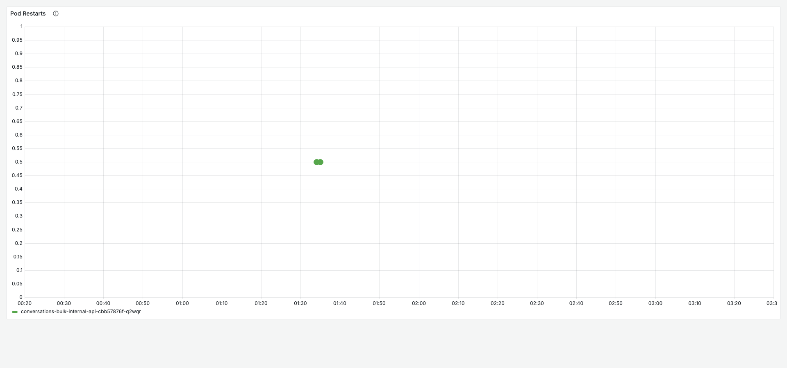
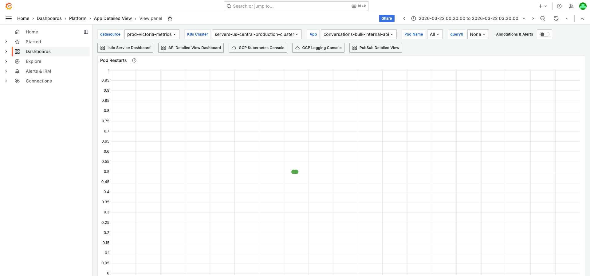
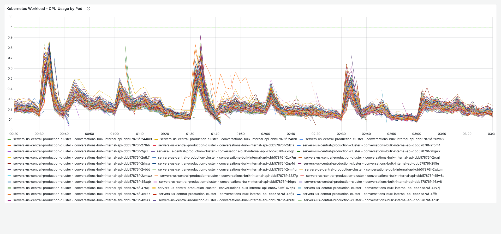
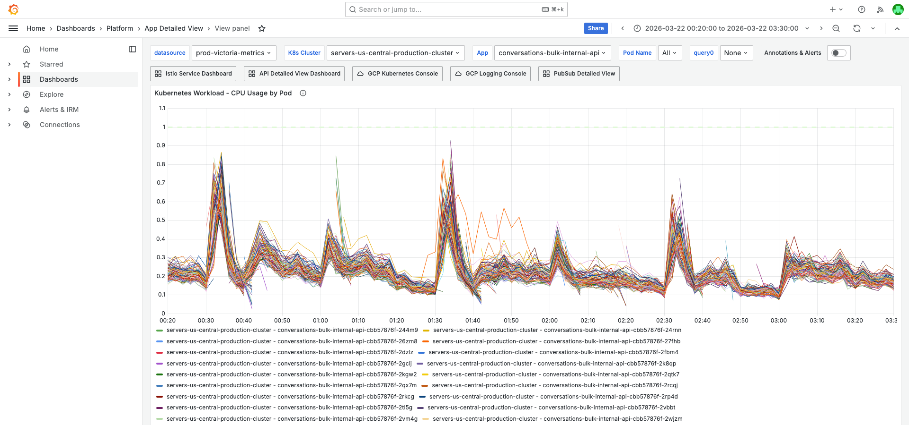
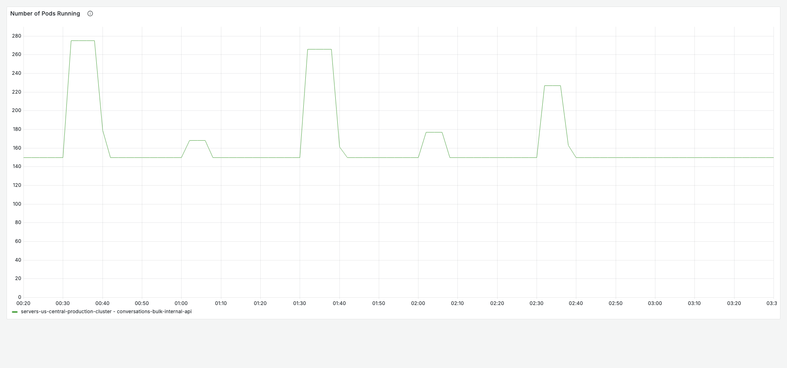
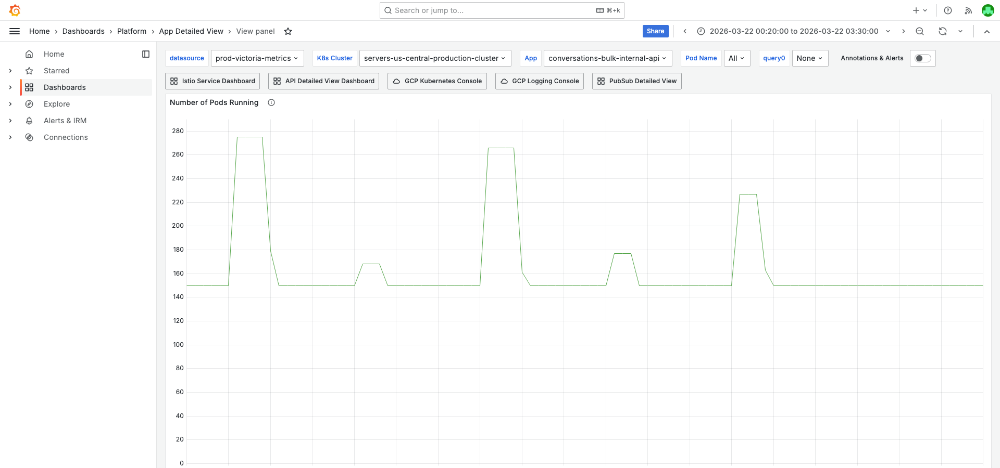
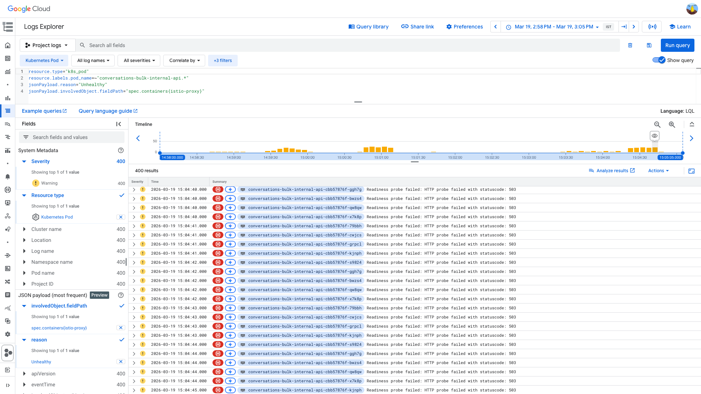
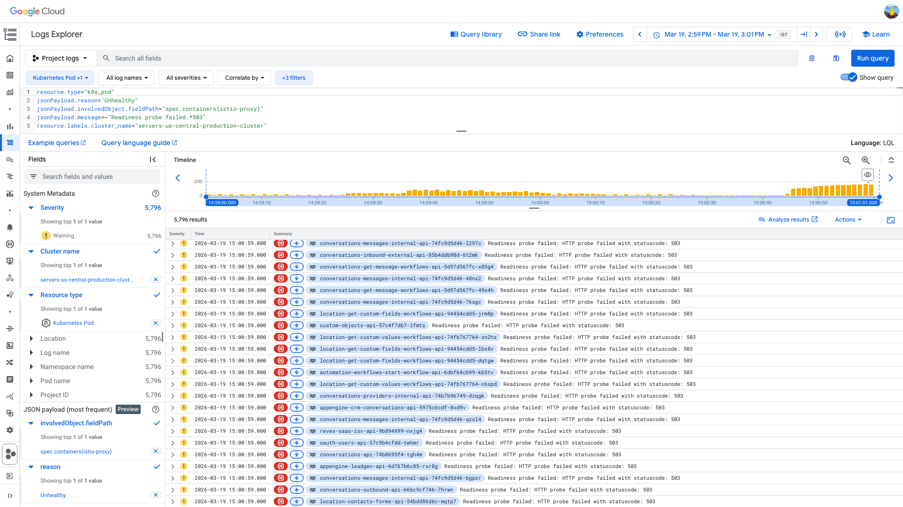

# PodRestartsAboveThreshold Investigation — conversations-bulk-internal-api — 2026-03-19

**Author:** Himanshu Bhutani
**Generated:** 2026-03-23

## Alert Summary

| Field | Value |
|-------|-------|
| Alert type | PodRestartsAboveThreshold (#113183) |
| Workload | conversations-bulk-internal-api |
| Cluster | servers-us-central-production-cluster |
| Namespace | default |
| Time | 15:36 IST (10:06 UTC) — March 19, 2026 |
| Severity | CRITICAL |
| Channel | #alerts-crm-conversations (C097UPY34QJ) |
| Status | Auto-resolved |
| Current value | 1 restart (threshold: 1) |
| Alert history | 180 total alerts for this service (recurring) |

## Investigation Findings

### Evidence: Grafana — Pod Health

<details>
<summary>Pod Restarts — 10 pods restarted during the incident window</summary>

> **What to look for:** Spike in restart count around 15:00 IST (09:30 UTC). The restarts should be concentrated in a short burst, not spread out.



**Context (filters + time range):**



[Open in Grafana](https://prod.grafana.leadconnectorhq.com/d/a4859d4a-1e0a-4ae3-b9b2-d04d366cf29b/app-detailed-view?orgId=1&var-container=conversations-bulk-internal-api&var-cluster=servers-us-central-production-cluster&from=1774119000000&to=1774130400000&viewPanel=36)

</details>

<details>
<summary>CPU by Pod — CPU pressure triggered HPA scaling from 150 → 278 pods</summary>

> **What to look for:** CPU usage relative to the request limit. High CPU triggered the aggressive HPA scaling that preceded the incident.



**Context (filters + time range):**



[Open in Grafana](https://prod.grafana.leadconnectorhq.com/d/a4859d4a-1e0a-4ae3-b9b2-d04d366cf29b/app-detailed-view?orgId=1&var-container=conversations-bulk-internal-api&var-cluster=servers-us-central-production-cluster&from=1774119000000&to=1774130400000&viewPanel=16)

</details>

<details>
<summary>Number of Pods — HPA churn: 150 → 278 → 206 + deployment rollout</summary>

> **What to look for:** Rapid pod count changes. Scale-up from 150 to 278 at 14:30 IST, scale-down to 206 at 14:40 IST, then new ReplicaSet creation at 14:40 IST.



**Context (filters + time range):**



[Open in Grafana](https://prod.grafana.leadconnectorhq.com/d/a4859d4a-1e0a-4ae3-b9b2-d04d366cf29b/app-detailed-view?orgId=1&var-container=conversations-bulk-internal-api&var-cluster=servers-us-central-production-cluster&from=1774119000000&to=1774130400000&viewPanel=32)

</details>

### Evidence: GCP Logs — K8s Pod Events

<details>
<summary>Istio-proxy readiness probe failures on conversations-bulk-internal-api pods</summary>

> **What to look for:** `fieldPath: "spec.containers{istio-proxy}"` with `reason: "Unhealthy"` and message `"Readiness probe failed: HTTP probe failed with statuscode: 503"`. Multiple pods affected simultaneously at 09:30:00 UTC.

**Key events (09:30:00 UTC):**

| Time (IST) | Pod | Container | Message |
|---|---|---|---|
| 15:00:00 | pf4rp | istio-proxy | Readiness probe failed: HTTP 503 |
| 15:00:00 | jlvmg | istio-proxy | Readiness probe failed: HTTP 503 |
| 15:00:00 | 6bvhs | istio-proxy | Readiness probe failed: HTTP 503 |
| 15:00:00 | dtfj7 | istio-proxy | Readiness probe failed: HTTP 503 |
| 15:00:01 | 4rxlf | app | connection refused to :15020 |
| 15:00:01 | xbpfq | app | connection refused to :15020 |
| 15:00:44 | chcvl | app | Stopping container |
| 15:00:44 | 6qbfd | istio-proxy | Stopping container |



GCP query:
```
resource.type="k8s_pod"
resource.labels.pod_name=~"conversations-bulk-internal-api.*"
jsonPayload.reason="Unhealthy"
jsonPayload.involvedObject.fieldPath="spec.containers{istio-proxy}"
```

[Open in GCP Log Explorer](https://console.cloud.google.com/logs/query;query=resource.type%3D%22k8s_pod%22%0Aresource.labels.pod_name%3D~%22conversations-bulk-internal-api.*%22%0AjsonPayload.reason%3D%22Unhealthy%22%0AjsonPayload.involvedObject.fieldPath%3D%22spec.containers%7Bistio-proxy%7D%22;timeRange=2026-03-19T09%3A28%3A00Z%2F2026-03-19T09%3A35%3A00Z?project=highlevel-backend)

</details>

<details>
<summary>Cluster-wide impact — 58 workloads with istio-proxy readiness failures in 2 minutes</summary>

> **What to look for:** Multiple unrelated workloads (from different teams — CRM, payments, contacts, oauth, automation) all showing istio-proxy readiness probe failures at the same time. This confirms infrastructure-level cause, not service-specific.

**Top 15 affected workloads:**

| Workload | Events |
|----------|--------|
| conversations-messages-internal-api | 27 |
| conversations-api | 16 |
| conversations-get-message-workflows-api | 13 |
| conversations-bulk-internal-api | 13 |
| conversations-providers-internal-api | 12 |
| location-get-custom-fields-workflows-api | 10 |
| conversations-bulk-external-api | 6 |
| location-get-custom-values-workflows-api | 6 |
| conversations-messages-send-api | 5 |
| payments-api | 5 |
| contacts-update-workflows-api | 4 |
| courses-learners-api | 4 |
| contacts-api | 4 |
| revex-saas-billing-api | 4 |
| conversations-providers-mailgun-external-api | 3 |

**Total: 200 events across 58 unique workloads** in `servers-us-central-production-cluster` between 09:29–09:31 UTC.



GCP query:
```
resource.type="k8s_pod"
jsonPayload.reason="Unhealthy"
jsonPayload.involvedObject.fieldPath="spec.containers{istio-proxy}"
jsonPayload.message=~"Readiness probe failed.*503"
resource.labels.cluster_name="servers-us-central-production-cluster"
```

[Open in GCP Log Explorer](https://console.cloud.google.com/logs/query;query=resource.type%3D%22k8s_pod%22%0AjsonPayload.reason%3D%22Unhealthy%22%0AjsonPayload.involvedObject.fieldPath%3D%22spec.containers%7Bistio-proxy%7D%22%0AjsonPayload.message%3D~%22Readiness%20probe%20failed.*503%22%0Aresource.labels.cluster_name%3D%22servers-us-central-production-cluster%22;timeRange=2026-03-19T09%3A29%3A00Z%2F2026-03-19T09%3A31%3A00Z?project=highlevel-backend)

</details>

### Evidence: GCP Logs — Kubelet

<details>
<summary>Kubelet logs — interleaved istio-proxy 503 and app connection-refused on :15020</summary>

> **What to look for:** Kubelet probe failure logs showing both `containerName="istio-proxy"` (HTTP 503) and `containerName="conversations-bulk-internal-api"` (connection refused to :15020). The :15020 failures confirm the app was healthy but Istio's health aggregation endpoint was down.

**Key kubelet entries at 09:30:00 UTC:**

| Time (IST) | Pod | Container | Probe Result |
|---|---|---|---|
| 15:00:00.023 | 4hfng | app | connection refused :15020 |
| 15:00:00.123 | xbpfq | app | connection refused :15020 |
| 15:00:00.197 | pf4rp | istio-proxy | HTTP 503 |
| 15:00:00.232 | jlvmg | istio-proxy | HTTP 503 |
| 15:00:00.317 | xbpfq | istio-proxy | HTTP 503 |
| 15:00:00.339 | xsf46 | istio-proxy | HTTP 503 |
| 15:00:00.450 | 6bvhs | istio-proxy | HTTP 503 |
| 15:00:00.656 | dtfj7 | istio-proxy | HTTP 503 |
| 15:00:01.036 | jlvmg | app | connection refused :15020 |
| 15:00:01.073 | pf4rp | app | connection refused :15020 |
| 15:00:01.371 | 4rxlf | app | connection refused :15020 |
| 15:00:01.651 | 6bvhs | app | connection refused :15020 |
| 15:00:01.866 | ssdlh | — | SyncLoop: startup started (new pod) |
| 15:00:01.869 | ssdlh | — | SyncLoop: readiness ready (new pod healthy) |

GCP query:
```
logName="projects/highlevel-backend/logs/kubelet"
"conversations-bulk-internal-api"
```

</details>

### Evidence: GCP Logs — K8s Cluster Events

<details>
<summary>istiod KEDA HPA thrashing — competing CPU/memory metrics</summary>

> **What to look for:** istiod scaling down by memory (below target) then immediately scaling up by CPU (above target). This oscillation pattern destabilizes the Istio control plane.

| Time (IST) | Event |
|---|---|
| 15:25:05 (09:55:05 UTC) | istiod scaled down 600 → 491 (memory below target) |
| 15:25:12 (09:55:12 UTC) | istiod scaled down 491 → 478 (memory below target) |
| 15:27:48 (09:57:48 UTC) | istiod scaled up 478 → 543 (CPU above target) |
| 15:28:41 (09:58:41 UTC) | istiod scaled up 543 → 600 (CPU above target) |

GCP query:
```
resource.type="k8s_cluster"
jsonPayload.reason=~"SuccessfulRescale|ScalingReplicaSet"
jsonPayload.involvedObject.name=~"istiod.*"
resource.labels.cluster_name="servers-us-central-production-cluster"
```

</details>

<details>
<summary>conversations-bulk-internal-api HPA churn + deployment rollout</summary>

> **What to look for:** Aggressive HPA scaling (150 → 278 in 35s) followed by scale-down and a deployment rollout creating a new ReplicaSet.

| Time (IST) | Event |
|---|---|
| 14:30:44 (09:00:44 UTC) | HPA: 150 → 172 → 174 (CPU above target) |
| 14:30:50 (09:00:50 UTC) | Scaled 174 → 194 |
| 14:30:59 (09:00:59 UTC) | Scaled 194 → 223 |
| 14:31:09 (09:01:09 UTC) | Scaled 223 → 248 |
| 14:31:19 (09:01:19 UTC) | Scaled 248 → 278 |
| 14:39:47 (09:09:47 UTC) | HPA scale-down: 278 → 214 (CPU below target) |
| 14:39:57 (09:09:57 UTC) | Scaled 214 → 209 |
| 14:40:02 (09:10:02 UTC) | Scaled 209 → 206 |
| 14:40:56 (09:10:56 UTC) | New ReplicaSet cbb57876f: 0 → 38 pods (deployment rollout) |

GCP query:
```
resource.type="k8s_cluster"
jsonPayload.reason=~"ScalingReplicaSet|SuccessfulRescale"
jsonPayload.involvedObject.name=~"conversations-bulk-internal-api.*"
```

</details>

### Evidence: Container Logs

<details>
<summary>Container ERROR logs — only business-logic errors (invalid email), no crash indicators</summary>

> **What to look for:** Absence of crash-related errors (OOM, unhandled rejection, Connection is closed). The only ERROR logs are `HttpException: Unable to send e-mail, contact's e-mail is invalid` — business logic, not infrastructure.

GCP query:
```
resource.type="k8s_container"
resource.labels.container_name="conversations-bulk-internal-api"
severity>=ERROR
```

This confirms the app container was healthy — the restarts were caused by Istio sidecar failures, not application errors.

</details>

## Cross-Validation

| Signal | Source | Finding | Agrees? |
|--------|--------|---------|---------|
| Probe failures on istio-proxy | K8s pod events | `fieldPath: spec.containers{istio-proxy}`, HTTP 503 | Yes |
| Probe failures on app via :15020 | Kubelet logs | `connection refused` to Istio health aggregation port | Yes |
| Cluster-wide impact | K8s pod events | 58 workloads affected simultaneously | Yes |
| No app-level errors | Container logs | Only business-logic HttpExceptions | Yes |
| istiod HPA thrashing | K8s cluster events | 600 → 478 → 600 in 3 minutes | Yes |
| HPA churn + deployment | K8s cluster events | 150 → 278 → 206 + new ReplicaSet | Yes |
| No platform alerts | Slack #alerts-platform | No GCE incidents or platform alerts on March 19 | Neutral |

**Confidence: High** — All 6 evidence sources agree. The `fieldPath` definitively identifies istio-proxy as the failing container. The 58-workload cross-service impact rules out any service-specific cause. The istiod HPA thrashing provides the infrastructure trigger.

## Root Cause

**Cluster-wide Istio sidecar instability** in `servers-us-central-production-cluster` caused readiness probe failures across 58 workloads within a 2-minute window (09:30–09:31 UTC). The istiod KEDA HPA was thrashing between competing CPU and memory targets (600 → 478 → 543 → 600 pods), destabilizing the Istio control plane. This caused sidecar proxies to lose stable connections, returning HTTP 503 on readiness probes.

`conversations-bulk-internal-api` was particularly vulnerable because:
1. It was already under HPA churn (150 → 278 → 206 pods in 10 minutes)
2. A deployment rollout was in progress (new ReplicaSet being created)
3. Both factors meant many pods were in transitional states when the sidecar disruption hit

**Causal chain:**
1. istiod KEDA HPA thrashes (competing CPU/memory targets)
2. istiod control plane destabilized during rapid scale-down/up
3. Sidecar proxies across 58 workloads lose stable xDS connection
4. istio-proxy readiness probes return HTTP 503
5. App health checks routed through :15020 also fail (connection refused)
6. K8s kills pods that exceed `failureThreshold`
7. 10 `conversations-bulk-internal-api` pods killed
8. HPA reschedules pods, service recovers

<details>
<summary>Detailed timeline — full event log</summary>

| Time (IST) | Source | Event |
|---|---|---|
| 14:30:44 | K8s HPA | conversations-bulk-internal-api: 150 → 172 (CPU above target) |
| 14:30:44 | K8s HPA | conversations-bulk-internal-api: 172 → 174 |
| 14:30:50 | K8s Deployment | Scaled 174 → 194 |
| 14:30:59 | K8s HPA | Scaled 194 → 223 |
| 14:31:09 | K8s Deployment | Scaled 223 → 248 |
| 14:31:19 | K8s Deployment | Scaled 248 → 278 |
| 14:33:17 | K8s Deployment | green canary: 0 → 1 pod |
| 14:39:47 | K8s HPA | Scale-down: 278 → 214 (CPU below target) |
| 14:39:57 | K8s HPA | 214 → 209 |
| 14:40:02 | K8s HPA | 209 → 206 |
| 14:40:56 | K8s Deployment | New ReplicaSet cbb57876f: 0 → 38 (rollout) |
| 15:00:00 | Kubelet | Readiness probe failed: istio-proxy HTTP 503 on pods pf4rp, jlvmg, 6bvhs, dtfj7, xbpfq, xsf46 |
| 15:00:00 | Kubelet | Readiness probe failed: app connection refused :15020 on pods 4hfng, xbpfq |
| 15:00:01 | Kubelet | More app probe failures: 4rxlf, jlvmg, pf4rp, xsf46, 6bvhs, dtfj7 |
| 15:00:01 | Kubelet | New pod ssdlh: startup + readiness OK |
| 15:00:44 | K8s Pod | Killing: chcvl (app + istio-proxy) |
| 15:00:44 | K8s Pod | Killing: 6qbfd, ktfgf, n6j7g, lf2z4, jwjpv (app + istio-proxy) |
| 15:00:45 | K8s Pod | Killing: n2m6c, qrtwr, l87rj (app + istio-proxy) |
| 15:25:05 | K8s HPA | istiod: 600 → 491 (memory below target) |
| 15:25:12 | K8s HPA | istiod: 491 → 478 (memory below target) |
| 15:27:48 | K8s HPA | istiod: 478 → 543 (CPU above target) |
| 15:28:41 | K8s HPA | istiod: 543 → 600 (CPU above target) |
| 16:06:04 | Grafana OnCall | Alert auto-resolved |

</details>

<details>
<summary>Probable noise — transient errors during disruption (not root cause)</summary>

| Time | Pattern | Why it's noise |
|------|---------|----------------|
| 15:00:05 | `HttpException: Unable to send e-mail, contact's e-mail is invalid` | Business-logic error, not related to infrastructure. Constant baseline. |
| 15:00:00 | App readiness probe `connection refused` to :15020 | Side-effect of istio-proxy failure — the app routes health checks through Istio's aggregation endpoint |

</details>

## Action Items

| Priority | Action | Owner | Reasoning |
|----------|--------|-------|-----------|
| **High** | Tune istiod KEDA HPA to prevent competing CPU/memory oscillation | Platform team | istiod thrashed 600 → 478 → 600 in 3 min. Add `stabilizationWindowSeconds: 300` and `behavior.scaleDown.policies` with max 10% per 5 min |
| **Medium** | Investigate root trigger for cluster-wide sidecar disruption at 09:30 UTC | Platform team | 58 workloads affected simultaneously — need to identify what caused the sidecar instability (node events, network partition, or istiod xDS push failure) |
| **Low** | Consider increasing readiness probe `failureThreshold` for conversations-bulk-internal-api | CRM Conversations team | Current threshold may be too aggressive for transient sidecar disruptions |
| **Low** | Review HPA scaling speed — 150 → 278 in 35 seconds is very aggressive | CRM Conversations team | Add `behavior.scaleUp.policies` to limit pods-per-minute and reduce cluster resource pressure |

### Separate issues found

| Issue | Severity | Details |
|-------|----------|---------|
| 180 total PodRestartsAboveThreshold alerts for this service | Info | This service has a recurring restart pattern — may need threshold tuning or deeper investigation into baseline restart rate |

## Deployment Details

| Setting | Value |
|---------|-------|
| Cluster | servers-us-central-production-cluster |
| Namespace | default |
| ReplicaSet (old) | conversations-bulk-internal-api-59c778546c |
| ReplicaSet (new) | conversations-bulk-internal-api-cbb57876f |
| HPA min/max | Unknown (scaled to 278) |
| istiod replicas | 478–600 (KEDA HPA managed) |

## Cross-Validation Summary

| Source 1 | Source 2 | Agreement |
|----------|----------|-----------|
| K8s pod events (fieldPath=istio-proxy) | Kubelet logs (istio-proxy 503) | Full agreement |
| Kubelet (app connection refused :15020) | Container logs (no app errors) | Full agreement — app was healthy |
| Cross-service impact (58 workloads) | istiod HPA thrashing | Full agreement — infrastructure cause |
| HPA churn + deployment rollout | Pod kill timing | Consistent — vulnerable state during disruption |

**Overall confidence: High**
