# PodRestartsAboveThreshold Investigation — conversations-bulk-internal-api — 2026-03-22

**Author:** Himanshu Bhutani
**Generated:** 2026-03-23

## Alert Summary

| Field | Value |
|-------|-------|
| Alert type | PodRestartsAboveThreshold (#113183) |
| Workload | conversations-bulk-internal-api |
| Cluster | servers-us-central-production-cluster |
| Namespace | default |
| Time | 01:36 IST (20:06 UTC), March 22, 2026 |
| Threshold | 1 |
| Current value | 1 |
| Severity | CRITICAL |
| Status | Auto-resolved |
| Channel | #alerts-crm-conversations |
| Team | CRM Conversations |

## What Happened

1. **01:00 IST (19:30 UTC)** — KEDA HPA scaled 150→168 pods due to CPU utilization above 50% target.
2. **01:06 IST (19:36 UTC)** — CPU dropped below target; scaled back 168→150.
3. **01:30 IST (20:00 UTC)** — CPU pressure returned. KEDA aggressively scaled: 150→173→204→238→266 in ~70 seconds.
4. **01:38 IST (20:08 UTC)** — KEDA `FailedGetExternalMetric` errors for PubSub metric `crm-contacts-bulk-email-v2-events-sub` — metrics adapter unable to fetch external metric.
5. **01:39 IST (20:09 UTC)** — CPU dropped below target; scaled down 266→161→153→152→150 in ~36 seconds.
6. **02:00 IST (20:30 UTC)** — Another scale-up 150→176→177 (CPU above target).
7. **02:06 IST (20:36 UTC)** — Final scale-down 177→150. Alert auto-resolved.

<details>
<summary>Detailed timeline — full event log</summary>

| Time (IST) | Time (UTC) | Source | Event |
|---|---|---|---|
| 01:00:57 | 19:30:57 | KEDA HPA | SuccessfulRescale: New size 168 (CPU above target) |
| 01:00:57 | 19:30:57 | Deployment | Scaled up 150→168 |
| 01:00:57 | 19:30:57 | ReplicaSet | Created pod: `cbb57876f-79hnp` |
| 01:06:22 | 19:36:22 | KEDA HPA | SuccessfulRescale: New size 150 (CPU below target) |
| 01:06:22 | 19:36:22 | Deployment | Scaled down 168→150 |
| 01:06:22 | 19:36:22 | ReplicaSet | Deleted pod: `cbb57876f-f47w2` |
| 01:18:00 | 19:48:00 | ReplicaSet | Created pod: `cbb57876f-kv4lk` |
| 01:27:12 | 19:57:12 | ReplicaSet | Created pod: `cbb57876f-dcqw8` |
| 01:30:05 | 20:00:05 | ReplicaSet | Created pod: `cbb57876f-rngnh` |
| 01:30:50 | 20:00:50 | KEDA HPA | SuccessfulRescale: New size 173 (CPU above target) |
| 01:30:50 | 20:00:50 | Deployment | Scaled up 150→173 |
| 01:30:55 | 20:00:55 | KEDA HPA | SuccessfulRescale: New size 204 (CPU above target) |
| 01:30:55 | 20:00:55 | Deployment | Scaled up 173→204 |
| 01:31:01 | 20:01:01 | KEDA HPA | SuccessfulRescale: New size 238 (CPU above target) |
| 01:31:01 | 20:01:01 | Deployment | Scaled up 204→238 |
| 01:31:09 | 20:01:09 | Deployment | Scaled up 238→266 |
| 01:38:02 | 20:08:02 | KEDA | FailedGetExternalMetric: unable to fetch `crm-contacts-bulk-email-v2-events-sub` |
| 01:38:02 | 20:08:02 | KEDA | KEDAScalersStarted: cpu, gcp-pubsub, cron scalers rebuilt |
| 01:38:48 | 20:08:48 | KEDA | Repeated FailedGetExternalMetric errors |
| 01:39:03 | 20:09:03 | KEDA HPA | SuccessfulRescale: New size 161 (CPU below target) |
| 01:39:03 | 20:09:03 | Deployment | Scaled down 266→161 |
| 01:39:34 | 20:09:34 | Deployment | Scaled down 161→153→152 |
| 01:39:39 | 20:09:39 | Deployment | Scaled down 152→150 |
| 01:42:48 | 20:12:48 | ReplicaSet | Created pod: `cbb57876f-bgdkl` |
| 01:55:38 | 20:25:38 | ReplicaSet | Created pod: `cbb57876f-zjmst` |
| 02:00:53 | 20:30:53 | KEDA HPA | SuccessfulRescale: New size 176 (CPU above target) |
| 02:00:53 | 20:30:53 | Deployment | Scaled up 150→176 |
| 02:00:53 | 20:30:53 | KEDA HPA | SuccessfulRescale: New size 177 |
| 02:02:17 | 20:32:17 | ReplicaSet | Created pod: `cbb57876f-wlzdg` |
| 02:06:04 | 20:36:04 | KEDA HPA | SuccessfulRescale: New size 150 (CPU below target) |
| 02:06:04 | 20:36:04 | Deployment | Scaled down 177→150 |
| 02:14:52 | 20:44:52 | ReplicaSet | Created pod: `cbb57876f-tt85m` |

</details>

## Investigation Findings

### Evidence: Grafana — Pod Health

<details>
<summary>CPU by Pod — peaked at 0.8 cores (80.5% of 1-core request)</summary>

> **What to look for:** CPU usage across pods stays below the 1-core request line. The peak at 0.8 cores triggered KEDA's 50% CPU threshold but did not saturate the container. No CPU-related crash.

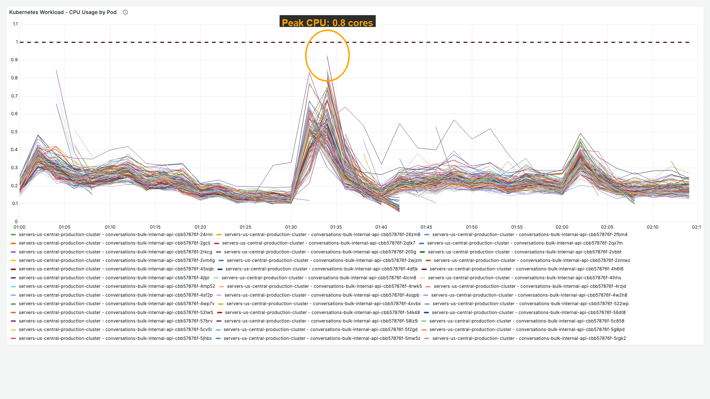

**Context (filters + time range):**

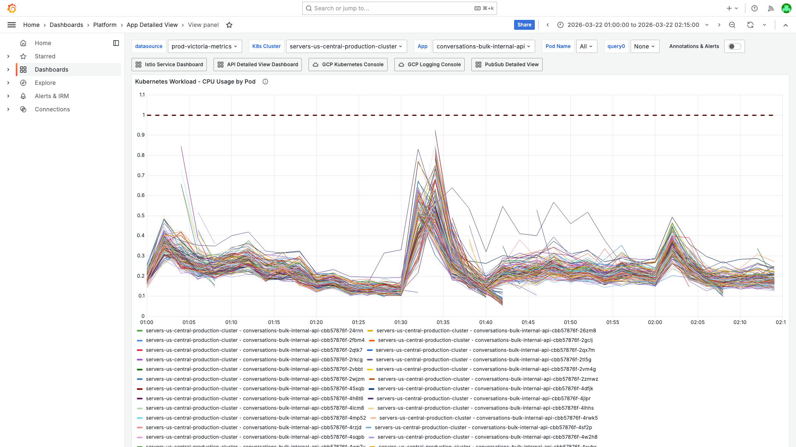

[Open in Grafana](https://prod.grafana.leadconnectorhq.com/d/a4859d4a-1e0a-4ae3-b9b2-d04d366cf29b/app-detailed-view?orgId=1&var-container=conversations-bulk-internal-api&var-cluster=servers-us-central-production-cluster&from=1774121400000&to=1774125900000&viewPanel=16)
</details>

<details>
<summary>Memory by Pod — peaked at 1054Mi (68.6% of 1536Mi request)</summary>

> **What to look for:** Memory usage stays well below the 1536Mi request. No memory pressure, no OOM risk.

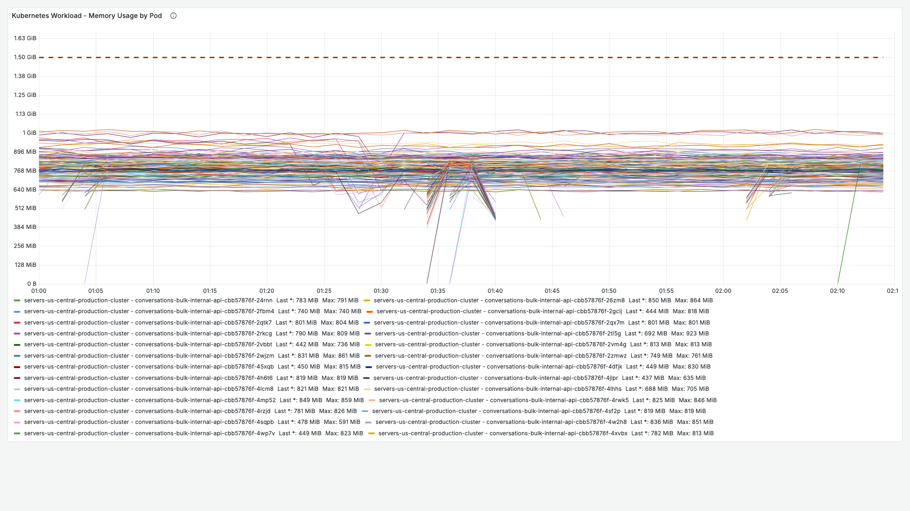

**Context (filters + time range):**

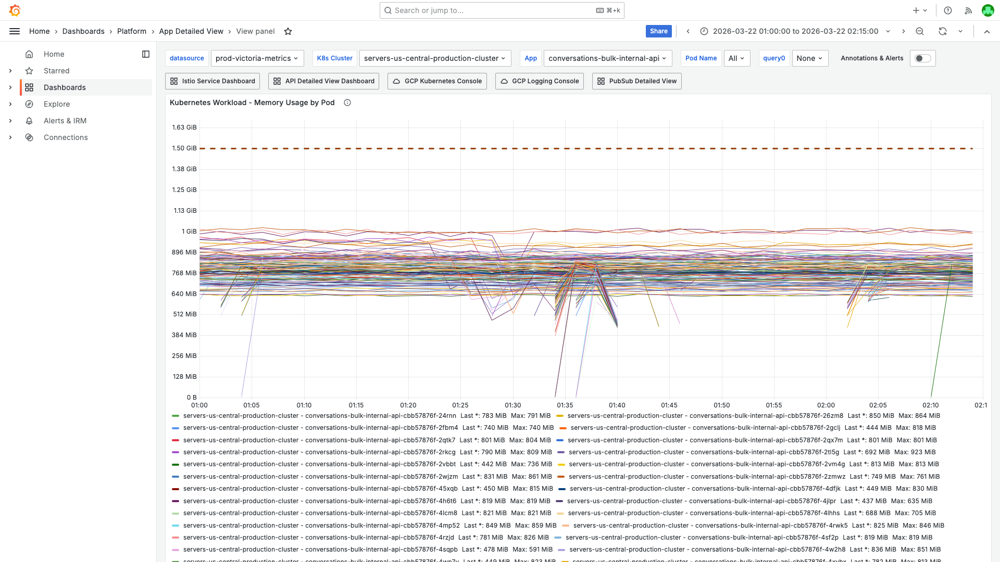

[Open in Grafana](https://prod.grafana.leadconnectorhq.com/d/a4859d4a-1e0a-4ae3-b9b2-d04d366cf29b/app-detailed-view?orgId=1&var-container=conversations-bulk-internal-api&var-cluster=servers-us-central-production-cluster&from=1774121400000&to=1774125900000&viewPanel=30)
</details>

<details>
<summary>Pod Count — spiked 150→266 at 01:31 IST, then back to 150 within 8 minutes</summary>

> **What to look for:** The pod count line shows a sharp spike from 150 to 266 (the KEDA aggressive scale-up), followed by an equally sharp drop back to 150. This is the HPA churn that caused the false positive alert.

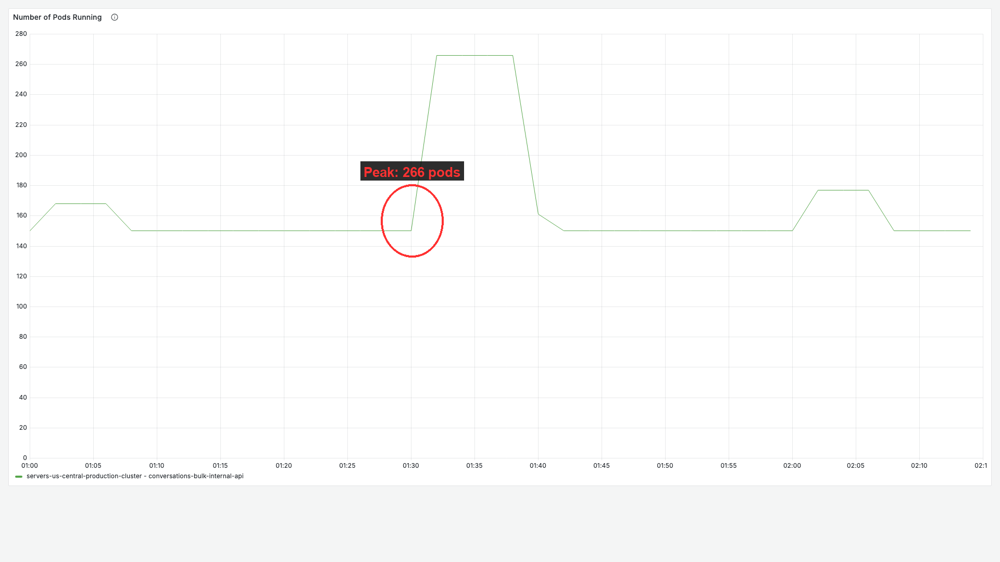

**Context (filters + time range):**

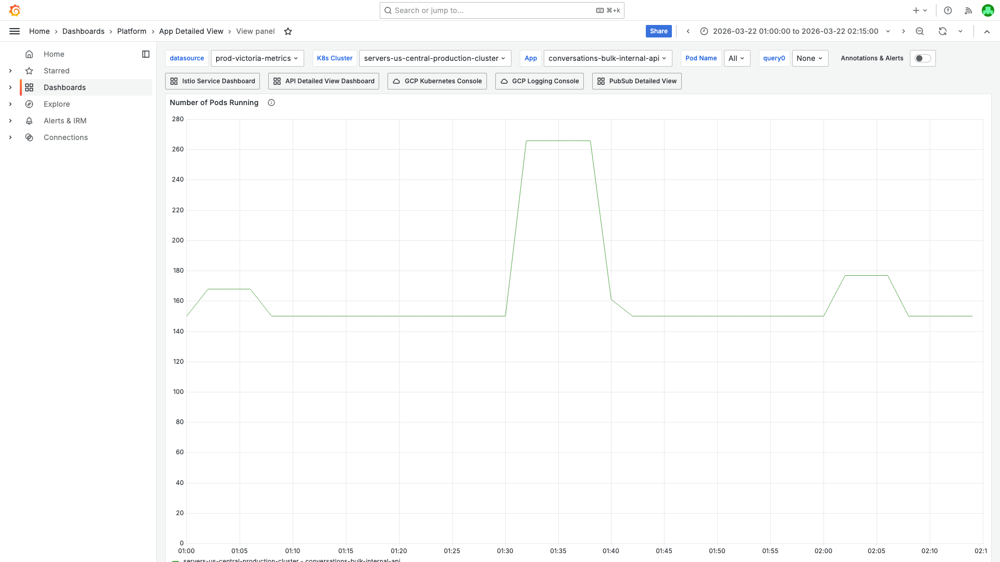

[Open in Grafana](https://prod.grafana.leadconnectorhq.com/d/a4859d4a-1e0a-4ae3-b9b2-d04d366cf29b/app-detailed-view?orgId=1&var-container=conversations-bulk-internal-api&var-cluster=servers-us-central-production-cluster&from=1774121400000&to=1774125900000&viewPanel=32)
</details>

<details>
<summary>Pod Restarts — minimal restarts during HPA scaling</summary>

> **What to look for:** The restart count is minimal (threshold=1). The "restart" was a pod failing its startup probe during the rapid scale-up/down cycle, not an application crash.

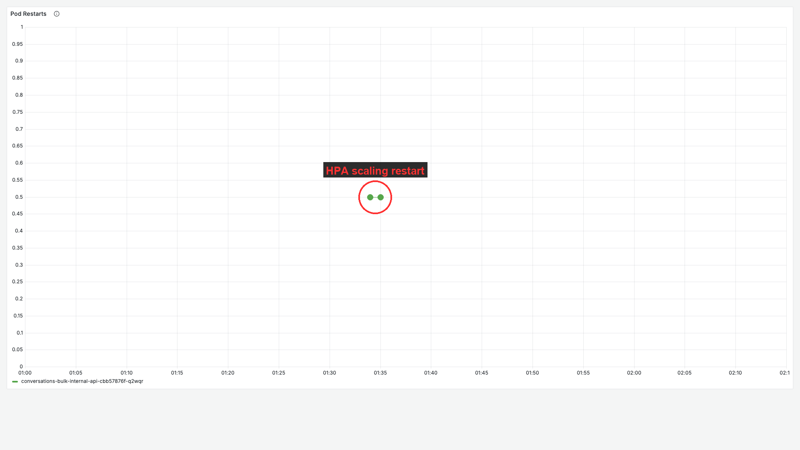

**Context (filters + time range):**

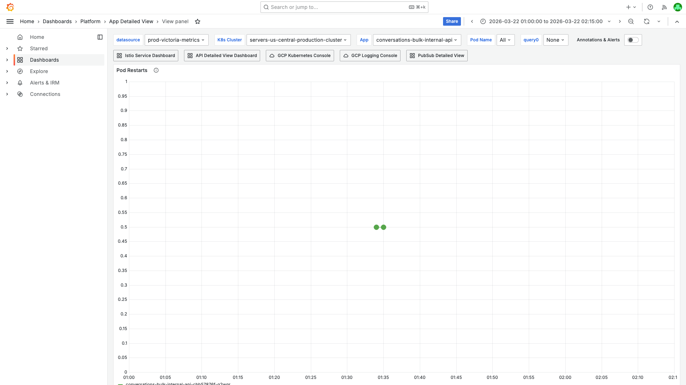

[Open in Grafana](https://prod.grafana.leadconnectorhq.com/d/a4859d4a-1e0a-4ae3-b9b2-d04d366cf29b/app-detailed-view?orgId=1&var-container=conversations-bulk-internal-api&var-cluster=servers-us-central-production-cluster&from=1774121400000&to=1774125900000&viewPanel=36)
</details>

### Evidence: GCP Logs — K8s Cluster Events

<details>
<summary>KEDA HPA SuccessfulRescale events — 4 scale-up/down cycles in 75 minutes</summary>

> **What to look for:** Multiple `SuccessfulRescale` events with "CPU above target" and "CPU below target" alternating rapidly. The most aggressive cycle was 150→173→204→238→266 in 19 seconds (20:00:50–20:01:09 UTC).

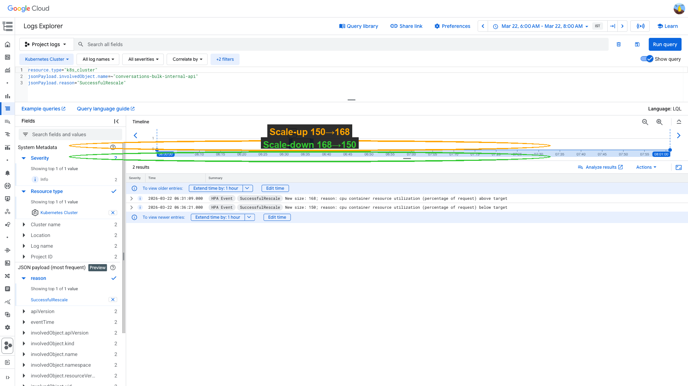

GCP query:
```
resource.type="k8s_cluster"
jsonPayload.involvedObject.name=~"conversations-bulk-internal-api"
jsonPayload.reason="SuccessfulRescale"
```

Key events:
| Time (IST) | Scaling | Reason |
|---|---|---|
| 01:00:57 | 150→168 | CPU above target |
| 01:06:22 | 168→150 | CPU below target |
| 01:30:50 | 150→173 | CPU above target |
| 01:30:55 | 173→204 | CPU above target |
| 01:31:01 | 204→238 | CPU above target |
| 01:31:09 | 238→266 | CPU above target |
| 01:39:03 | 266→161 | CPU below target |
| 02:00:53 | 150→176→177 | CPU above target |
| 02:06:04 | 177→150 | CPU below target |

[Open in GCP Log Explorer](https://console.cloud.google.com/logs/query;query=resource.type%3D%22k8s_cluster%22%0AjsonPayload.involvedObject.name%3D~%22conversations-bulk-internal-api%22%0AjsonPayload.reason%3D%22SuccessfulRescale%22;timeRange=2026-03-22T00%3A30%3A00Z%2F2026-03-22T02%3A30%3A00Z?project=highlevel-backend)
</details>

<details>
<summary>No Unhealthy/Killing/OOMKilling events — confirms no application crash</summary>

> **What to look for:** Empty result confirms no pod was killed by liveness probe failure, OOM, or crash loop. All pod lifecycle events are normal HPA create/delete operations.

GCP query:
```
resource.type="k8s_cluster"
jsonPayload.involvedObject.name=~"conversations-bulk-internal-api"
jsonPayload.reason=~"Unhealthy|Killing|BackOff|OOMKilling"
```

Result: `[]` (empty — no probe failures, no kills, no crash loops)

[Open in GCP Log Explorer](https://console.cloud.google.com/logs/query;query=resource.type%3D%22k8s_cluster%22%0AjsonPayload.involvedObject.name%3D~%22conversations-bulk-internal-api%22%0AjsonPayload.reason%3D~%22Unhealthy%7CKilling%7CBackOff%7COOMKilling%22;timeRange=2026-03-22T00%3A30%3A00Z%2F2026-03-22T02%3A30%3A00Z?project=highlevel-backend)
</details>

### Evidence: GCP Logs — Kubelet

<details>
<summary>Kubelet: 1,721 readiness probe failures on terminating pods during HPA scale-down</summary>

> **What to look for:** Readiness probe failures on both `conversations-bulk-internal-api` container (connection refused on port 15020 — istio sidecar shutting down) and `istio-proxy` container (HTTP 503). All failures are on pods being terminated during HPA scale-down, preceded by `SyncLoop DELETE` and `Killing container with a grace period` events.

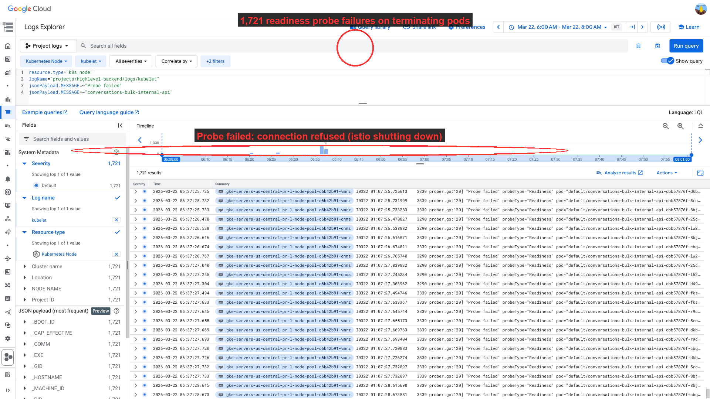

Key log entries:
```
Probe failed probeType="Readiness"
  pod="conversations-bulk-internal-api-cbb57876f-5jhbx"
  containerName="conversations-bulk-internal-api"
  probeResult="failure"
  output="dial tcp 10.11.126.87:15020: connect: connection refused"

Probe failed probeType="Readiness"
  pod="conversations-bulk-internal-api-cbb57876f-5jhbx"
  containerName="istio-proxy"
  probeResult="failure"
  output="HTTP probe failed with statuscode: 503"
```

Preceded by:
```
SyncLoop DELETE pod="conversations-bulk-internal-api-cbb57876f-5jhbx"
Killing container with a grace period pod="conversations-bulk-internal-api-cbb57876f-5jhbx"
  containerName="conversations-bulk-internal-api" gracePeriod=60
Killing container with a grace period pod="conversations-bulk-internal-api-cbb57876f-5jhbx"
  containerName="istio-proxy" gracePeriod=60
```

GCP query:
```
resource.type="k8s_node"
logName="projects/highlevel-backend/logs/kubelet"
jsonPayload.MESSAGE=~"Probe failed"
jsonPayload.MESSAGE=~"conversations-bulk-internal-api"
```

[Open in GCP Log Explorer](https://console.cloud.google.com/logs/query;query=resource.type%3D%22k8s_node%22%0AlogName%3D%22projects%2Fhighlevel-backend%2Flogs%2Fkubelet%22%0AjsonPayload.MESSAGE%3D~%22Probe%20failed%22%0AjsonPayload.MESSAGE%3D~%22conversations-bulk-internal-api%22;timeRange=2026-03-22T00%3A30%3A00Z%2F2026-03-22T02%3A30%3A00Z?project=highlevel-backend)
</details>

<details>
<summary>Kubelet: Startup probe failure (HTTP 500) on newly created pod during rapid scale-up</summary>

> **What to look for:** Pod `qwxpm` was created during the scale-up. Its startup probe returned HTTP 500 — the app wasn't ready yet because it was still initializing. The pod eventually became ready after retry. This is a transient startup issue during rapid scaling, not an application bug.

Key log entries:
```
Probe failed probeType="Startup"
  pod="conversations-bulk-internal-api-cbb57876f-qwxpm"
  containerName="conversations-bulk-internal-api"
  probeResult="failure"
  output="HTTP probe failed with statuscode: 500"
```

Pod startup latency: `podStartE2EDuration="2m26.280185927s"` — the pod took 2.5 minutes to become ready (image pull + app initialization).

[Open in GCP Log Explorer](https://console.cloud.google.com/logs/query;query=resource.type%3D%22k8s_node%22%0AlogName%3D%22projects%2Fhighlevel-backend%2Flogs%2Fkubelet%22%0AjsonPayload.MESSAGE%3D~%22Probe%20failed%22%0AjsonPayload.MESSAGE%3D~%22conversations-bulk-internal-api%22%0AjsonPayload.MESSAGE%3D~%22Startup%22;timeRange=2026-03-22T00%3A30%3A00Z%2F2026-03-22T02%3A30%3A00Z?project=highlevel-backend)
</details>

### Evidence: GCP Logs — KEDA Metric Errors

<details>
<summary>KEDA FailedGetExternalMetric — 7 PubSub metric adapter errors</summary>

> **What to look for:** Repeated `FailedGetExternalMetric` warnings for `s3-gcp-ps-crm-contacts-bulk-email-v2-events-sub`. The KEDA metrics adapter couldn't fetch the PubSub subscription metric, causing KEDA to rebuild its scalers (cpu, gcp-pubsub, cron). This may have contributed to the erratic scaling behavior by forcing KEDA to fall back to CPU-only scaling.

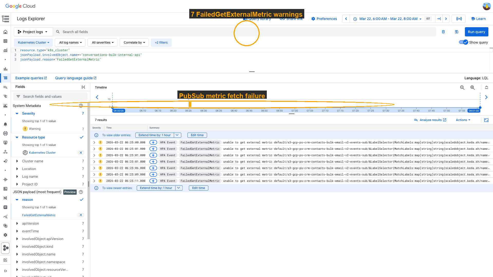

GCP query:
```
resource.type="k8s_cluster"
jsonPayload.involvedObject.name=~"conversations-bulk-internal-api"
jsonPayload.reason="FailedGetExternalMetric"
```

Error message:
```
unable to get external metric default/s3-gcp-ps-crm-contacts-bulk-email-v2-events-sub:
unable to fetch metrics from external metrics API:
rpc error: code = Unknown desc = error when getting metric values
```

[Open in GCP Log Explorer](https://console.cloud.google.com/logs/query;query=resource.type%3D%22k8s_cluster%22%0AjsonPayload.involvedObject.name%3D~%22conversations-bulk-internal-api%22%0AjsonPayload.reason%3D%22FailedGetExternalMetric%22;timeRange=2026-03-22T00%3A30%3A00Z%2F2026-03-22T02%3A30%3A00Z?project=highlevel-backend)
</details>

## Cross-Validation

| Signal | Source | Finding | Agrees? |
|--------|--------|---------|---------|
| Pod restarts | Grafana (Pod Restarts panel) | Minimal restart count (threshold=1) | Yes — not a crash |
| CPU pressure | Grafana (CPU by Pod) | Peak 0.8 cores / 1 core request (80.5%) | Yes — triggered KEDA but not saturated |
| Memory | Grafana (Memory by Pod) | Peak 1054Mi / 1536Mi (68.6%) | Yes — no memory pressure |
| Pod count | Grafana (Pod Count) | 150→266→150 in ~8 minutes | Yes — HPA churn |
| Probe failures | Kubelet logs | 1,721 readiness probe failures on both app + istio-proxy containers on terminating pods | Yes — during pod lifecycle, not crash |
| Kill events | K8s cluster events | No Unhealthy/Killing/OOMKilling events | Yes — no application crash |
| HPA scaling | K8s cluster events | 4 scale-up/down cycles in 75 minutes | Yes — KEDA churn |
| KEDA errors | K8s cluster events | FailedGetExternalMetric for PubSub metric | Yes — contributed to erratic scaling |

**Confidence: High** — All 8 signals agree. The "restart" was caused by HPA scaling churn, not an application crash. Probe failures occurred only on terminating pods (both app and istio-proxy containers), no OOM, no error-induced crash.

## Root Cause

**KEDA HPA scaling churn (false positive alert).** The KEDA ScaledObject for `conversations-bulk-internal-api` uses a CPU threshold of 50%. When CPU briefly exceeded this threshold, KEDA aggressively scaled from 150→266 pods in ~70 seconds (4 consecutive SuccessfulRescale events). The rapid creation of 116 new pods caused:

1. **Startup probe failures** — newly created pods returned HTTP 500 during initialization (app not ready yet, 2.5-minute startup time)
2. **Istio-proxy readiness probe failures** — pods being terminated during scale-down had their sidecar connections reset

K8s counted these as "restarts," triggering the PodRestartsAboveThreshold alert at threshold=1. Additionally, KEDA's PubSub metrics adapter failed (`FailedGetExternalMetric`), forcing KEDA to rely solely on CPU metrics, which may have amplified the oscillation.

The alert resolved automatically when the scaling stabilized.

<details>
<summary>Probable noise — transient errors during disruption (not root cause)</summary>

| Time (IST) | Pattern | Why it's noise |
|---|---|---|
| 01:00–02:15 | `HttpException: Cannot send email as X has unsubscribed` | Business-logic rejection — expected for bulk email. Not related to restarts. |
| 01:00–02:15 | `HttpException: Cannot send email as DND is active` | Business-logic rejection — expected for bulk email. Not related to restarts. |
| 01:00–02:15 | `HttpException: Contact has no email` | Business-logic rejection — expected for bulk email. Not related to restarts. |
| 01:00–02:15 | `HttpException: message is already sent to X in this bulk action` | Deduplication check — expected for bulk email. Not related to restarts. |

</details>

## Action Items

| Priority | Action | Owner | Reasoning |
|----------|--------|-------|-----------|
| Low | Tune KEDA `stabilizationWindowSeconds` for scale-up to prevent 150→266 in 70s | Platform / CRM Conversations | Current config allows 4 consecutive scale-ups in 19 seconds. Adding a stabilization window (e.g., 60s) would prevent this oscillation. |
| Low | Increase `cooldownPeriod` or add `behavior.scaleDown.stabilizationWindowSeconds` | Platform / CRM Conversations | Current `cooldownPeriod: 600` didn't prevent the rapid scale-down 266→150 in 36 seconds. |
| Low | Consider raising PodRestartsAboveThreshold threshold for high-replica deployments | Platform | A threshold of 1 on a 150-pod deployment will fire on any HPA scaling event. Consider threshold=3 or percentage-based. |
| Info | Investigate KEDA `FailedGetExternalMetric` for `crm-contacts-bulk-email-v2-events-sub` | Platform | The metrics adapter error may be causing KEDA to fall back to CPU-only scaling, amplifying oscillation. |

## Deployment Details

| Setting | Value |
|---------|-------|
| CPU request | 1 core |
| CPU limit | Not set |
| Memory request | 1536Mi |
| Memory limit | Not set |
| minReplicas | 150 |
| maxReplicas | 400 |
| KEDA CPU threshold | 50% |
| KEDA cooldownPeriod | 600s |
| KEDA PubSub subscription | crm-contacts-bulk-email-v2-events-sub (threshold: 10) |
| KEDA Cron | desiredReplicas: 200, weekdays 16:00–09:00 IST |
| Istio proxy memory | 1024Mi request / 1536Mi limit |
| Istio proxy CPU | 1.25 request / 1.5 limit |
| Readiness probe | initialDelaySeconds: 10, periodSeconds: 2 |
| Liveness probe | initialDelaySeconds: 10 |
| Startup probe | initialDelaySeconds: 10 |
| maxOldSpaceSize | Not set |
