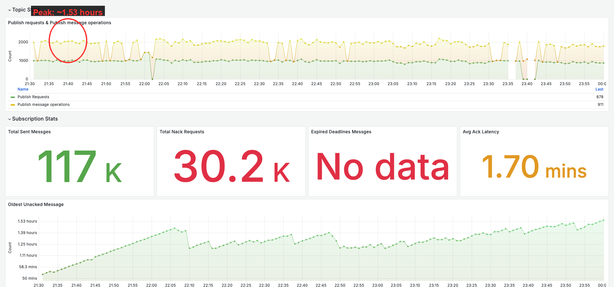
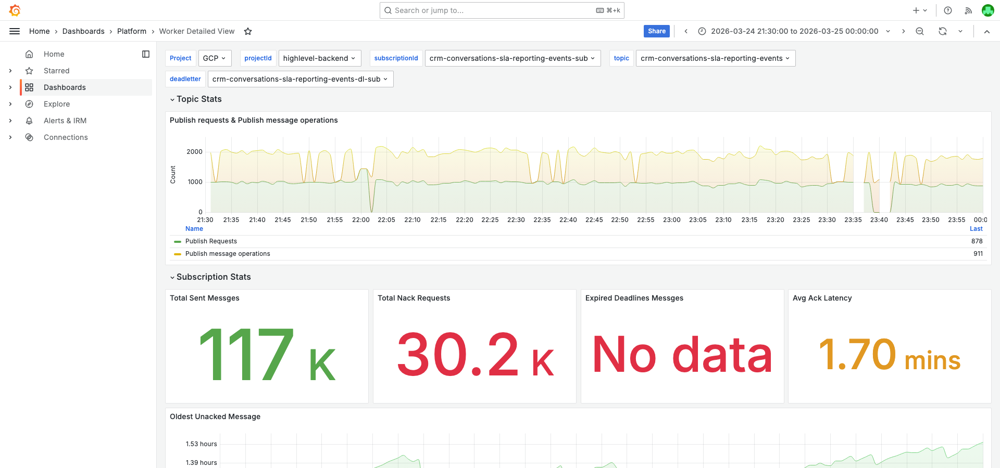
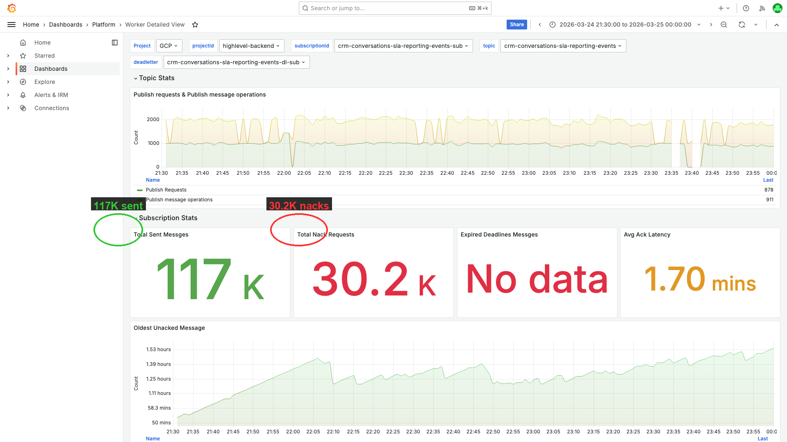
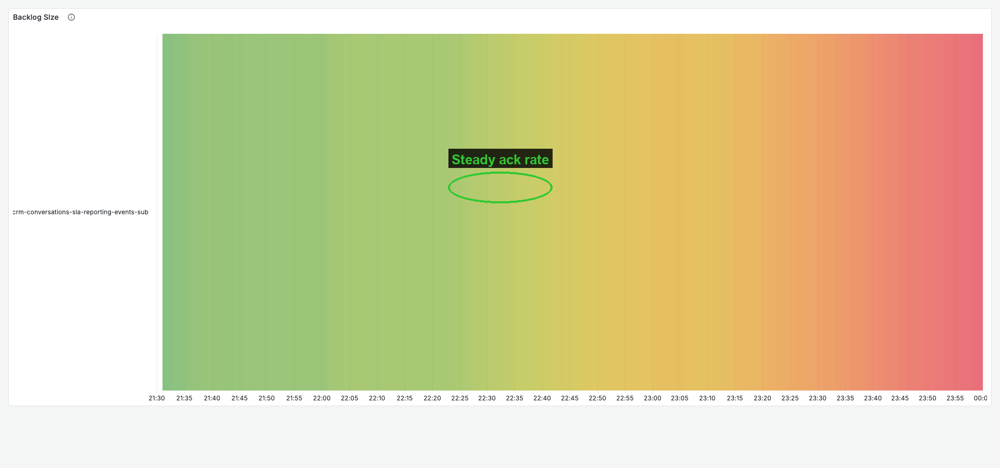
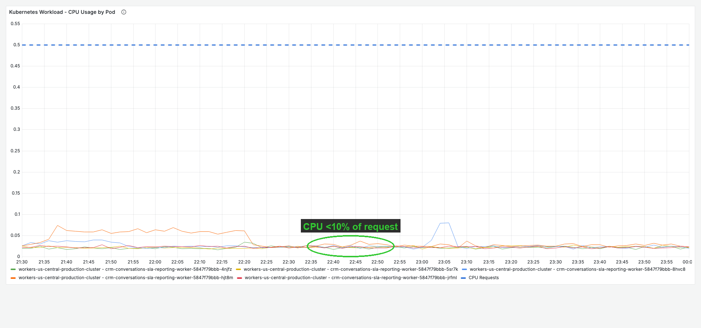
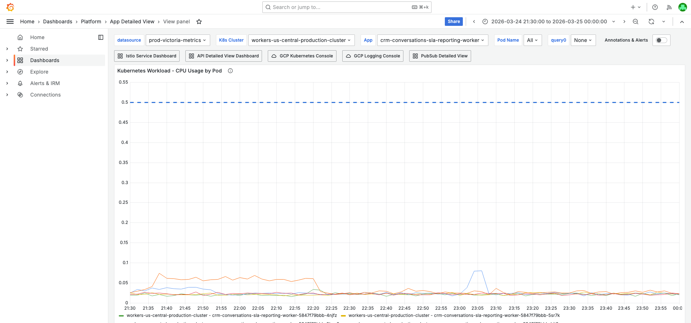
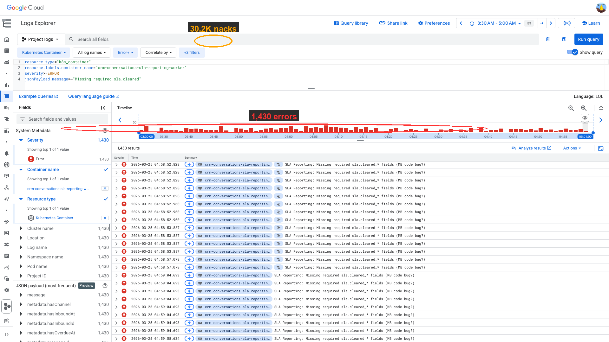

# PubSub Oldest Unacked Age Investigation — crm-conversations-sla-reporting-events-sub — 2026-03-25

**Author:** Himanshu Bhutani
**Generated:** 2026-03-25 ~04:30 IST

---

## 1. Alert Summary

| Field | Value |
|-------|-------|
| Alert ID | #113552 |
| Alert type | Pubsub Oldest Unacked Messages age above 30mins |
| Subscription | crm-conversations-sla-reporting-events-sub |
| Worker | crm-conversations-sla-reporting-worker |
| Cluster | workers-us-central-production-cluster |
| Namespace | default |
| Time | 04:11 IST / 22:41 UTC on 2026-03-24 |
| Reported age | 3,511s (~58.5 min) |
| Threshold | 30 min (1,800s) |
| Alert note | "Showing the last alert only out of 5 total" |
| Team | CRM Conversations |

## 2. Investigation Findings

### Evidence: Cloud Monitoring — PubSub Metrics

<details>
<summary>Oldest Unacked Message Age — peaked at ~1.53 hours at 03:35 IST</summary>

> **What to look for:** The green area chart should show sustained elevation above 50 min from ~03:00 IST, peaking at ~1.53 hours around 03:35 IST, then gradually declining as failed messages exhaust retries and dead-letter.



**Context (filters + time range):**



[Open in Grafana](https://prod.grafana.leadconnectorhq.com/d/a04e5483-eb8c-47ef-8198-30147926964c/worker-detailed-view?orgId=1&var-datasource=GCP&var-projectId=highlevel-backend&var-subscriptionId=crm-conversations-sla-reporting-events-sub&var-topic=crm-conversations-sla-reporting-events&var-deadletter=crm-conversations-sla-reporting-events-dl-sub&from=1774368000000&to=1774377000000)

**6-hour view (16:00-23:30 UTC / 21:30 IST Mar 24 - 05:00 IST Mar 25):**

| Time (IST) | Time (UTC) | Age (s) | Age (min) |
|---|---|---|---|
| 21:30 | 16:00 | 3,343 | 56 |
| 22:00 | 16:30 | 4,209 | 70 |
| 22:30 | 17:00 | 5,209 | 87 |
| 23:00 | 17:30 | 4,977 | 83 |
| 23:30 | 18:00 | 4,602 | 77 |
| 00:00 | 18:30 | 4,551 | 76 |
| 00:30 | 19:00 | 4,783 | 80 |
| 01:00 | 19:30 | 5,040 | 84 |
| 01:30 | 20:00 | 4,782 | 80 |
| 02:00 | 20:30 | 4,718 | 79 |
| 02:30 | 21:00 | 3,914 | 65 |
| 03:00 | 21:30 | 3,551 | 59 |
| 03:30 | 22:00 | 6,044 | 101 |
| **03:35** | **22:05** | **6,177** | **103** |
| 03:40 | 22:10 | 6,156 | 103 |
| 04:10 | 22:40 | 5,876 | 98 |
| 04:30 | 23:00 | 4,673 | 78 |
| 05:00 | 23:30 | 4,061 | 68 |

**2-day hourly view (backlog onset):**

| Date/Time (IST) | Age (s) | Age (min) |
|---|---|---|
| Mar 23 morning | 0 | 0 |
| Mar 23 afternoon | ~300-550 | ~5-9 |
| Mar 24 ~19:00 IST (13:30 UTC) | ~660 | 11 |
| Mar 24 ~20:00 IST (14:30 UTC) | ~1,380 | 23 |
| Mar 24 ~21:00 IST (15:30 UTC) | ~2,640 | 44 |
| Mar 24 ~22:00 IST (16:30 UTC) | ~4,800 | 80 |

**Baseline departure:** ~19:00 IST Mar 24 (13:30 UTC). Steep climb from ~21:00 IST (15:30 UTC).

[Open in GCP Console](https://console.cloud.google.com/cloudpubsub/subscription/detail/crm-conversations-sla-reporting-events-sub?project=highlevel-backend)
</details>

<details>
<summary>Subscription Stats — 117K sent, 30.2K nacks, 1.70 min avg ack latency</summary>

> **What to look for:** The gauges show total sent messages, nack count (significant volume indicating processing failures), and average ack latency. The high nack count (30.2K) relative to sent (117K) confirms a subset of messages consistently failing.



[Open in Grafana](https://prod.grafana.leadconnectorhq.com/d/a04e5483-eb8c-47ef-8198-30147926964c/worker-detailed-view?orgId=1&var-datasource=GCP&var-projectId=highlevel-backend&var-subscriptionId=crm-conversations-sla-reporting-events-sub&var-topic=crm-conversations-sla-reporting-events&var-deadletter=crm-conversations-sla-reporting-events-dl-sub&from=1774368000000&to=1774377000000)

</details>

<details>
<summary>Undelivered Messages — peaked at ~52k, draining to ~21k over 90 min</summary>

> **What to look for:** `num_undelivered_messages` should show a declining trend during the investigation window, confirming the worker IS processing but can't keep pace.

| Time (IST) | Time (UTC) | Undelivered |
|---|---|---|
| 03:30 | 22:00 | 52,343 |
| 03:35 | 22:05 | 51,107 |
| 03:40 | 22:10 | 50,386 |
| 03:50 | 22:20 | 47,542 |
| 04:00 | 22:30 | 43,691 |
| 04:10 | 22:40 | 35,483 |
| 04:15 | 22:45 | 31,716 |
| 04:20 | 22:50 | 27,779 |
| 04:30 | 23:00 | 22,704 |
| 04:40 | 23:10 | 22,809 |
| 04:45 | 23:15 | 25,213 |
| 05:00 | 23:30 | 21,435 |

**2-week daily trend:**

| Date | Peak Undelivered |
|---|---|
| Mar 18-22 | 0 |
| Mar 23 | 1,386 |
| Mar 24 | 78,446 |

The backlog is recent — 0 through Mar 22, then rapid growth starting Mar 23.
</details>

<details>
<summary>Ack Rate — steady ~5k/5min, workers processing throughout</summary>

> **What to look for:** The ack count timeseries should show a steady, positive processing rate throughout the window, confirming workers are actively processing (not stalled).



[Open in Grafana](https://prod.grafana.leadconnectorhq.com/d/a04e5483-eb8c-47ef-8198-30147926964c/worker-detailed-view?orgId=1&var-datasource=GCP&var-projectId=highlevel-backend&var-subscriptionId=crm-conversations-sla-reporting-events-sub&var-topic=crm-conversations-sla-reporting-events&var-deadletter=crm-conversations-sla-reporting-events-dl-sub&from=1774368000000&to=1774377000000)

| Time (IST) | Time (UTC) | Acks/5min |
|---|---|---|
| 03:30 | 22:00 | 4,868 |
| 03:35 | 22:05 | 4,780 |
| 03:40 | 22:10 | 5,054 |
| 04:00 | 22:30 | 6,490 |
| 04:10 | 22:40 | 6,677 |
| 04:15 | 22:45 | 6,562 |
| 04:30 | 23:00 | 4,829 |
| 05:00 | 23:30 | 3,053 |

Workers are actively processing. The ack rate is positive throughout — this is NOT a stalled consumer.
</details>

<details>
<summary>Sent/Ack Ratio — ~1.0x, no retry amplification</summary>

> **What to look for:** Ratio should be close to 1.0x. A ratio >1.5x would indicate nack-based retry amplification.

| Time (IST) | Sent | Acked | Ratio |
|---|---|---|---|
| 04:00 (22:30 UTC) | 6,817 | 6,490 | 1.05x |
| 04:10 (22:40 UTC) | 6,852 | 6,677 | 1.03x |
| 04:35 (23:05 UTC) | 4,757 | 5,067 | 0.94x |
| 04:45 (23:15 UTC) | 4,853 | 4,880 | 0.99x |

**Conclusion:** No retry amplification. Messages that succeed are acked 1:1. The backlog is from a subset of messages that consistently fail validation and get retried.
</details>

<details>
<summary>Topic Publish Rate — steady ~2.5k-5k/5min, no traffic surge</summary>

> **What to look for:** `send_message_operation_count` on the topic should show steady publish rates without a dramatic spike.

| Time (IST) | Time (UTC) | Published/5min |
|---|---|---|
| 03:30 | 22:00 | 3,674 |
| 03:35 | 22:05 | 4,312 |
| 03:40 | 22:10 | 3,669 |
| 04:00 | 22:30 | 2,796 |
| 04:10 | 22:40 | 2,575 |
| 04:30 | 23:00 | 2,617 |
| 04:35 | 23:05 | 5,176 |
| 04:40 | 23:10 | 8,124 |

Publish rate is steady. The spike at 04:40 IST (8,124) is a brief burst but not the cause of the sustained backlog.
</details>

### Evidence: Pod Health

<details>
<summary>Worker pods — 4 pods running, CPU <10% of request, no restarts</summary>

> **What to look for:** CPU usage for all 4 pods should be well below the 0.5 CPU request line (dashed blue), confirming no resource pressure. Pod Restarts panel should show "No data" (= zero restarts).



**Context (filters + time range):**



[Open in Grafana](https://prod.grafana.leadconnectorhq.com/d/a4859d4a-1e0a-4ae3-b9b2-d04d366cf29b/app-detailed-view?orgId=1&var-cluster=workers-us-central-production-cluster&var-container=crm-conversations-sla-reporting-worker&var-gcpProject=highlevel-backend&from=1774368000000&to=1774377000000)

Active pods during the investigation window:
- `crm-conversations-sla-reporting-worker-5847f79bbb-jrfml`
- `crm-conversations-sla-reporting-worker-5847f79bbb-5sr7k`
- `crm-conversations-sla-reporting-worker-5847f79bbb-4njfz`
- `crm-conversations-sla-reporting-worker-5847f79bbb-8hvc8`

All pods on the same ReplicaSet (`5847f79bbb`), indicating no recent deployment rollout.
</details>

### Evidence: GCP Logs — ERROR Analysis

<details>
<summary>ERROR logs — 1,430 results, 100% are "Missing required sla.cleared_* fields on outbound message"</summary>

> **What to look for:** The Log Explorer should show all ERROR entries with the same validation failure pattern. The timeline histogram should show sustained error volume across the window.



[Open in GCP Log Explorer](https://console.cloud.google.com/logs/query;query=resource.type%3D%22k8s_container%22%0Aresource.labels.container_name%3D%22crm-conversations-sla-reporting-worker%22%0Aseverity%3E%3DERROR%0AjsonPayload.message%3D~%22Missing%20required%20sla.cleared%22;timeRange=2026-03-24T22%3A00%3A00Z%2F2026-03-24T23%3A30%3A00Z?project=highlevel-backend)

**Query:**
```
resource.type="k8s_container"
resource.labels.container_name="crm-conversations-sla-reporting-worker"
severity>=ERROR
jsonPayload.message=~"Missing required sla.cleared"
```

**Error distribution (30-entry sample):**

| Count | Message |
|---|---|
| 15 | `SLA Reporting: batch message failed` |
| 15 | `SLA Reporting: Missing required sla.cleared_* fields (MB code bug?)` |

These always appear in pairs — the diagnostic log followed by the batch failure log.

**Sample error metadata:**
```json
{
  "message": "SLA Reporting: Missing required sla.cleared_* fields (MB code bug?)",
  "metadata": {
    "assignedUserIdValue": "g5qn5ZKRBMBnxWHxp1z3",
    "hasChannel": true,
    "hasInboundAt": true,
    "hasInboundId": false,
    "hasOverdueAt": true,
    "messageId": "Sb9L80kfGhu4wDnMDrnS"
  }
}
```

**Key observation:** `hasInboundId: false` is the consistent failing field. The outbound "cleared SLA" events don't have an associated inbound message ID, which the `handleOutboundCleared` handler requires.

[Open in GCP Log Explorer](https://console.cloud.google.com/logs/query;query=resource.type%3D%22k8s_container%22%0Aresource.labels.container_name%3D%22crm-conversations-sla-reporting-worker%22%0Aseverity%3E%3DERROR;timeRange=2026-03-24T22:00:00Z%2F2026-03-24T23:30:00Z?project=highlevel-backend)
</details>

<details>
<summary>ERROR volume — ~100-280 errors/5min, peak at ~04:10 IST (22:40 UTC)</summary>

> **What to look for:** Error volume should be sustained (not a single spike), confirming the issue is ongoing message processing failures.

Cloud Monitoring `log_entry_count` for ERROR severity:

| Time (IST) | Errors/5min |
|---|---|
| ~03:30 | ~150 |
| ~03:40 | ~180 |
| ~04:00 | ~200 |
| ~04:10 | ~280 (peak) |
| ~04:20 | ~160 |
| ~04:30 | ~140 |

WARNING volume tracks similarly (~60-214/5min).
</details>

### Evidence: Code Analysis

<details>
<summary>Worker source — production has handleOutboundCleared logic not in current repo branch</summary>

> **What to look for:** The repo's `crm-conversations-sla-reporting-worker.ts` shows a simple processBatch that logs and acks. But production has additional SLA processing logic.

**Repo version** (`apps/conversations/workers/crm-conversations-sla-reporting-worker.ts`):
- Simple `processBatch` that parses JSON, logs, and acks all messages
- Has a TODO comment: "In task 6 & 7, implement handlers for started_sla and cleared_sla events"

**Production version** (from GCP error stack traces):
- Has `handleOutboundCleared` at compiled JS line 608
- Has `processBatch` at compiled JS line 696
- Validates `sla.cleared_*` fields on outbound messages
- Throws when `hasInboundId` is false

**Git history** shows 20+ commits on this file including:
- `fix(sla-reporting): skip legacy pre-deployment SLA cycles to prevent DLQ population`
- `feat(sla-reporting): add diagnostic logs for email inbound_at dedup tracing`
- `fix(sla-reporting): align email inbound_at for v=1/v=2 ClickHouse dedup`
- `feat(sla-reporting): add responded_by_type field to track who cleared SLA`

The production deployment is ahead of the current repo branch with full SLA processing logic.
</details>

<details>
<summary>Subscription config — retry backoff 10s→600s, max 10 attempts, then dead-letter</summary>

> **What to look for:** The retry policy determines how long failed messages stay in the backlog before being dead-lettered.

```yaml
ackDeadlineSeconds: 300
deadLetterPolicy:
  deadLetterTopic: projects/highlevel-backend/topics/crm-conversations-sla-reporting-events-dl
  maxDeliveryAttempts: 10
messageRetentionDuration: 604800s  # 7 days
retryPolicy:
  minimumBackoff: 10s
  maximumBackoff: 600s
labels:
  unack_age_alert_level: 30mins
  old_age_threshold: '60'
  unack_threshold: '1000'
```

With max 10 attempts and exponential backoff up to 600s, a single failing message can stay in the subscription for ~1 hour before being dead-lettered. This explains the sustained ~60-100 min oldest unacked age.
</details>

### Evidence: Subscription Configuration

<details>
<summary>Deployment config — only staging YAML exists in repo, no production YAML</summary>

> **What to look for:** The production deployment exists in GCP but is missing from the repo's `deployments/production/` directory.

**Staging YAML** (`apps/conversations/deployments/staging/values.crm-conversations-sla-reporting-worker.yaml`):
```yaml
resources:
  requests:
    memory: 256
    cpu: 0.5
  limits:
    memory: 512
    cpu: 1
autoscaling:
  minReplicas: 1
  maxReplicas: 3
  pubsub:
    unDeliveredMessagesTargetAverageValue: 25
```

**Production YAML:** Does not exist in `apps/conversations/deployments/production/`.

**Actual production state** (from GCP logs): Worker is running with 4 pods on ReplicaSet `5847f79bbb`.
</details>

## 3. Cross-Validation

| Signal | Source | Finding | Agrees? |
|---|---|---|---|
| Backlog draining | Cloud Monitoring | 52k → 21k over 90 min | Yes — workers processing |
| Ack rate positive | Cloud Monitoring | ~5k/5min steady | Yes — not stalled |
| Sent/ack ~1.0x | Cloud Monitoring | 0.94x-1.06x | Yes — no retry amplification |
| Consistent ERROR | GCP Logs | 100% are `Missing sla.cleared_*` | Yes — single failure mode |
| `hasInboundId: false` | GCP Logs | All sampled errors | Yes — consistent validation failure |
| No pod restarts | GCP Logs + Prometheus | 4 pods stable | Yes — not a pod health issue |
| Recent backlog | Cloud Monitoring | 0 until Mar 23 | Yes — new issue, likely from recent code deployment |

**Confidence: HIGH** — All sources agree on a single root cause (validation failure in `handleOutboundCleared`). No contradicting evidence.

## 4. Root Cause

**Validation bug in `handleOutboundCleared`**: Outbound "cleared SLA" messages lack a required `inboundId` field. The handler validates for `sla.cleared_*` fields and throws when `hasInboundId` is false. Failed messages are nacked, PubSub retries them with exponential backoff (10s→600s, max 10 attempts), and each retry holds a flowControl slot for the duration of processing + backoff. This creates a sustained backlog where:

1. ~2.5k-5k new messages arrive per 5 minutes
2. Most are processed successfully (~5k acks/5min)
3. A subset (~100-280 per 5 min) fail validation and enter the retry cycle
4. Each failing message occupies the subscription for up to ~1 hour (10 attempts × exponential backoff)
5. The accumulation of in-flight retried messages keeps the oldest unacked age at ~60-100 min

The backlog is self-draining as failed messages exhaust their 10 delivery attempts and move to the dead-letter topic.

### Causal Chain Timeline

1. **~Mar 23** — New outbound "cleared SLA" events began arriving (possibly from a recent feature deployment or data change). These events lack `inboundId`.
2. **~19:00 IST Mar 24** — Volume of these events increased, causing oldest unacked age to climb above the ~7 min baseline.
3. **~21:00 IST Mar 24** — Backlog crossed 50k. Each failed message retries up to 10 times with backoff up to 600s, keeping the oldest unacked age elevated.
4. **04:11 IST Mar 25** — Alert fired. Oldest unacked at 3,511s. Backlog already draining (52k → 35k).
5. **Ongoing** — Backlog continues to drain as failed messages exhaust retries and dead-letter.

<details>
<summary>Detailed timeline — full event log</summary>

| Time (IST) | Source | Event |
|---|---|---|
| Mar 22 | Cloud Monitoring | 0 undelivered messages — baseline |
| Mar 23 | Cloud Monitoring | 1,386 undelivered — first appearance of backlog |
| Mar 24 ~19:00 (13:30 UTC) | Cloud Monitoring | Oldest unacked age ~11 min — departure from ~7 min baseline |
| Mar 24 ~20:00 (14:30 UTC) | Cloud Monitoring | Oldest unacked age ~23 min — crossing alert threshold |
| Mar 24 ~21:00 (15:30 UTC) | Cloud Monitoring | Oldest unacked age ~44 min — steep climb |
| Mar 24 ~22:00 (16:30 UTC) | Cloud Monitoring | Oldest unacked age ~80 min |
| Mar 25 03:30 (22:00 UTC) | Cloud Monitoring | Peak backlog: 52,343 undelivered |
| Mar 25 03:35 (22:05 UTC) | Cloud Monitoring | Peak oldest unacked: 6,177s (~103 min) |
| Mar 25 04:10 (22:40 UTC) | Cloud Monitoring | Peak error rate: ~280 errors/5min |
| Mar 25 04:11 (22:41 UTC) | Slack alert | Alert #113552 fired — oldest unacked 3,511s |
| Mar 25 04:15-05:00 | Cloud Monitoring | Backlog draining: 35k → 21k |

</details>

## 5. Probable Noise

<details>
<summary>Probable noise — transient patterns during the incident (not root cause)</summary>

| Pattern | Why it's noise |
|---|---|
| WARNING-level logs (~60-214/5min) | Track with ERROR volume; likely the same validation failures logged at different severity levels |
| Brief publish spike at 04:40 IST (8,124/5min) | Single 5-min burst; doesn't explain the sustained multi-hour backlog |

</details>

## 6. Action Items

| Priority | Action | Owner | Reasoning |
|---|---|---|---|
| **High** | Fix `handleOutboundCleared` to gracefully handle outbound messages without `inboundId` — either skip and ack, or derive the field from an alternative source | CRM Conversations | Root cause — these messages will never succeed on retry since the data is structurally missing |
| **Medium** | Add production deployment YAML to repo (`apps/conversations/deployments/production/values.crm-conversations-sla-reporting-worker.yaml`) | CRM Conversations | Config drift — production deployment exists but isn't tracked in the repo |
| **Medium** | Consider reducing `maxDeliveryAttempts` for validation errors or adding early force-ack for non-retryable failures | CRM Conversations | Validation errors won't self-heal; retrying 10 times with up to 600s backoff wastes capacity |
| **Low** | Monitor the dead-letter subscription (`crm-conversations-sla-reporting-events-dl-sub`) for accumulating messages | CRM Conversations | Failed messages are dead-lettered but may need manual review or reprocessing after the bug is fixed |

## 7. Deployment Details

| Setting | Value |
|---|---|
| Subscription | crm-conversations-sla-reporting-events-sub |
| Topic | crm-conversations-sla-reporting-events |
| Dead-letter topic | crm-conversations-sla-reporting-events-dl |
| Ack deadline | 300s |
| Max delivery attempts | 10 |
| Retry backoff | 10s → 600s |
| Message retention | 7 days |
| Pods (observed) | 4 |
| Cluster | workers-us-central-production-cluster |
| Staging resources | CPU: 0.5 req / 1 limit, Memory: 256 req / 512 limit |

## 8. Cross-Validation Summary

| Check | Grafana/Cloud Monitoring | GCP Logs | Code Analysis | Agrees? |
|---|---|---|---|---|
| Workers processing? | Ack rate ~5k/5min | Log entries from all 4 pods | processBatch runs | Yes |
| Retry amplification? | Sent/ack ~1.0x | — | — | No amplification |
| Pod health? | No restarts | No crash logs | — | Healthy |
| Error pattern? | ~100-280 errors/5min | 100% `Missing sla.cleared_*` | `handleOutboundCleared` validates | Yes |
| Backlog cause? | Draining but slowly | Failed messages retried | Nack on validation failure | Yes |
| Recent onset? | 0 until Mar 23 | — | 20+ recent commits on worker | Yes |

**Confidence: HIGH** — Three independent sources (Cloud Monitoring metrics, GCP application logs, and code analysis) all point to the same root cause with no contradicting evidence.
