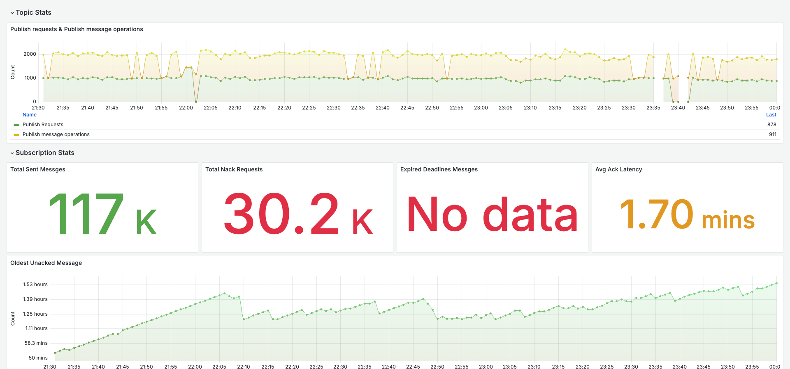
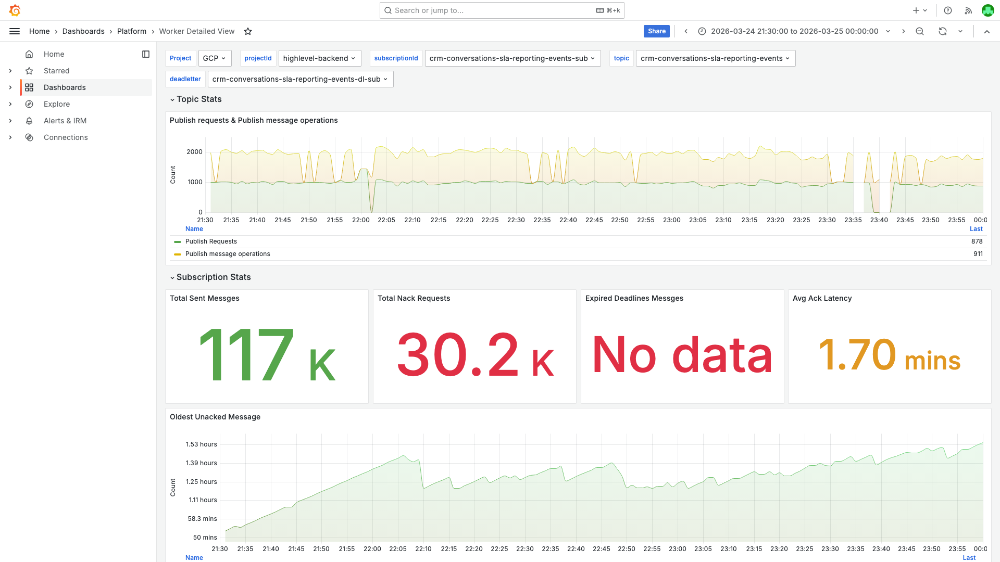
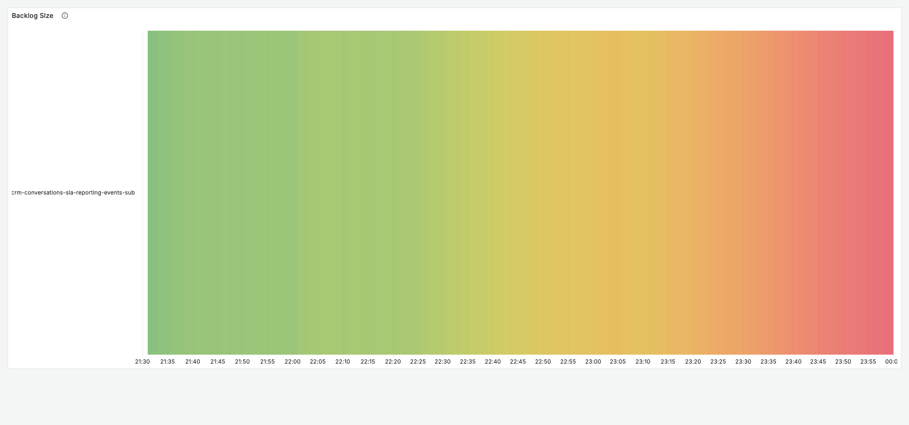
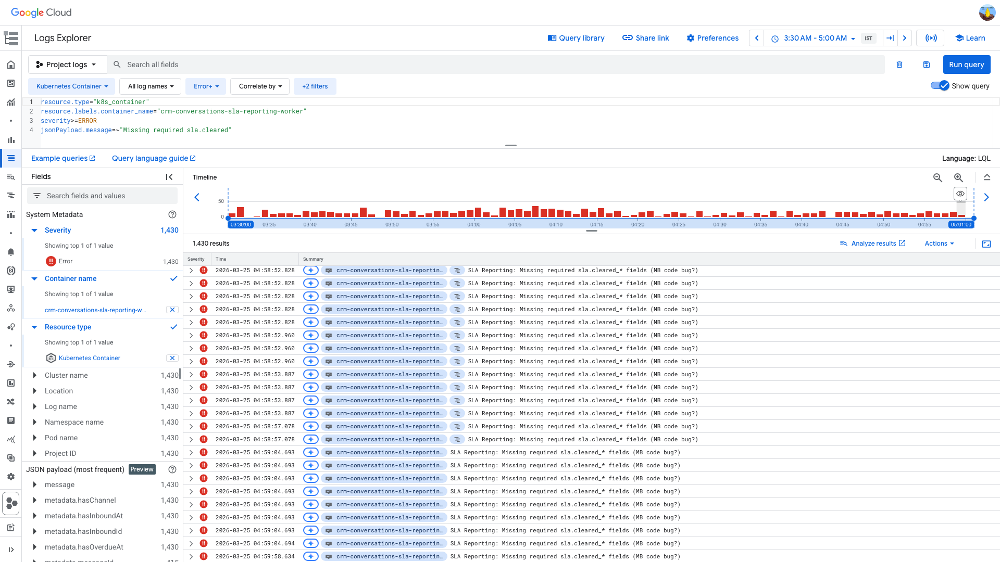
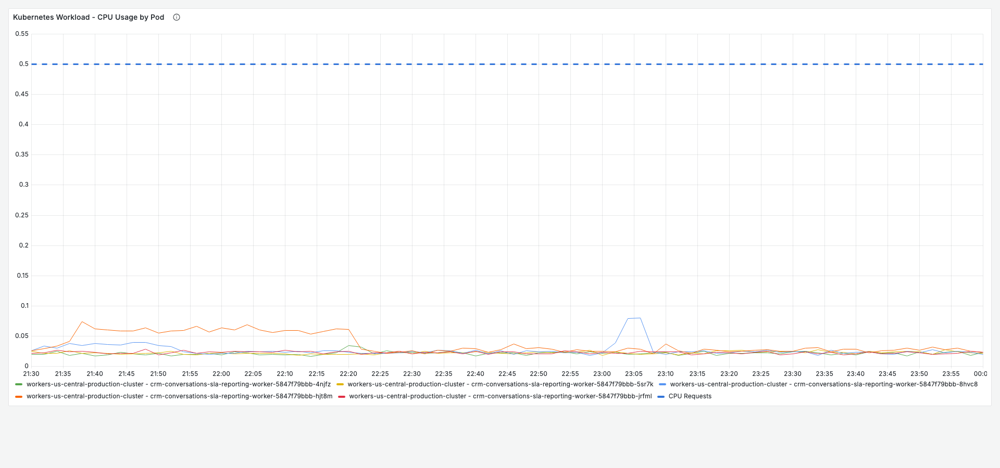

# PubSub Oldest Unacked Age — crm-conversations-sla-reporting-events-sub — 2026-03-25

**Author:** Himanshu Bhutani | **Status:** Draining (self-recovering)

## Summary

| Field | Value |
|-------|-------|
| Alert | #113552 Pubsub Oldest Unacked Messages age above 30mins |
| Service | crm-conversations-sla-reporting-worker |
| Subscription | crm-conversations-sla-reporting-events-sub |
| Cluster | workers-us-central-production-cluster |
| Fired | 04:11 IST (22:41 UTC) on 2026-03-25 |
| Peak oldest unacked | ~103 min (6,177s) at ~03:35 IST (22:05 UTC) |
| Peak backlog | ~52,343 undelivered messages at ~03:30 IST (22:00 UTC) |
| Duration | Backlog building since ~19:00 IST Mar 24 (13:30 UTC); draining by alert time |
| Impact | SLA reporting data delayed; no user-facing impact (internal analytics pipeline) |

## Root Cause

**Validation failures in `handleOutboundCleared`** — outbound "cleared SLA" messages are missing required `sla.cleared_*` fields (specifically `hasInboundId: false`), causing the worker to throw errors and nack those messages. PubSub retries them (up to 10 attempts with exponential backoff 10s→600s), consuming worker capacity and inflating the backlog. Successfully processed messages are acked normally (sent/ack ratio ~1.0x), but the error rate (~100-280 errors/5min) combined with retry backoff keeps the oldest unacked age elevated.

## What Happened

1. **~19:00 IST Mar 24** — Oldest unacked age began climbing above the ~7 min baseline, suggesting a new class of messages started arriving that the worker couldn't process.
2. **~21:00 IST Mar 24** — Backlog crossed 50k undelivered; oldest unacked age reached ~100 min. Worker ack rate steady at ~5k/5min but insufficient to outpace incoming + retried messages.
3. **04:11 IST Mar 25** — Alert fired (#113552). Oldest unacked at 3,511s (~58 min). Backlog already draining (52k → 35k by alert time).
4. **Post-alert** — Backlog continued draining as failed messages exhausted their 10 delivery attempts and moved to the dead-letter topic (`crm-conversations-sla-reporting-events-dl`).

## Proof

<details>
<summary>[Grafana] Oldest unacked age peaked at ~1.53 hours at 03:35 IST</summary>

> **Verify:** The green area chart shows sustained elevation above 50 min from ~03:00 IST, peaking at ~1.53 hours around 03:35 IST, then gradually declining.



**Context (filters + time range):**


[Open in Grafana](https://prod.grafana.leadconnectorhq.com/d/a04e5483-eb8c-47ef-8198-30147926964c/worker-detailed-view?orgId=1&var-datasource=GCP&var-projectId=highlevel-backend&var-subscriptionId=crm-conversations-sla-reporting-events-sub&var-topic=crm-conversations-sla-reporting-events&var-deadletter=crm-conversations-sla-reporting-events-dl-sub&from=1774368000000&to=1774377000000)
</details>

<details>
<summary>[Grafana] Subscription stats — 117K sent, 30.2K nacks, 1.70 min avg ack latency</summary>

> **Verify:** The gauges show 117K total sent messages, 30.2K total nack requests (significant nack volume), and 1.70 min average ack latency. "No data" for expired deadlines is expected (metric not exported for this consumer path).



[Open in Grafana](https://prod.grafana.leadconnectorhq.com/d/a04e5483-eb8c-47ef-8198-30147926964c/worker-detailed-view?orgId=1&var-datasource=GCP&var-projectId=highlevel-backend&var-subscriptionId=crm-conversations-sla-reporting-events-sub&var-topic=crm-conversations-sla-reporting-events&var-deadletter=crm-conversations-sla-reporting-events-dl-sub&from=1774368000000&to=1774377000000)
</details>

<details>
<summary>[Grafana] Ack rate steady — workers processing throughout</summary>

> **Verify:** The ack count timeseries shows a steady processing rate throughout the window, confirming workers are actively processing messages (not stalled).



[Open in Grafana](https://prod.grafana.leadconnectorhq.com/d/a04e5483-eb8c-47ef-8198-30147926964c/worker-detailed-view?orgId=1&var-datasource=GCP&var-projectId=highlevel-backend&var-subscriptionId=crm-conversations-sla-reporting-events-sub&var-topic=crm-conversations-sla-reporting-events&var-deadletter=crm-conversations-sla-reporting-events-dl-sub&from=1774368000000&to=1774377000000)
</details>

<details>
<summary>[GCP Logs] 1,430 ERRORs — all "Missing required sla.cleared_* fields (MB code bug?)"</summary>

> **Verify:** The Log Explorer shows 1,430 ERROR results, all from `crm-conversations-sla-reporting-worker`, all with the same message pattern. The timeline histogram shows sustained error volume across the window.



```
resource.type="k8s_container"
resource.labels.container_name="crm-conversations-sla-reporting-worker"
severity>=ERROR
jsonPayload.message=~"Missing required sla.cleared"
```

[Open in GCP Log Explorer](https://console.cloud.google.com/logs/query;query=resource.type%3D%22k8s_container%22%0Aresource.labels.container_name%3D%22crm-conversations-sla-reporting-worker%22%0Aseverity%3E%3DERROR%0AjsonPayload.message%3D~%22Missing%20required%20sla.cleared%22;timeRange=2026-03-24T22%3A00%3A00Z%2F2026-03-24T23%3A30%3A00Z?project=highlevel-backend)
</details>

<details>
<summary>[Grafana] Pod health — CPU <10% of request, no restarts</summary>

> **Verify:** CPU usage for all 4 pods is well below the 0.5 CPU request line (dashed blue), confirming no resource pressure. Pod Restarts panel shows no data (= zero restarts).



**Context (filters + time range):**


[Open in Grafana](https://prod.grafana.leadconnectorhq.com/d/a4859d4a-1e0a-4ae3-b9b2-d04d366cf29b/app-detailed-view?orgId=1&var-cluster=workers-us-central-production-cluster&var-container=crm-conversations-sla-reporting-worker&var-gcpProject=highlevel-backend&from=1774368000000&to=1774377000000)
</details>

## Action Items

| Priority | Action | Owner |
|----------|--------|-------|
| **High** | Fix `handleOutboundCleared` to handle outbound messages missing `inboundId` — either skip gracefully (ack without processing) or populate the field from an alternative source | CRM Conversations team |
| **Medium** | Add the production deployment YAML (`values.crm-conversations-sla-reporting-worker.yaml`) to the `deployments/production/` directory in the repo — currently only staging exists, creating a config drift | CRM Conversations team |
| **Low** | Consider force-acking messages that fail validation after fewer retries (currently retries 10 times with up to 600s backoff before dead-lettering) — validation errors won't self-heal on retry | CRM Conversations team |

## Links

- [Verbose report](report-verbose.md)
- [GCP PubSub Console](https://console.cloud.google.com/cloudpubsub/subscription/detail/crm-conversations-sla-reporting-events-sub?project=highlevel-backend)
- [GCP Log Explorer — ERROR logs](https://console.cloud.google.com/logs/query;query=resource.type%3D%22k8s_container%22%0Aresource.labels.container_name%3D%22crm-conversations-sla-reporting-worker%22%0Aseverity%3E%3DERROR;timeRange=2026-03-24T22:00:00Z%2F2026-03-24T23:30:00Z?project=highlevel-backend)
