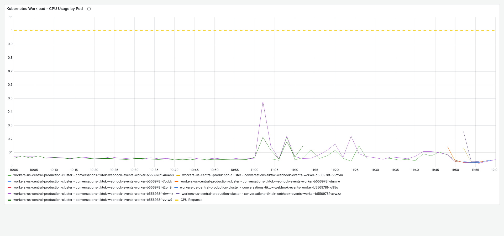
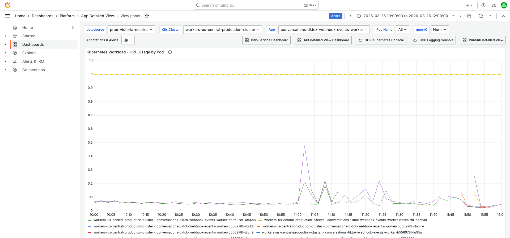
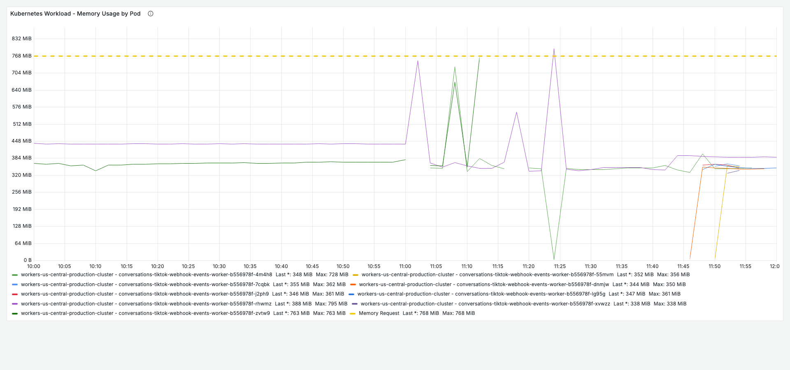
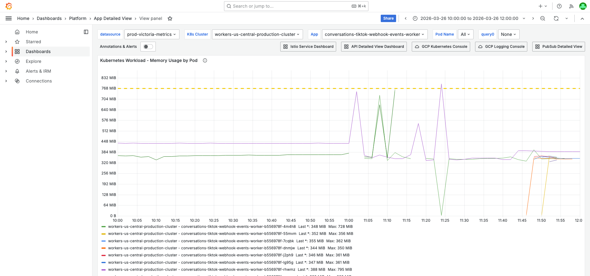
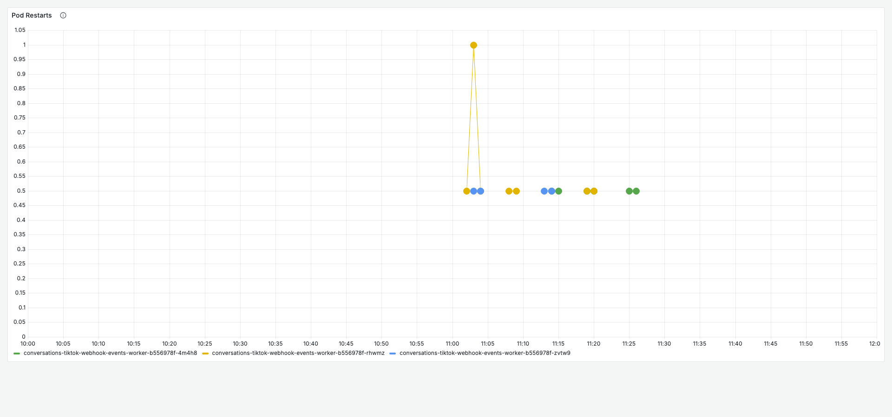
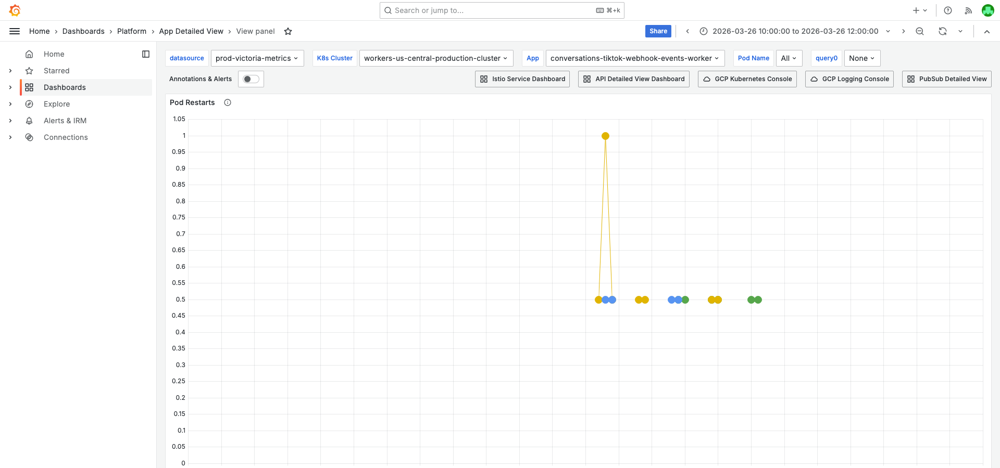
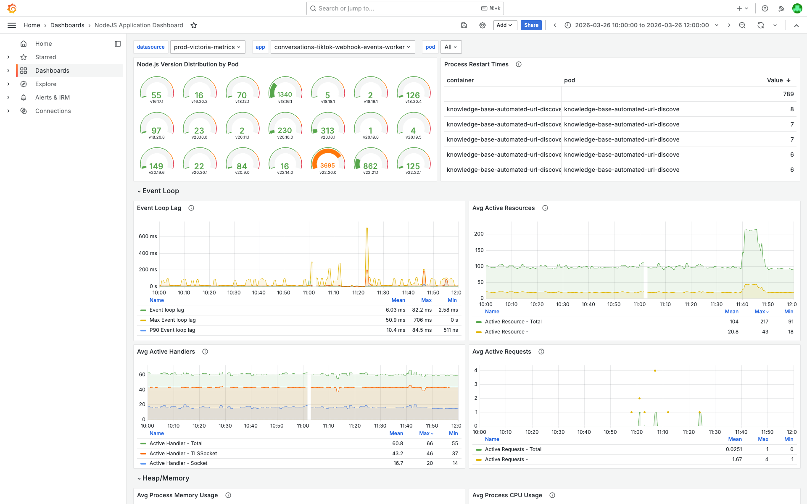
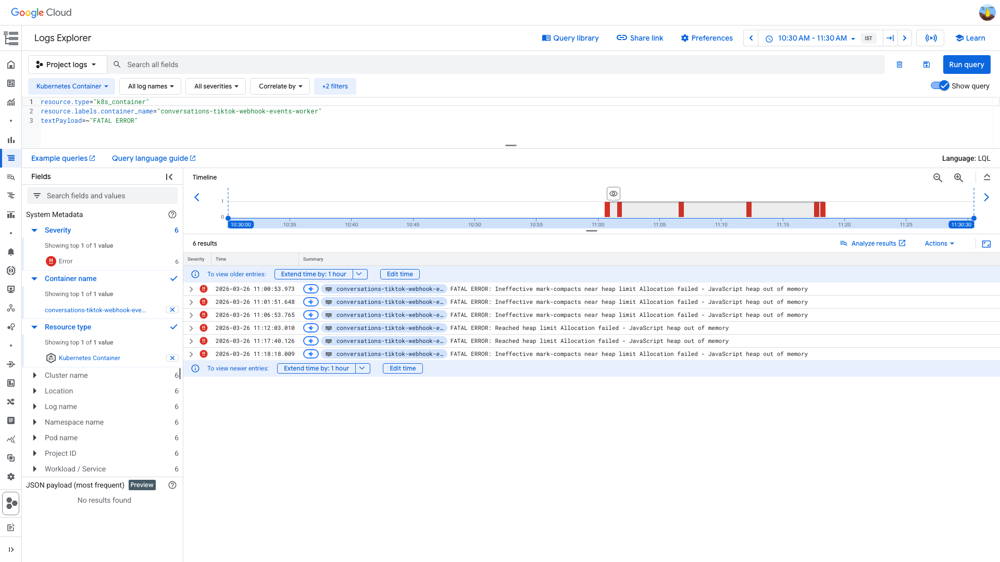
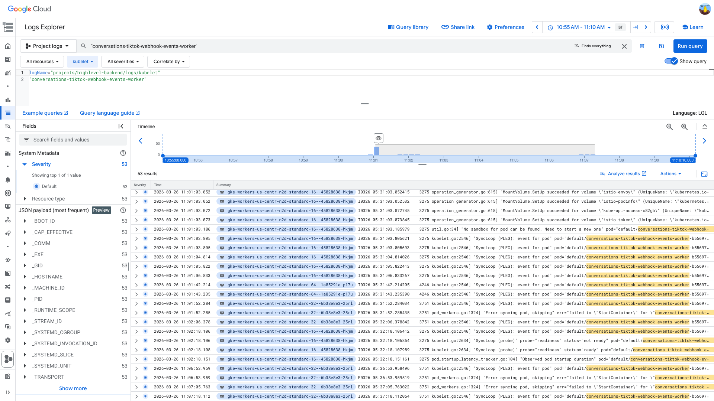

# PodRestartsAboveThreshold Investigation — conversations-tiktok-webhook-events-worker — 2026-03-26

**Author:** Himanshu Bhutani
**Generated:** 2026-03-26 12:45 IST

---

## 1. Alert Summary

| Field | Value |
|-------|-------|
| Alert type | PodRestartsAboveThreshold |
| Grafana OnCall | #113689 (group IDSBXI53YLDBD) |
| Related alert | #113690 Heap out of Memory (same workload, 21s later) |
| Workload | conversations-tiktok-webhook-events-worker |
| Cluster | workers-us-central-production-cluster |
| Time | 11:02:34 IST (05:32:34 UTC), 2026-03-26 |
| Threshold | 1 restart |
| Current value | 1 (at alert time; 9 total restarts across 3 pods over ~25 min) |
| Source channel | #alerts-crm-conversations |
| Team | CRM Conversations |
| Acknowledged by | Balaji Venkatesh |

---

## 2. What Happened

1. **11:00:53 IST** (05:30:53 UTC) — Pod `rhwmz` crashes with `FATAL ERROR: Ineffective mark-compacts near heap limit Allocation failed - JavaScript heap out of memory`. V8 heap at ~723 MiB vs 760 MiB limit.
2. **11:01:02 IST** (05:31:02 UTC) — HPA scales from 2 → 3 pods (CPU metric instability from crash). New pod `4m4h8` created.
3. **11:02:34 IST** (05:32:34 UTC) — Alert fires after `rhwmz` restarts twice in 2 minutes. CrashLoopBackOff begins (back-off 10s → 20s).
4. **11:12–11:25 IST** — Pods `zvtw9` and `4m4h8` also crash with heap OOM. HPA scales to 8 pods as crash loop creates CPU metric noise.
5. **~11:30 IST** — Crash cycle stabilizes as new pods handle traffic before heap exhaustion.

<details>
<summary>Detailed timeline — full event log</summary>

| Time (IST) | Time (UTC) | Source | Event |
|---|---|---|---|
| 11:00:53 | 05:30:53 | GCP stderr | `FATAL ERROR: Ineffective mark-compacts near heap limit` on `rhwmz` |
| 11:00:54 | 05:30:54 | Kubelet | PLEG ContainerDied for `rhwmz` |
| 11:00:55 | 05:30:55 | Kubelet | ContainerStarted for `rhwmz` (restart #1) |
| 11:01:02 | 05:31:02 | K8s HPA | SuccessfulRescale: 2 → 3 pods; created `4m4h8` |
| 11:01:51 | 05:31:51 | GCP stderr | Heap OOM again on `rhwmz` (restart #2) |
| 11:01:52 | 05:31:52 | Kubelet | ContainerDied + CrashLoopBackOff (back-off 10s) |
| 11:02:05 | 05:32:05 | Kubelet | Pulled / Created / Started for `rhwmz` (restart #2 complete) |
| 11:02:34 | 05:32:34 | Grafana | **Alert #113689 PodRestartsAboveThreshold fires** |
| 11:02:55 | 05:32:55 | Grafana | **Alert #113690 Heap out of Memory fires** |
| 11:03 | 05:33 | Grafana | `rhwmz` restart counter 1→2; `zvtw9` restart counter 0→1 |
| 11:06:53 | 05:36:53 | GCP stderr | Heap OOM on `rhwmz` (restart #3) |
| 11:08 | 05:38 | Grafana | `rhwmz` restart counter 2→3 |
| 11:12:03 | 05:42:03 | GCP stderr | Heap OOM on `zvtw9` |
| 11:13 | 05:43 | Grafana | `zvtw9` restart counter 1→2 |
| 11:14 | 05:44 | Grafana | `4m4h8` restart counter 0→1 |
| 11:17:40 | 05:47:40 | GCP stderr | Heap OOM on `4m4h8` |
| 11:18:18 | 05:48:18 | GCP stderr | Heap OOM on `rhwmz` (restart #4) |
| 11:19 | 05:49 | Grafana | `rhwmz` counter 3→4; `4m4h8` counter 1→2 |
| 11:25 | 05:55 | Grafana | `4m4h8` counter 2→3 (last restart in window) |

</details>

---

## 3. Evidence: Grafana — Pod Health

<details>
<summary>CPU by Pod — peak ~263m, well below 1.1c limit (not CPU-related)</summary>

> **What to look for:** CPU lines stay well below the limit reference line at 1.1 core. Peak is ~263m on `rhwmz` at 11:05 IST. This confirms the restarts are NOT CPU-driven.



**Context (filters + time range):**


[Open in Grafana](https://prod.grafana.leadconnectorhq.com/d/a4859d4a-1e0a-4ae3-b9b2-d04d366cf29b?orgId=1&var-datasource=ber8nnhvgsjy8f&var-cluster=workers-us-central-production-cluster&var-container=conversations-tiktok-webhook-events-worker&from=1774499400000&to=1774506600000&viewPanel=16)
</details>

<details>
<summary>Memory by Pod — peak 795 MiB WSS at 11:24 IST, limit 845 MiB (94%)</summary>

> **What to look for:** Memory working set lines climbing into high 700s MiB. The container limit reference line is at 845 MiB. Pod `rhwmz` peaks at ~795 MiB (94% of limit). Repeated drops followed by regrowth show the crash-restart cycle (sawtooth pattern).



**Context (filters + time range):**


[Open in Grafana](https://prod.grafana.leadconnectorhq.com/d/a4859d4a-1e0a-4ae3-b9b2-d04d366cf29b?orgId=1&var-datasource=ber8nnhvgsjy8f&var-cluster=workers-us-central-production-cluster&var-container=conversations-tiktok-webhook-events-worker&from=1774499400000&to=1774506600000&viewPanel=30)
</details>

<details>
<summary>Pod Restarts — 9 total restarts across 3 pods (11:02–11:25 IST)</summary>

> **What to look for:** Staircase pattern on the restart counter — `rhwmz` climbs from 0→4, `zvtw9` from 0→2, `4m4h8` from 0→3. The concentrated burst between 11:02–11:25 IST shows a fleet-wide issue, not a single-pod anomaly.



**Context (filters + time range):**


[Open in Grafana](https://prod.grafana.leadconnectorhq.com/d/a4859d4a-1e0a-4ae3-b9b2-d04d366cf29b?orgId=1&var-datasource=ber8nnhvgsjy8f&var-cluster=workers-us-central-production-cluster&var-container=conversations-tiktok-webhook-events-worker&from=1774499400000&to=1774506600000&viewPanel=36)
</details>

---

## 4. Evidence: Grafana — NodeJS Heap

<details>
<summary>NodeJS Heap Used — rhwmz at 723 MiB (95% of 760 MiB V8 limit)</summary>

> **What to look for:** Heap used graph shows sawtooth pattern — linear growth to ~723 MiB on `rhwmz` then a sharp drop (process crash) and regrowth. Other pods (`zvtw9` peak ~584 MiB, `4m4h8` peak ~593 MiB) also show high heap usage before crashing. Event loop P99 spikes to ~199ms on `4m4h8` at 11:23 IST.



[Open in Grafana](https://prod.grafana.leadconnectorhq.com/d/PTSqcpJWka/nodejs-application?orgId=1&var-datasource=ber8nnhvgsjy8f&var-app=conversations-tiktok-webhook-events-worker&from=1774499400000&to=1774506600000)
</details>

---

## 5. Evidence: GCP Logs

<details>
<summary>GCP stderr — FATAL ERROR: Ineffective mark-compacts near heap limit (5+ occurrences)</summary>

> **What to look for:** Log entries showing `FATAL ERROR: Ineffective mark-compacts near heap limit Allocation failed - JavaScript heap out of memory` on multiple pods. The earliest entry is at 05:30:53 UTC on `rhwmz`, followed by entries on `zvtw9` (05:42:03) and `4m4h8` (05:47:40).



```
resource.type="k8s_container"
resource.labels.container_name="conversations-tiktok-webhook-events-worker"
textPayload=~"FATAL ERROR"
```

[Open in Log Explorer](https://console.cloud.google.com/logs/query;query=resource.type%3D%22k8s_container%22%0Aresource.labels.container_name%3D%22conversations-tiktok-webhook-events-worker%22%0AtextPayload%3D~%22FATAL%20ERROR%22;timeRange=2026-03-26T05%3A00%3A00Z%2F2026-03-26T06%3A00%3A00Z?project=highlevel-backend)
</details>

<details>
<summary>Kubelet — ContainerDied + CrashLoopBackOff on rhwmz starting 05:30:54 UTC</summary>

> **What to look for:** Kubelet PLEG events showing `ContainerDied` immediately after the heap OOM stderr, followed by `ContainerStarted` (restart), then another `ContainerDied` within ~60s triggering `CrashLoopBackOff` with escalating back-off intervals (10s → 20s).



```
logName="projects/highlevel-backend/logs/kubelet"
"conversations-tiktok-webhook-events-worker"
```

[Open in Log Explorer](https://console.cloud.google.com/logs/query;query=logName%3D%22projects%2Fhighlevel-backend%2Flogs%2Fkubelet%22%0A%22conversations-tiktok-webhook-events-worker%22;timeRange=2026-03-26T05%3A25%3A00Z%2F2026-03-26T05%3A40%3A00Z?project=highlevel-backend)
</details>

---

## 6. Evidence: Slack & Deployment Context

- **Alert thread:** [#alerts-crm-conversations](https://gohighlevel.slack.com/archives/C097UPY34QJ/p1774503154039219) — acknowledged by Balaji Venkatesh.
- **Heap OOM thread:** [#113690](https://gohighlevel.slack.com/archives/C097UPY34QJ/p1774503175733579) fired 21s later. Reaper auto-investigation at 05:34:22 UTC concluded heap OOM with Redis retry as contributing factor. ClickUp ticket [86d2eb2j9](https://app.clickup.com/t/86d2eb2j9) created.
- **Deployment:** PR #26967 batch deploy discussion at ~09:57 IST (04:27 UTC), ~65 min before the alert. This worker was in the deploy list. Deploy could have changed the workload profile.
- **Prior occurrences:**
  - 2026-03-16: `current_value: 3` (3 restarts)
  - 2026-03-17: `current_value: 2` — resolved automatically

---

## 7. Cross-Validation

| Signal | Source | Finding | Agreement |
|--------|--------|---------|-----------|
| Memory at limit | Grafana (App Detailed View) | 795 MiB WSS / 845 MiB limit (94%) | ✅ |
| Heap at limit | Grafana (NodeJS Dashboard) | 723 MiB heap / 760 MiB V8 limit (95%) | ✅ |
| Heap OOM crash | GCP stderr | `FATAL ERROR: Ineffective mark-compacts` | ✅ |
| CrashLoopBackOff | Kubelet logs | ContainerDied → CrashLoopBackOff | ✅ |
| Exit code 139 | kubectl describe | `last_terminated_reason=Error`, exit 139 | ✅ |
| Fleet-wide | Grafana + GCP | 3 pods affected (rhwmz, zvtw9, 4m4h8) | ✅ |
| Not CPU | Grafana (CPU panel) | Peak 263m vs 1.1c limit | ✅ |
| Not istio-proxy | K8s events | `fieldPath: spec.containers{conversations-tiktok-webhook-events-worker}` | ✅ |

**Confidence: HIGH** — 4 independent sources (Grafana memory, Grafana NodeJS heap, GCP stderr, kubelet lifecycle) all confirm JavaScript heap OOM as the crash cause. Exit code 139 (SIGSEGV) is consistent with V8 aborting when GC fails.

---

## 8. Root Cause

**JavaScript heap out of memory.** The worker's V8 heap (`--max-old-space-size=760` MiB) is exhausted under normal processing load. When GC becomes ineffective (heap at ~95% of limit), V8 throws a fatal error and the process exits with SIGSEGV (code 139). This is a fleet-wide issue — all 3 active pods crashed, confirming insufficient memory allocation rather than a single-pod anomaly.

**Exit code note:** Exit 139 is 128+11 (SIGSEGV), which is unusual for heap OOM (typically exit 134 or OOMKilled 137). This likely occurs because V8's abort() handler triggers SIGSEGV in this runtime version.

**Config discrepancy:** The deployment YAML (`values.conversations-tiktok-webhook-events-worker.yaml`) sets `maxOldSpaceSize: 550`, but the running pod reports `NODE_OPTIONS=--max-old-space-size=760`. The Helm template likely overrides this based on memory request (768 MiB).

---

<details>
<summary>Probable noise — transient errors during disruption (not root cause)</summary>

| Time (IST) | Pattern | Why it's noise |
|------|---------|----------------|
| ~10:30 IST | Redis ECONNREFUSED `127.0.0.1:6379` | No Redis sidecar configured — persistent noise, not correlated with crash timing. Errors at ~05:00 UTC, before the 05:30 crash |
| Post-restart | `[PLATFORM_CORE_OBSERVABILITY] Error while instantiating Counter/Histogram Metric` | Expected post-restart metric re-registration noise |
| 11:04 IST | `FailedGetResourceMetric` on HPA | Transient metric blip from crash loop — HPA recovers |

</details>

---

## 9. Action Items

### For the alert

| Priority | Action | Rationale |
|----------|--------|-----------|
| **High** | Increase memory limit and `maxOldSpaceSize` — current 845 MiB limit / 760 MiB heap is too tight for this workload | Heap at 95% of V8 limit under normal load; no headroom for payload spikes |
| **Medium** | Align `maxOldSpaceSize` in deployment YAML (currently 550) with actual runtime value (760) | Config drift — YAML doesn't reflect deployed state |
| **Medium** | Profile memory to determine if there's a leak or if workload genuinely needs more memory | Recurring alerts (Mar 16, 17, 26) suggest systematic issue, not transient |

### Separate issues found

| Priority | Issue | Rationale |
|----------|-------|-----------|
| **Medium** | Redis ECONNREFUSED to `127.0.0.1:6379` — no Redis sidecar configured | Creates persistent error noise. Reaper investigation also flagged this. Not causing crashes but wastes error logging resources and may contribute to memory pressure from retry objects |

---

## 10. Deployment Details

| Setting | Value |
|---------|-------|
| Memory request | 768 MiB |
| Memory limit | ~845 MiB (from Grafana/kubectl) |
| CPU request | 1 core |
| CPU limit | 1.1 core |
| V8 max-old-space-size | 760 MiB (runtime) / 550 MiB (YAML) |
| HPA min/max | 2 / 20 |
| HPA target CPU | 60% |
| Peak load min replicas | 3 |
| PubSub subscription | crm-conversations-tiktok-webhook-events-sub |
| PubSub flowControl | 60 |
| PubSub ackDeadline | 300s |
| Istio proxy memory | 750Mi request / 1Gi limit |
| Base worker version | `@platform-core/base-worker_v2.24` |
