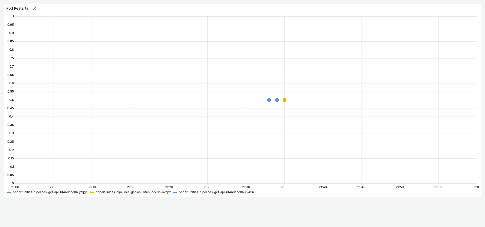
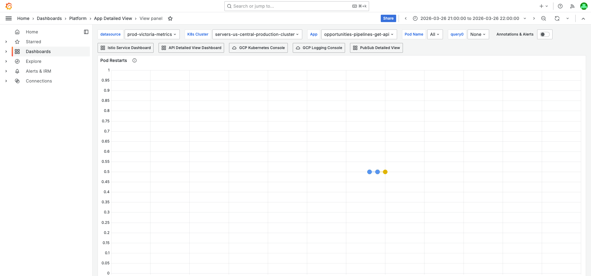
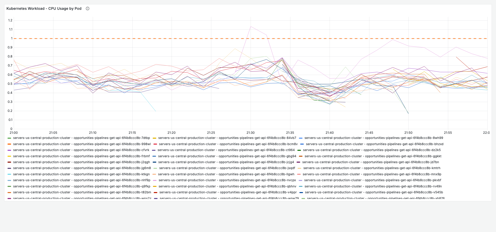
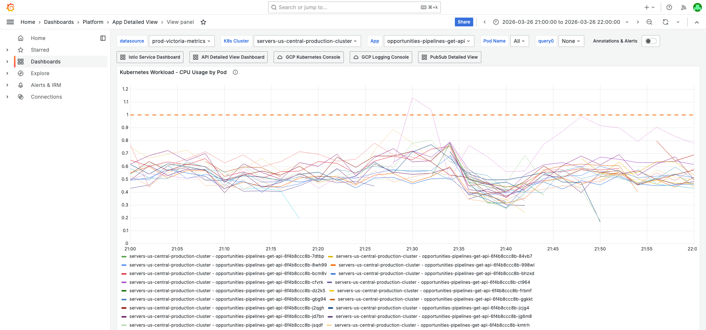
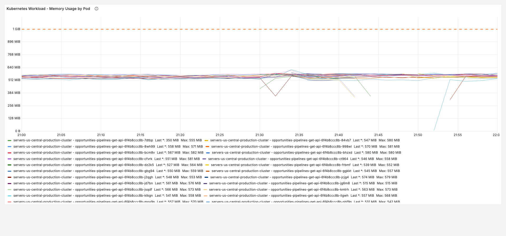
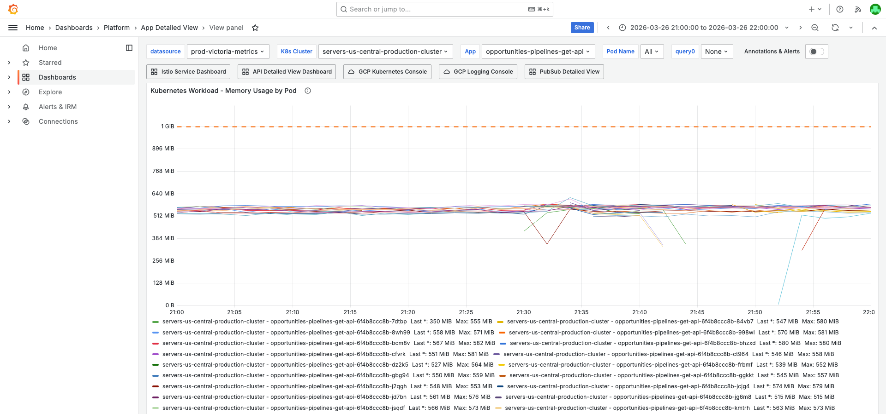
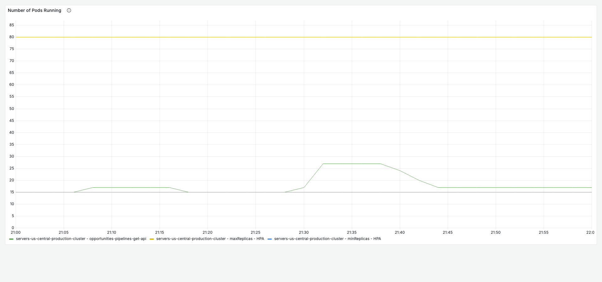
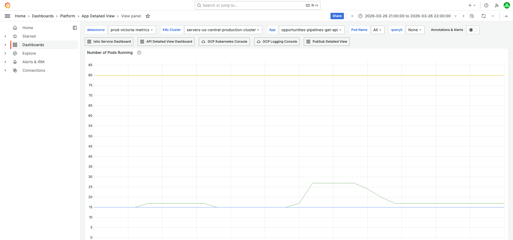
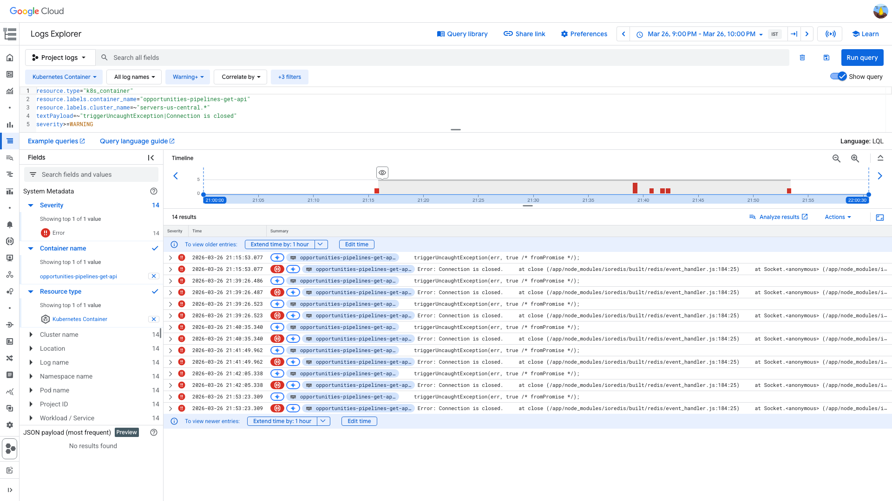
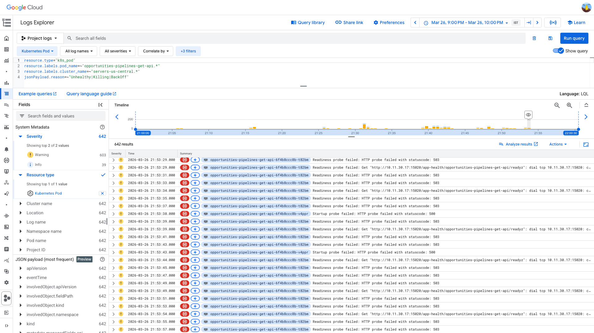

# PodRestartsAboveThreshold Investigation — opportunities-pipelines-get-api — 2026-03-26

**Author:** Himanshu Bhutani
**Generated:** 2026-03-27 01:30 IST

---

## 1. Alert Summary

| Field | Value |
|-------|-------|
| Alert type | PodRestartsAboveThreshold |
| Alert ID | [#113753](https://prod.grafana.leadconnectorhq.com/a/grafana-oncall-app/alert-groups/IGUQCV233DUVY) |
| Workload | `opportunities-pipelines-get-api` |
| Container | `opportunities-pipelines-get-api` |
| Cluster | `servers-us-central-production-cluster` |
| Channel | `#alerts-crm` |
| Time | 21:34:20 IST (16:04:20 UTC) — 2026-03-26 |
| Threshold | 1 restart |
| Current value | 3 restarts |
| Status | Auto-resolved |

---

## 2. What Happened

1. **21:06 IST** — HPA scaled up from 15→17 pods due to CPU above target. Two new pods (`ggkkt`, `ktkgn`) failed startup probes with HTTP 500.
2. **21:15 IST** — After 10 min of startup probe failures, kubelet killed both pods. During termination, Redis TCP sockets closed → ioredis emitted `Connection is closed` as unhandled promise rejection → `triggerUncaughtException` → exit code 1.
3. **21:28–21:31 IST** — HPA aggressively scaled up to 27 pods (CPU above target from earlier error storm at 21:06).
4. **21:34 IST** — **Alert fired** (restart count crossed threshold of 1).
5. **21:39–21:53 IST** — HPA scaled back down from 27 to 17 pods. Each SIGTERM sent to terminated pods caused Redis socket close → same ioredis unhandled rejection → exit code 1. 7 total crash instances in GCP logs.
6. **~22:00 IST** — Pod count stabilized at 15-17. Alert auto-resolved.

<details>
<summary>Detailed timeline — full event log</summary>

| Time (IST) | Source | Event |
|---|---|---|
| 21:05:44 | K8s HPA | ScalingReplicaSet: 15 → 17 (CPU above target) |
| 21:05:59 | K8s Pod Events | Startup probe failed: HTTP 500 on pod `ggkkt` (`spec.containers{opportunities-pipelines-get-api}`) |
| 21:06:00 | K8s Pod Events | Startup probe failed: HTTP 500 on pod `ktkgn` (`spec.containers{opportunities-pipelines-get-api}`) |
| 21:06 | GCP Monitoring | ERROR spike: **10,438 errors** in 1 minute |
| 21:15:52 | K8s HPA | ScalingReplicaSet: 17 → 15 (CPU below target) |
| 21:15:53 | K8s Pod Events | Killing pods `ggkkt` and `ktkgn` (Stopping container) |
| 21:15:53 | GCP Container Logs | `triggerUncaughtException` + `Error: Connection is closed` from ioredis |
| 21:15 | GCP Monitoring | ERROR spike: **2,616 errors** |
| 21:28:45 | K8s HPA | ScalingReplicaSet: 15 → 17 (CPU above target) |
| 21:31:08 | K8s HPA | ScalingReplicaSet: 17 → 21 (CPU above target) |
| 21:31:14 | K8s HPA | ScalingReplicaSet: 21 → 24 (CPU above target) |
| 21:31:27 | K8s HPA | ScalingReplicaSet: 24 → 27 (CPU above target) |
| 21:34:20 | Grafana OnCall | **Alert fired**: PodRestartsAboveThreshold (current_value: 3) |
| 21:39:26 | GCP Container Logs | `Connection is closed` crash ×2 (HPA scale-down 27→24) |
| 21:40:35 | GCP Container Logs | `Connection is closed` crash (HPA 24→22) |
| 21:41:49 | GCP Container Logs | `Connection is closed` crash (HPA 20→19) |
| 21:42:05 | GCP Container Logs | `Connection is closed` crash (HPA 19→18) |
| 21:42:34 | K8s HPA | ScalingReplicaSet: 18 → 17 |
| 21:53:23 | GCP Container Logs | `Connection is closed` crash (later scale-down) |
| ~22:00 | K8s HPA | Pods stabilized at 15-17 |

</details>

---

## 3. Evidence: Grafana — Pod Health

<details>
<summary>Pod Restarts — all restarted pods terminated with reason "Error" (exit code 1)</summary>

> **What to look for:** The restart panel should show spike(s) in the 21:00–22:00 IST window. The termination reason should be "Error" (not "OOMKilled"), confirming this is an app crash, not memory exhaustion.



**Context (filters + time range):**


[Open in Grafana](https://prod.grafana.leadconnectorhq.com/d/a4859d4a-1e0a-4ae3-b9b2-d04d366cf29b/app-detailed-view?orgId=1&var-datasource=ber8nnhvgsjy8f&var-cluster=servers-us-central-production-cluster&var-container=opportunities-pipelines-get-api&from=1774539000000&to=1774542600000&viewPanel=36)

</details>

<details>
<summary>CPU by Pod — avg 0.45–0.66 cores, peak 0.98 cores (limit: 1.1 cores)</summary>

> **What to look for:** CPU lines should stay below the limit reference line (1.1 cores). Any pod peaking near 0.98 cores is likely a startup spike. HPA triggered on CPU utilization % relative to request (not limit), which explains scaling even though CPU is below the absolute limit.



**Context (filters + time range):**


[Open in Grafana](https://prod.grafana.leadconnectorhq.com/d/a4859d4a-1e0a-4ae3-b9b2-d04d366cf29b/app-detailed-view?orgId=1&var-datasource=ber8nnhvgsjy8f&var-cluster=servers-us-central-production-cluster&var-container=opportunities-pipelines-get-api&from=1774539000000&to=1774542600000&viewPanel=16)

</details>

<details>
<summary>Memory by Pod — 450–570 MB (limit: 1126 MB) — NOT OOM</summary>

> **What to look for:** Memory lines should be well below the limit reference line (1126 MB). Values around 450–570 MB confirm ~50% utilization. Dips to ~3 MB indicate post-restart startup (fresh process with minimal heap). This rules out OOM as the restart cause.



**Context (filters + time range):**


[Open in Grafana](https://prod.grafana.leadconnectorhq.com/d/a4859d4a-1e0a-4ae3-b9b2-d04d366cf29b/app-detailed-view?orgId=1&var-datasource=ber8nnhvgsjy8f&var-cluster=servers-us-central-production-cluster&var-container=opportunities-pipelines-get-api&from=1774539000000&to=1774542600000&viewPanel=30)

</details>

<details>
<summary>Pod Count (HPA) — oscillated 15→27→17 during incident</summary>

> **What to look for:** The pod count line should show: starting at 15, spike to ~27 around 21:31 IST, then gradual descent back to 17 by 21:53 IST. This is HPA CPU-driven scaling (not a deployment rollout — no deployment was found in the 2h before the alert).



**Context (filters + time range):**


[Open in Grafana](https://prod.grafana.leadconnectorhq.com/d/a4859d4a-1e0a-4ae3-b9b2-d04d366cf29b/app-detailed-view?orgId=1&var-datasource=ber8nnhvgsjy8f&var-cluster=servers-us-central-production-cluster&var-container=opportunities-pipelines-get-api&from=1774539000000&to=1774542600000&viewPanel=32)

</details>

---

## 4. Evidence: GCP Logs — Crash Evidence

<details>
<summary>ioredis "Connection is closed" — 7 crash instances (unhandled promise rejection)</summary>

> **What to look for:** Log entries should show `triggerUncaughtException(err, true /* fromPromise */)` followed by `Error: Connection is closed.` with the ioredis stack trace. Timestamps should cluster at 21:15 IST (first pod kills) and 21:39–21:53 IST (HPA scale-down phase).

Full stack trace from GCP logs:
```
    triggerUncaughtException(err, true /* fromPromise */);
Error: Connection is closed.
    at close (/app/node_modules/ioredis/built/redis/event_handler.js:184:25)
    at Socket.<anonymous> (/app/node_modules/ioredis/built/redis/event_handler.js:151:20)
    at Object.onceWrapper (node:events:634:26)
    at Socket.emit (node:events:519:28)
    at TCP.<anonymous> (node:net:346:12)
    at TCP.callbackTrampoline (node:internal/async_hooks:130:17)
```



```
resource.type="k8s_container"
resource.labels.container_name="opportunities-pipelines-get-api"
resource.labels.cluster_name=~"servers-us-central.*"
textPayload=~"triggerUncaughtException|Connection is closed"
severity>=WARNING
```

[Open in GCP Log Explorer](https://console.cloud.google.com/logs/query;query=resource.type%3D%22k8s_container%22%0Aresource.labels.container_name%3D%22opportunities-pipelines-get-api%22%0Aresource.labels.cluster_name%3D~%22servers-us-central.%2A%22%0AtextPayload%3D~%22triggerUncaughtException%7CConnection%20is%20closed%22%0Aseverity%3E%3DWARNING;timeRange=2026-03-26T15%3A30%3A00Z%2F2026-03-26T16%3A30%3A00Z?project=highlevel-backend)

</details>

<details>
<summary>K8s Pod Events — startup probe failures + killing events</summary>

> **What to look for:** Events should show `Unhealthy` with `Startup probe failed: HTTP probe failed with statuscode: 500` for pods `ggkkt` and `ktkgn` starting at 21:05:59 IST, followed by `Killing: Stopping container` at 21:15:53 IST. The `fieldPath` should be `spec.containers{opportunities-pipelines-get-api}` (app container, not istio-proxy).

| Time (IST) | Pod | Reason | Message | fieldPath |
|---|---|---|---|---|
| 21:05:59 | `ggkkt` | Unhealthy | Startup probe failed: HTTP 500 | `spec.containers{opportunities-pipelines-get-api}` |
| 21:06:00 | `ktkgn` | Unhealthy | Startup probe failed: HTTP 500 | `spec.containers{opportunities-pipelines-get-api}` |
| 21:15:53 | `ggkkt` | Killing | Stopping container `opportunities-pipelines-get-api` | — |
| 21:15:53 | `ktkgn` | Killing | Stopping container `opportunities-pipelines-get-api` | — |
| 21:15:54 | Both | Unhealthy | Readiness probe failed: 503 / connection refused | `spec.containers{istio-proxy}` (secondary) |



```
resource.type="k8s_pod"
resource.labels.pod_name=~"opportunities-pipelines-get-api.*"
resource.labels.cluster_name=~"servers-us-central.*"
jsonPayload.reason=~"Unhealthy|Killing|BackOff"
```

[Open in GCP Log Explorer](https://console.cloud.google.com/logs/query;query=resource.type%3D%22k8s_pod%22%0Aresource.labels.pod_name%3D~%22opportunities-pipelines-get-api.%2A%22%0Aresource.labels.cluster_name%3D~%22servers-us-central.%2A%22%0AjsonPayload.reason%3D~%22Unhealthy%7CKilling%7CBackOff%22;timeRange=2026-03-26T15%3A30%3A00Z%2F2026-03-26T16%3A30%3A00Z?project=highlevel-backend)

</details>

---

## 5. Evidence: Log Volume Analysis

ERROR spike histogram from Cloud Monitoring `log_entry_count`:

| Time (IST) | ERROR count | Notes |
|---|---|---|
| **21:06** | **10,438** | PRIMARY spike — error storm during startup probe failures |
| **21:15** | **2,616** | Pod terminations |
| 21:28–21:29 | 392 + 250 | Second wave (HPA scale-up) |
| 21:32 | 390 | HPA scaling stress |
| 21:36 | 179 | Settling |

The dominant ERROR pattern was `"Error occured while fetching pipeline with id"` — business logic errors from the pipeline GET endpoint that likely spiked because unhealthy pods were receiving traffic before startup probes passed.

---

## 6. Root Cause

**HPA CPU-driven oscillation → ioredis "Connection is closed" unhandled promise rejection during pod termination → exit code 1.**

### Causal chain:

1. Normal traffic load caused CPU utilization to exceed HPA target → HPA scaled up
2. Two new pods failed startup probes (HTTP 500 — app health endpoint returned error during initialization)
3. After 10 minutes of startup probe failures, kubelet killed the unhealthy pods via SIGTERM
4. SIGTERM closed the Redis TCP socket
5. ioredis emitted `Connection is closed` as a promise rejection on the socket close event
6. No `unhandledRejection` handler was registered → Node.js v22 treated it as a fatal error
7. `triggerUncaughtException(err, true /* fromPromise */)` terminated the process with exit code 1
8. K8s counted this as a container restart
9. HPA later scaled down (27→17), and each pod termination triggered the same crash path

### Why this is the root cause (not OOM, not infra):
- Exit code is **1** (app crash), not **137** (OOMKilled)
- Memory was at **~50%** of limit — no memory pressure
- `fieldPath` in probe failures points to the **app container**, not `istio-proxy`
- No correlated alerts on other services (isolated, not infra-wide)
- No deployment in the 2h before the alert
- **Same ioredis pattern** confirmed in the [2025-12-09 incident](https://gohighlevel.slack.com/archives/C0315RRNH1B/p1765278655918829) (Amith's investigation)

---

## 7. Cross-Validation

| Signal | Source 1 | Source 2 | Agreement |
|--------|----------|----------|-----------|
| Exit code 1 (not 137) | GCP container logs | Grafana termination panel ("Error") | ✅ Both confirm app crash |
| ioredis Connection is closed | GCP textPayload | Stack trace in container logs | ✅ Same vulnerability as 2025-12-09 |
| Memory not at limit | Grafana Memory by Pod (50%) | No OOMKilling in K8s events | ✅ Not OOM |
| HPA oscillation 15→27→17 | Grafana Pod Count panel | K8s cluster ScalingReplicaSet events | ✅ Same timeline |
| App container failed (not sidecar) | K8s pod events `fieldPath` | Startup probe on app health endpoint | ✅ App issue |
| No deployment trigger | Slack search (no deploys found) | K8s events (no rollout events) | ✅ Not deployment-triggered |

**Confidence: HIGH** — 6 independent data sources all point to the same root cause.

---

## 8. Correlated Alerts

The Alert Correlator searched all channels (±15 min window):

- **`#alerts-crm`**: Only this alert
- **`#alerts-platform`**: GCP Quota Exceeded at 21:42 IST (unrelated — mybusiness API quota)
- **`#alerts-crm-conversations`**: No alerts
- **`#alerts-database`**: No alerts

**This was an isolated incident** — no multi-service restart pattern, no infrastructure-wide disruption.

---

## 9. Prior Occurrences

This is a **recurring pattern** for `opportunities-pipelines-get-api`:

| Date | Alert | Root Cause |
|---|---|---|
| **2025-12-09** | PodRestartsAboveThreshold | Redis Command timed out (ioredis) → unhandled rejection → exit 1. All 30 pods crashed simultaneously. [Amith's investigation](https://gohighlevel.slack.com/archives/C0315RRNH1B/p1765278655918829) |
| 2026-01-13 | PodRestartsAboveThreshold | Similar pattern (details in Slack) |
| 2026-01-20 | PodRestartsAboveThreshold | Similar pattern |
| 2026-01-24 | PodRestartsAboveThreshold | Similar pattern |
| 2026-02-26 | PodRestartsAboveThreshold | Similar pattern |
| 2026-03-10 | PodRestartsAboveThreshold | Similar pattern |
| 2026-03-16 | PodRestartsAboveThreshold | Similar pattern |
| 2026-03-17 | PodRestartsAboveThreshold | istio-proxy related (Amith marked "fixed") |
| **2026-03-26** | PodRestartsAboveThreshold | **This incident** — same ioredis vulnerability |

The ioredis unhandled rejection vulnerability has been known since December 2025 and has not been fixed.

---

<details>
<summary>Probable noise — transient errors during disruption (not root cause)</summary>

| Time (IST) | Pattern | Why it's noise |
|---|---|---|
| 21:06 | `Error occured while fetching pipeline with id` (10k+ errors) | Business logic errors — spiked because unhealthy pods received traffic before startup probes blocked them. Self-resolved when pods stabilized. |
| 21:15:54 | Readiness probe failed on `istio-proxy` (503, connection refused) | Secondary effect — istio-proxy readiness failed because the main app container was already being killed. Not the cause. |
| 21:06+ | `IAM_CONFIG_PACKAGE_WARN: Invalid Private Integration token` | Routine auth warning, constant baseline, not correlated with incident. |
| 21:06+ | `JWT decode error` | Routine auth warning, not correlated. |

</details>

---

## 10. Action Items

| Priority | Action | Rationale | Owner |
|----------|--------|-----------|-------|
| **High** | Add `process.on('unhandledRejection', handler)` to catch ioredis connection close during shutdown | Prevents exit code 1 crash on SIGTERM. The process should log and exit gracefully, not crash. | CRM Opportunities team |
| **High** | Implement graceful Redis disconnect in SIGTERM handler (`redis.disconnect()` before process exit) | Prevents the socket close event from being emitted as an unhandled rejection. Standard pattern for NestJS apps. | CRM Opportunities team |
| **Medium** | Tune HPA `behavior.scaleDown.stabilizationWindowSeconds` (e.g., 300s) | Prevents rapid scale-down oscillation that triggers multiple pod terminations in quick succession. | CRM Opportunities team |
| **Medium** | Investigate startup probe HTTP 500 — why does the app health endpoint fail during initialization? | New pods `ggkkt`/`ktkgn` failed startup probes, suggesting the app isn't ready when the probe starts. May need a longer `initialDelaySeconds` or fix the health endpoint. | CRM Opportunities team |
| **Low** | Upgrade `ioredis` to check if newer versions handle socket close gracefully | Newer versions may not emit connection close as an unhandled rejection. | CRM Opportunities team |

---

## 11. Deployment Details

| Config | Value |
|--------|-------|
| CPU limit | 1.1 cores |
| CPU request | Unknown (HPA triggers on % of request) |
| Memory limit | 1126 MB |
| Replicas (steady) | 15 |
| Replicas (peak) | 27 |
| HPA target | CPU utilization % |
| Cluster | servers-us-central-production-cluster |
| Traffic | 977–1,622 req/sec |

---

## Links

- [Concise report](report.md)
- [Grafana — App Detailed View](https://prod.grafana.leadconnectorhq.com/d/a4859d4a-1e0a-4ae3-b9b2-d04d366cf29b/app-detailed-view?orgId=1&var-datasource=ber8nnhvgsjy8f&var-cluster=servers-us-central-production-cluster&var-container=opportunities-pipelines-get-api&from=1774539000000&to=1774542600000)
- [GCP Log Explorer — crash logs](https://console.cloud.google.com/logs/query;query=resource.type%3D%22k8s_container%22%0Aresource.labels.container_name%3D%22opportunities-pipelines-get-api%22%0Aresource.labels.cluster_name%3D~%22servers-us-central.%2A%22%0AtextPayload%3D~%22triggerUncaughtException%7CConnection%20is%20closed%22%0Aseverity%3E%3DWARNING;timeRange=2026-03-26T15%3A30%3A00Z%2F2026-03-26T16%3A30%3A00Z?project=highlevel-backend)
- [Slack alert thread](https://gohighlevel.slack.com/archives/C0315RRNH1B/p1774541060663219)
- [2025-12-09 prior investigation (Amith)](https://gohighlevel.slack.com/archives/C0315RRNH1B/p1765278655918829)
