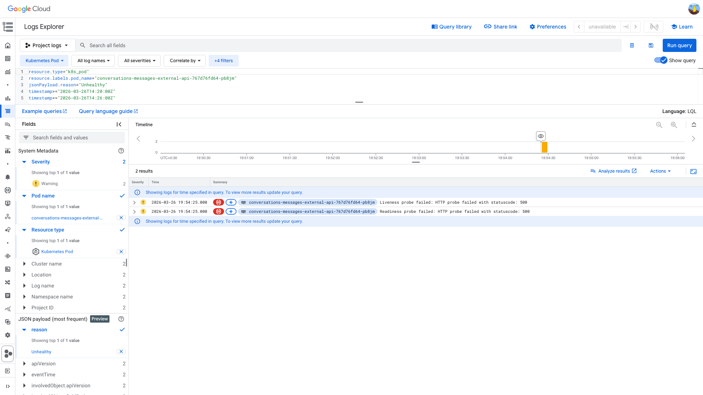
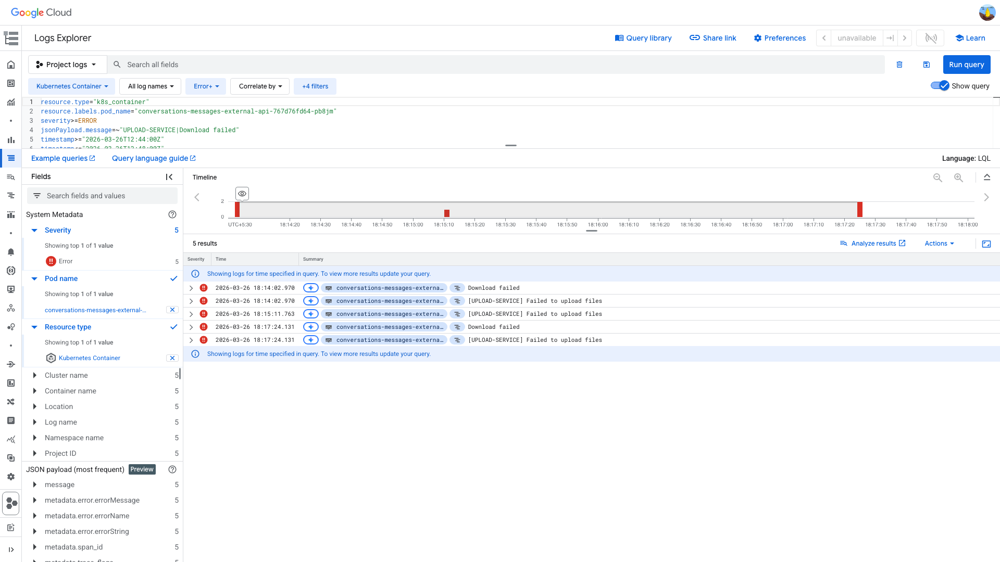

# PodRestartsAboveThreshold Investigation — conversations-messages-external-api — Memory Deep Dive (2026-03-26)

**Author:** Himanshu Bhutani
**Generated:** 2026-03-27 IST

## 1. Alert Summary

| Field | Value |
|-------|-------|
| Alert type | PodRestartsAboveThreshold |
| Alert ID | [#113739](https://prod.grafana.leadconnectorhq.com/a/grafana-oncall-app/alert-groups/I23Z4F3TXWLMK) |
| Workload | conversations-messages-external-api |
| Cluster | servers-us-central-production-cluster |
| Alert time | 19:56 IST (14:26 UTC) |
| Pod investigated | conversations-messages-external-api-767d76fd64-pb8jm |

## 2. Findings

### A. Memory tracking instrumentation isolated the trigger window

The new interceptor/watchdog logs added for leak analysis gave direct correlation:

- **12:46:09 UTC (18:16:09 IST):** `Memory spike detected on request`
  - route: `/conversations/messages/upload`
  - contentLength: `15554228` (15.5 MB)
  - `deltas.rssMiB=1394`
  - `deltas.heapUsedMiB=90`
- **13:13:43 UTC (18:43:43 IST):** watchdog warning on same pod
  - `rss=3162 MiB`
  - `heapUsed=640 MiB`
  - `usagePercent=70`

This is native-memory-heavy growth, not heap-dominant growth.

<details>
<summary>Evidence — upload spike log</summary>

> **What to look for:** RSS delta is ~15x heap delta on the upload route.

```log
2026-03-26T12:46:09.937Z  route=/conversations/messages/upload  contentLength=15554228
rss_delta=1394MiB  heap_delta=90MiB
```


[Open in GCP Log Explorer](https://console.cloud.google.com/logs/query;query=resource.type%3D%22k8s_container%22%0Aresource.labels.pod_name%3D%22conversations-messages-external-api-767d76fd64-pb8jm%22%0AjsonPayload.message%3D%22Memory%20spike%20detected%20on%20request%22%0AjsonPayload.metadata.route%3D%22%2Fconversations%2Fmessages%2Fupload%22%0Atimestamp%3E%3D%222026-03-26T12%3A45%3A30Z%22%0Atimestamp%3C%3D%222026-03-26T12%3A46%3A30Z%22;timeRange=2026-03-26T12%3A40%3A00Z%2F2026-03-26T14%3A30%3A00Z?project=highlevel-backend)
</details>

<details>
<summary>Evidence — watchdog 70% warning on pb8jm</summary>

> **What to look for:** RSS remains very high long after upload spike; heap is much lower.


[Open in GCP Log Explorer](https://console.cloud.google.com/logs/query;query=resource.type%3D%22k8s_container%22%0Aresource.labels.pod_name%3D%22conversations-messages-external-api-767d76fd64-pb8jm%22%0AjsonPayload.message%3D%22WARNING%3A%20Memory%20usage%20above%2070%25%22%0Atimestamp%3E%3D%222026-03-26T13%3A10%3A00Z%22%0Atimestamp%3C%3D%222026-03-26T13%3A20%3A00Z%22;timeRange=2026-03-26T12%3A40%3A00Z%2F2026-03-26T14%3A30%3A00Z?project=highlevel-backend)
</details>

### B. Restart trigger on same pod is concrete and time-aligned

- **14:24:25 UTC (19:54:25 IST):** K8s events on pb8jm:
  - `Liveness probe failed: HTTP probe failed with statuscode: 500`
  - `Readiness probe failed: HTTP probe failed with statuscode: 500`
- Restart happens immediately after, matching Grafana restart panel.

<details>
<summary>Evidence — pb8jm unhealthy/liveness failures before restart</summary>

> **What to look for:** Failures are on the same pod in the 1–2 minute window before restart.



[Open in GCP Log Explorer](https://console.cloud.google.com/logs/query;query=resource.type%3D%22k8s_pod%22%0Aresource.labels.pod_name%3D%22conversations-messages-external-api-767d76fd64-pb8jm%22%0AjsonPayload.reason%3D%22Unhealthy%22%0Atimestamp%3E%3D%222026-03-26T14%3A20%3A00Z%22%0Atimestamp%3C%3D%222026-03-26T14%3A26%3A00Z%22;timeRange=2026-03-26T14%3A20%3A00Z%2F2026-03-26T14%3A26%3A00Z?project=highlevel-backend)
</details>

### C. Metrics corroborate the same chain

<details>
<summary>Evidence — Memory panel + Restart panel</summary>

> **What to look for:** Elevated RSS plateau on pb8jm leading into single restart event.


**Context:**


**Context:**


- [Open memory panel](https://prod.grafana.leadconnectorhq.com/d/a4859d4a-1e0a-4ae3-b9b2-d04d366cf29b/app-detailed-view?orgId=1&var-cluster=servers-us-central-production-cluster&var-container=conversations-messages-external-api&from=1774528200000&to=1774537200000&viewPanel=30)
- [Open restart panel](https://prod.grafana.leadconnectorhq.com/d/a4859d4a-1e0a-4ae3-b9b2-d04d366cf29b/app-detailed-view?orgId=1&var-cluster=servers-us-central-production-cluster&var-container=conversations-messages-external-api&from=1774528200000&to=1774537200000&viewPanel=36)
</details>

## 3. Root Cause Assessment

### Most likely direct cause

Native-memory-heavy upload processing caused sustained RSS growth on one pod, which eventually failed liveness and restarted.

### Code-path correlation (why this is likely)

The upload path (`POST /conversations/messages/upload`) leads to `common/helpers/UploadFiles.ts`, where:

1. image compression loop uses `sharp(...).toBuffer()` repeatedly (native allocations)
2. write path uses `Buffer.from(file.buffer, 'base64')` before stream write (extra copy/conversion pressure)
3. buffer cleanup is conditional (not always released immediately)

The instrumentation evidence aligns with these patterns: huge RSS jump with small heap change.

## 4. Causal Timeline

### Summary timeline

1. **18:16:09 IST (12:46:09 UTC)** — Upload request logs +1394 MiB RSS on pb8jm.
2. **18:43:43 IST (13:13:43 UTC)** — Watchdog reports 70% memory (RSS 3162 MiB).
3. **19:54:25 IST (14:24:25 UTC)** — Liveness/readiness probe failures on pb8jm.
4. **~19:55 IST** — Pod restart observed in Grafana restart panel.

<details>
<summary>Detailed timeline</summary>

| Time (IST) | Source | Event |
|---|---|---|
| 18:16:09 | Memory interceptor | `/messages/upload` request logs RSS +1394 MiB, heap +90 MiB |
| 18:43:43 | Watchdog | WARNING memory usage 70%, rss=3162, heap=640 |
| 19:54:25 | K8s events | Liveness probe failed HTTP 500 |
| 19:54:25 | K8s events | Readiness probe failed HTTP 500 |
| ~19:55 | Grafana | Restart count increases to 1 |

</details>

## 5. Probable Noise

<details>
<summary>Probable noise — transient errors during same window</summary>

| Pattern | Why treated as noise in this RCA |
|---|---|
| `[UPLOAD-SERVICE] Failed to upload files` / `Download failed` | Co-occurs around upload activity but does not by itself explain sustained high RSS + restart chain |
| Generic fetchNonEmailMessages errors | Present intermittently and not tightly coupled to restart timestamp |



[Open in GCP Log Explorer](https://console.cloud.google.com/logs/query;query=resource.type%3D%22k8s_container%22%0Aresource.labels.pod_name%3D%22conversations-messages-external-api-767d76fd64-pb8jm%22%0Aseverity%3E%3DERROR%0AjsonPayload.message%3D~%22UPLOAD-SERVICE%7CDownload%20failed%22%0Atimestamp%3E%3D%222026-03-26T12%3A44%3A00Z%22%0Atimestamp%3C%3D%222026-03-26T12%3A48%3A00Z%22;timeRange=2026-03-26T12%3A40%3A00Z%2F2026-03-26T14%3A30%3A00Z?project=highlevel-backend)
</details>

## 6. Action Items

| Priority | Action | Owner |
|---|---|---|
| High | Replace `Buffer.from(file.buffer, 'base64')` with direct buffer write in upload path | CRM Conversations |
| High | Ensure `file.buffer` gets released immediately after successful upload in all branches | CRM Conversations |
| Medium | Add safe limits / guardrails around sharp compression iterations and cache behavior | CRM Conversations |
| Medium | Prefer signed URL + streaming upload path for large media workloads | CRM Conversations |
| Medium | Add route-level memory telemetry counters (upload route) to Grafana for proactive alerts | CRM Conversations |

## 7. Cross-validation confidence

**Confidence: High**

- Log evidence and metrics agree on timestamp/order.
- Restart trigger and pod identity match across GCP and Grafana.
- Memory signature strongly indicates native-memory pressure rather than pure V8 heap growth.
