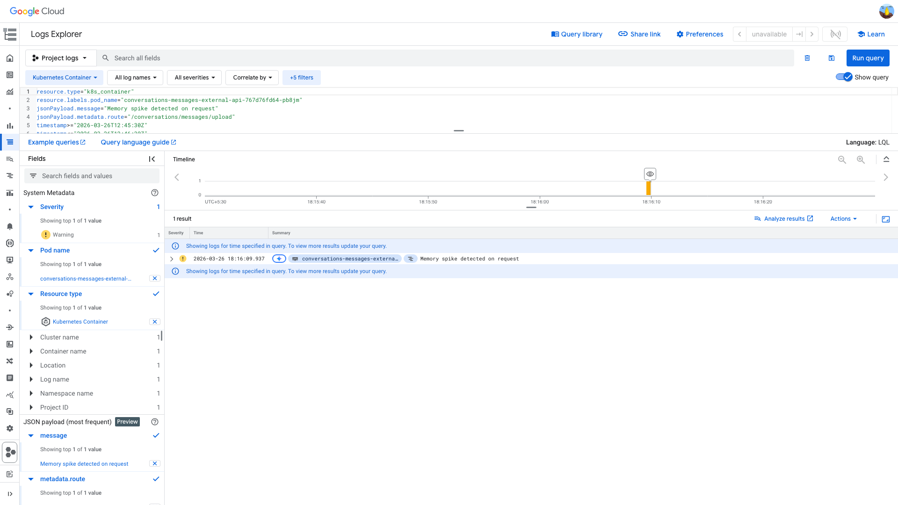
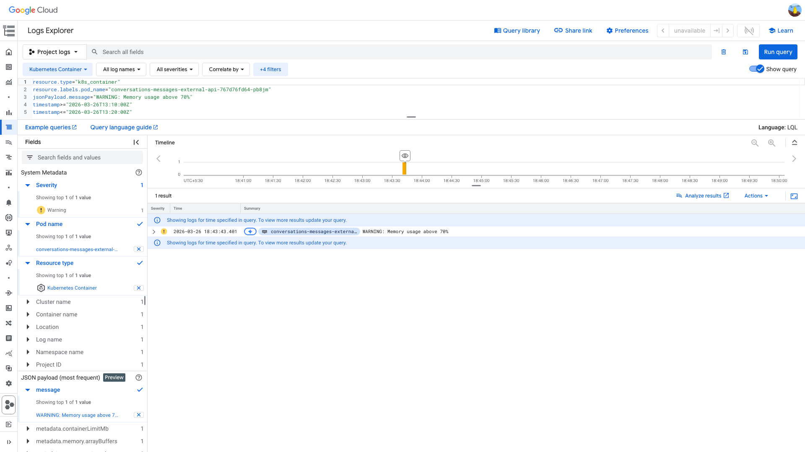

# PodRestartsAboveThreshold — conversations-messages-external-api — Memory Deep Dive (2026-03-26)

**Author:** Himanshu Bhutani | **Status:** Auto-resolved

## Summary

| Field | Value |
|-------|-------|
| Alert | [#113739 PodRestartsAboveThreshold](https://prod.grafana.leadconnectorhq.com/a/grafana-oncall-app/alert-groups/I23Z4F3TXWLMK) |
| Service | conversations-messages-external-api |
| Cluster | servers-us-central-production-cluster |
| Fired | 19:56 IST (14:26 UTC) |
| Impact | Single pod (`pb8jm`) restarted after prolonged high RSS; no sustained 5XX impact |

## Root Cause

The restart is linked to **native memory runaway triggered in the upload path**:

1. At **18:16:09 IST (12:46:09 UTC)**, memory-tracking logs show a single `POST /conversations/messages/upload` request with `contentLength=15,554,228` causing **RSS +1394 MiB** with only **heap +90 MiB**.
2. RSS stayed elevated (~2.9–3.2 GiB) for over an hour; watchdog later logged **70% memory usage** on the same pod (`RSS=3162 MiB`, `heap=640 MiB`).
3. At **19:54:25 IST (14:24:25 UTC)**, pod events show liveness/readiness failures (`HTTP 500`) and kubelet restarted the container.

This points to a **native (non-V8) memory retention/leak** in the upload/compression/upload pipeline, not a JS heap-only leak.

## Proof

<details>
<summary>[GCP Memory Tracking] Upload request caused +1394 MiB RSS with only +90 MiB heap</summary>

> **Verify:** The log entry shows `route=/conversations/messages/upload`, `contentLength=15554228`, `deltas.rssMiB=1394`, `deltas.heapUsedMiB=90` on pod `pb8jm`.

```text
2026-03-26T12:46:09.937Z  rss_delta=1394  heap_delta=90  contentLength=15554228
```



[Open in GCP Log Explorer](https://console.cloud.google.com/logs/query;query=resource.type%3D%22k8s_container%22%0Aresource.labels.pod_name%3D%22conversations-messages-external-api-767d76fd64-pb8jm%22%0AjsonPayload.message%3D%22Memory%20spike%20detected%20on%20request%22%0AjsonPayload.metadata.route%3D%22%2Fconversations%2Fmessages%2Fupload%22%0Atimestamp%3E%3D%222026-03-26T12%3A45%3A30Z%22%0Atimestamp%3C%3D%222026-03-26T12%3A46%3A30Z%22;timeRange=2026-03-26T12%3A40%3A00Z%2F2026-03-26T14%3A30%3A00Z?project=highlevel-backend)
</details>

<details>
<summary>[GCP Watchdog] 70% memory warning confirms RSS remained elevated</summary>

> **Verify:** Same pod logs `WARNING: Memory usage above 70%` with `rss=3162`, `heapUsed=640`, `usagePercent=70`.



[Open in GCP Log Explorer](https://console.cloud.google.com/logs/query;query=resource.type%3D%22k8s_container%22%0Aresource.labels.pod_name%3D%22conversations-messages-external-api-767d76fd64-pb8jm%22%0AjsonPayload.message%3D%22WARNING%3A%20Memory%20usage%20above%2070%25%22%0Atimestamp%3E%3D%222026-03-26T13%3A10%3A00Z%22%0Atimestamp%3C%3D%222026-03-26T13%3A20%3A00Z%22;timeRange=2026-03-26T12%3A40%3A00Z%2F2026-03-26T14%3A30%3A00Z?project=highlevel-backend)
</details>

<details>
<summary>[Grafana] Memory + restart timeline aligns with restart window</summary>

> **Verify:** Memory panel shows pb8jm elevated around ~3 GiB before restart; restart panel shows single restart near 19:55 IST.


- [Open memory panel](https://prod.grafana.leadconnectorhq.com/d/a4859d4a-1e0a-4ae3-b9b2-d04d366cf29b/app-detailed-view?orgId=1&var-cluster=servers-us-central-production-cluster&var-container=conversations-messages-external-api&from=1774528200000&to=1774537200000&viewPanel=30)
- [Open restart panel](https://prod.grafana.leadconnectorhq.com/d/a4859d4a-1e0a-4ae3-b9b2-d04d366cf29b/app-detailed-view?orgId=1&var-cluster=servers-us-central-production-cluster&var-container=conversations-messages-external-api&from=1774528200000&to=1774537200000&viewPanel=36)
</details>

## Action Items

| Priority | Action | Owner |
|----------|--------|-------|
| High | Fix `Buffer.from(file.buffer, 'base64')` to `writableStream.write(file.buffer)` in `common/helpers/UploadFiles.ts` | CRM Conversations |
| High | Always release upload buffers after GCS write (`delete file.buffer` for all code paths) | CRM Conversations |
| Medium | Reduce native pressure in image compression path (`sharp` cache/loop controls) | CRM Conversations |
| Medium | Move heavy uploads to signed URL / streaming path where possible | CRM Conversations |

## Links

- [Verbose report](report-verbose.md)
- [Alert thread](https://gohighlevel.slack.com/archives/C097UPY34QJ/p1774554711011769?thread_ts=1774535213.802499&cid=C097UPY34QJ)
- ClickUp: [86d23q0rm](https://app.clickup.com/t/86d23q0rm)
