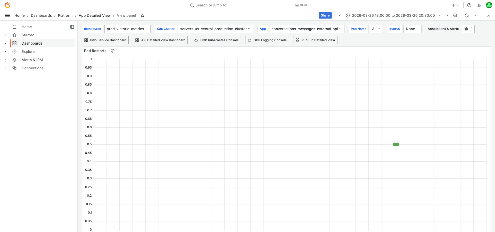
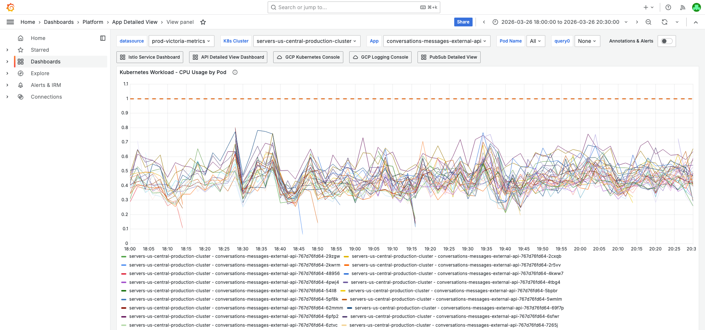
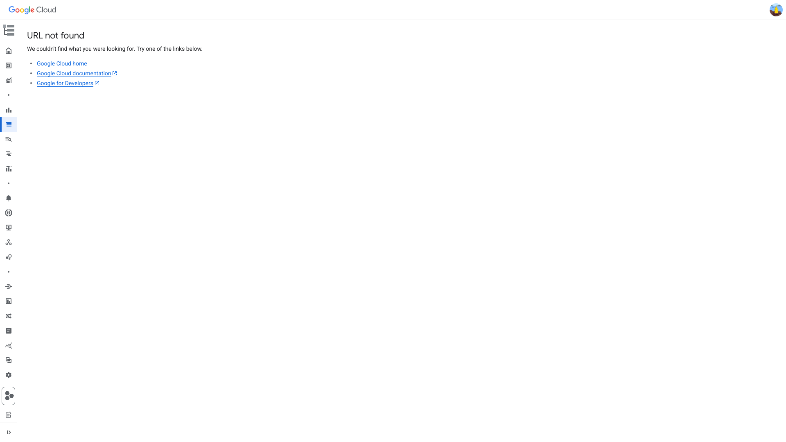

# PodRestartsAboveThreshold Investigation — conversations-messages-external-api — 2026-03-26

**Author:** Himanshu Bhutani
**Generated:** 2026-03-27 01:20 IST

## Update Note (2026-03-27)

This original verbose report is retained and not deleted.

An expanded deep-dive report is available here:
- [Deep-dive concise](https://github.com/bhutanihimanshu/alert-investigations/blob/main/reports/2026/03/26-pod-restarts-conversations-messages-external-api-memory-deep-dive/report.md)
- [Deep-dive verbose](https://github.com/bhutanihimanshu/alert-investigations/blob/main/reports/2026/03/26-pod-restarts-conversations-messages-external-api-memory-deep-dive/report-verbose.md)

What the deep-dive adds beyond this report:
- Direct memory-tracking log evidence linking restart progression to upload-route native memory growth on pod `pb8jm`.
- Verified GCP query outputs for the upload spike (`rss +1394 MiB`, `heap +90 MiB`) and watchdog warning (`rss=3162 MiB`, `heap=640 MiB`).
- Pod-specific liveness/readiness failure evidence at restart edge (`HTTP 500`) for the same pod.
- Additional focused screenshots and report sections for these memory-tracking signals.

---

## 1. Alert Summary

| Field | Value |
|-------|-------|
| Alert type | PodRestartsAboveThreshold |
| Alert ID | [#113739](https://prod.grafana.leadconnectorhq.com/a/grafana-oncall-app/alert-groups/I23Z4F3TXWLMK) |
| Workload | conversations-messages-external-api |
| Cluster | servers-us-central-production-cluster |
| Time | 19:56 IST (14:26 UTC) on 2026-03-26 |
| Threshold | 1 |
| Channel | #alerts-crm-conversations |
| Team | CRM Conversations |
| Acknowledged by | Balaji Venkatesh |
| Status | Auto-resolved |

---

## 2. Investigation Findings

### Evidence: Grafana — Pod Health

<details>
<summary>Memory by Pod — OOM spike from 1.7 GiB → 3.15 GiB on pod pb8jm starting at 18:17 IST</summary>

> **What to look for:** One pod line (pb8jm) shows a sharp upward spike from ~1700 MiB to ~3000 MiB at 18:17 IST, while all other pods remain stable at ~1100-1500 MiB. The line continues elevated at ~3000 MiB for ~1.5 hours, then drops abruptly to ~672 MiB at ~19:55 IST when the kernel OOM-killed the container. After restart, it stabilizes at ~1100-1550 MiB (normal range).

> V8 heap was only ~964 MiB at peak while container RSS was ~3162 MiB — indicating **~2.2 GiB of non-heap (native) memory** from native buffers, gRPC connections, or external string buffers.


**Context (filters + time range):**


[Open in Grafana — Memory by Pod](https://prod.grafana.leadconnectorhq.com/d/a4859d4a-1e0a-4ae3-b9b2-d04d366cf29b/app-detailed-view?orgId=1&var-cluster=servers-us-central-production-cluster&var-container=conversations-messages-external-api&from=1774528200000&to=1774537200000&viewPanel=30)

</details>

<details>
<summary>Pod Restarts — single restart on pb8jm at ~19:55 IST</summary>

> **What to look for:** A single restart event visible for one pod around 19:55 IST. The restart counter shows `increase(restarts[1h]) = 1` appearing after the OOM kill.


**Context (filters + time range):**


[Open in Grafana — Pod Restarts](https://prod.grafana.leadconnectorhq.com/d/a4859d4a-1e0a-4ae3-b9b2-d04d366cf29b/app-detailed-view?orgId=1&var-cluster=servers-us-central-production-cluster&var-container=conversations-messages-external-api&from=1774528200000&to=1774537200000&viewPanel=36)

</details>

<details>
<summary>CPU by Pod — normal levels, all pods well below 1.1 core limit</summary>

> **What to look for:** All pod lines stay well below the 1.0 core request / 1.1 core limit reference lines. The restarted pod pb8jm averaged 0.41 cores with a peak of 0.55 cores at 14:08 UTC. The highest across the fleet was 0.78 cores on pod rk4d8 — still 29% below the limit. CPU was NOT a factor.


**Context (filters + time range):**


[Open in Grafana — CPU by Pod](https://prod.grafana.leadconnectorhq.com/d/a4859d4a-1e0a-4ae3-b9b2-d04d366cf29b/app-detailed-view?orgId=1&var-cluster=servers-us-central-production-cluster&var-container=conversations-messages-external-api&from=1774528200000&to=1774537200000&viewPanel=16)

</details>

### Evidence: Grafana — API Traffic

<details>
<summary>API Requests Overview — steady ~650 req/s, zero 5XX errors</summary>

> **What to look for:** Request rate is flat at ~650 req/s throughout the window (avg 649.9, max 724.5 at 14:37 UTC). The 5XX error line is at zero. No traffic spike preceded the restart, ruling out traffic-induced CPU/memory pressure.


[Open in Grafana — API Requests Overview](https://prod.grafana.leadconnectorhq.com/d/d2db17da-6a85-44c7-88a5-391ef0063cd0/api-requests-overview?orgId=1&var-container=conversations-messages-external-api&from=1774528200000&to=1774537200000)

</details>

### Evidence: GCP Logs — Redis Timeout Storm

<details>
<summary>Redis command timeout errors from OAuth Rate Limiter — burst at 19:26 IST (13:56 UTC)</summary>

> **What to look for:** Multiple ERROR entries showing `Oauth Rate Limiter Middleware: Redis command timeout - Command timed out` from the `@platform-core/ratelimit` ioredis client. Stack trace points to `ioredis/built/Command.js:192:33`. At least 8 pods affected: stcl2, fj6sq, v2gbv, 6pfp2, dghjw, rk4d8, 62mmm, hgjwb.

**Raw query:**

```
resource.type="k8s_container"
resource.labels.container_name="conversations-messages-external-api"
severity>=ERROR
jsonPayload.message=~"Command timed out"
timestamp>="2026-03-26T13:50:00Z"
timestamp<="2026-03-26T14:10:00Z"
```



[Open in GCP Log Explorer](https://console.cloud.google.com/logs/query;query=resource.type%3D%22k8s_container%22%0Aresource.labels.container_name%3D%22conversations-messages-external-api%22%0Aseverity%3E%3DERROR%0AjsonPayload.message%3D~%22Command%20timed%20out%22;timeRange=2026-03-26T13%3A50%3A00Z/2026-03-26T14%3A10%3A00Z?project=highlevel-backend)

</details>

### Evidence: GCP Events — Probe Failure Storm

<details>
<summary>K8s probe failures — 30 Unhealthy events on 15+ pods, liveness failures on 3 pods (19:30-19:34 IST)</summary>

> **What to look for:** `jsonPayload.reason=Unhealthy` events with `fieldPath=spec.containers{conversations-messages-external-api}` — confirming the **app container** failed, NOT istio-proxy. Liveness probe failures triggered kills on:
> - Pod `7mlzp` at 14:03:49 UTC — `context deadline exceeded`
> - Pod `h9rl7` at 14:03:55 UTC — `HTTP probe failed with statuscode: 500`
> - Pod `stcl2` at 14:03:57 UTC — `context deadline exceeded`
>
> Probe URL: `http://<podIP>:15020/app-health/conversations-messages-external-api/readyz`

**Raw query:**

```
resource.type="k8s_pod"
resource.labels.pod_name=~"conversations-messages-external-api.*"
jsonPayload.reason="Unhealthy"
timestamp>="2026-03-26T13:56:00Z"
timestamp<="2026-03-26T14:10:00Z"
```

[Open in GCP Log Explorer](https://console.cloud.google.com/logs/query;query=resource.type%3D%22k8s_pod%22%0Aresource.labels.pod_name%3D~%22conversations-messages-external-api.%2A%22%0AjsonPayload.reason%3D%22Unhealthy%22;timeRange=2026-03-26T13%3A56%3A00Z/2026-03-26T14%3A10%3A00Z?project=highlevel-backend)

</details>

### Evidence: Grafana — Event Loop (NodeJS Dashboard)

Event loop lag P99 on the restarted pod (pb8jm) was max 0.03s at 13:50 UTC — well below the probe timeout. One other pod (4pwj4) showed a separate 1.96s spike at 14:05 UTC. Event loop blocking was NOT a primary factor for the OOM-killed pod, but may have contributed to the Redis-timeout-affected pods.

[Open in Grafana — NodeJS Dashboard](https://prod.grafana.leadconnectorhq.com/d/PTSqcpJWka?orgId=1&var-container=conversations-messages-external-api&from=1774528200000&to=1774537200000)

---

## 3. Cross-Validation

| Signal | Source | Finding | Agrees? |
|--------|--------|---------|---------|
| OOM Kill | Grafana `kube_pod_container_status_last_terminated_reason` | OOMKilled | ✅ |
| Memory spike | Grafana Memory by Pod panel | pb8jm: 1.7→3.15 GiB RSS, V8 heap only 964 MiB | ✅ |
| Redis timeouts | GCP logs (`severity>=ERROR`) | 20+ `Command timed out` from `@platform-core/ratelimit` | ✅ |
| Probe failures | GCP K8s pod events | 30 Unhealthy, 3 liveness failures, fieldPath=app | ✅ |
| CPU normal | Grafana CPU by Pod panel | Peak 0.55 cores, limit 1.1 | ✅ |
| Traffic normal | Grafana API Requests Overview | Steady ~650 req/s, zero 5XX | ✅ |
| No deployment | Slack search | No deploy within 2h before alert | ✅ |
| No correlated alerts | Alert Correlator (all channels) | 0 alerts in ±15 min | ✅ |
| Known recurring issue | Slack history, ClickUp | OOM investigation since Oct 2025 | ✅ |

**Confidence:** HIGH — OOM confirmed by 3 independent sources (Grafana termination reason, memory timeline, known pattern match). Redis timeout cascade confirmed by 2 sources (GCP logs, K8s events).

---

## 4. Root Cause

### Primary: OOM Kill — Native Memory Leak

Pod `conversations-messages-external-api-767d76fd64-pb8jm` was killed by the kernel OOM killer at ~19:55 IST (14:25 UTC).

**Memory timeline on pb8jm:**

| Time (IST) | RSS (MiB) | V8 Heap (MiB) | Event |
|------------|-----------|----------------|-------|
| 18:16 | ~1,689 | — | Normal baseline |
| 18:17 | ~2,953 | — | **Sudden +1,264 MiB spike in 1 minute** |
| 18:44 | ~3,154 | ~964 | Peak recorded — V8 heap only 31% of RSS |
| 18:50 | ~2,986 | — | Still elevated |
| 19:50 | ~2,091 | — | Slowly declining |
| 19:54 | ~1,664 | — | Declining |
| 19:55 | 672 | — | **OOM-killed + restarted** |
| 19:56 | ~873 | — | New container starting |
| 20:00+ | ~1,100-1,550 | — | Stabilized (normal) |

**Key insight:** V8 heap at 964 MiB while container RSS at 3,154 MiB means **~2,190 MiB (2.2 GiB) of non-heap native memory**. This is NOT a JavaScript memory leak — it's a native memory issue from:
- Native buffers (e.g., large HTTP request/response bodies, file upload buffers)
- gRPC connection pools (Firestore, PubSub clients)
- External string buffers from V8 (externalized strings not counted in heap)
- Memory fragmentation from frequent large allocations

### Secondary: Redis Timeout Cascade

Independently, OAuth Rate Limiter Redis command timeouts started at 19:26 IST (13:56 UTC) and cascaded into:

1. Redis `@platform-core/ratelimit` ioredis client timeouts on 8+ pods
2. Error handlers consumed event loop time
3. Readiness probes failed on 15+ pods (19:30-19:34 IST)
4. Liveness probes breached `failureThreshold` on 3 pods → kubelet killed them
5. HPA scaled up from 37 to 48 pods in response

This matches the documented [Redis Timeout Cascade](https://github.com/GoHighLevel/marketplace-backend/blob/main/docs/known-root-causes.md#redis-timeout-cascade) pattern, with a historical occurrence on this exact container on 2026-01-22 (OAuth Rate Limiter Redis at 10.109.67.140).

### Causal Chain Timeline

1. **18:17 IST** — Pod `pb8jm` memory spiked from ~1.7 GiB to ~3.0 GiB in 1 minute (native/external memory, not V8 heap).
2. **19:26 IST** — OAuth Rate Limiter Redis command timeouts started across the fleet (separate event, likely transient Redis latency).
3. **19:30–19:34 IST** — Redis timeouts caused readiness probe failures on 15+ pods; liveness failures killed pods 7mlzp, h9rl7, stcl2.
4. **19:33 IST** — HPA scaled from 42 to 48 pods (CPU above target from Redis error handling load).
5. **19:55 IST** — Pod `pb8jm` exceeded 4.4 GiB memory limit → OOM-killed by kernel.
6. **~20:00 IST** — All pods recovered. HPA scaled back to 41 pods.

<details>
<summary>Detailed timeline — full event log</summary>

| Time (IST) | Source | Event |
|------------|--------|-------|
| 18:17:00 | Grafana Memory | pb8jm RSS: 1,689 → 2,953 MiB (sudden spike) |
| 18:44:00 | Grafana Memory | pb8jm RSS peak: 3,154 MiB |
| 19:26:22 | K8s HPA | Scaled 37 → 42 (CPU above target) |
| 19:26:XX | GCP Logs | Redis command timeout burst: `Oauth Rate Limiter Middleware: Redis command timeout` on stcl2, fj6sq, v2gbv, 6pfp2, dghjw, rk4d8, 62mmm, hgjwb |
| 19:30:11 | K8s Events | First readiness probe failure: pod 7mlzp, fieldPath=spec.containers{conversations-messages-external-api} |
| 19:33:33 | K8s HPA | Scaled 42 → 48 (CPU above target) |
| 19:33:49 | K8s Events | Liveness probe failure: pod 7mlzp — `context deadline exceeded` |
| 19:33:55 | K8s Events | Liveness probe failure: pod h9rl7 — `HTTP 500` |
| 19:33:57 | K8s Events | Liveness probe failure: pod stcl2 — `context deadline exceeded` |
| 19:34:27 | K8s Events | Last readiness probe failure in this storm |
| 19:42:45 | K8s HPA | Scaled 48 → 42 (CPU below target) |
| 19:55:00 | Grafana Memory | pb8jm RSS drops to 672 MiB (OOM kill + restart) |
| 19:56:53 | Grafana OnCall | Alert #113739 PodRestartsAboveThreshold fired |
| 20:02:18 | K8s HPA | Scaled 41 → 46 (brief CPU blip) |
| 20:12:19 | K8s HPA | Scaled 46 → 41 (CPU below target) |

</details>

---

## 5. Probable Noise

<details>
<summary>Probable noise — transient errors during disruption (not root cause)</summary>

| Time (IST) | Pattern | Why it's noise |
|------------|---------|----------------|
| 19:26+ | `error connecting redis` / `reconnecting to redis` | Known baseline noise on all conversations API containers (~98 errors/hr). No Redis sidecar configured; worker defaults to localhost. |
| 19:45+ | `Error fetching contact from email message` | Post-recovery business logic error. Contact fetch failures are operational (contact may not exist). |
| 19:45+ | Twilio download 401/404, lc-phone-api timeouts | Post-recovery upstream errors. Self-resolved when pods recovered. |
| 19:30-19:34 | Readiness probe failures (15+ pods) | Side-effect of Redis timeout storm. Readiness probe failures only remove pods from traffic — they don't kill pods. Self-resolved after Redis recovered. |

</details>

---

## 6. Action Items

| Priority | Action | Reasoning | Owner |
|----------|--------|-----------|-------|
| **High** | Investigate native memory source — V8 heap was only 964 MiB while RSS hit 3.15 GiB. Use `process.memoryUsage()` detailed logging (deployed in PR [#26112](https://github.com/GoHighLevel/marketplace-backend/pull/26112)) to identify the native allocation source. Suspect: large HTTP request/response bodies, file upload buffers, or gRPC connection pools. | 2.2 GiB of unexplained native memory is the direct OOM cause. | CRM Conversations |
| **Medium** | Investigate OAuth Rate Limiter Redis timeouts — check Redis Observability dashboard for the OAuth Rate Limiter Redis instance (historically `10.109.67.140`) around 19:26 IST. Determine if the Redis instance had a latency spike or if it's a client-side reconnection issue. | Redis timeouts caused fleet-wide probe failures affecting 15+ pods. | CRM Conversations / Platform |
| **Low** | Consider increasing memory limit from 4.4 GiB → 5.0 GiB temporarily while native memory leak investigation continues. Only if OOM frequency increases. | Short-term mitigation; doesn't fix the root cause. | CRM Conversations |

### Existing tracking

- ClickUp [86d23q0rm](https://app.clickup.com/t/86d23q0rm) — OOM memory investigation (Feb 2026, enhanced memory logging deployed)
- ClickUp [86d0mynhv](https://app.clickup.com/t/86d0mynhv) — File upload size tracking (Oct 2025, suspicion that file uploads cause memory spikes)

---

## 7. Deployment Details

| Config | Value |
|--------|-------|
| Memory Request | 4,096 MiB (4.0 GiB) |
| Memory Limit | 4,506 MiB (4.4 GiB) |
| CPU Request | 1.0 core |
| CPU Limit | 1.1 cores |
| Pod Count | 37–48 (HPA active) |
| Event Loop Lag P99 | 0.03s max on pb8jm (healthy) |
| V8 Heap at Peak | ~964 MiB |
| Container RSS at Peak | ~3,154 MiB |
| Non-Heap Memory | ~2,190 MiB (2.2 GiB) |

---

## 8. Cross-Validation Summary

**Confidence: HIGH**

All 8 signals agree across 4 independent sources (Grafana, GCP logs, K8s events, Slack/deployment channels):

- **OOM confirmed** by Grafana termination reason metric, memory timeline (spike → plateau → kill), and V8 heap/RSS discrepancy
- **Redis timeout cascade confirmed** by GCP application logs (20+ `Command timed out` entries) and K8s pod events (30 Unhealthy events, 3 liveness failures with `fieldPath=spec.containers{conversations-messages-external-api}`)
- **Traffic and CPU ruled out** as triggers — steady 650 req/s, CPU at 50% of limit
- **No deployment or correlated alerts** — isolated to this service, likely triggered by a sudden native memory allocation event on one pod + a transient Redis latency spike affecting the fleet

The two events (OOM on pb8jm, Redis timeout storm on the fleet) appear to be **concurrent but independent** — the OOM memory spike started at 18:17 IST (~1 hour before the Redis timeouts at 19:26 IST), and the Redis timeouts affected different pods than the OOM-killed one.
