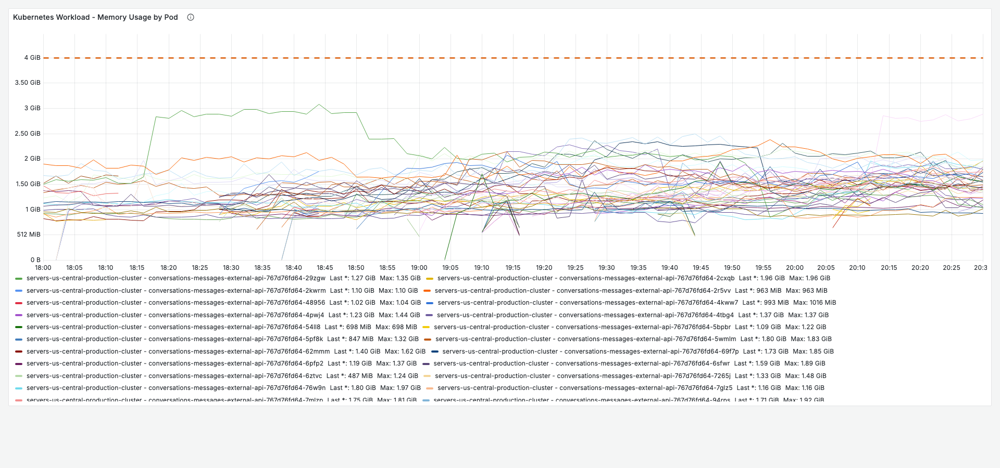
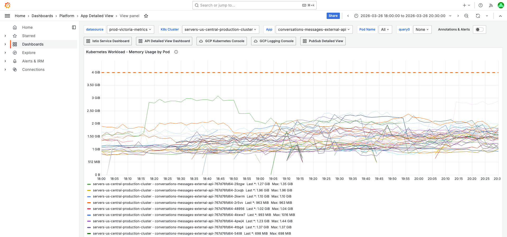
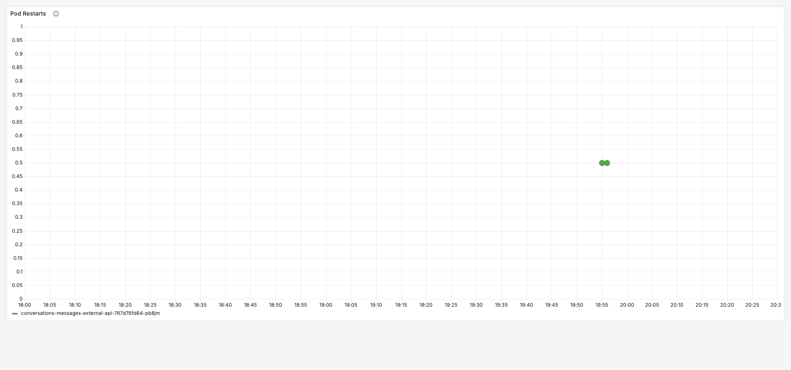
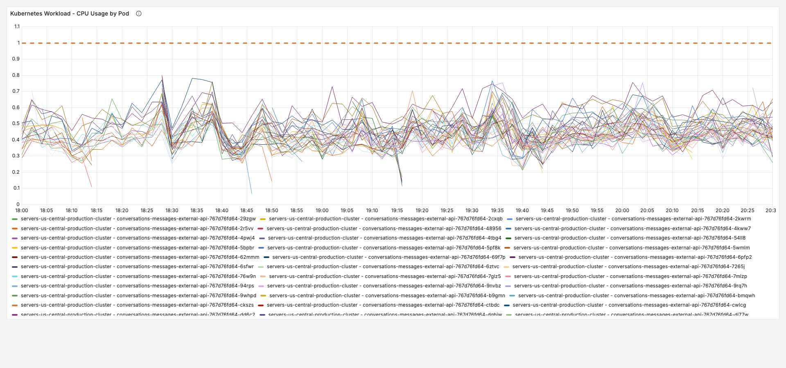
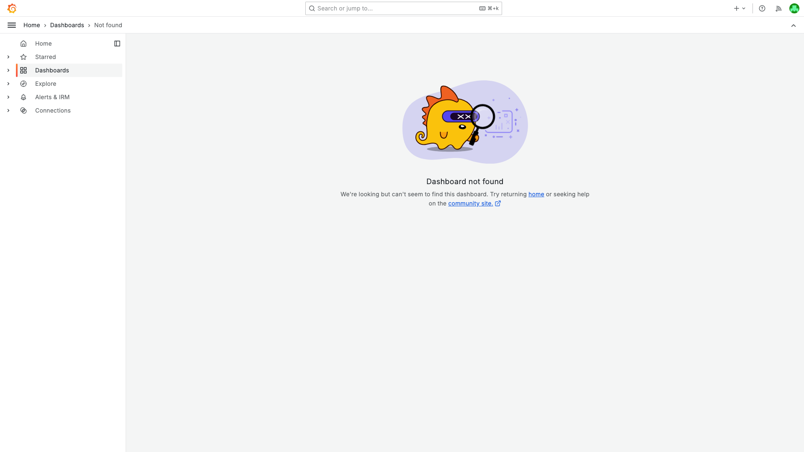

# PodRestartsAboveThreshold — conversations-messages-external-api — 2026-03-26

**Author:** Himanshu Bhutani | **Status:** Auto-resolved | **Acknowledged by:** Balaji Venkatesh

## Update Note (2026-03-27)

This original report is retained as-is and not deleted.

An expanded deep-dive report is available here:
- [Deep-dive concise](https://github.com/bhutanihimanshu/alert-investigations/blob/main/reports/2026/03/26-pod-restarts-conversations-messages-external-api-memory-deep-dive/report.md)
- [Deep-dive verbose](https://github.com/bhutanihimanshu/alert-investigations/blob/main/reports/2026/03/26-pod-restarts-conversations-messages-external-api-memory-deep-dive/report-verbose.md)

What the deep-dive adds beyond this report:
- Direct memory-tracking log proof for upload route: `POST /conversations/messages/upload` with `contentLength=15554228` causing `rss +1394 MiB` and `heap +90 MiB`.
- Watchdog memory evidence on the same pod (`pb8jm`): `rss=3162 MiB`, `heap=640 MiB`, `usagePercent=70`.
- Pod-specific restart-trigger events for `pb8jm` (liveness/readiness `HTTP 500`) aligned to restart time.
- Additional screenshots dedicated to the above GCP evidence and focused Grafana correlation.

## Summary

| Field | Value |
|-------|-------|
| Alert | [#113739 PodRestartsAboveThreshold](https://prod.grafana.leadconnectorhq.com/a/grafana-oncall-app/alert-groups/I23Z4F3TXWLMK) |
| Service | conversations-messages-external-api |
| Cluster | servers-us-central-production-cluster |
| Fired | 19:56 IST (14:26 UTC) on 2026-03-26 |
| Duration | ~5 min (auto-resolved) |
| Impact | Single pod OOM-killed; no user-facing errors (0% 5XX rate). Concurrent Redis timeout storm caused probe failures on 15+ pods, liveness failures on 3 pods. All recovered automatically. |

## Root Cause

**OOM Kill (primary):** Pod `pb8jm` experienced a sudden native memory spike — RSS jumped from ~1.7 GiB to ~3.0 GiB in under 1 minute at 18:17 IST (12:47 UTC), while V8 heap remained at only ~964 MiB. The ~2.2 GiB of non-heap memory (native buffers, gRPC connections, or external string buffers) grew until the container exceeded the 4.4 GiB limit at ~19:55 IST (14:25 UTC), triggering OOMKilled.

**Redis Timeout Cascade (secondary):** Concurrently, OAuth Rate Limiter Redis command timeouts at 19:26 IST (13:56 UTC) caused event loop saturation across the fleet, leading to readiness probe failures on 15+ pods and liveness probe failures on 3 pods (7mlzp, h9rl7, stcl2). `fieldPath` confirms the **app container** failed, not istio-proxy.

This is a **known recurring issue** — the team has been investigating OOM/native memory spikes on this container since October 2025 (ClickUp tasks [86d23q0rm](https://app.clickup.com/t/86d23q0rm), [86d0mynhv](https://app.clickup.com/t/86d0mynhv)). 55+ PodRestartsAboveThreshold alerts have fired for this container historically.

## What Happened

1. **18:17 IST** — Pod `pb8jm` memory spiked from ~1.7 GiB to ~3.0 GiB in 1 minute (native/external memory, not V8 heap).
2. **19:26 IST** — OAuth Rate Limiter Redis command timeouts started across the fleet, causing event loop saturation.
3. **19:30–19:34 IST** — Readiness probe failures on 15+ pods; liveness probe failures on pods 7mlzp, h9rl7, stcl2.
4. **19:55 IST** — Pod `pb8jm` OOM-killed (memory exceeded 4.4 GiB limit). HPA had scaled 37→48 pods during the incident.
5. **~20:00 IST** — All pods recovered. Alert auto-resolved.

## Proof

<details>
<summary>[Grafana] OOMKilled — memory spike from 1.7→3.0 GiB on pb8jm at 18:17 IST</summary>

> **Verify:** One pod line (pb8jm) shows a sharp upward spike from ~1700 MiB to ~3000 MiB, while all other pods remain stable at ~1100-1500 MiB. The line drops to ~672 MiB at ~19:55 IST when the pod was killed and restarted.



**Context (filters + time range):**


[Open in Grafana](https://prod.grafana.leadconnectorhq.com/d/a4859d4a-1e0a-4ae3-b9b2-d04d366cf29b/app-detailed-view?orgId=1&var-cluster=servers-us-central-production-cluster&var-container=conversations-messages-external-api&from=1774528200000&to=1774537200000&viewPanel=30)

</details>

<details>
<summary>[Grafana] Pod restart count = 1 on pb8jm at ~19:55 IST</summary>

> **Verify:** A single restart event visible for one pod around 19:55 IST. The pod restart panel shows increase(restarts[1h]) = 1.



[Open in Grafana](https://prod.grafana.leadconnectorhq.com/d/a4859d4a-1e0a-4ae3-b9b2-d04d366cf29b/app-detailed-view?orgId=1&var-cluster=servers-us-central-production-cluster&var-container=conversations-messages-external-api&from=1774528200000&to=1774537200000&viewPanel=36)

</details>

<details>
<summary>[Grafana] CPU normal — peak 0.55 cores, well below 1.1 limit</summary>

> **Verify:** All pod lines stay well below the 1.0 request / 1.1 limit reference lines. CPU was NOT a factor in this incident.



[Open in Grafana](https://prod.grafana.leadconnectorhq.com/d/a4859d4a-1e0a-4ae3-b9b2-d04d366cf29b/app-detailed-view?orgId=1&var-cluster=servers-us-central-production-cluster&var-container=conversations-messages-external-api&from=1774528200000&to=1774537200000&viewPanel=16)

</details>

<details>
<summary>[Grafana] Traffic steady — ~650 req/s, zero 5XX errors</summary>

> **Verify:** Request rate is flat at ~650 req/s. 5XX line is at zero. No traffic spike preceded the restart.



[Open in Grafana](https://prod.grafana.leadconnectorhq.com/d/d2db17da-6a85-44c7-88a5-391ef0063cd0/api-requests-overview?orgId=1&var-container=conversations-messages-external-api&from=1774528200000&to=1774537200000)

</details>

<details>
<summary>[GCP] Redis command timeout storm — OAuth Rate Limiter at 19:26 IST</summary>

> **Verify:** Multiple ERROR entries showing `Oauth Rate Limiter Middleware: Redis command timeout - Command timed out` from `@platform-core/ratelimit` ioredis, affecting 8+ pods (stcl2, fj6sq, v2gbv, 6pfp2, dghjw, rk4d8, 62mmm, hgjwb).

```
resource.type="k8s_container"
resource.labels.container_name="conversations-messages-external-api"
severity>=ERROR
jsonPayload.message=~"Command timed out"
```

[Open in GCP Log Explorer](https://console.cloud.google.com/logs/query;query=resource.type%3D%22k8s_container%22%0Aresource.labels.container_name%3D%22conversations-messages-external-api%22%0Aseverity%3E%3DERROR%0AjsonPayload.message%3D~%22Command%20timed%20out%22;timeRange=2026-03-26T13%3A50%3A00Z/2026-03-26T14%3A10%3A00Z?project=highlevel-backend)

</details>

<details>
<summary>[GCP] Probe failures — fieldPath=app container on 15+ pods (14:00-14:04 UTC)</summary>

> **Verify:** K8s events with `reason=Unhealthy`, `fieldPath=spec.containers{conversations-messages-external-api}`. Liveness probe failures on 7mlzp (context deadline exceeded), h9rl7 (HTTP 500), stcl2 (context deadline exceeded). Confirms app container, NOT istio-proxy.

```
resource.type="k8s_pod"
resource.labels.pod_name=~"conversations-messages-external-api.*"
jsonPayload.reason="Unhealthy"
```

[Open in GCP Log Explorer](https://console.cloud.google.com/logs/query;query=resource.type%3D%22k8s_pod%22%0Aresource.labels.pod_name%3D~%22conversations-messages-external-api.%2A%22%0AjsonPayload.reason%3D%22Unhealthy%22;timeRange=2026-03-26T13%3A56%3A00Z/2026-03-26T14%3A10%3A00Z?project=highlevel-backend)

</details>

## Action Items

| Priority | Action | Owner |
|----------|--------|-------|
| High | Investigate native memory leak — V8 heap only 964 MiB while container RSS hit 3.15 GiB. ~2.2 GiB is non-heap (native buffers, gRPC, external strings). Use `process.memoryUsage()` detailed logging from PR #26112 to identify the allocation source. | CRM Conversations |
| Medium | Investigate Redis timeout source — OAuth Rate Limiter Redis (`@platform-core/ratelimit`) timeouts at 19:26 IST. Check if the Redis instance had a latency spike (Redis Observability dashboard) or if it's a client-side issue. | CRM Conversations / Platform |
| Low | Consider increasing memory limit from 4.4 GiB temporarily while the native memory leak is being investigated (only if OOM frequency increases). | CRM Conversations |

## Cross-Validation

| Signal | Source | Finding | Agrees? |
|--------|--------|---------|---------|
| OOM Kill | Grafana (termination reason) | OOMKilled | Yes |
| Memory spike | Grafana (Memory by Pod) | 1.7→3.15 GiB, V8 heap only 964 MiB | Yes |
| Redis timeouts | GCP logs (severity>=ERROR) | 20+ `Command timed out` from OAuth Rate Limiter | Yes |
| Probe failures | GCP K8s events | 30 Unhealthy events, 3 liveness failures, fieldPath=app container | Yes |
| CPU normal | Grafana (CPU by Pod) | Peak 0.55 cores, limit 1.1 | Yes |
| Traffic normal | Grafana (API Requests Overview) | Steady ~650 req/s, zero 5XX | Yes |
| No deployment | Slack (#core-crm-conversations-internal) | No deploy within 2h | Yes |
| No correlated alerts | Alert Correlator | 0 alerts in ±15 min across all channels | Yes |

**Confidence:** HIGH — OOM confirmed by Grafana metrics + memory timeline; Redis timeout cascade confirmed by GCP logs + K8s events + known pattern match.

## Links

- [Verbose report](report-verbose.md)
- [Grafana App Detailed View](https://prod.grafana.leadconnectorhq.com/d/a4859d4a-1e0a-4ae3-b9b2-d04d366cf29b/app-detailed-view?orgId=1&var-cluster=servers-us-central-production-cluster&var-container=conversations-messages-external-api&from=1774528200000&to=1774537200000)
- [GCP Log Explorer — Redis timeouts](https://console.cloud.google.com/logs/query;query=resource.type%3D%22k8s_container%22%0Aresource.labels.container_name%3D%22conversations-messages-external-api%22%0Aseverity%3E%3DERROR%0AjsonPayload.message%3D~%22Command%20timed%20out%22;timeRange=2026-03-26T13%3A50%3A00Z/2026-03-26T14%3A10%3A00Z?project=highlevel-backend)
- [Grafana OnCall Alert](https://prod.grafana.leadconnectorhq.com/a/grafana-oncall-app/alert-groups/I23Z4F3TXWLMK)
- ClickUp: [86d23q0rm](https://app.clickup.com/t/86d23q0rm) (OOM investigation), [86d0mynhv](https://app.clickup.com/t/86d0mynhv) (file upload tracking)
