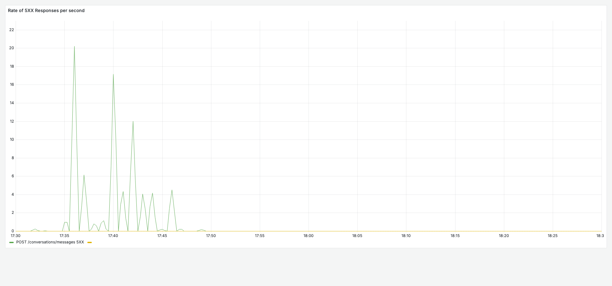
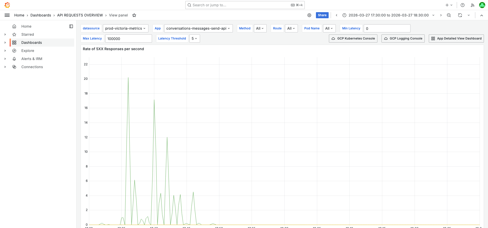
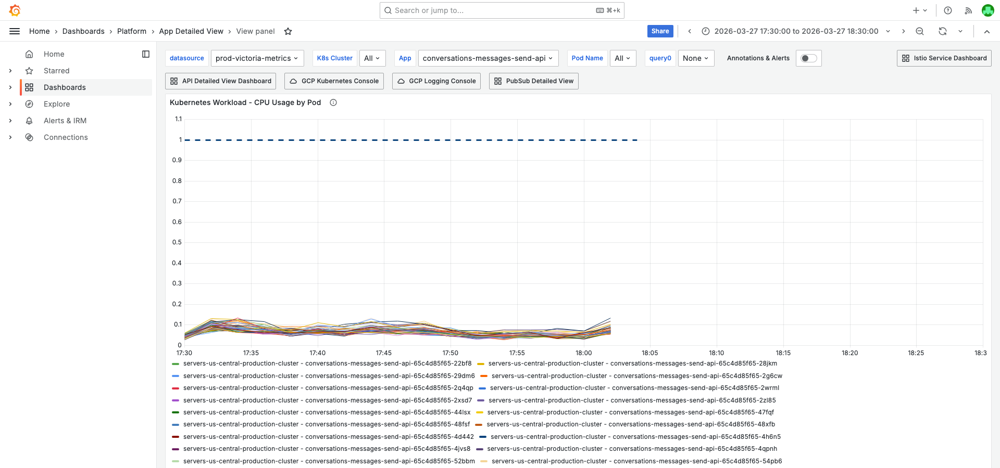
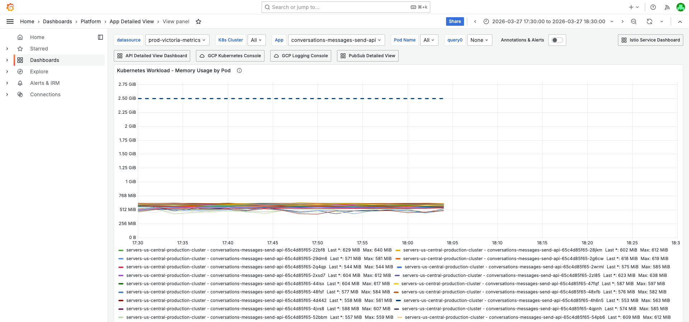

# 5XX Error Rate Investigation — conversations-messages-send-api — 2026-03-27

**Author:** Himanshu Bhutani
**Generated:** 2026-03-27 18:10 IST

---

## 1. Alert Summary

| Field | Value |
|-------|-------|
| Alert type | 5XXPercentagePerAPI |
| Alert ID | #113824 |
| Workload | `conversations-messages-send-api` |
| Route | `POST /conversations/messages` |
| Method | POST |
| Time | 17:40:49 IST (12:10:49 UTC) |
| Channel | `#alerts-crm-conversations` |
| Team | CRM Conversations |
| Current value | 18.55% (threshold: 1%) |

---

## 2. Investigation Findings

### Evidence: Grafana — API Error Rate & Traffic

<details>
<summary>5XX Error Rate (%) — peaked at ~18.55% at 17:40 IST on POST /conversations/messages</summary>

> **What to look for:** A sharp spike starting at ~17:32 IST, reaching 18.55% at 17:40 IST, then gradually recovering to 0% by 17:54 IST. Only the `/conversations/messages` route shows errors.


**Context (filters + time range):**


[Open in Grafana](https://prod.grafana.leadconnectorhq.com/d/d2db17da-530c-43f3-9273-c0fd664c591f/api-requests-overview?orgId=1&var-datasource=ber8nnhvgsjy8f&var-container=conversations-messages-send-api&var-method=All&var-route=All&var-pod_name=All&from=1774612800000&to=1774616400000&viewPanel=14)
</details>

<details>
<summary>5XX Responses/sec — peaked at 9.3 req/s at 17:40 IST</summary>

> **What to look for:** The absolute 5XX rate (not percentage) shows a clear spike to ~9.3 requests/second at 17:40 IST.



**Context:**


[Open in Grafana](https://prod.grafana.leadconnectorhq.com/d/d2db17da-530c-43f3-9273-c0fd664c591f/api-requests-overview?orgId=1&var-datasource=ber8nnhvgsjy8f&var-container=conversations-messages-send-api&var-method=All&var-route=All&var-pod_name=All&from=1774612800000&to=1774616400000&viewPanel=4)
</details>

<details>
<summary>API Hits/second — traffic spike to 115 req/s at 17:36 IST from bulk notification workers</summary>

> **What to look for:** Total traffic spikes from ~60 req/s baseline to ~115 req/s. The dominant callers during the spike are `crm-marketplace-notifications-email-worker` (35.2 req/s peak) and `crm-contacts-bulk-action-sms-worker`.


**Context:**


[Open in Grafana](https://prod.grafana.leadconnectorhq.com/d/d2db17da-530c-43f3-9273-c0fd664c591f/api-requests-overview?orgId=1&var-datasource=ber8nnhvgsjy8f&var-container=conversations-messages-send-api&var-method=All&var-route=All&var-pod_name=All&from=1774612800000&to=1774616400000&viewPanel=1)
</details>

### Evidence: Grafana — Pod Health (Infrastructure)

<details>
<summary>CPU by Pod — all 125 pods at 0.06–0.10 cores (no saturation)</summary>

> **What to look for:** All pod CPU lines are clustered at the bottom of the chart, well below any concerning level. Maximum observed was 0.121 cores (pod `qvrl9`). No saturation whatsoever.


**Context:**


[Open in Grafana](https://prod.grafana.leadconnectorhq.com/d/a4859d4a-1e0a-4ae3-b9b2-d04d366cf29b/app-detailed-view?orgId=1&var-datasource=ber8nnhvgsjy8f&var-cluster=All&var-container=conversations-messages-send-api&var-pod_name=All&from=1774612800000&to=1774616400000&viewPanel=16)
</details>

<details>
<summary>Memory by Pod — 480–634 MiB working set, stable with normal GC sawtooth</summary>

> **What to look for:** Memory lines are stable. Some pods show a gentle sawtooth pattern (normal GC cycles, e.g. 433–537 MiB). No memory pressure.


**Context:**


[Open in Grafana](https://prod.grafana.leadconnectorhq.com/d/a4859d4a-1e0a-4ae3-b9b2-d04d366cf29b/app-detailed-view?orgId=1&var-datasource=ber8nnhvgsjy8f&var-cluster=All&var-container=conversations-messages-send-api&var-pod_name=All&from=1774612800000&to=1774616400000&viewPanel=30)
</details>

**Additional Grafana metrics (not screenshotted):**

| Metric | Value | Status |
|--------|-------|--------|
| Pod restarts | 0 | ✅ Healthy |
| Pod count | 125 (stable) | ✅ No HPA scaling |
| Event loop lag P99 | 6.7–8.8ms | ✅ Healthy |
| P95 latency | ~1.0–1.2s | ✅ Normal |

### Evidence: GCP Logs — Error Pattern Analysis

<details>
<summary>HttpException errors — 100% business-logic validations, zero infrastructure errors</summary>

> **What to look for:** The Log Explorer shows all ERROR entries are `HttpException` with messages like "DND is active", "Missing phone number", "has unsubscribed". No Redis, Firestore, or infrastructure errors.


**GCP query:**
```
resource.type="k8s_container"
resource.labels.container_name="conversations-messages-send-api"
severity>=ERROR
jsonPayload.message=~"HttpException"
```

[Open in GCP Log Explorer](https://console.cloud.google.com/logs/query;query=resource.type%3D%22k8s_container%22%0Aresource.labels.container_name%3D%22conversations-messages-send-api%22%0Aseverity%3E%3DERROR%0AjsonPayload.message%3D~%22HttpException%22;timeRange=2026-03-27T12%3A00%3A00Z%2F2026-03-27T12%3A25%3A00Z?project=highlevel-backend)
</details>

#### Error Distribution (200 entries, 17:30–17:50 IST / 12:00–12:20 UTC)

| Count | % | Error Pattern | Thrown at |
|-------|---|---------------|-----------|
| 88 | 44% | `HttpException: Cannot send message as DND is active for SMS` | `MessagesService.sendSMSOrWhatsAppOrRCSMessage:62489` |
| 50 | 25% | `HttpException: Cannot send message as DND is active` (generic) | Same path |
| 44 | 22% | `HttpException: Missing phone number` | `MessagesService.sendSMSOrWhatsAppOrRCSMessage:62467` |
| 7 | 3.5% | `HttpException: Cannot send message as <phone> has unsubscribed` | `MessagesController.sendMessage:92415` |
| 3 | 1.5% | `HttpException: Location or agency is inactive` | Same controller |
| 8 | 4% | Other (empty message, duplicate send, email validation) | Various |

#### Log Volume Timeline (ERROR per minute)

| Time (IST) | Errors/min | Notes |
|---|---|---|
| 17:10 | 186 | Baseline |
| 17:11 | 661 | First spike (deployment rollout startup probes) |
| 17:25 | 742 | Second spike |
| 17:31 | 1,039 | Major spike — bulk campaign starting |
| 17:40 | 350 | Alert fires |
| 17:45 | 954 | Accelerating |
| **17:46** | **1,743** | **PEAK** |
| 17:47 | 1,145 | Declining |

#### Negative evidence (ruled out)

| Hypothesis | Query | Result |
|------------|-------|--------|
| Redis timeouts | `jsonPayload.message=~"Command timed out\|ECONNREFUSED\|Connection is closed"` | **Zero results** |
| Unhandled rejections | `textPayload=~"triggerUncaughtException\|unhandledRejection"` | **Zero results** |
| Firestore DEADLINE_EXCEEDED | `jsonPayload.message=~"DEADLINE_EXCEEDED"` | **Zero results** |
| Pod crashes/OOM | K8s pod events: `reason=~"OOMKilling\|Killing\|Failed"` | **Zero results** |

#### Deployment Rollout (17:14 IST / 11:44 UTC)

A deployment rollout was detected at ~17:14 IST. 8+ pods briefly failed startup probes (HTTP 500 on startup endpoint) but all recovered within 1 minute. This caused a brief error spike at 17:11 IST but is **not the cause of the main 5XX incident** (which started 20 minutes later at 17:31 IST).

---

## 3. Cross-Validation

| Signal | Grafana | GCP Logs | Slack | Agreement |
|--------|---------|----------|-------|-----------|
| Infrastructure healthy | ✅ CPU 0.06–0.10, Memory 480–634 MiB, 0 restarts, EL 6.7–8.8ms | ✅ Zero Redis/Firestore/crash errors | N/A | **HIGH** |
| Errors are validation rejections | ✅ Only from marketplace notification workers | ✅ 100% HttpException business-logic | N/A | **HIGH** |
| Traffic spike from bulk campaign | ✅ 115 req/s peak from notification workers | ✅ Error volume escalating with campaign | N/A | **HIGH** |
| Not deployment-triggered | ✅ Pod count stable at 125 | ✅ Rollout completed 20 min before | ✅ No deploys in 48h | **HIGH** |
| No correlated alerts | N/A | N/A | ✅ Zero alerts ±15 min | **HIGH** |

**Confidence: HIGH** — All sources agree completely. Zero contradicting evidence.

---

## 4. Root Cause

### What happened

A **bulk notification campaign** from `crm-marketplace-notifications-email-worker` (92% of errors) and `crm-marketplace-notifications-sms-worker` (8%) sent a high volume of message-send requests to `POST /conversations/messages`. A large fraction of these requests targeted contacts that:
- Have **DND (Do Not Disturb) active** for SMS/WhatsApp (69% of errors)
- Are **missing a phone number** (22% of errors)
- Have **unsubscribed** from communications (4% of errors)

The `MessagesService` correctly rejects these with `HttpException`, but these exceptions are being counted as 5XX responses in the Prometheus metrics, triggering the `5XXPercentagePerAPI` alert.

### Why this is a false positive

- **No infrastructure degradation**: CPU, memory, event loop, pod stability — all completely normal
- **No dependency failures**: Zero Redis timeouts, zero Firestore errors, zero crashes
- **All errors are intentional validation rejections**: The application is working correctly by rejecting messages to DND/unsubscribed/phoneless contacts
- **The HTTP status code classification is the issue**: These validations should return 4XX (400 Bad Request or 422 Unprocessable Entity), not 5XX

### Causal chain

1. **17:30 IST** — `crm-marketplace-notifications-email-worker` starts a bulk campaign, sending messages to a large contact list via `POST /conversations/messages`.
2. **17:32 IST** — 5XX error rate begins climbing as DND/unsubscribed/missing-phone contacts are hit — these throw `HttpException` which is counted as 5XX.
3. **17:40 IST** — 5XX rate crosses 18.55% threshold, alert fires.
4. **17:46 IST** — Peak error volume at 1,743 errors/min as the campaign hits the highest density of invalid contacts.
5. **~17:54 IST** — Error rate returns to 0% as the campaign completes.

<details>
<summary>Detailed timeline — full event log</summary>

| Time (IST) | Source | Event |
|---|---|---|
| 17:14:19 | K8s pod events | Deployment rollout — 8+ pods startup probe failures, all recover by 17:15 |
| 17:30 | Grafana | Notification worker traffic begins ramping |
| 17:32 | Grafana | 5XX error rate crosses 0.1% |
| 17:35 | Grafana | Traffic peaks at 115 req/s (vs 60 req/s baseline) |
| 17:36 | Grafana | 5XX rate at 3.88% (6.48 req/s errors) |
| 17:37 | Grafana | 5XX rate at 6.64% |
| 17:40:49 | Alert | 5XXPercentagePerAPI fires — 18.55% |
| 17:41 | GCP | ERROR volume at 350/min |
| 17:45 | GCP | ERROR volume at 954/min — escalating |
| 17:46 | GCP | ERROR volume at 1,743/min — **PEAK** |
| 17:47 | GCP | ERROR volume at 1,145/min — declining |
| 17:54 | Grafana | 5XX rate returns to 0% |

</details>

---

<details>
<summary>Probable noise — transient errors during disruption (not root cause)</summary>

| Time (IST) | Pattern | Why it's noise |
|------|---------|----------------|
| 17:14–17:15 | Startup probe failures (8+ pods) | Deployment rollout — all pods recovered in <1 min. 20 min before the main incident. |
| Constant | `error connecting redis` on localhost | Known baseline noise — no Redis sidecar configured. Caught in code, doesn't affect processing. |

</details>

---

## 5. Action Items

### For the alert

| Priority | Action | Reasoning |
|----------|--------|-----------|
| **P1** | Ensure DND/unsubscribed/missing-phone `HttpException` uses 4XX status (400 or 422), not 5XX | These are correct validation rejections — counting them as 5XX inflates the error rate metric and triggers false positive alerts |
| **P2** | Add pre-validation in `crm-marketplace-notifications-email-worker` to filter contacts with DND/unsubscribed/no phone before calling the Send API | Reduces unnecessary API calls and eliminates this class of false-positive alerts |
| **P3** | Tune `5XXPercentagePerAPI` alert to have a higher threshold or exclude known validation patterns | This is the 279th alert for this container — chronic false positives waste on-call attention |

### Recurring alert pattern

This container has **279 historical alerts** in `#alerts-crm-conversations`. Past investigations (March 21) identified similar patterns — traffic spikes from notification workers hitting validation errors. The root cause is the same: validation `HttpException` being classified as 5XX.

---

## 6. Deployment Details

| Parameter | Value |
|-----------|-------|
| Pod count | 125 (stable, no HPA scaling during incident) |
| CPU per pod | 0.06–0.10 cores avg, 0.121 max |
| Memory per pod | 480–634 MiB working set |
| Event loop lag P99 | 6.7–8.8ms |
| Recent deployment | 17:14 IST (completed in <1 min, unrelated to incident) |

---

## 7. Cross-Validation Summary

| Source | Finding | Confirms Root Cause |
|--------|---------|---------------------|
| Grafana — Error Rate | 5XX spike only on `/conversations/messages`, only from notification workers | ✅ |
| Grafana — Resource Health | CPU/memory/event loop all normal | ✅ (rules out infra) |
| GCP — Error Patterns | 100% HttpException: DND, unsubscribed, missing phone | ✅ |
| GCP — Negative Evidence | Zero Redis/Firestore/crash errors | ✅ (rules out dependencies) |
| Slack — Correlated Alerts | Zero correlated alerts in ±15 min | ✅ (isolated to this service) |
| Slack — Deployments | No deployments in 48h | ✅ (rules out deployment) |

**Confidence: HIGH** — All 6 evidence streams agree. No contradicting evidence.
