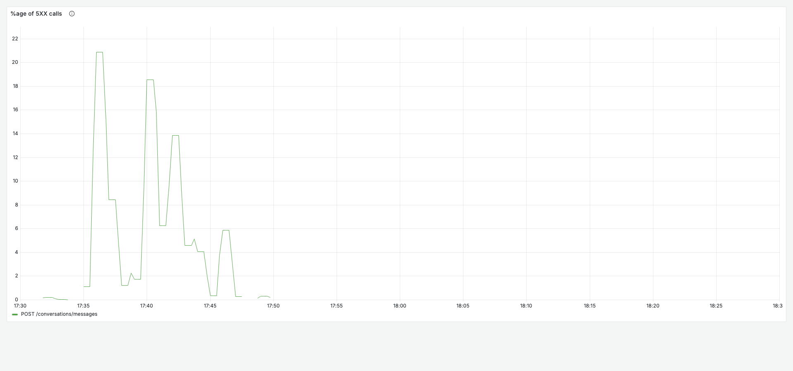
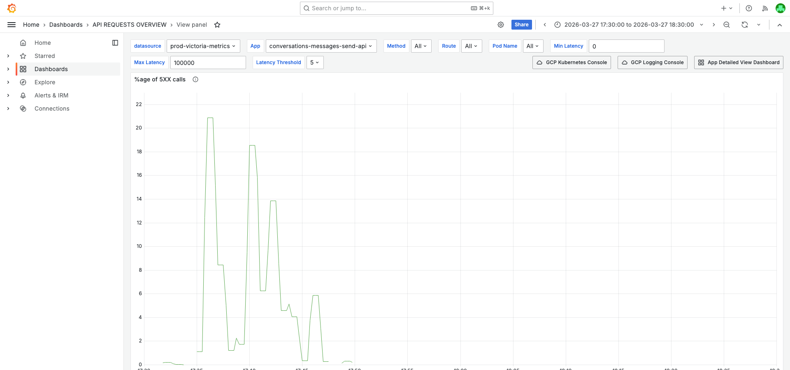
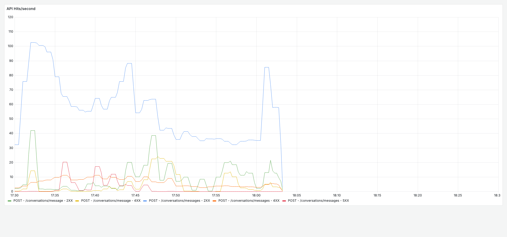
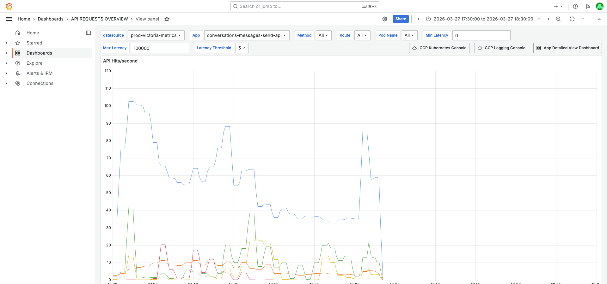
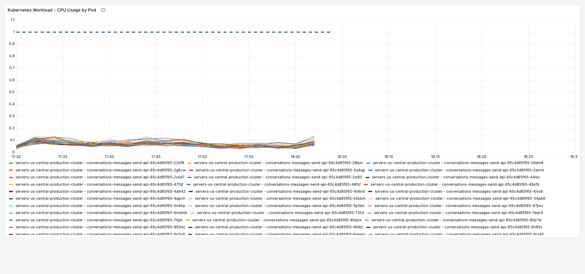
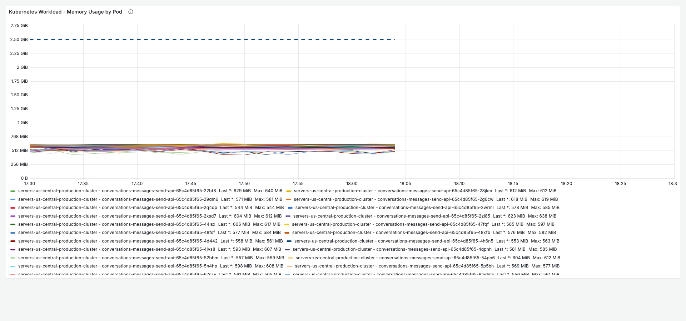
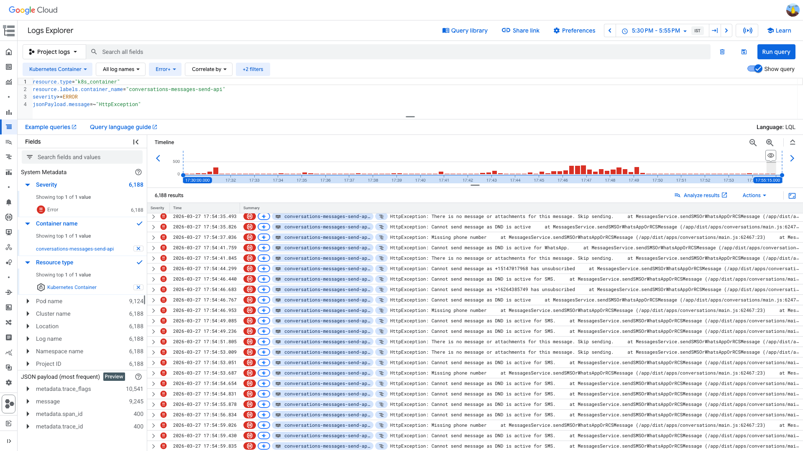

# 5XX Error Rate — conversations-messages-send-api — 2026-03-27

**Author:** Himanshu Bhutani | **Status:** Self-resolving (business-logic errors, not infrastructure)

## Summary

| Field | Value |
|-------|-------|
| Alert | 5XXPercentagePerAPI (#113824) |
| Service | `conversations-messages-send-api` |
| Route | `POST /conversations/messages` |
| Fired | 17:40 IST (12:10 UTC) |
| Duration | ~22 min (17:32–17:54 IST) |
| Peak 5XX rate | 18.55% (9.3 req/s 5XX out of 82 req/s total) |
| Impact | **No real user impact** — all 5XX responses are intentional validation rejections (DND, unsubscribed, missing phone) |

## Root Cause

A **bulk notification campaign** from `crm-marketplace-notifications-email-worker` (92% of errors) and `crm-marketplace-notifications-sms-worker` (8%) sent requests to contacts that fail business-logic validations (DND active, unsubscribed, missing phone). These validation rejections are thrown as `HttpException` and counted as 5XX in metrics, triggering the alert. Infrastructure is completely healthy — zero resource pressure, zero pod restarts, zero dependency failures.

## Proof

<details>
<summary>[Grafana] 5XX error rate peaked at ~18.55% at 17:40 IST — only on POST /conversations/messages</summary>

> **Verify:** The error rate chart shows a spike starting ~17:32 IST, peaking at 17:40 IST, and recovering by 17:54 IST. Only the `/conversations/messages` route is affected.



**Context (filters + time range):**


[Open in Grafana](https://prod.grafana.leadconnectorhq.com/d/d2db17da-530c-43f3-9273-c0fd664c591f/api-requests-overview?orgId=1&var-datasource=ber8nnhvgsjy8f&var-container=conversations-messages-send-api&var-method=All&var-route=All&var-pod_name=All&from=1774612800000&to=1774616400000&viewPanel=14)
</details>

<details>
<summary>[Grafana] Traffic spike from notification workers — peak 115 req/s at 17:36 IST</summary>

> **Verify:** The hits/second chart shows a traffic surge driven by `crm-marketplace-notifications-email-worker` and `crm-contacts-bulk-action-sms-worker`, peaking around 17:36 IST.



**Context:**


[Open in Grafana](https://prod.grafana.leadconnectorhq.com/d/d2db17da-530c-43f3-9273-c0fd664c591f/api-requests-overview?orgId=1&var-datasource=ber8nnhvgsjy8f&var-container=conversations-messages-send-api&var-method=All&var-route=All&var-pod_name=All&from=1774612800000&to=1774616400000&viewPanel=1)
</details>

<details>
<summary>[Grafana] Infrastructure healthy — CPU 0.06–0.10 cores, Memory 480–634 MiB, 0 restarts</summary>

> **Verify:** CPU by Pod shows all 125 pods well below 0.15 cores (no saturation). Memory is stable. Zero pod restarts.





[Open in Grafana](https://prod.grafana.leadconnectorhq.com/d/a4859d4a-1e0a-4ae3-b9b2-d04d366cf29b/app-detailed-view?orgId=1&var-datasource=ber8nnhvgsjy8f&var-cluster=All&var-container=conversations-messages-send-api&var-pod_name=All&from=1774612800000&to=1774616400000)
</details>

<details>
<summary>[GCP Logs] 100% of errors are business-logic HttpExceptions — DND 69%, missing phone 22%, unsubscribed 4%</summary>

> **Verify:** The log entries all show `HttpException: Cannot send message as DND is active` or similar validation messages. Zero infrastructure errors (no Redis timeouts, no DEADLINE_EXCEEDED, no crashes).

**Error distribution (200 entries, 12:00–12:20 UTC):**

| Count | Error |
|-------|-------|
| 88 | `HttpException: Cannot send message as DND is active for SMS` |
| 50 | `HttpException: Cannot send message as DND is active` |
| 44 | `HttpException: Missing phone number` |
| 7 | `HttpException: Cannot send message as <phone> has unsubscribed` |
| 11 | Other validations (inactive location, empty message, duplicate) |



```
resource.type="k8s_container"
resource.labels.container_name="conversations-messages-send-api"
severity>=ERROR
jsonPayload.message=~"HttpException"
```

[Open in GCP Log Explorer](https://console.cloud.google.com/logs/query;query=resource.type%3D%22k8s_container%22%0Aresource.labels.container_name%3D%22conversations-messages-send-api%22%0Aseverity%3E%3DERROR%0AjsonPayload.message%3D~%22HttpException%22;timeRange=2026-03-27T12%3A00%3A00Z%2F2026-03-27T12%3A25%3A00Z?project=highlevel-backend)
</details>

<details>
<summary>[Cross-validation] All sources agree — HIGH confidence this is a false positive</summary>

> **Verify:** No contradicting evidence from any source.

| Signal | Grafana | GCP Logs | Slack |
|--------|---------|----------|-------|
| Infrastructure healthy | ✅ CPU/memory/event loop normal | ✅ Zero infra errors | N/A |
| Errors are validation rejections | ✅ Only from notification workers | ✅ 100% HttpException | N/A |
| No deployment trigger | ✅ Pod count stable at 125 | ✅ Rollout at 17:14 IST completed in 1 min | ✅ No deploys in 48h |
| No correlated alerts | N/A | N/A | ✅ Zero alerts in ±15 min |
</details>

## Action Items

| Priority | Action | Owner |
|----------|--------|-------|
| P1 | Ensure DND/unsubscribed/missing phone `HttpException` returns 4XX (400/422), not 5XX — or exclude from 5XX metric | CRM Conversations |
| P2 | Add pre-validation in `crm-marketplace-notifications-email-worker` to filter DND/unsubscribed contacts before calling Send API | Marketplace team |
| P3 | Consider tuning the 5XXPercentagePerAPI alert to exclude known validation error patterns | Platform team |

## Links

- [Verbose report](report-verbose.md)
- [Grafana — API Requests Overview](https://prod.grafana.leadconnectorhq.com/d/d2db17da-530c-43f3-9273-c0fd664c591f/api-requests-overview?orgId=1&var-datasource=ber8nnhvgsjy8f&var-container=conversations-messages-send-api&from=1774612800000&to=1774616400000)
- [Grafana — App Detailed View](https://prod.grafana.leadconnectorhq.com/d/a4859d4a-1e0a-4ae3-b9b2-d04d366cf29b/app-detailed-view?orgId=1&var-datasource=ber8nnhvgsjy8f&var-cluster=All&var-container=conversations-messages-send-api&from=1774612800000&to=1774616400000)
- [GCP Log Explorer](https://console.cloud.google.com/logs/query;query=resource.type%3D%22k8s_container%22%0Aresource.labels.container_name%3D%22conversations-messages-send-api%22%0Aseverity%3E%3DERROR%0AjsonPayload.message%3D~%22HttpException%22;timeRange=2026-03-27T12%3A00%3A00Z%2F2026-03-27T12%3A25%3A00Z?project=highlevel-backend)
