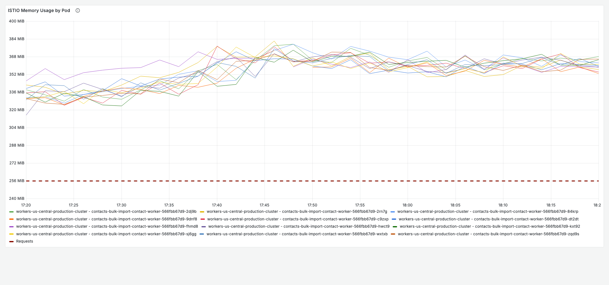
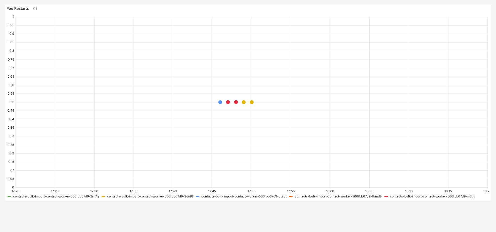
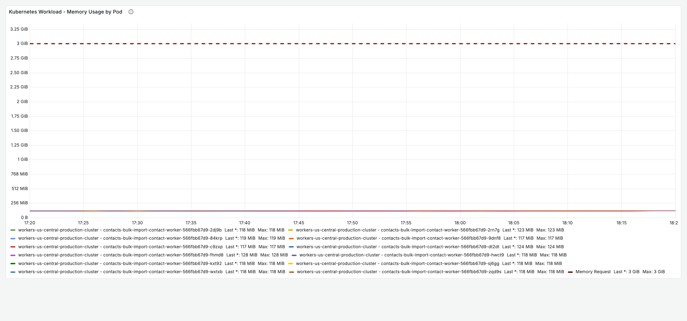
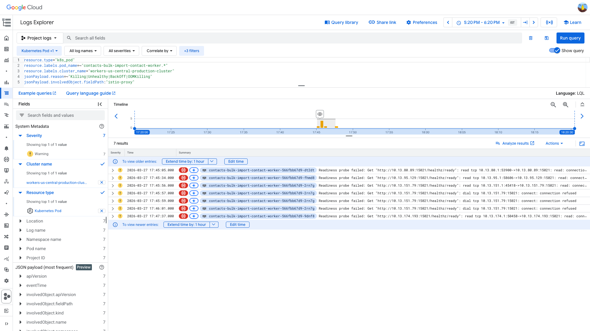
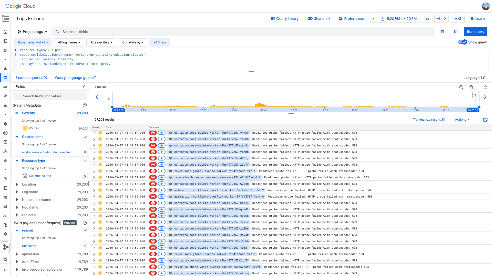

# PodRestartsAboveThreshold Investigation — contacts-bulk-import-contact-worker (istio-proxy) — 2026-03-27

**Author:** Himanshu Bhutani
**Generated:** 2026-03-27 19:00 IST

---

## 1. Alert Summary

| Field | Value |
|-------|-------|
| Alert type | PodRestartsAboveThreshold |
| Alert ID | [#113827](https://prod.grafana.leadconnectorhq.com/a/grafana-oncall-app/alert-groups/IFA4Q9964NN52) |
| Workload | contacts-bulk-import-contact-worker |
| Container | istio-proxy (sidecar, NOT the app container) |
| Cluster | workers-us-central-production-cluster |
| Alert time | 17:50:39 IST (12:20:39 UTC) on 2026-03-27 |
| Threshold | 1 restart |
| Current value | 8–15 restarts (escalated from 8 to 15) |
| Source channel | #alerts-crm (C0315RRNH1B) |
| Escalated to | Virendra Sharma, Anjalica Suman (automated, no human response) |

---

## 2. Investigation Findings

### Evidence: Grafana — Istio Sidecar Resource Pressure

<details>
<summary>ISTIO Memory Usage by Pod — all pods at 96–99% of 384 MB limit</summary>

> **What to look for:** All pod memory lines are clustered between 350–382 MB, consistently close to the 384 MB limit. The 5 pods that restarted (dt2dt, fhmd8, 2rn7g, sj6gg, 9dnf8) touched the ceiling at ~12:16–12:23 UTC before dropping to zero (restart) and recovering.



[Open in Grafana](https://prod.grafana.leadconnectorhq.com/d/a4859d4a-1e0a-4ae3-b9b2-d04d366cf29b/app-detailed-view?orgId=1&var-container=contacts-bulk-import-contact-worker&var-cluster=workers-us-central-production-cluster&from=1774612200000&to=1774615800000&viewPanel=40)
</details>

<details>
<summary>Pod Restarts — 5 out of 12 pods restarted in a 5-minute window</summary>

> **What to look for:** Restart bars clustered between 17:45–17:53 IST on pods dt2dt, fhmd8, 2rn7g, sj6gg, and 9dnf8. Each pod had exactly 1 restart. The remaining 7 pods stayed healthy.



[Open in Grafana](https://prod.grafana.leadconnectorhq.com/d/a4859d4a-1e0a-4ae3-b9b2-d04d366cf29b/app-detailed-view?orgId=1&var-container=contacts-bulk-import-contact-worker&var-cluster=workers-us-central-production-cluster&from=1774612200000&to=1774615800000&viewPanel=36)
</details>

<details>
<summary>Pod Termination Reason — all restarts are OOMKilled (Prometheus query)</summary>

> **What to look for:** Prometheus metric `kube_pod_container_status_last_terminated_reason` confirms OOMKilled. The Grafana table panel showed "No data" at screenshot time (likely data retention) — termination reason confirmed via direct Prometheus query during Layer 1 investigation.

All 5 restarted pods show `reason=OOMKilled` on the `istio-proxy` container:
- contacts-bulk-import-contact-worker-566fbb67d9-dt2dt
- contacts-bulk-import-contact-worker-566fbb67d9-fhmd8
- contacts-bulk-import-contact-worker-566fbb67d9-2rn7g
- contacts-bulk-import-contact-worker-566fbb67d9-sj6gg
- contacts-bulk-import-contact-worker-566fbb67d9-9dnf8

[Open in Grafana](https://prod.grafana.leadconnectorhq.com/d/a4859d4a-1e0a-4ae3-b9b2-d04d366cf29b/app-detailed-view?orgId=1&var-container=contacts-bulk-import-contact-worker&var-cluster=workers-us-central-production-cluster&from=1774612200000&to=1774615800000&viewPanel=50)
</details>

### Evidence: Grafana — App Container Health (Healthy)

<details>
<summary>App container memory — 115–128 MB of 3,379 MB limit (~3.5%)</summary>

> **What to look for:** All pod memory lines should be flat around 115–128 MB, far below the 3,379 MB limit. This confirms the app container is completely unaffected — the restarts are exclusively in the istio-proxy sidecar.



[Open in Grafana](https://prod.grafana.leadconnectorhq.com/d/a4859d4a-1e0a-4ae3-b9b2-d04d366cf29b/app-detailed-view?orgId=1&var-container=contacts-bulk-import-contact-worker&var-cluster=workers-us-central-production-cluster&from=1774612200000&to=1774615800000&viewPanel=30)
</details>

### Evidence: GCP Logs — istio-proxy Readiness Probe Failures

<details>
<summary>Readiness probe failures on istio-proxy — connection reset/refused on port 15021</summary>

> **What to look for:** All events have `fieldPath: spec.containers{istio-proxy}` — NOT the app container. Messages show "connection reset by peer" and "connection refused" to the istio health endpoint on port 15021. Events are clustered between 17:45–17:48 IST on 4 distinct pods.

```
resource.type="k8s_pod"
resource.labels.pod_name=~"contacts-bulk-import-contact-worker.*"
resource.labels.cluster_name="workers-us-central-production-cluster"
jsonPayload.reason=~"Killing|Unhealthy|BackOff|OOMKilling"
jsonPayload.involvedObject.fieldPath:"istio-proxy"
```

| Time (IST) | Pod | Event |
|---|---|---|
| 17:45:05 | contacts-bulk-import-contact-worker-566fbb67d9-dt2dt | Readiness probe failed: `connection reset by peer` |
| 17:45:34 | contacts-bulk-import-contact-worker-566fbb67d9-fhmd8 | Readiness probe failed: `connection reset by peer` |
| 17:45:56 | contacts-bulk-import-contact-worker-566fbb67d9-2rn7g | Readiness probe failed: `connection reset by peer` |
| 17:45:57 | contacts-bulk-import-contact-worker-566fbb67d9-2rn7g | Readiness probe failed: `connection refused` |
| 17:45:59 | contacts-bulk-import-contact-worker-566fbb67d9-2rn7g | Readiness probe failed: `connection refused` |
| 17:46:01 | contacts-bulk-import-contact-worker-566fbb67d9-2rn7g | Readiness probe failed: `connection refused` |
| 17:47:37 | contacts-bulk-import-contact-worker-566fbb67d9-9dnf8 | Readiness probe failed: `connection reset by peer` |



[Open in GCP Log Explorer](https://console.cloud.google.com/logs/query;query=resource.type%3D%22k8s_pod%22%0Aresource.labels.pod_name%3D~%22contacts-bulk-import-contact-worker.%2A%22%0Aresource.labels.cluster_name%3D%22workers-us-central-production-cluster%22%0AjsonPayload.reason%3D~%22Killing%7CUnhealthy%7CBackOff%7COOMKilling%22%0AjsonPayload.involvedObject.fieldPath%3A%22istio-proxy%22;timeRange=2026-03-27T11%3A50%3A00Z%2F2026-03-27T12%3A50%3A00Z?project=highlevel-backend)
</details>

### Evidence: GCP Logs — Cluster-Wide Scope

<details>
<summary>403+ pods across the cluster with istio-proxy restarts in same window</summary>

> **What to look for:** Events span multiple unrelated workloads from different teams — CRM, LeadGen, Automations, Email. This confirms the issue is cluster-wide infrastructure, not specific to contacts-bulk-import-contact-worker.

```
resource.type="k8s_pod"
resource.labels.cluster_name="workers-us-central-production-cluster"
jsonPayload.reason="Unhealthy"
jsonPayload.involvedObject.fieldPath:"istio-proxy"
```

Sample affected workloads (from 12:10–12:25 UTC):
- `crm-evaluations-ai-process-events-worker`
- `leadgen-payments-stripe-events-worker`
- `leadgen-reporting-report-scheduler-worker`
- `lc-email-billing-request-worker`
- `automation-workflows-start-worker`
- `crm-conversations-update-conversations-events-worker`
- And 397+ more

All showing: `Readiness probe failed: HTTP probe failed with statuscode: 503`



[Open in GCP Log Explorer](https://console.cloud.google.com/logs/query;query=resource.type%3D%22k8s_pod%22%0Aresource.labels.cluster_name%3D%22workers-us-central-production-cluster%22%0AjsonPayload.reason%3D%22Unhealthy%22%0AjsonPayload.involvedObject.fieldPath%3A%22istio-proxy%22;timeRange=2026-03-27T11%3A50%3A00Z%2F2026-03-27T12%3A50%3A00Z?project=highlevel-backend)
</details>

### Evidence: Kubelet Logs — Container Lifecycle

<details>
<summary>Kubelet confirms istio-proxy ContainerDied → ContainerStarted cycle</summary>

> **What to look for:** Kubelet PLEG events show the istio-proxy container dying and restarting, with the pod going not-ready then ready again within 7–10 seconds. No application container lifecycle events — only istio-proxy.

```
logName="projects/highlevel-backend/logs/kubelet"
"contacts-bulk-import-contact-worker"
```

Kubelet lifecycle for each affected pod:
1. **Readiness probe failed** on istio-proxy → connection refused/reset
2. **ContainerDied** (PLEG event) — istio-proxy container OOMKilled
3. **ContainerStarted** — istio-proxy container restarted
4. Pod transitions: not ready → ready (7–10s recovery)

Affected pods (5 total): `dt2dt`, `fhmd8`, `2rn7g`, `sj6gg`, `9dnf8`
</details>

### Evidence: istiod Control Plane — HPA Scaling (Contributing Factor)

<details>
<summary>istiod HPA scaled 600 → 527 → 600 between 17:24–17:32 IST</summary>

> **What to look for:** istiod HPA oscillation — scale-down by 73 pods at 17:24 IST (memory below target), then scale-up back to 600 at 17:32 IST (CPU above target). The istio-proxy restarts started ~13 minutes after the scale-down.

```
resource.type="k8s_cluster"
resource.labels.cluster_name="workers-us-central-production-cluster"
jsonPayload.reason=~"SuccessfulRescale|ScalingReplicaSet"
jsonPayload.involvedObject.name=~"istiod"
```

| Time (IST) | Event |
|---|---|
| 17:24:47 | SuccessfulRescale: istiod 600 → 527 (memory below target) |
| 17:32:08 | SuccessfulRescale: istiod 527 → 600 (CPU above target) |

**Note:** istiod scaling 175→900 daily is normal and typically doesn't cause alerts. The memory pressure on istio-proxy sidecars is the primary cause — istiod scaling may have added incremental pressure from xDS config push updates.
</details>

### Evidence: Application Container Logs — Zero Errors

<details>
<summary>Zero ERROR-level logs from the app container in the entire investigation window</summary>

> **What to look for:** Empty result set confirms the application container (`contacts-bulk-import-contact-worker`) is completely healthy. All restarts are exclusively in the istio-proxy sidecar.

```
resource.type="k8s_container"
resource.labels.container_name="contacts-bulk-import-contact-worker"
resource.labels.cluster_name="workers-us-central-production-cluster"
severity>=ERROR
```

**Result:** `[]` — zero entries.
</details>

---

## 3. Cross-Validation

| Signal | Grafana | GCP Logs | Slack | Agree? |
|--------|---------|----------|-------|--------|
| Restarting container = istio-proxy | ✅ Termination reason on istio-proxy | ✅ fieldPath: `spec.containers{istio-proxy}` | ✅ Alert says "Container: istio-proxy" | ✅ All 3 |
| Cause = OOMKilled | ✅ Termination reason table | ✅ Kubelet ContainerDied after memory ceiling | — | ✅ 2 sources |
| Memory at limit | ✅ ISTIO Memory: 372–382 MB / 384 MB | — | ✅ Jan 2026: memory >100% alerts on same worker | ✅ 2 sources |
| Cluster-wide scope | ✅ 403+ pods with istio-proxy restarts | ✅ Events across CRM, LeadGen, Automations | ✅ Correlated alert on crm-contacts-bulk-whatsapp-worker | ✅ All 3 |
| App container healthy | ✅ CPU: 0.001–0.015 cores, Memory: 115–128 MB | ✅ Zero ERROR logs | — | ✅ 2 sources |
| No deployment trigger | — | ✅ No HPA/deployment events | ✅ No deploy activity in Slack | ✅ 2 sources |

**Confidence: HIGH** — All 6 signals agree across multiple independent sources.

---

## 4. Root Cause

**istio-proxy sidecar OOMKilled** due to a memory limit of 384 MB that is insufficient for current mesh traffic/complexity. Memory usage averaged 92% of the limit (351–360 MB) across all 12 pods, with peaks at 96–99% (372–382 MB). Five pods hit the ceiling and were OOMKilled by the kernel.

This is a **cluster-wide infrastructure issue** — 403+ pods had istio-proxy restarts in the same 1-hour window, spanning CRM, LeadGen, Automations, Email, and other teams.

### Causal Chain

1. **17:24 IST** — istiod HPA scaled down 600 → 527 pods (memory below target), then scaled back to 600 at 17:32 IST. This may have increased memory pressure in sidecars from xDS config push updates.
2. **17:45 IST** — istio-proxy memory on 5 pods reaches 372–382 MB (96–99% of 384 MB limit). Readiness probes start failing with "connection reset by peer" on port 15021.
3. **17:46–17:53 IST** — Kernel OOMKills istio-proxy containers on 5 pods (dt2dt, fhmd8, 2rn7g, sj6gg, 9dnf8). Each recovers within 7–10 seconds.
4. **17:50 IST** — PodRestartsAboveThreshold alert fires (8 cumulative restarts, threshold: 1).
5. **Post-restart** — All pods recover. App container unaffected throughout (zero errors, near-idle resource usage).

<details>
<summary>Detailed timeline — full event log</summary>

| Time (IST) | Source | Event |
|---|---|---|
| 17:24:47 | K8s HPA | istiod SuccessfulRescale: 600 → 527 (memory below target) |
| 17:32:08 | K8s HPA | istiod SuccessfulRescale: 527 → 600 (CPU above target) |
| 17:45:05 | K8s Pod Event | dt2dt: Readiness probe failed (istio-proxy) — connection reset by peer |
| 17:45:34 | K8s Pod Event | fhmd8: Readiness probe failed (istio-proxy) — connection reset by peer |
| 17:45:56 | K8s Pod Event | 2rn7g: Readiness probe failed (istio-proxy) — connection reset by peer |
| 17:45:57 | K8s Pod Event | 2rn7g: Readiness probe failed (istio-proxy) — connection refused |
| 17:45:59 | K8s Pod Event | 2rn7g: Readiness probe failed (istio-proxy) — connection refused |
| 17:46:01 | K8s Pod Event | 2rn7g: Readiness probe failed (istio-proxy) — connection refused |
| 17:46:07 | Kubelet | sj6gg: ContainerDied (istio-proxy) |
| 17:46:16–17:23 | Grafana | dt2dt, fhmd8, 2rn7g, sj6gg: restart count increments |
| 17:47:37 | K8s Pod Event | 9dnf8: Readiness probe failed (istio-proxy) — connection reset by peer |
| 17:49:19–17:53 | Grafana | 9dnf8: restart count increment |
| 17:50:39 | Grafana OnCall | Alert #113827 fires |
| 17:51:20 | Grafana OnCall | Escalation: invited Virendra Sharma |
| 18:20:57 | Grafana OnCall | Escalation: re-invited both on-call engineers |

</details>

---

## 5. Probable Noise

<details>
<summary>Probable noise — transient errors during disruption (not root cause)</summary>

| Time | Pattern | Why it's noise |
|------|---------|----------------|
| 17:40–17:50 IST | Cluster-wide istio-proxy readiness probe 503s | Expected side-effect of istio-proxy memory pressure across the cluster. Self-resolved with sidecar restarts. |
| 17:24–17:32 IST | istiod HPA scaling (600 → 527 → 600) | Normal daily istiod autoscaling (range: 175–900). Not the primary cause — istiod had zero restarts and scaled successfully. May have contributed incremental memory pressure. |

</details>

---

## 6. Action Items

### For the alert

| Priority | Action | Owner |
|----------|--------|-------|
| **Medium** | Increase istio-proxy sidecar memory limit from 384 MB → 512 MB or higher | Platform team |
| **Low** | Investigate what's driving istio-proxy baseline memory to 92% — mesh complexity, xDS config size, Envoy filter chain, sidecar version | Platform team |

### Separate issues found

| Priority | Action | Owner |
|----------|--------|-------|
| **Low** | Consider decommissioning `contacts-bulk-import-contact-worker` — reportedly not in use since March 2025 (confirmed by Sachin Kashyap in #infra) | CRM team |

---

## 7. Deployment Details

| Parameter | Value |
|-----------|-------|
| istio-proxy memory limit | 384 MB |
| istio-proxy peak memory | 372–382 MB (96–99% of limit) |
| istio-proxy average memory | 351–360 MB (~92% of limit) |
| istio-proxy CPU (peak) | 0.06–0.11 cores |
| App container memory limit | 3,379 MB |
| App container memory (actual) | 115–128 MB (~3.5%) |
| App container CPU (peak) | 0.001–0.015 cores |
| Pod count | 12 (stable, no HPA scaling) |
| Pods affected | 5 of 12 (42%) |
| ReplicaSet | 566fbb67d9 |
| Cluster-wide impact | 403+ pods with istio-proxy restarts |

---

## 8. Cross-Validation Summary

| # | Signal | Sources | Confidence |
|---|--------|---------|------------|
| 1 | istio-proxy is the restarting container (NOT app) | Grafana + GCP (fieldPath) + Alert message | **High** |
| 2 | OOMKilled as termination reason | Grafana termination table + Kubelet lifecycle | **High** |
| 3 | Memory consistently at 96–99% of 384 MB limit | Grafana ISTIO Memory + Historical alerts (Jan 2026) | **High** |
| 4 | Cluster-wide scope (403+ pods) | Grafana fleet-wide restarts + GCP cross-workload events + Correlated Slack alerts | **High** |
| 5 | App container completely healthy | Grafana resources + GCP zero errors | **High** |
| 6 | No deployment trigger | GCP cluster events (empty) + Slack deploy search (empty) | **High** |

**Overall confidence: HIGH** — 6/6 signals agree across 3+ independent sources.

---

## Historical Context

This is a **recurring pattern** for istio-proxy on this cluster:

| Date | Alert | Details |
|------|-------|---------|
| 2026-03-27 | This alert | istio-proxy OOMKilled, 384 MB limit, 5/12 pods |
| 2026-03-16 | Cluster-wide istio-proxy disruption | 30+ workloads, GCP compute quota exceeded → node autoscaler failed → cluster resource pressure |
| 2026-01-24 | Istio-proxy memory >100% | Same worker, usage ratio: 1.047 |
| 2026-01-17 | Istio-proxy memory >100% | Same worker, usage ratio: 1.018 |
| 2025-12-29 | Constant Istio memory/CPU restarts | SMS and email workers |
