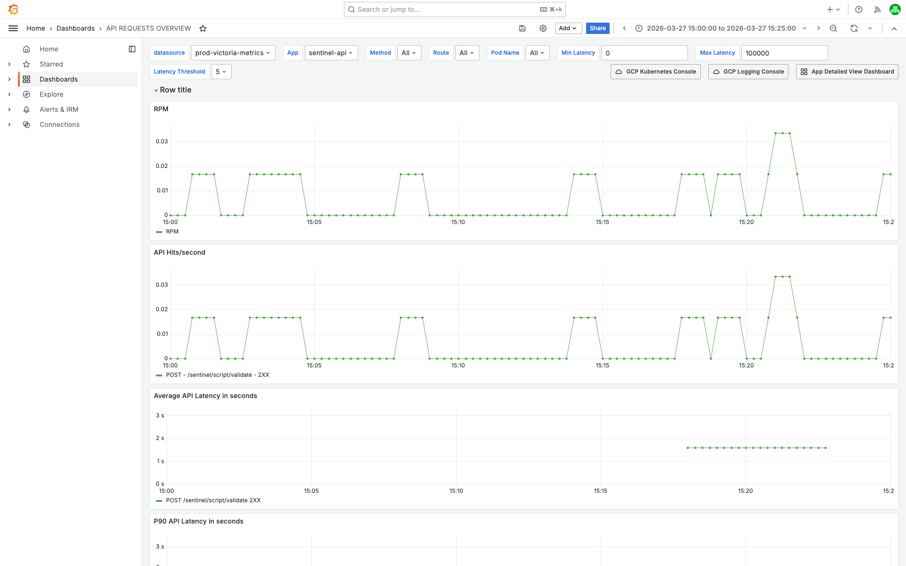
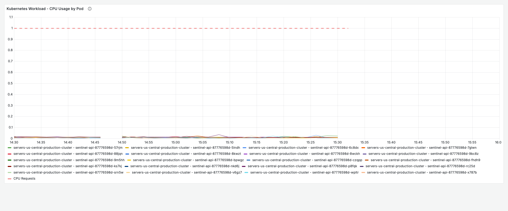
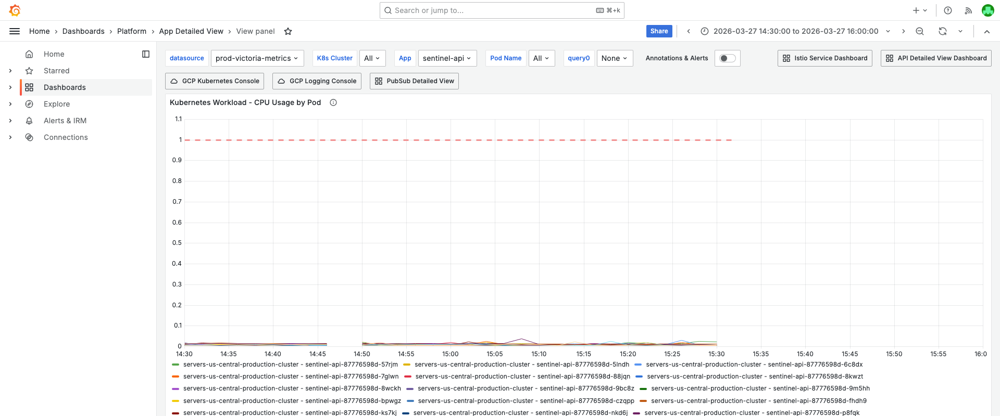
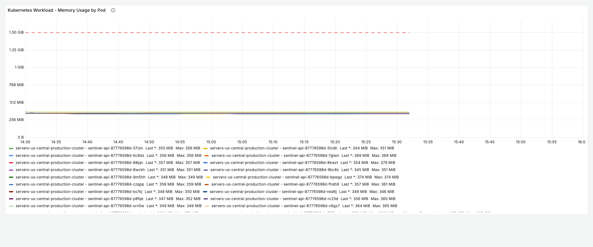
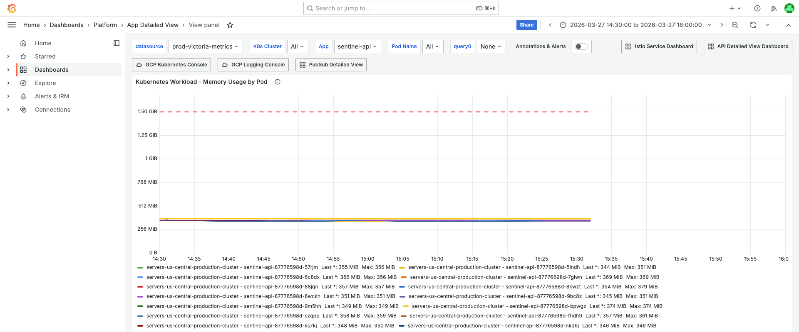
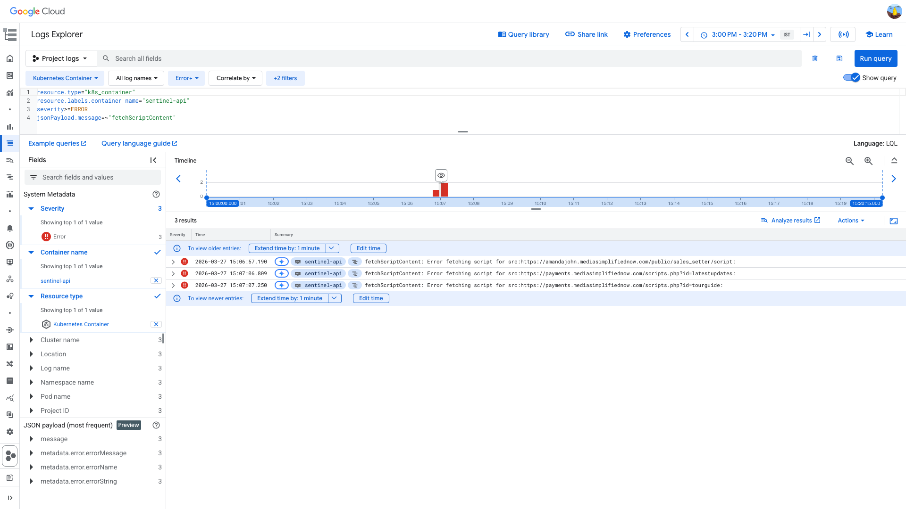

# HTTPLatencyPerApp Investigation — sentinel-api — 2026-03-27

**Author:** Himanshu Bhutani
**Generated:** 2026-03-27 15:35 IST

---

## 1. Alert Summary

| Field | Value |
|-------|-------|
| Alert type | HTTPLatencyPerApp |
| Alert ID | #113821 |
| Workload | sentinel-api |
| Channel | #alerts-crm |
| Time | 15:13 IST (09:43 UTC) on 2026-03-27 |
| Threshold | 10s |
| Current value | 14.85s |
| Status | Acknowledged by Smitha Shastri |
| Team | CRM-Marketplace |

## 2. What Happened

1. **15:06 IST** — sentinel-api attempted to validate a customer script that referenced external URLs on `mediasimplifiednow.com`.
2. **15:06-15:07 IST** — `fetchScriptContent()` calls to 3 external URLs timed out (axios 10s timeout), producing ERROR logs.
3. **15:08 IST** — P99 latency spiked from ~2.5s to 14.97s as the blocked request completed after ~15s.
4. **15:13 IST** — Alert fired when P99 exceeded 10s threshold for 2 consecutive minutes.
5. **15:14 IST** — Latency returned to normal (~1.5s) as the next request completed normally.

<details>
<summary>Detailed timeline — full event log</summary>

| Time (IST) | Source | Event |
|---|---|---|
| 15:06:57 | GCP ERROR | `fetchScriptContent: Error fetching script for src:https://amandajohn.mediasimplifiednow.com/public/sales_setter/script:` |
| 15:07:06 | GCP ERROR | `fetchScriptContent: Error fetching script for src:https://payments.mediasimplifiednow.com/scripts.php?id=latestupdates:` |
| 15:07:07 | GCP ERROR | `fetchScriptContent: Error fetching script for src:https://payments.mediasimplifiednow.com/scripts.php?id=tourguide:` |
| 15:08:00 | Grafana | P99 latency: 14.94s (spike starts) |
| 15:09-15:12 | Grafana | P99 latency: 14.97s (sustained — histogram artifact from low volume) |
| 15:13:00 | Grafana | `/sentinel/script/validate` request completed in 1.285s (normal) |
| 15:13:27 | Alert | HTTPLatencyPerApp fired — P99 above 10s for 2 minutes |
| 15:14:00 | Grafana | P99 latency: 1.50s (self-resolved) |
| 15:17:02 | GCP INFO | `/sentinel/script/validate` request completed in 1.576s (normal) |

</details>

## 3. Investigation Findings

### Evidence: Grafana — API Latency & Traffic

<details>
<summary>P99 latency spiked from 2.5s → 14.97s at 15:08 IST on a single endpoint</summary>

> **What to look for:** The P99 Latency panel shows a sharp spike to ~15s. The traffic rate is ~0.006 rps — only one endpoint (`POST /sentinel/script/validate`) receives traffic. With 1 request every ~2.5 minutes, a single slow request dominates the P99 calculation.



[Open in Grafana](https://prod.grafana.leadconnectorhq.com/d/d2db17da-530c-43f3-9273-c0fd664c591f/api-requests-overview?orgId=1&var-datasource=ber8nnhvgsjy8f&var-container=sentinel-api&from=1774603800000&to=1774605300000)
</details>

### Evidence: Grafana — Resource Usage

<details>
<summary>CPU at <2% of limit, Memory at 22% — zero resource pressure</summary>

> **What to look for:** CPU usage flat at ~0.009 cores across all 20 pods (limit: 1.1 cores). Memory stable at 346-374 MB (limit: 1.69GB). No resource contention — the latency is not caused by CPU/memory saturation.

**CPU by Pod:**



<details>
<summary>Filter & time range context</summary>


</details>

**Memory by Pod:**



<details>
<summary>Filter & time range context</summary>


</details>

[Open in Grafana](https://prod.grafana.leadconnectorhq.com/d/a4859d4a-1e0a-4ae3-b9b2-d04d366cf29b/app-detailed-view?orgId=1&var-container=sentinel-api&from=1774602000000&to=1774607400000)
</details>

### Evidence: Grafana — Event Loop & Pod Health

- **Event Loop Lag P99**: Max 77.4ms on pod `5lndh` at 15:06 IST — minor GC pause, not significant for a 15s latency spike.
- **Pod Count**: 20 pods, stable throughout.
- **Pod Restarts**: 0 — no restarts in the investigation window.
- **Error Rate**: 0% — all requests returned 2xx.

### Evidence: GCP Logs — External Script Fetch Failures

<details>
<summary>3 fetchScriptContent errors at 15:06-15:07 IST — customer URLs on mediasimplifiednow.com</summary>

> **What to look for:** 3 ERROR entries, all `fetchScriptContent: Error fetching script for src:` pointing to external customer-hosted URLs. These are the external HTTP calls that blocked for the full axios timeout (10s), causing the latency spike.

```
resource.type="k8s_container"
resource.labels.container_name="sentinel-api"
severity>=ERROR
jsonPayload.message=~"fetchScriptContent"
```

| Time (IST) | URL |
|---|---|
| 15:06:57 | `amandajohn.mediasimplifiednow.com/public/sales_setter/script` |
| 15:07:06 | `payments.mediasimplifiednow.com/scripts.php?id=latestupdates` |
| 15:07:07 | `payments.mediasimplifiednow.com/scripts.php?id=tourguide` |



[Open in GCP Log Explorer](https://console.cloud.google.com/logs/query;query=resource.type%3D%22k8s_container%22%0Aresource.labels.container_name%3D%22sentinel-api%22%0Aseverity%3E%3DERROR%0AjsonPayload.message%3D~%22fetchScriptContent%22;timeRange=2026-03-27T09%3A30%3A00Z%2F2026-03-27T09%3A50%3A00Z?project=highlevel-backend)
</details>

### Evidence: Code Analysis

sentinel-api validates customer-submitted JavaScript in marketplace apps. The validation flow:

1. `POST /sentinel/script/validate` receives HTML/JS content
2. **Puppeteer** (headless Chromium) parses the HTML and extracts `<script src>` URLs
3. `fetchScriptContent()` downloads each external script via **axios with 10s timeout** (`timeout: 10000`)
4. Security checks run on the downloaded content (Firebase access, obfuscation detection, token access)
5. Scripts are processed in parallel with `p-limit(5)` concurrency

**The 10s axios timeout exactly matches the alert threshold.** A single external URL that takes >10s to respond (or times out completely) pushes the total request latency past the 10s threshold. With ~1 request every 2.5 minutes, one slow request dominates P99.

Source: `apps/sentinel/src/helper/customJSValidator.ts`

## 4. Cross-Validation

| Signal | Source | Finding | Agreement |
|--------|--------|---------|-----------|
| P99 spike timing | Grafana | 15:08 IST (09:38 UTC) | ✓ |
| External fetch errors | GCP Logs | 15:06-15:07 IST (09:36-09:37 UTC) — 2 min before spike | ✓ |
| No resource pressure | Grafana | CPU <2%, memory 22% | ✓ |
| No pod restarts | Grafana + GCP | 0 restarts, no K8s events | ✓ |
| No 5xx errors | Grafana | All 2xx | ✓ |
| Low traffic volume | Grafana | ~0.006 rps | ✓ |
| 10s axios timeout in code | Code | `customJSValidator.ts` | ✓ |
| Team-confirmed fix | Slack thread | "reduce the timeout for axios call" | ✓ |
| Recurring pattern | Slack | 55 historical alerts for sentinel-api | ✓ |

**Confidence: HIGH** — 3 independent sources (Grafana metrics, GCP logs, code analysis) plus team confirmation in Slack thread. No alternative explanations.

## 5. Root Cause

**External HTTP timeout in `fetchScriptContent()` on a low-traffic service.**

sentinel-api's `fetchScriptContent()` uses axios with a 10s timeout to download scripts from external customer-hosted URLs. When the external server (`mediasimplifiednow.com`) was slow or unresponsive, the HTTP call blocked for the full timeout duration. Combined with extremely low traffic (~1 request every 2.5 minutes), this single slow request pushed the P99 latency metric from ~2.5s to 14.97s, exceeding the 10s alert threshold.

This is a **recurring pattern** — 55 historical alerts on sentinel-api indicate this happens regularly whenever a customer's external script URL is slow. The root cause is the combination of:
1. Synchronous external HTTP calls with a 10s timeout
2. An alert threshold (10s) that is <= the timeout duration
3. Insufficient request volume for reliable P99 percentile calculation

<details>
<summary>Probable noise — transient errors during disruption (not root cause)</summary>

| Time | Pattern | Why it's noise |
|------|---------|----------------|
| 15:06 IST | Event loop lag 77ms on pod `5lndh` | Normal GC pause, well below probe timeout. Does not explain 15s latency. |

No other noise patterns observed — this is a very clean single-cause incident.

</details>

## 6. Action Items

| Priority | Action | Owner | Rationale |
|----------|--------|-------|-----------|
| **Medium** | Reduce axios timeout in `fetchScriptContent()` from 10s → 3-5s | CRM-Marketplace | Keeps request latency below alert threshold even when external URLs are slow |
| **Low** | Raise alert threshold for sentinel-api above 10s, or exclude from HTTPLatencyPerApp | CRM-Marketplace / Platform | Low-traffic service where P99 is dominated by individual request noise |
| **Low** | Add circuit breaker for repeated failures to the same external domain | CRM-Marketplace | Prevents repeated timeouts to known-bad domains |
| **Low** | Consider caching external script content with short TTL | CRM-Marketplace | Reduces external dependency on customer-hosted URLs |

## 7. Deployment Details

| Setting | Value |
|---------|-------|
| Pods | 20 (HPA min: 2, max: 10 — but running 20) |
| CPU request/limit | 756m / 1.1 cores |
| Memory request/limit | 1.5Gi / 1.69GB |
| Endpoint | `POST /sentinel/script/validate` (internal, ISTIO_MESH only) |
| Caller | `companies-api` |
| Framework | NestJS + Puppeteer (headless Chromium) |
| Axios timeout | 10,000ms (10s) |

## 8. Correlated Alerts

No correlated alerts within ±15 minutes. This is an isolated alert on a single service — no infrastructure or platform-wide issue.
