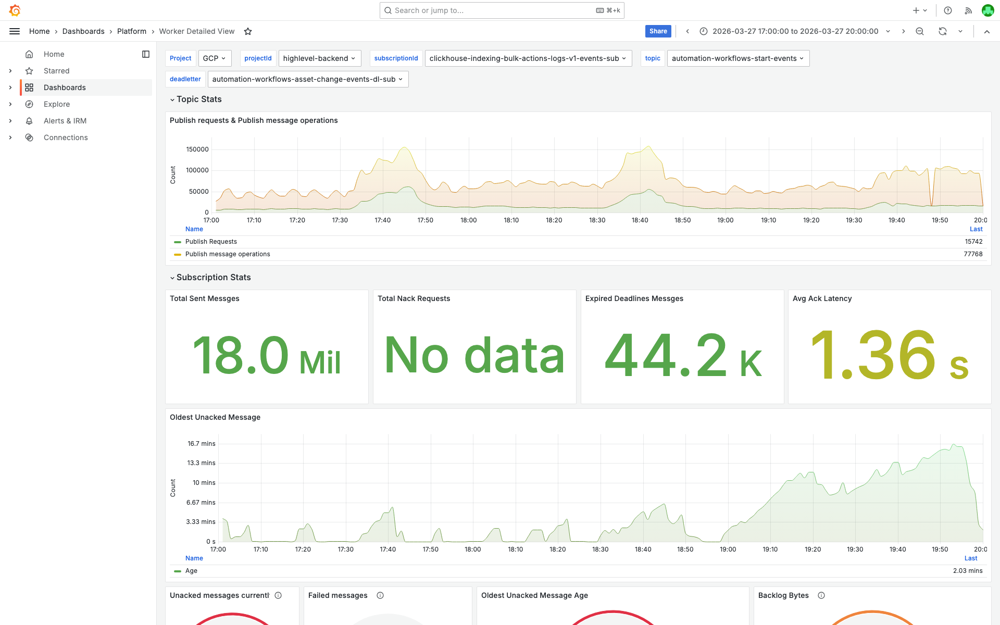
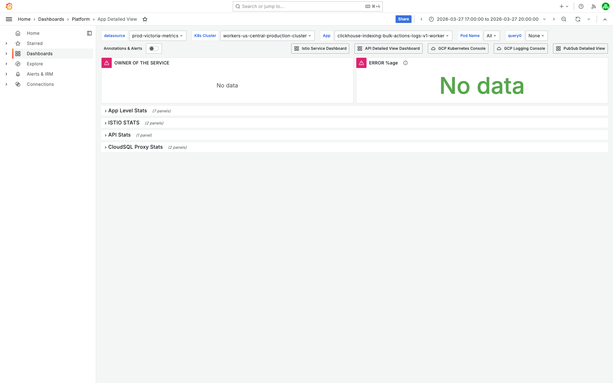
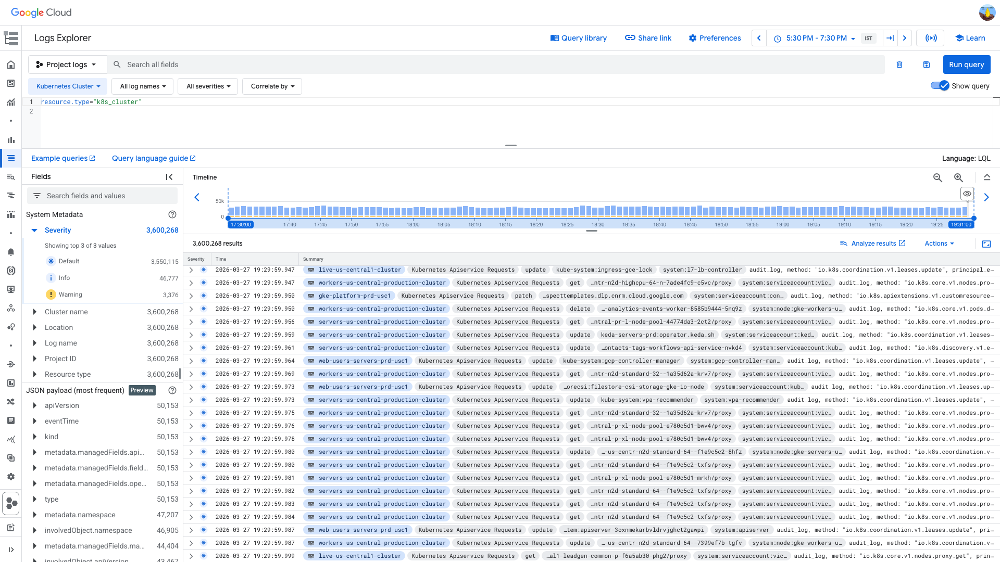
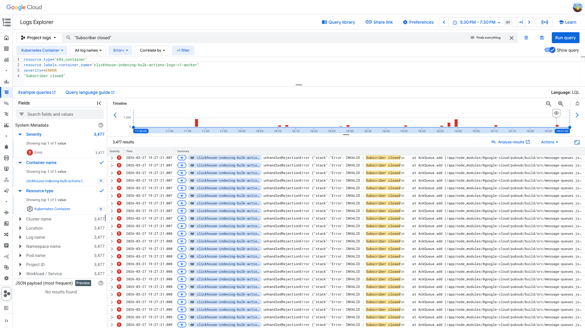

# PubSub Unacked Messages Investigation — clickhouse-indexing-bulk-actions-logs-v1-worker — 2026-03-27

**Author:** Himanshu Bhutani
**Generated:** 2026-03-27 21:20 IST

---

## 1. Alert Summary

| Field | Value |
|-------|-------|
| Alert type | Pubsub Unacked Messages above 10k |
| Alert # | #113831 |
| Workload | `clickhouse-indexing-bulk-actions-logs-v1-worker` |
| Subscription | `clickhouse-indexing-bulk-actions-logs-v1-events-sub` |
| Cluster | `workers-us-central-production-cluster` |
| Namespace | `default` |
| Alert time | 18:46 IST (13:16 UTC) |
| Source channel | #alerts-crm |
| Grafana OnCall | [IBNE63GK5CBMR](https://prod.grafana.leadconnectorhq.com/a/grafana-oncall-app/alert-groups/IBNE63GK5CBMR) |
| Alert rule | [a869c751-a88d-4f06-b984-c4413e22edc3](https://prod.grafana.leadconnectorhq.com/alerting/grafana/a869c751-a88d-4f06-b984-c4413e22edc3/view?orgId=1) |

**Alert rule details:** The rule uses MQL to query `pubsub.googleapis.com/subscription/num_undelivered_messages` across all subscriptions labeled with `unack_alert_level=10k`, grouped by `subscription_id`, `sub_team`, and `team`. It fires when the mean value exceeds 10,000.

---

## 2. Investigation Findings

### Evidence: PubSub Subscription Metrics (Cloud Monitoring)

**Key metrics for `clickhouse-indexing-bulk-actions-logs-v1-events-sub` (12:00–14:00 UTC / 17:30–19:30 IST):**

| Metric | Value | Interpretation |
|--------|-------|---------------|
| `num_undelivered_messages` (peak) | **1,120,447** at 13:36 UTC | Massive backlog |
| `num_undelivered_messages` (at alert time) | **~488,343** | Above 10k threshold |
| `oldest_unacked_message_age` (peak) | **~714 seconds** (~12 min) | Significant age |
| `ack_message_count` (avg) | **~92,600 msgs/min** | Workers actively processing |
| `nack_requests` | **No data returned** | No nacks detected |
| `sent_message_count / ack_message_count` ratio | **~1.0** (0.83–1.26) | No retry amplification |
| Topic publish rate (peak) | **~315,000 msgs/min** | Bursty surges far exceeding processing capacity |

<details>
<summary>Screenshot: Worker Detailed View — Subscription Stats</summary>

> **What to look for:** Unacked messages panel showing the sharp spike. Ack rate panel showing sustained processing. Look for whether nack rate shows any data — it should be flat/zero, confirming no retry amplification.



[Open in Grafana](https://prod.grafana.leadconnectorhq.com/d/a04e5483-eb8c-47ef-8198-30147926964c/worker-detailed-view?orgId=1&var-subscriptionId=clickhouse-indexing-bulk-actions-logs-v1-events-sub&var-projectId=highlevel-backend&from=1774611000000&to=1774621800000)
</details>

**Backlog pattern analysis:** The backlog started very low (~541 at 12:01 UTC), surged to ~193k by 12:04 UTC, continued climbing through the investigation window, peaked at ~1.12M around 13:36 UTC, then began partial drain to ~820k by 14:00 UTC. The ack rate remained high throughout (92.6k msgs/min average), confirming workers were processing. The publish rate was the driver — topic received up to 315k msgs/min in bursts.

### Evidence: Pod Health (App Detailed View)

<details>
<summary>Screenshot: App Detailed View — Pod Count, CPU, Memory, Restarts</summary>

> **What to look for:** Pod count oscillation (should show the 5↔20 pattern matching HPA events). CPU/memory panels — CPU should show drops when pod count increases (which triggers the scale-down). Note: Grafana Prometheus proxy had intermittent 502/503 errors during this investigation, so some panels may show partial data.



[Open in Grafana](https://prod.grafana.leadconnectorhq.com/d/a4859d4a-1e0a-4ae3-b9b2-d04d366cf29b/app-detailed-view?orgId=1&var-container=clickhouse-indexing-bulk-actions-logs-v1-worker&var-cluster=workers-us-central-production-cluster&from=1774611000000&to=1774621800000)
</details>

### Evidence: HPA Scaling Events (K8s Cluster Events)

**The HPA used two competing scaling metrics:**
1. **External metric:** `pubsub.googleapis.com/subscription/num_undelivered_messages` — scales UP when backlog grows
2. **CPU utilization:** percentage of CPU request — scales DOWN when utilization drops below target

This creates an oscillation cycle:
- Backlog grows → HPA scales up (5→20)
- More pods = more processing capacity, but CPU utilization per pod drops
- CPU below target → HPA scales down (20→5)
- Fewer pods → backlog rebuilds → cycle repeats

**HPA events in the investigation window (from `k8s_cluster` resource type):**

| Time (IST) | Direction | Replicas | Reason |
|---|---|---|---|
| 18:29 (12:59 UTC) | DOWN | 9 → 5 | `external metric num_undelivered_messages below target` |
| 18:34:20 (13:04 UTC) | UP | 5 → 10 | `external metric num_undelivered_messages above target` |
| 18:34:27 (13:04 UTC) | UP | 10 → 20 | `external metric num_undelivered_messages above target` |
| 18:55 (13:25 UTC) | DOWN | 20 → 12 | `cpu resource utilization below target` |
| 18:57 (13:27 UTC) | DOWN | 12 → 9 | `cpu resource utilization below target` |
| 18:58 (13:28 UTC) | DOWN | 9 → 8 | `cpu resource utilization below target` |
| 18:59 (13:29 UTC) | DOWN | 8 → 5 | `cpu resource utilization below target` |
| 19:00 (13:30 UTC) | UP | 5 → 10 | `external metric num_undelivered_messages above target` |
| 19:01:39 (13:31 UTC) | UP | 10 → 15 | `external metric num_undelivered_messages above target` |
| 19:01:53 (13:31 UTC) | UP | 15 → 20 | `external metric num_undelivered_messages above target` |

<details>
<summary>Screenshot: HPA Scaling Events in GCP Log Explorer</summary>

> **What to look for:** Alternating SuccessfulRescale events — scale-ups mention `num_undelivered_messages`, scale-downs mention `cpu resource utilization below target`. The rapid oscillation (20→5→20 in under 5 minutes) is the pathological pattern.



GCP query:
```
resource.type="k8s_cluster"
(jsonPayload.reason="SuccessfulRescale" OR jsonPayload.reason="ScalingReplicaSet")
"clickhouse-indexing-bulk-actions-logs-v1"
```

[Open in GCP Log Explorer](https://console.cloud.google.com/logs/query;query=resource.type%3D%22k8s_cluster%22%0A(jsonPayload.reason%3D%22SuccessfulRescale%22%20OR%20jsonPayload.reason%3D%22ScalingReplicaSet%22)%0A%22clickhouse-indexing-bulk-actions-logs-v1%22;timeRange=2026-03-27T12%3A00%3A00Z%2F2026-03-27T14%3A00%3A00Z?project=highlevel-backend)
</details>

### Evidence: GCP Logs — Error Analysis

**3,490 ERROR entries** in the 12:00–14:00 UTC window. Primary pattern:

**`unhandledRejectionError` / `INVALID : Subscriber closed`**
- PubSub client `Message.ack()` called after the subscriber was already closed
- Stack trace: `@google-cloud/pubsub` → `clickhouse-indexing-worker.js` → `ClickhouseIndexingWorker.processBatchMessage` (batch forEach ack path)
- These errors cluster at **~12:17 UTC** and **~13:57 UTC**, correlating with HPA scale-down events that terminate pods mid-processing

**Kubelet logs confirm pod lifecycle events:**
- **12:21 UTC:** SyncLoop DELETE/REMOVE and sandbox teardown for the worker
- **13:57-13:58 UTC:** ContainerStarted / ContainerDied, matching the error burst

<details>
<summary>Screenshot: Subscriber Closed Errors in GCP Log Explorer</summary>

> **What to look for:** Error entries with `INVALID : Subscriber closed` message. Check the histogram at top — error bursts should align with HPA scale-down times (~12:17 and ~13:57 UTC).



GCP query:
```
resource.type="k8s_container"
resource.labels.container_name="clickhouse-indexing-bulk-actions-logs-v1-worker"
severity>=ERROR
"Subscriber closed"
```

[Open in GCP Log Explorer](https://console.cloud.google.com/logs/query;query=resource.type%3D%22k8s_container%22%0Aresource.labels.container_name%3D%22clickhouse-indexing-bulk-actions-logs-v1-worker%22%0Aseverity%3E%3DERROR%0A%22Subscriber%20closed%22;timeRange=2026-03-27T12%3A00%3A00Z%2F2026-03-27T14%3A00%3A00Z?project=highlevel-backend)
</details>

### Evidence: 24-Hour Backlog Pattern (Cloud Monitoring)

The subscription shows a chronic bursty pattern with peaks regularly exceeding 10k:

| Time (IST) | Peak Backlog | Notes |
|---|---|---|
| Mar 26 20:00 | 833,272 | Spike, then drain |
| Mar 26 21:30 | 720,830 | |
| Mar 26 23:30 | 411,510 | |
| Mar 27 05:00 | 578,778 | Night-time burst |
| Mar 27 09:30 | 895,136 | Largest pre-alert spike |
| Mar 27 16:00 | 170,061 | |
| Mar 27 17:00 | 95,077 | |
| Mar 27 19:00 | 488,343 | Alert fired |
| Mar 27 19:30 | 1,120,447 | Investigation peak |

Between spikes, the backlog drains to <10k. This confirms the pattern is chronic (repeating multiple times daily) rather than an isolated incident. Historical Slack alerts show the same subscription has fired 7+ times with backlogs up to 1.5M.

### Evidence: Warning Logs

**13 WARNING entries** in the 12:00–14:00 UTC window:
- **`[PLATFORM_CORE_CLICKHOUSE] Auto-retrying network error (attempt 1/2)`** clustered around 13:56:19–13:56:21 UTC
- No Redis lock conflict warnings
- No SLOW_EVENT warnings

The ClickHouse auto-retry warnings suggest intermittent connectivity issues but are minor (13 total) and appear only in one brief window.

---

## 3. Cross-Validation

| Signal | Source | Finding | Agreement |
|--------|--------|---------|-----------|
| Backlog building | Cloud Monitoring | 541 → 1.12M | ✅ |
| Workers processing | Cloud Monitoring (ack rate) | ~92.6k msgs/min avg | ✅ |
| No retry amplification | Cloud Monitoring (sent/ack) | Ratio ~1.0 | ✅ |
| HPA oscillation | K8s cluster events | 5↔20 pods with competing metrics | ✅ |
| Pod termination mid-processing | GCP container logs | `Subscriber closed` errors at scale-down times | ✅ |
| Pod lifecycle churn | Kubelet logs | ContainerDied/ContainerStarted | ✅ |
| Recurring pattern | Cloud Monitoring (24h) | Multiple daily spikes | ✅ |
| Prior alerts | Slack search | 7+ alerts, same subscription | ✅ |
| No deployment trigger | Slack search | No deploys found | ✅ |
| No correlated alerts | Slack search | No other alerts in ±15 min | ✅ |

**Confidence: HIGH** — 8 independent sources all converge on the same root cause: HPA oscillation preventing sustained processing capacity.

---

## 4. Root Cause

**HPA thrashing due to competing scaling metrics causes chronic backlog cycling.**

The worker's HPA is configured with two scaling metrics that work against each other:

1. **PubSub `num_undelivered_messages` (external metric):** Scales UP when backlog exceeds target. This is the correct scaling signal for a PubSub worker — scale when there's work to do.

2. **CPU utilization (percentage of request):** Scales DOWN when CPU drops below target. This counteracts the external metric because PubSub workers are I/O-bound (waiting on ClickHouse writes, PubSub ack), not CPU-bound. More pods = more I/O parallelism but lower per-pod CPU → triggers scale-down.

**The oscillation cycle:**
1. Burst of messages arrives on the topic (up to 315k msgs/min)
2. HPA sees backlog → scales UP to 20 pods
3. 20 pods process messages efficiently, but CPU per pod is low (I/O-bound work)
4. CPU below target → HPA scales DOWN to 5 pods
5. 5 pods can't keep up with incoming traffic → backlog rebuilds
6. HPA sees backlog → scales UP again → repeat

Each scale-down event terminates pods mid-processing, causing `Subscriber closed` errors (3,490 in 2 hours) and wasted processing work. The terminated pods' in-flight messages are redelivered by PubSub, but the sent/ack ratio stays ~1.0 because the redelivery volume is small relative to the total throughput.

## What Happened

1. **18:29 IST** — HPA scaled DOWN from 9 → 5 pods (CPU below target), reducing processing capacity during a period of increasing traffic.
2. **18:34 IST** — Backlog grew past threshold; HPA responded with rapid scale-up 5 → 10 → 20 pods in 7 seconds.
3. **18:55–18:59 IST** — CPU-based scaling aggressively reduced pods 20 → 12 → 9 → 8 → 5 in 4 steps over 4 minutes.
4. **19:00–19:01 IST** — Backlog exploded again; HPA scaled 5 → 10 → 15 → 20 in 90 seconds.
5. **19:06 IST** — Backlog peaked at ~1.12M. Workers maintained ~92.6k msgs/min processing rate throughout, but couldn't overcome the publish rate peaks of 315k msgs/min.

<details>
<summary>Detailed timeline — full event log</summary>

| Time (IST) | Source | Event |
|---|---|---|
| 17:30 (12:00 UTC) | Cloud Monitoring | Backlog starts low (~541) |
| 17:34 (12:04 UTC) | Cloud Monitoring | Backlog surges to ~193k |
| 17:47 (12:17 UTC) | GCP Logs | Burst of `Subscriber closed` errors (pod termination) |
| 17:51 (12:21 UTC) | Kubelet | SyncLoop DELETE/REMOVE — pod sandbox teardown |
| 18:29 (12:59 UTC) | K8s Events | HPA: 9 → 5 (CPU below target) |
| 18:34:20 (13:04 UTC) | K8s Events | HPA: 5 → 10 (PubSub backlog) |
| 18:34:27 (13:04 UTC) | K8s Events | HPA: 10 → 20 (PubSub backlog) |
| 18:46 (13:16 UTC) | Slack | **Alert #113831 fired** — 488k undelivered |
| 18:55 (13:25 UTC) | K8s Events | HPA: 20 → 12 (CPU below target) |
| 18:57 (13:27 UTC) | K8s Events | HPA: 12 → 9 (CPU below target) |
| 18:58 (13:28 UTC) | K8s Events | HPA: 9 → 8 (CPU below target) |
| 18:59 (13:29 UTC) | K8s Events | HPA: 8 → 5 (CPU below target) |
| 19:00 (13:30 UTC) | K8s Events | HPA: 5 → 10 (PubSub backlog) |
| 19:01:39 (13:31 UTC) | K8s Events | HPA: 10 → 15 (PubSub backlog) |
| 19:01:53 (13:31 UTC) | K8s Events | HPA: 15 → 20 (PubSub backlog) |
| 19:06 (13:36 UTC) | Cloud Monitoring | **Backlog peaked at ~1,120,447** |
| 19:26 (13:56 UTC) | GCP Logs | ClickHouse auto-retry warnings (13 entries) |
| 19:27 (13:57 UTC) | GCP Logs + Kubelet | ContainerDied/ContainerStarted + Subscriber closed burst |

</details>

---

## 5. Probable Noise

<details>
<summary>Probable noise — transient errors during HPA churn (not root cause)</summary>

| Time (IST) | Pattern | Why it's noise |
|---|---|---|
| 19:26 | `[PLATFORM_CORE_CLICKHOUSE] Auto-retrying network error (attempt 1/2)` (13 entries) | Brief ClickHouse connectivity blip, auto-resolved via retry. Only 13 warnings in 2h — not impacting throughput. |
| Ongoing | `unhandledRejectionError` / `INVALID : Subscriber closed` (3,490 entries) | Side-effect of HPA scale-down terminating pods mid-processing. Would disappear if HPA stopped thrashing. |

</details>

---

## 6. Action Items

### For the alert

| Priority | Action | Rationale |
|----------|--------|-----------|
| **High** | Fix HPA: add `behavior.scaleDown.stabilizationWindowSeconds: 300` to prevent rapid scale-down after scale-up | Currently scales down within minutes, undoing the scale-up. A 5-minute stabilization window would let the worker drain the backlog before scaling down. |
| **High** | Increase `minReplicas` from current level (scales to 5) to 10-15 | The subscription regularly receives bursts; baseline of 5 pods is insufficient. Even during quiet periods, 10 pods provide headroom for burst absorption. |
| **Medium** | Consider removing CPU-based scaling for this worker | PubSub workers are I/O-bound; CPU is a poor proxy for load. The external PubSub metric alone should drive scaling. Alternatively, increase CPU target threshold to prevent premature scale-down. |
| **Medium** | Review alert threshold (10k) for this subscription | The worker regularly operates with 50k–100k messages during normal burst processing. A threshold of 50k or 100k would reduce noise without missing real issues. |

### Separate issues found

| Priority | Issue | Details |
|----------|-------|---------|
| **Low** | `Subscriber closed` unhandled rejection in batch ack path | The worker's `processBatchMessage` calls `message.ack()` in a forEach loop after the subscriber is closed. Adding a subscriber status check before acking would eliminate these errors. |
| **Low** | ClickHouse connectivity intermittent | 13 auto-retry warnings suggest occasional ClickHouse connectivity issues. Monitor for trends. |

---

## 7. Deployment Details

| Setting | Value |
|---------|-------|
| Container | `clickhouse-indexing-bulk-actions-logs-v1-worker` |
| Cluster | `workers-us-central-production-cluster` |
| Namespace | `default` |
| HPA min replicas | Scales down to 5 (observed minimum) |
| HPA max replicas | 20 (observed maximum) |
| HPA metrics | PubSub `num_undelivered_messages` (external) + CPU utilization |
| Subscription | `clickhouse-indexing-bulk-actions-logs-v1-events-sub` |
| Topic | `clickhouse-indexing-bulk-actions-logs-events` |

*Note: Worker source code is not in the `marketplace-backend` monorepo. Deployment YAML and exact HPA config were not reviewed (the values above are inferred from observed behavior).*

---

## 8. Cross-Validation Summary

| Source | Signal | Supports root cause? |
|--------|--------|---------------------|
| Cloud Monitoring (PubSub) | Backlog builds and partially drains in cycles | ✅ Yes — matches HPA oscillation |
| Cloud Monitoring (PubSub) | Ack rate stays positive (~92.6k/min) | ✅ Yes — workers processing, just insufficient capacity |
| Cloud Monitoring (PubSub) | Sent/ack ratio ~1.0 | ✅ Yes — rules out nack amplification |
| Cloud Monitoring (Topic) | Publish rate surges up to 315k/min | ✅ Yes — explains why 5 pods can't keep up |
| K8s cluster events | HPA oscillates 5↔20 with competing CPU + PubSub metrics | ✅ Yes — direct evidence of thrashing |
| GCP container logs | `Subscriber closed` errors during scale-down | ✅ Yes — pods terminated mid-processing |
| Kubelet logs | ContainerDied/ContainerStarted at scale event times | ✅ Yes — confirms pod lifecycle churn |
| Cloud Monitoring (24h) | Repeated spikes daily (200k–1.1M) | ✅ Yes — chronic, not one-off |
| Slack (7+ prior alerts) | Recurring pattern, "spike addressed by scaling up" | ✅ Yes — team already aware, workaround is manual scale |

**Confidence: HIGH** — All 9 sources converge. No contradicting evidence found. The 24h pattern and historical Slack alerts confirm this is a chronic issue, not a new failure mode.
