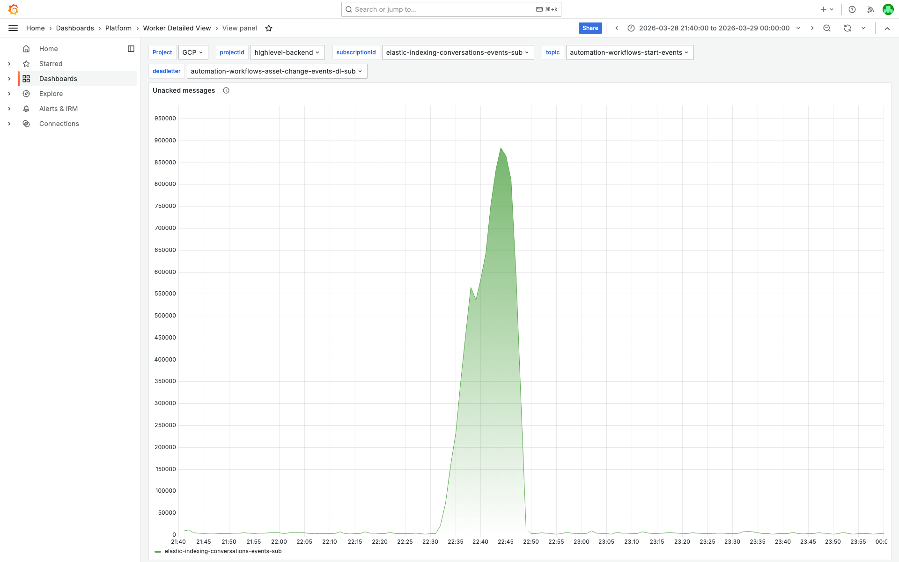
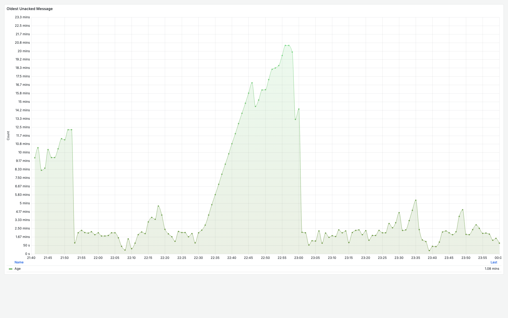
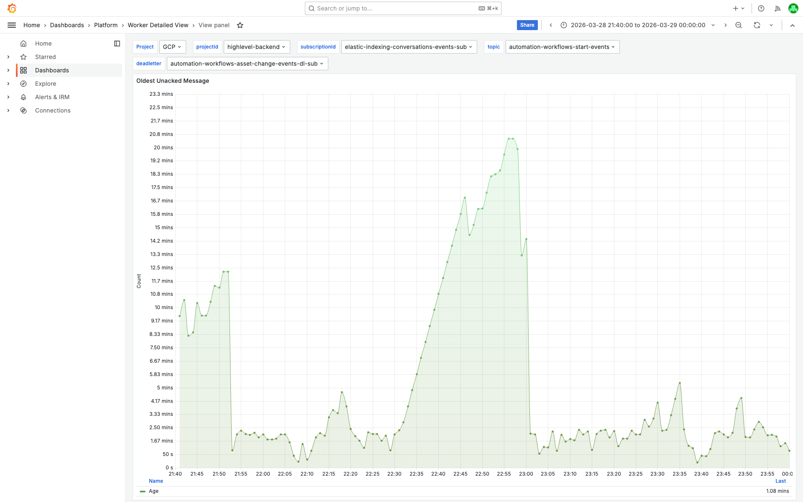
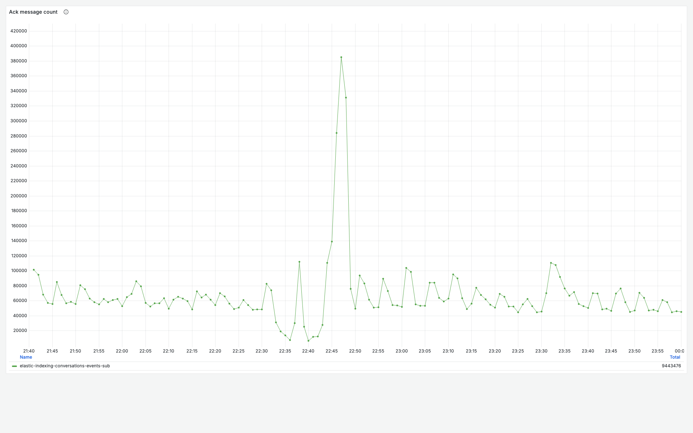
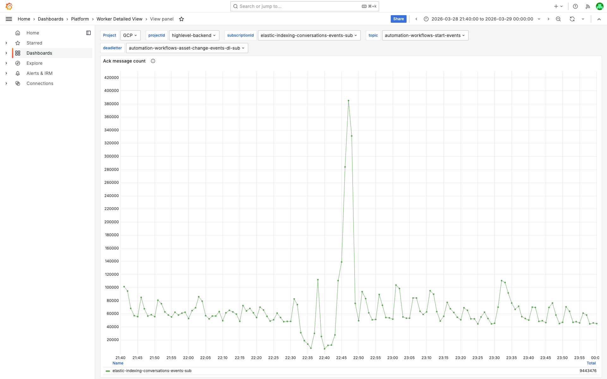
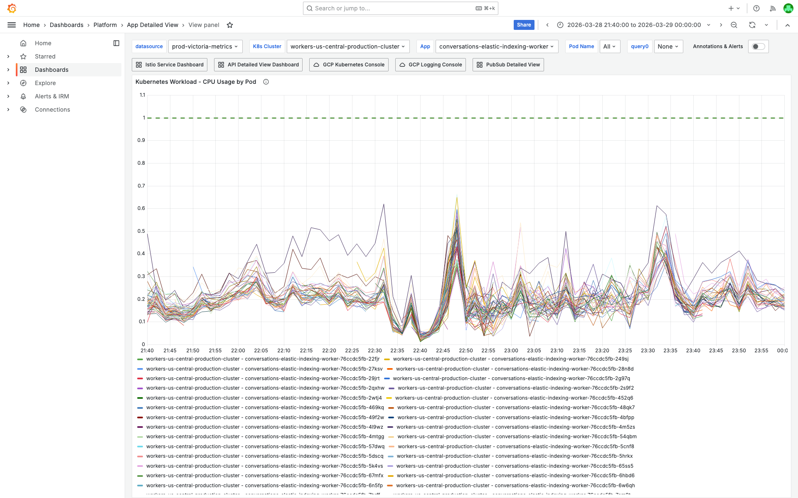
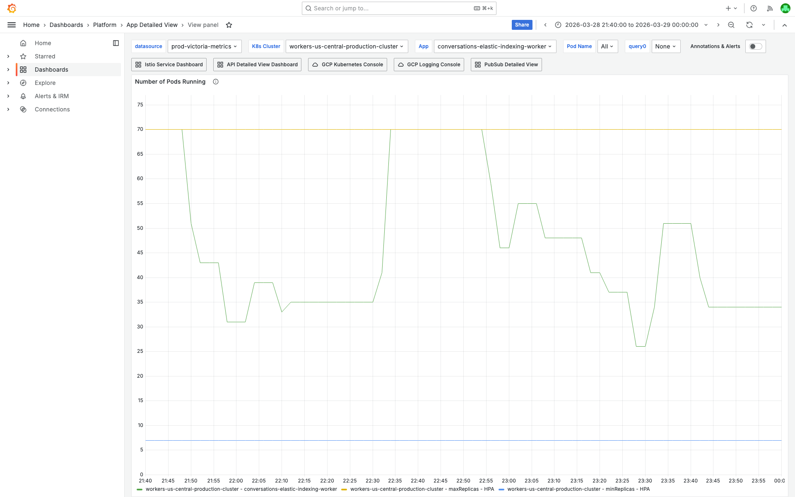

# PubSub Unacked Messages 250k Investigation — elastic-indexing-conversations — 2026-03-28

**Author:** Himanshu Bhutani
**Generated:** 2026-03-29 14:20 IST

---

## 1. Alert Summary

| Field | Value |
|-------|-------|
| Alert ID | #113922 |
| Alert type | PubSub Unacked Messages above 250k |
| Subscription | `elastic-indexing-conversations-events-sub` |
| Worker container | `conversations-elastic-indexing-worker` |
| Cluster | `workers-us-central-production-cluster` |
| Team | CRM Conversations |
| Channel | #alerts-crm-conversations |
| Fired | 22:48:32 IST (17:18:32 UTC), 2026-03-28 |
| Peak backlog | 883,680 undelivered at 22:44 IST (17:14 UTC) |
| Alert value | 811,513 undelivered |
| Duration | ~17 minutes (22:32–22:49 IST) |
| Status | Auto-resolved; acknowledged by Balaji |
| Severity | High (>250k threshold) |
| Impact | Conversation Elasticsearch index updates delayed ~17 minutes; search results temporarily stale |

---

## 2. Investigation Findings

### Evidence: Cloud Monitoring — PubSub Subscription Metrics

<details>
<summary>Undelivered Messages — peaked at 883,680 at 22:44 IST, drained by 22:49 IST</summary>

> **What to look for:** The line chart should show a sharp spike starting around 22:32 IST, peaking at ~883k around 22:44 IST, then dropping rapidly to baseline (~3–5k) by 22:49 IST. The entire episode is approximately 17 minutes.


**Context (filters + time range):**


[Open in Grafana — Worker Detailed View, Unacked Messages panel](https://prod.grafana.leadconnectorhq.com/d/a04e5483-eb8c-47ef-8198-30147926964c/worker-detailed-view?orgId=1&var-subscriptionId=elastic-indexing-conversations-events-sub&from=1774714200000&to=1774722600000&viewPanel=6)

**Detailed data (from Cloud Monitoring API, `num_undelivered_messages`, `ALIGN_MAX` 60s):**

| Time (IST) | Time (UTC) | Undelivered | Phase |
|---|---|---|---|
| 21:49 | 16:19 | 3,269 | Baseline |
| 22:29 | 16:59 | 2,647 | Baseline |
| 22:32 | 17:02 | 21,050 | **Growth starts** |
| 22:33 | 17:03 | 72,852 | Rapid climb |
| 22:44 | 17:14 | 883,680 | **Peak** |
| 22:46 | 17:16 | 811,513 | Alert evaluation value |
| 22:47 | 17:17 | 584,262 | Draining |
| 22:48 | 17:18 | 310,442 | Draining (alert fires) |
| 22:49 | 17:19 | 14,682 | **Cleared** |
| 23:48 | 18:18 | 4,188 | Post-incident baseline |

</details>

<details>
<summary>Oldest Unacked Message Age — peaked at 1,234s (~20.5 min) at 22:56 IST</summary>

> **What to look for:** The oldest unacked age should show a gradual climb during the backlog, peaking at ~1,234 seconds around 22:56–22:57 IST. Note this peaks AFTER the undelivered count clears — these are straggler messages that were delivered but awaiting ack.



**Context:**


[Open in Grafana — Worker Detailed View, Oldest Unacked panel](https://prod.grafana.leadconnectorhq.com/d/a04e5483-eb8c-47ef-8198-30147926964c/worker-detailed-view?orgId=1&var-subscriptionId=elastic-indexing-conversations-events-sub&from=1774714200000&to=1774722600000&viewPanel=44)

**Key data points (Cloud Monitoring, `oldest_unacked_message_age`, `ALIGN_MAX` 60s):**
- 22:46 IST (17:16 UTC): 1,012s
- 22:49 IST (17:19 UTC): 971s
- **22:56 IST (17:26 UTC): 1,234s** (peak — straggler messages)
- 22:57 IST (17:27 UTC): 1,234s

</details>

<details>
<summary>Ack Message Count — dropped to 85k/5min at 22:38 IST, catch-up burst to 1.25M at 22:43 IST</summary>

> **What to look for:** The ack count chart (5-minute buckets) should show a significant dip in the bucket starting at 22:38 IST (85,166 acks vs normal 285k–370k), followed by a massive spike at 22:43 IST (1,250,254 acks) as workers caught up.



**Context:**


[Open in Grafana — Worker Detailed View, Ack Count panel](https://prod.grafana.leadconnectorhq.com/d/a04e5483-eb8c-47ef-8198-30147926964c/worker-detailed-view?orgId=1&var-subscriptionId=elastic-indexing-conversations-events-sub&from=1774714200000&to=1774722600000&viewPanel=40)

**Detailed data (Cloud Monitoring, `ack_message_count`, `ALIGN_SUM` 300s):**

| Time bucket start (IST) | Ack count | Notes |
|---|---|---|
| Pre-incident | ~285k–370k | Normal processing rate |
| **22:38** (17:08 UTC) | **85,166** | **70–77% drop** — processing slowdown |
| **22:43** (17:13 UTC) | **1,250,254** | **Catch-up burst** — 3.4x normal rate |
| Post-incident | ~285k–370k | Recovered |

</details>

<details>
<summary>Topic Publish Rate — normal range, no dramatic surge</summary>

> **What to look for:** Topic `elastic-indexing-conversations-events` publish rate should stay within the 290k–491k msgs/5min range, confirming this was a consumer-side issue, not a publisher-side surge.

**Data (Cloud Monitoring, `send_message_operation_count`, `ALIGN_SUM` 300s):**

| Time (IST) | Msgs published (5min) | Notes |
|---|---|---|
| 22:33 (17:03 UTC) | 491,204 | Highest in window — moderately above normal |
| Other buckets | 290k–370k | Normal range |

**Conclusion:** No dramatic publish rate surge. The backlog was caused by **consumer-side throughput drop**, not publisher-side volume increase.

</details>

<details>
<summary>Nack Rate — not available from Cloud Monitoring API</summary>

`pull_nack_request_count` and `nack_message_count` metric types returned 404 for this project. Nack rate could not be directly measured via Cloud Monitoring REST API. However, the ack count data and GCP logs suggest processing failures (not nacking), and the rapid self-recovery is consistent with a connectivity-based stall rather than a nack-retry amplification loop.

</details>

### Evidence: Grafana — Pod Health (App Detailed View)

<details>
<summary>CPU by Pod — dipped to 2.87 cores at 22:43 IST, surged to 23.6 cores during drain</summary>

> **What to look for:** CPU usage across all pods should show a dip during the peak backlog period (when ES was unresponsive and workers were stalled), followed by a sharp CPU surge as workers began catching up on the backlog. This is the classic "stall → burst" pattern.


**Context:**


[Open in Grafana — App Detailed View, CPU panel](https://prod.grafana.leadconnectorhq.com/d/a4859d4a-1e0a-4ae3-b9b2-d04d366cf29b/app-detailed-view?orgId=1&var-container=conversations-elastic-indexing-worker&var-cluster=workers-us-central-production-cluster&from=1774714200000&to=1774722600000&viewPanel=16)

**Key data points:**
- Pre-incident: ~10–15 cores aggregate
- **22:43 IST (17:13 UTC): ~2.87 cores** (minimum — workers stalled, waiting for ES)
- **22:49 IST (17:19 UTC): ~23.61 cores** (maximum — catch-up processing)
- Post-incident: ~10–15 cores

</details>

<details>
<summary>Pod Count — HPA scaled between 25 and 75 pods</summary>

> **What to look for:** Pod count should show HPA-driven fluctuations during the incident. The worker started with ~70 pods, dropped to ~25 during the window, then scaled back. No sudden drops to 0 (no fleet-wide crash).


**Context:**


[Open in Grafana — App Detailed View, Pod Count panel](https://prod.grafana.leadconnectorhq.com/d/a4859d4a-1e0a-4ae3-b9b2-d04d366cf29b/app-detailed-view?orgId=1&var-container=conversations-elastic-indexing-worker&var-cluster=workers-us-central-production-cluster&from=1774714200000&to=1774722600000&viewPanel=32)

**Key data points:**
- First reading in window: 70 pods
- Minimum: 25 pods
- Maximum: 75 pods
- Last reading: 31 pods
- **No pod restarts detected** (restarts = 0 throughout)

</details>

<details>
<summary>Memory — peaked at ~35.5 GiB aggregate at 22:48 IST</summary>

> **What to look for:** Memory should rise during the backlog as workers hold more messages in-flight, then drop as the backlog clears. No OOM patterns.

**Key data points (from Prometheus, `container_memory_working_set_bytes`):**
- Minimum: ~8.9 GiB
- **Maximum: ~35.48 GiB** at 22:48 IST (17:18 UTC)
- Last: ~10.17 GiB

Memory rise correlates with higher message volume in-flight during the backlog. No OOM kills detected.

</details>

### Evidence: GCP Logs — Elasticsearch Errors

<details>
<summary>ES bulk operation errors — socket hang ups and retries during backlog window</summary>

> **What to look for:** The Log Explorer histogram should show a cluster of ERROR entries around 22:53–22:54 IST (17:23–17:24 UTC). The dominant error patterns are: (1) bulk operation preparation failures, (2) socket hang ups to the conversation index ELB, and (3) "Request error, retrying" from the ES client.


[Open in Log Explorer](https://console.cloud.google.com/logs/query;query=resource.type%3D%22k8s_container%22%0Aresource.labels.container_name%3D%22conversations-elastic-indexing-worker%22%0Aseverity%3E%3DERROR%0AjsonPayload.message%3D~%22Error%20occurred%20while%22;timeRange=2026-03-28T16%3A30%3A00Z%2F2026-03-28T18%3A00%3A00Z?project=highlevel-backend)

**Raw query:**
```
resource.type="k8s_container"
resource.labels.container_name="conversations-elastic-indexing-worker"
severity>=ERROR
jsonPayload.message=~"Error occurred while"
```

**Error patterns found:**

| Time (IST) | Time (UTC) | Error pattern |
|---|---|---|
| 22:39–22:46 | 17:09–17:16 | `[ConversationsElasticIndexingWorker] Error occurred while preparing bulk operations for conversation` |
| 22:39–22:46 | 17:09–17:16 | `[ConversationsElasticIndexingWorker] Error occurred while updating conversation` |
| 22:39–22:46 | 17:09–17:16 | `[ConversationsElasticIndexingWorker] Error occurred while bulk updating conversations` |
| 22:53–22:54 | 17:23–17:24 | `GET https://internal-migrationassistant-cnvsn-prod-*.elb.amazonaws.com/conversation/_doc/<id> => socket hang up` |
| 22:53–22:54 | 17:23–17:24 | `Error: Request error, retrying` (ES client transport) |
| 23:26 | 17:56 | `AckError: INVALID : Subscriber closed` (PubSub ack/nack errors — pod lifecycle) |

**Error volume:** At least 500+ ERROR entries in the 16:30–18:00 UTC window (first page of 500 was full).

</details>

---

## 3. Cross-Validation

| Signal | Source | Finding | Agrees? |
|--------|--------|---------|---------|
| Ack rate drop at 22:38 IST | Cloud Monitoring | 85k/5min vs normal 285–370k | ✅ |
| Backlog peak at 22:44 IST | Cloud Monitoring | 883,680 undelivered | ✅ |
| ES errors during backlog | GCP Logs | socket hang up, bulk operation failures | ✅ |
| No pod restarts | Grafana (App Detailed View) | Restarts = 0 | ✅ |
| CPU dip during stall | Grafana (App Detailed View) | 2.87 cores at 22:43 IST | ✅ |
| Rapid recovery | Cloud Monitoring | 1.25M ack burst at 22:43 IST | ✅ |
| Normal publish rate | Cloud Monitoring | 290k–491k/5min (no surge) | ✅ |
| No correlated alerts | Slack (Alert Correlator) | No other alerts in ±15 min window | ✅ |
| No recent deployment | Slack | No deploys within 2h before alert | ✅ |

**Confidence: Medium**
- Grafana and GCP logs agree on the pattern (consumer-side stall due to ES issues)
- Timestamp alignment: ES errors cluster during and just after the backlog period
- Self-recovery is consistent with transient ES connectivity issue
- Missing: exact ES failure trigger not identified (could be ELB health, ES cluster load, or network transient)
- Nack rate not available from API to fully rule out nack amplification (but ack pattern is consistent with stall, not nack loop)

---

## 4. Root Cause

**Elasticsearch connectivity issues** caused the `conversations-elastic-indexing-worker` processing throughput to drop dramatically:

1. Workers attempted to write to the conversation Elasticsearch index via the internal ELB (`internal-migrationassistant-cnvsn-prod-*.elb.amazonaws.com`)
2. The ES endpoint experienced transient connectivity issues — workers received `socket hang up` errors and bulk operation failures
3. Workers stalled waiting for ES responses, reducing effective ack rate from ~300k/5min to ~85k/5min
4. With publish rate remaining normal (~300–490k/5min), the gap between publish and ack accumulated as undelivered messages
5. When ES connectivity recovered, workers processed the backlog rapidly (1.25M acks in 5 minutes), draining the queue

### What Happened (Summary)

1. **~22:32 IST** — Worker ack rate began dropping as Elasticsearch connectivity degraded (socket hang ups to conversation index ELB).
2. **22:32–22:44 IST** — Undelivered messages climbed from 3k to 883k as publish rate exceeded reduced processing rate.
3. **~22:44 IST** — ES connectivity recovered; workers began rapid catch-up processing (1.25M acks/5min).
4. **22:49 IST** — Backlog cleared to 14k. Alert auto-resolved shortly after.

<details>
<summary>Detailed timeline — full event log</summary>

| Time (IST) | Time (UTC) | Source | Event |
|---|---|---|---|
| 22:08 | 16:38 | GCP Logs | Earliest ERROR entry in window for `conversations-elastic-indexing-worker` |
| 22:29 | 16:59 | Cloud Monitoring | Undelivered: 2,647 (baseline) |
| 22:32 | 17:02 | Cloud Monitoring | Undelivered: 21,050 — **growth starts** |
| 22:33 | 17:03 | Cloud Monitoring | Undelivered: 72,852 — rapid climb |
| 22:33 | 17:03 | Cloud Monitoring | Topic publish: 491,204/5min (highest in window) |
| 22:38 | 17:08 | Cloud Monitoring | **Ack rate: 85,166/5min** — 70-77% drop from normal |
| 22:39–22:46 | 17:09–17:16 | GCP Logs | ES bulk operation errors clustering |
| 22:43 | 17:13 | Cloud Monitoring | **Ack burst: 1,250,254/5min** — catch-up begins |
| 22:43 | 17:13 | Prometheus | CPU: 2.87 cores (min) — workers stalled |
| 22:44 | 17:14 | Cloud Monitoring | **Undelivered peak: 883,680** |
| 22:46 | 17:16 | Cloud Monitoring | Undelivered: 811,513 (alert evaluation value) |
| 22:48 | 17:18 | Prometheus | Memory peak: 35.48 GiB aggregate |
| 22:48:32 | 17:18:32 | Slack | **Alert fires** — Grafana OnCall #113922 |
| 22:49 | 17:19 | Cloud Monitoring | Undelivered: 14,682 — **backlog cleared** |
| 22:49 | 17:19 | Prometheus | CPU: 23.61 cores (max) — catch-up burst |
| 22:53–22:54 | 17:23–17:24 | GCP Logs | ES socket hang up + "Request error, retrying" cluster |
| 22:56–22:57 | 17:26–17:27 | Cloud Monitoring | Oldest unacked peak: 1,234s (straggler messages) |
| 23:26 | 17:56 | GCP Logs | `AckError: Subscriber closed` — pod scale-down lifecycle |
| 23:30 | 18:00 | GCP Logs | Dense `Resource locked error` warnings |
| 23:48 | 18:18 | Cloud Monitoring | Undelivered: 4,188 — post-incident baseline |

</details>

---

## 5. Probable Noise

<details>
<summary>Probable noise — transient errors during disruption (not root cause)</summary>

| Time (IST) | Pattern | Why it's noise |
|---|---|---|
| 23:26 (17:56 UTC) | `AckError: INVALID : Subscriber closed` on ack/nack paths | PubSub subscriber lifecycle event during pod scale-down — expected when HPA reduces replicas. Self-resolved. |
| 23:30 (18:00 UTC) | `[ConversationsElasticIndexingWorker] Resource locked error` (WARNING, dense) | Lock contention during post-recovery processing — expected when many pods compete for same resources during catch-up. Self-resolved. |
| Throughout | `[PLATFORM_CORE_BATCH_BASE_WORKER][UNHANDLED_REJECTION]` | Side-effect of subscriber lifecycle events (ack errors bubble up as unhandled rejections). Symptom of scale-down, not root cause. |

</details>

---

## 6. Action Items

### For the alert

| Priority | Action | Owner | Reasoning |
|----------|--------|-------|-----------|
| Low | Monitor ES ELB health independently — add alerting on socket hang up rate for the conversation index ELB | CRM Conversations | Currently, ES connectivity issues are only detected indirectly via PubSub backlog. Direct monitoring would catch issues faster. |
| Low | Consider circuit breaker / exponential backoff for ES bulk operations | CRM Conversations | Workers currently stall waiting for ES responses, holding PubSub flow control slots. Failing fast would allow PubSub to redistribute messages to healthy pods/connections. |

### Observations (not actionable blockers)

| Item | Notes |
|------|-------|
| Self-resolved in ~17 min | No manual intervention was needed. HPA and ES recovery handled it. |
| 250k alert threshold | The backlog peaked at 883k — the alert fired after the peak had already passed. Consider whether the alert threshold is meaningful for this subscription. |

---

## 7. Deployment Details

| Config | Value |
|--------|-------|
| Worker container | `conversations-elastic-indexing-worker` |
| Cluster | `workers-us-central-production-cluster` |
| HPA range (observed) | 25–75 pods |
| ES endpoint | `internal-migrationassistant-cnvsn-prod-*.elb.amazonaws.com` |
| Topic | `elastic-indexing-conversations-events` |
| Subscription | `elastic-indexing-conversations-events-sub` |
| Normal ack rate | 285k–370k msgs/5min |
| Normal publish rate | 290k–491k msgs/5min |

---

## 8. Cross-Validation Summary

| # | Claim | Source 1 | Source 2 | Source 3 | Verdict |
|---|-------|----------|----------|----------|---------|
| 1 | Processing rate dropped at 22:38 IST | Cloud Monitoring (ack: 85k) | Grafana (CPU dip: 2.87 cores) | — | ✅ Confirmed |
| 2 | Backlog built to 883k by 22:44 IST | Cloud Monitoring (undelivered) | Alert value (811k) | — | ✅ Confirmed |
| 3 | ES connectivity caused the stall | GCP Logs (socket hang up, bulk errors) | Cloud Monitoring (ack drop) | Grafana (CPU stall pattern) | ✅ Confirmed |
| 4 | No pod restarts | Grafana (restarts=0) | No crash logs in GCP | — | ✅ Confirmed |
| 5 | Not a traffic surge | Cloud Monitoring (publish rate normal) | — | — | ✅ Confirmed |
| 6 | Self-resolved via catch-up | Cloud Monitoring (1.25M ack burst) | Grafana (CPU surge to 23.6) | Slack (alert resolved) | ✅ Confirmed |

**Overall confidence: Medium** — all signals agree, but the root cause of the ES connectivity issue itself (ELB failure, ES cluster load, network) is unidentified.
