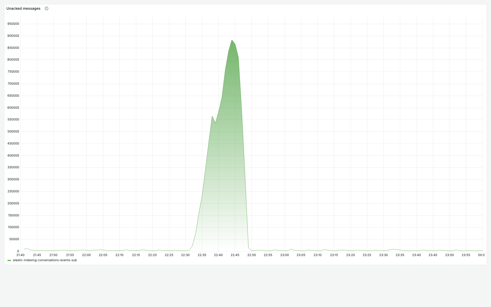
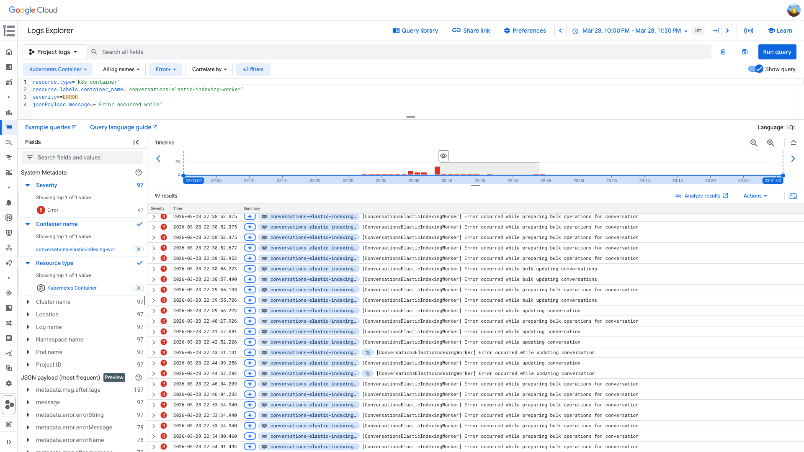
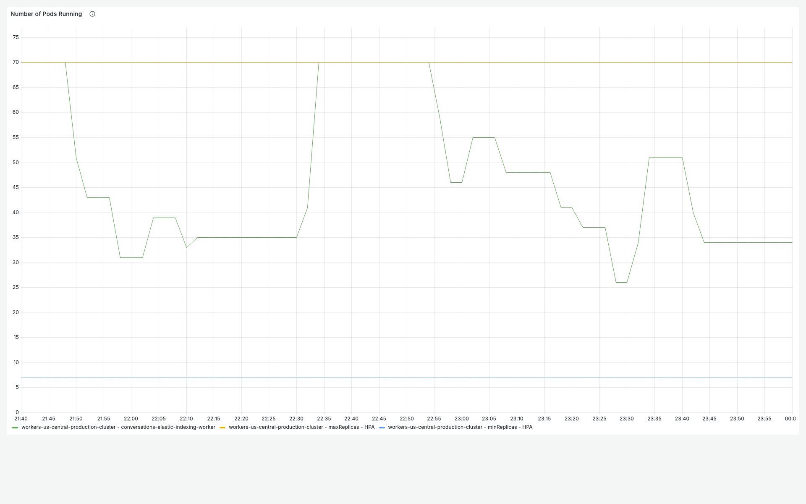
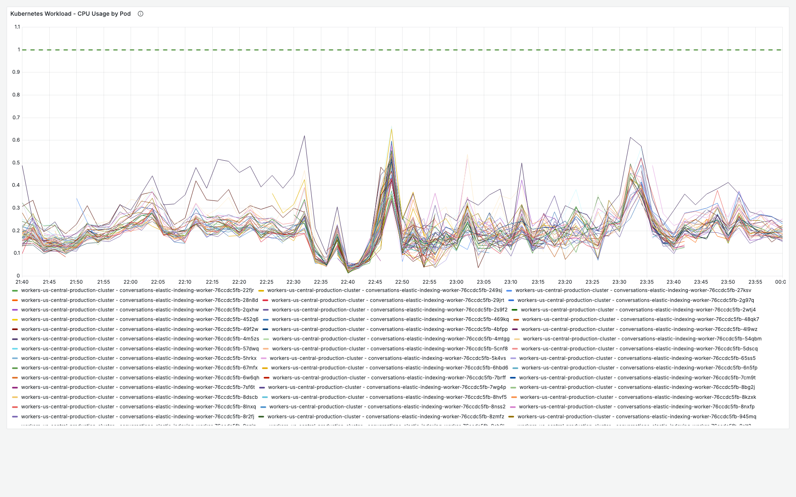

# PubSub Unacked Messages 250k — elastic-indexing-conversations — 2026-03-28

**Author:** Himanshu Bhutani | **Status:** Auto-resolved (acknowledged by Balaji)

## Summary

| Field | Value |
|-------|-------|
| Alert | #113922 — Pubsub Unacked Messages above 250k |
| Service | `elastic-indexing-conversations-events-sub` (worker: `conversations-elastic-indexing-worker`) |
| Fired | 22:48 IST (17:18 UTC), 2026-03-28 |
| Duration | ~17 minutes (22:32–22:49 IST) |
| Peak backlog | 883,680 undelivered messages at 22:44 IST |
| Impact | Conversation search index updates delayed ~17 min; search results temporarily stale |

## Root Cause

**Elasticsearch connectivity issues** (socket hang ups and bulk operation errors against the conversation index ELB) caused the worker's processing throughput to drop sharply. Publish rate remained normal (~300–490k msgs/5min), but the ack rate fell from ~285–370k/5min to ~85k/5min, accumulating an 883k-message backlog in ~12 minutes. Workers self-recovered when ES stabilized, draining the backlog in ~3 minutes via a 1.25M ack burst.

**Confidence:** Medium — Grafana metrics and GCP logs agree on the pattern (ack drop + ES errors + self-recovery), but the exact Elasticsearch failure trigger (ELB issue, ES cluster load, network transient) is not identified.

## Proof

<details>
<summary>[Cloud Monitoring] Ack rate dropped to 85k/5min at 22:38 IST (normal: 285–370k)</summary>

> **Verify:** The 5-minute ack count bucket at 22:38 IST shows 85,166 — a 70–77% drop from the normal range. The next bucket at 22:43 IST shows 1,250,254 — a massive catch-up burst.

| Time (IST) | Ack count (5min) | Notes |
|---|---|---|
| 22:23 | ~285k–370k | Normal range |
| 22:38 | 85,166 | **Processing slowdown** |
| 22:43 | 1,250,254 | **Catch-up burst** |
| 22:48+ | ~285k–370k | Recovered |

[Open Worker Detailed View — Ack Count](https://prod.grafana.leadconnectorhq.com/d/a04e5483-eb8c-47ef-8198-30147926964c/worker-detailed-view?orgId=1&var-subscriptionId=elastic-indexing-conversations-events-sub&from=1774714200000&to=1774722600000&viewPanel=40)
</details>

<details>
<summary>[Cloud Monitoring] Undelivered peaked at 883,680 at 22:44 IST, drained by 22:49</summary>

> **Verify:** `num_undelivered_messages` rose from ~3k baseline at 22:32 IST to 883,680 at 22:44 IST, then collapsed to 14k by 22:49 IST.

| Time (IST) | Undelivered | Phase |
|---|---|---|
| 22:29 | ~3,269 | Baseline |
| 22:32 | 21,050 | **Growth starts** |
| 22:33 | 72,852 | Rapid climb |
| 22:44 | 883,680 | **Peak** |
| 22:46 | 811,513 | Alert value |
| 22:47 | 584,262 | Draining |
| 22:49 | 14,682 | **Cleared** |


[Open Worker Detailed View — Unacked](https://prod.grafana.leadconnectorhq.com/d/a04e5483-eb8c-47ef-8198-30147926964c/worker-detailed-view?orgId=1&var-subscriptionId=elastic-indexing-conversations-events-sub&from=1774714200000&to=1774722600000&viewPanel=6)
</details>

<details>
<summary>[GCP Logs] ES bulk operation errors at 22:53–22:54 IST (socket hang up, Request error retrying)</summary>

> **Verify:** `conversations-elastic-indexing-worker` ERROR logs show "Error occurred while preparing bulk operations for conversation" and "socket hang up" against the conversation index ELB.

```
resource.type="k8s_container"
resource.labels.container_name="conversations-elastic-indexing-worker"
severity>=ERROR
jsonPayload.message=~"Error occurred while"
```

Sample entries:
- `17:23:34 UTC`: `[ConversationsElasticIndexingWorker] Error occurred while preparing bulk operations for conversation`
- `17:23–17:24 UTC`: `GET https://internal-migrationassistant-cnvsn-prod-*.elb.amazonaws.com/conversation/_doc/<id> => socket hang up`
- `17:23–17:24 UTC`: `Error: Request error, retrying`


[Open in Log Explorer](https://console.cloud.google.com/logs/query;query=resource.type%3D%22k8s_container%22%0Aresource.labels.container_name%3D%22conversations-elastic-indexing-worker%22%0Aseverity%3E%3DERROR%0AjsonPayload.message%3D~%22Error%20occurred%20while%22;timeRange=2026-03-28T16%3A30%3A00Z%2F2026-03-28T18%3A00%3A00Z?project=highlevel-backend)
</details>

<details>
<summary>[Grafana] No pod restarts; HPA scaled 25→75 pods; CPU dipped then surged</summary>

> **Verify:** Pod count oscillated between 25 and 75 during the incident. CPU dropped to ~2.87 cores at 22:43 IST (when processing stalled) then surged to ~23.6 cores at 22:49 IST (catch-up drain).



[Open App Detailed View](https://prod.grafana.leadconnectorhq.com/d/a4859d4a-1e0a-4ae3-b9b2-d04d366cf29b/app-detailed-view?orgId=1&var-container=conversations-elastic-indexing-worker&var-cluster=workers-us-central-production-cluster&from=1774714200000&to=1774722600000)
</details>

<details>
<summary>[Cloud Monitoring] Publish rate normal — no traffic surge</summary>

> **Verify:** Topic `elastic-indexing-conversations-events` publish rate stayed in the 290k–491k msgs/5min range. Highest bucket: 491,204 at 22:33 IST — moderately above normal, not a dramatic surge.

This rules out traffic surge as the primary cause. The backlog was caused by **consumer-side throughput drop**, not publisher-side volume increase.
</details>

## What Happened

1. **~22:32 IST** — Worker ack rate began dropping as Elasticsearch connectivity degraded (socket hang ups to conversation index ELB).
2. **22:32–22:44 IST** — Undelivered messages climbed from 3k to 883k as publish rate (~300–490k/5min) exceeded the reduced processing rate (~85k/5min).
3. **~22:44 IST** — ES connectivity recovered; workers began rapid catch-up processing.
4. **22:49 IST** — Backlog cleared to 14k. Workers processed 1.25M messages in a single 5-minute bucket.

## Action Items

| Priority | Action | Owner |
|----------|--------|-------|
| Low | Monitor ES ELB health independently — add alerting on socket hang up rate for the conversation index ELB | CRM Conversations |
| Low | Consider circuit breaker or exponential backoff for ES bulk operations to fail fast and release PubSub flow control slots | CRM Conversations |

## Links

- [Verbose report](report-verbose.md)
- [Worker Detailed View](https://prod.grafana.leadconnectorhq.com/d/a04e5483-eb8c-47ef-8198-30147926964c/worker-detailed-view?orgId=1&var-subscriptionId=elastic-indexing-conversations-events-sub&from=1774714200000&to=1774722600000)
- [App Detailed View](https://prod.grafana.leadconnectorhq.com/d/a4859d4a-1e0a-4ae3-b9b2-d04d366cf29b/app-detailed-view?orgId=1&var-container=conversations-elastic-indexing-worker&var-cluster=workers-us-central-production-cluster&from=1774714200000&to=1774722600000)
- [GCP Log Explorer](https://console.cloud.google.com/logs/query;query=resource.type%3D%22k8s_container%22%0Aresource.labels.container_name%3D%22conversations-elastic-indexing-worker%22%0Aseverity%3E%3DERROR%0AjsonPayload.message%3D~%22Error%20occurred%20while%22;timeRange=2026-03-28T16%3A30%3A00Z%2F2026-03-28T18%3A00%3A00Z?project=highlevel-backend)
- [GCP PubSub Console](https://console.cloud.google.com/cloudpubsub/subscription/detail/elastic-indexing-conversations-events-sub?project=highlevel-backend)
