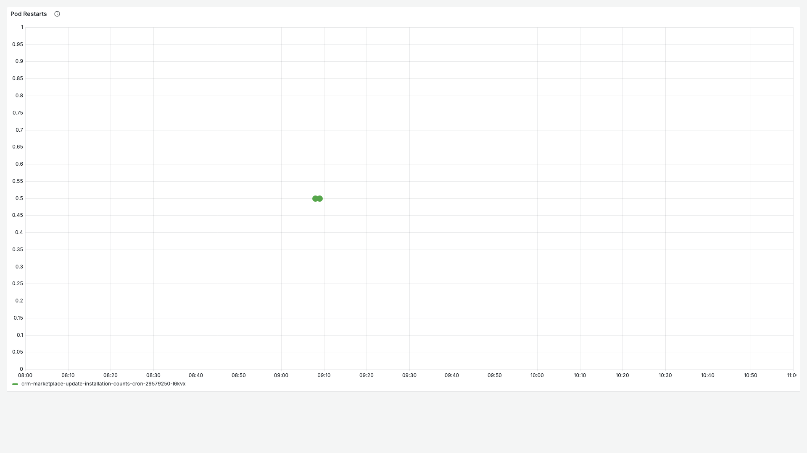
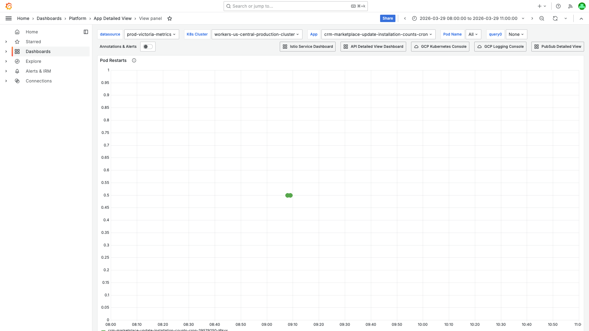
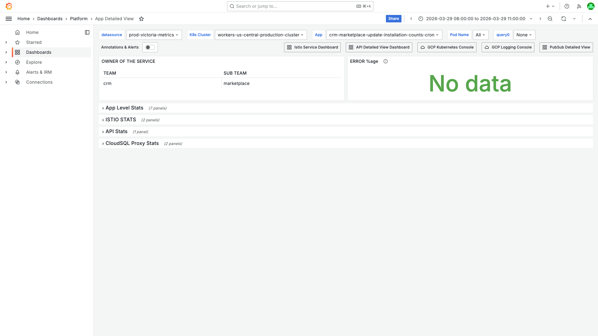
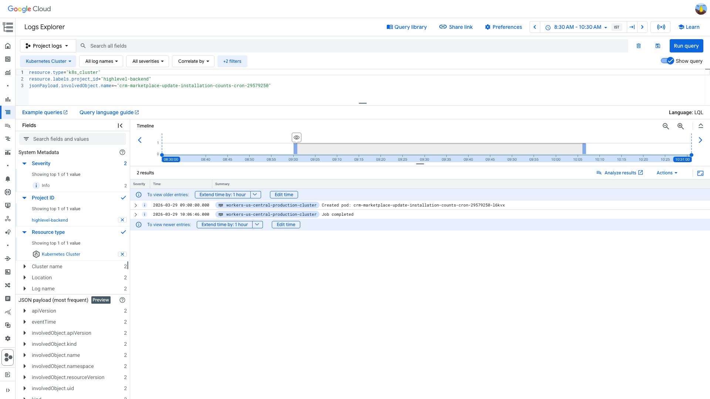
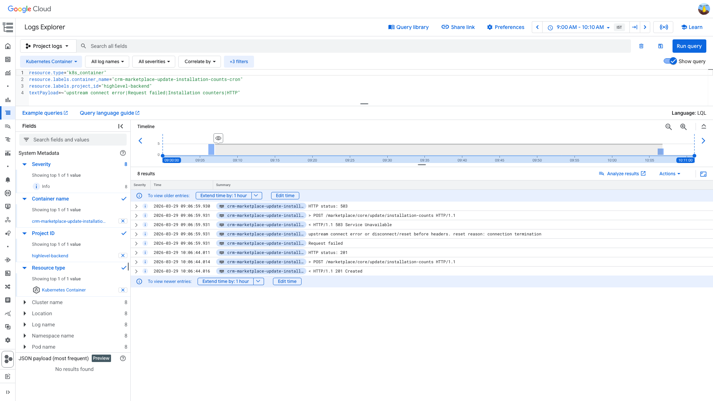

# PodRestartsAboveThreshold Investigation — crm-marketplace-update-installation-counts-cron — 2026-03-29

**Author:** Himanshu Bhutani
**Generated:** 2026-03-29 14:45 IST

---

## 1. Alert Summary

| Field | Value |
|-------|-------|
| Alert type | PodRestartsAboveThreshold (#113953) |
| Workload | crm-marketplace-update-installation-counts-cron-29579250 |
| Container | crm-marketplace-update-installation-counts-cron |
| Cluster | workers-us-central-production-cluster |
| Time | 09:09 IST (03:39 UTC), 2026-03-29 |
| Threshold | 1 |
| Current value | 1 |
| Source channel | #alerts-crm (C0315RRNH1B) |
| Grafana OnCall | [Alert group IG45WUL3SR8UA](https://prod.grafana.leadconnectorhq.com/a/grafana-oncall-app/alert-groups/IG45WUL3SR8UA) |

---

## 2. Investigation Findings

### Evidence: Grafana — Pod Restarts

<details>
<summary>Pod Restarts panel — single restart at ~09:07 IST, count = 1</summary>

> **What to look for:** A single green dot at ~09:05 IST on the Pod Restarts panel. The Y-axis goes from 0 to 1, confirming exactly one restart. The pod name in the legend is `crm-marketplace-update-installation-counts-cron-29579250-l6kvx`.



**Context (filters + time range):**


[Open in Grafana](https://prod.grafana.leadconnectorhq.com/d/a4859d4a-1e0a-4ae3-b9b2-d04d366cf29b/app-detailed-view?orgId=1&var-datasource=ber8nnhvgsjy8f&var-cluster=workers-us-central-production-cluster&var-container=crm-marketplace-update-installation-counts-cron&from=1774751400000&to=1774762200000&viewPanel=36)
</details>

<details>
<summary>App Detailed View — dashboard context showing team ownership and collapsed rows</summary>

> **What to look for:** The dashboard shows the correct container filter (`crm-marketplace-update-installation-counts-cron`), cluster (`workers-us-central-production-cluster`), and time range (2026-03-29 08:00-11:00 IST). Team ownership is `crm` / `marketplace`. Rows are collapsed by default — this is a CronJob, so API Stats and ERROR %age show "No data" (expected).



[Open in Grafana](https://prod.grafana.leadconnectorhq.com/d/a4859d4a-1e0a-4ae3-b9b2-d04d366cf29b/app-detailed-view?orgId=1&var-datasource=ber8nnhvgsjy8f&var-cluster=workers-us-central-production-cluster&var-container=crm-marketplace-update-installation-counts-cron&from=1774751400000&to=1774762200000)
</details>

### Evidence: GCP Logs — K8s Cluster Events

<details>
<summary>K8s cluster events — Job Created (09:00 IST) + Completed (10:06 IST)</summary>

> **What to look for:** Two events in the log results. First: "Created pod: crm-marketplace-update-installation-counts-cron-29579250-l6kvx" at 2026-03-29 09:00:00 IST with `reason=SuccessfulCreate`. Second: "Job completed" at 2026-03-29 10:06:46 IST with `reason=Completed`. This confirms the Job reached successful completion despite the container restart.



```
resource.type="k8s_cluster"
resource.labels.project_id="highlevel-backend"
jsonPayload.involvedObject.name=~"crm-marketplace-update-installation-counts-cron-29579250"
```

[Open in Log Explorer](https://console.cloud.google.com/logs/query;query=resource.type%3D%22k8s_cluster%22%0Aresource.labels.project_id%3D%22highlevel-backend%22%0AjsonPayload.involvedObject.name%3D~%22crm-marketplace-update-installation-counts-cron-29579250%22;timeRange=2026-03-29T03%3A00%3A00Z%2F2026-03-29T05%3A00%3A00Z?project=highlevel-backend)
</details>

### Evidence: GCP Logs — Container Application Logs

<details>
<summary>Container logs — First attempt 503 (09:07 IST), second attempt 201 (10:06 IST)</summary>

> **What to look for:** Two clusters of log entries. **First cluster at 09:06:59 IST:** "HTTP status: 503", the POST request line, "HTTP/1.1 503 Service Unavailable", "upstream connect error or disconnect/reset before headers. reset reason: connection termination", and "Request failed" — this is the first attempt failing due to an Envoy connection reset. **Second cluster at 10:06:44 IST:** "HTTP status: 201", the POST request line, and "HTTP/1.1 201 Created" — this is the second attempt succeeding after ~60 minutes of processing.



```
resource.type="k8s_container"
resource.labels.container_name="crm-marketplace-update-installation-counts-cron"
resource.labels.project_id="highlevel-backend"
textPayload=~"upstream connect error|Request failed|Installation counters|HTTP"
```

[Open in Log Explorer](https://console.cloud.google.com/logs/query;query=resource.type%3D%22k8s_container%22%0Aresource.labels.container_name%3D%22crm-marketplace-update-installation-counts-cron%22%0Aresource.labels.project_id%3D%22highlevel-backend%22%0AtextPayload%3D~%22upstream%20connect%20error%7CRequest%20failed%7CInstallation%20counters%7CHTTP%22;timeRange=2026-03-29T03%3A30%3A00Z%2F2026-03-29T04%3A40%3A00Z?project=highlevel-backend)
</details>

### Evidence: Slack — Alert Thread

<details>
<summary>Alert thread — 25 messages, Smitha asked Ved to validate OOM vs timeout theory</summary>

> **What to look for:** Thread on alert #113953. 25 messages, mostly Grafana OnCall escalations. Key human message from Smitha Shastri: "can you increase the memory as suggested by Reaper and check if it's an actual OOM and not a timeout as we thought?" — this contrasts the prior belief (timeout) with a new OOM theory. No reply from Ved in the thread.

Alert thread: [#alerts-crm permalink](https://gohighlevel.slack.com/archives/C0315RRNH1B/p1774755552547879)

Alert Debug Bot suggested: OOM from loading all installations in memory. Recommended paged/streaming processing, code review of `apps/crm-marketplace/src/crons/update-installation-counts.cron.ts`, and short-term memory limit increase to test OOM theory.
</details>

### Evidence: Alert Correlator — Cross-Channel Search

<details>
<summary>Alert Correlator — 0 correlated alerts, 8 occurrences in 12 days, no deployments</summary>

> **What to look for:** This alert is completely isolated — no other alerts fired within ±15 min across #alerts-crm, #alerts-crm-conversations, #alerts-platform, or #alerts-database. No deployment of this cron in the last 2 days. This is a recurring pattern: 8 occurrences in 12 days (Mar 18-29), 41 total messages since Feb 21.

| Check | Result |
|-------|--------|
| Correlated alerts (±15 min) | 0 — completely isolated |
| Alert frequency (12 days) | 8 occurrences (Mar 18, 19, 20, 21, 24, 25, 28, 29) |
| Total since Feb 21 | 41+ messages in #alerts-crm |
| Deployment (last 2h) | None |
| Past investigations | 2 (Mar 15, Mar 16) — both confirmed same pattern |
</details>

---

## 3. Cross-Validation

| Signal | Source | Agrees? |
|--------|--------|---------|
| Single restart at ~09:07 IST | Grafana Pod Restarts | ✅ |
| ContainerDied at 03:37:00 UTC (09:07 IST) | GCP kubelet logs | ✅ |
| Job Completed at 04:36:46 UTC (10:06 IST) | GCP K8s cluster events | ✅ |
| First attempt: 503 / Envoy connection reset | GCP container logs | ✅ |
| Second attempt: HTTP 201 success | GCP container logs | ✅ |
| 0 correlated alerts | Slack cross-channel search | ✅ |
| No recent deployment | Slack deployment search | ✅ |
| Known root cause pattern match | known-root-causes.md | ✅ |
| 2 prior investigations (Mar 15, 16) | Investigations DB | ✅ |

**Confidence:** HIGH — All 9 signals agree. This matches the documented "CronJob Container Timeout → Restart (false positive)" pattern with identical behavior across 41+ occurrences.

---

## 4. Root Cause

**Known false positive — CronJob container timeout → restart.**

The CronJob `crm-marketplace-update-installation-counts-cron` runs daily at ~09:00 IST. It launches a container that makes an HTTP POST to `/marketplace/core/update/installation-counts`, which triggers a heavy MongoDB aggregation. The underlying API takes ~60 minutes to complete.

On 2026-03-29, the first container attempt received an HTTP 503 with "upstream connect error or disconnect/reset before headers. reset reason: connection termination" after ~7 minutes. This is an Envoy/Istio sidecar terminating the upstream connection. K8s restarted the container due to `restartPolicy: OnFailure`. The second attempt completed successfully in ~60 minutes, returning HTTP 201 with "Installation counters updated successfully."

### What Happened

1. **09:00 IST** — CronJob pod `crm-marketplace-update-installation-counts-cron-29579250-l6kvx` created on `workers-us-central-production-cluster`.
2. **09:07 IST** — First container received HTTP 503 (Envoy connection termination: "upstream connect error or disconnect/reset before headers"). Container died.
3. **09:07 IST** — K8s restarted the container immediately (`restartPolicy: OnFailure`). Second attempt began.
4. **09:09 IST** — `PodRestartsAboveThreshold` alert fired (restart count reached 1, threshold = 1).
5. **10:06 IST** — Second attempt completed: HTTP 201, "Installation counters updated successfully". Job reached Completed status.

<details>
<summary>Detailed timeline — full event log</summary>

| Time (IST) | Source | Event |
|---|---|---|
| 09:00:00 | K8s cluster | SuccessfulCreate: Created pod crm-marketplace-update-installation-counts-cron-29579250-l6kvx |
| 09:00:01-04 | Kubelet | Pulling → Pulled → Created → Started (first container attempt) |
| 09:06:59.930 | Container log | "HTTP status: 503" |
| 09:06:59.931 | Container log | "> POST /marketplace/core/update/installation-counts HTTP/1.1" |
| 09:06:59.931 | Container log | "< HTTP/1.1 503 Service Unavailable" |
| 09:06:59.931 | Container log | "upstream connect error or disconnect/reset before headers. reset reason: connection termination" |
| 09:06:59.931 | Container log | "Request failed" |
| 09:07:00.274 | Kubelet PLEG | ContainerDied (container 646f5670…) |
| 09:07:01.290 | Kubelet PLEG | ContainerStarted (new container c2919e50…, second attempt) |
| 09:07:45 | Grafana scrape | kube_pod_container_status_restarts_total → 1 |
| 09:09:12 | Grafana OnCall | PodRestartsAboveThreshold alert fired (#113953) |
| 10:06:44.011 | Container log | "HTTP status: 201" |
| 10:06:44.014 | Container log | "> POST /marketplace/core/update/installation-counts HTTP/1.1" |
| 10:06:44.016 | Container log | "< HTTP/1.1 201 Created" |
| 10:06:44.016 | Container log (JSON) | "Installation counters updated successfully" (success: true) |
| 10:06:44.476 | Kubelet PLEG | ContainerDied (clean exit after success) |
| 10:06:46 | K8s cluster | Completed: Job completed |

</details>

---

## 5. Probable Noise

<details>
<summary>Probable noise — transient errors during disruption (not root cause)</summary>

| Time | Pattern | Why it's noise |
|------|---------|----------------|
| 09:07 IST | Metric registration errors (`PLATFORM_CORE_OBSERVABILITY`) | Expected post-restart behavior from observability SDK re-registering Prometheus metrics |

No other noise patterns — this CronJob generates minimal logs.
</details>

---

## 6. Action Items

### For the alert

| Priority | Action | Owner | Rationale |
|----------|--------|-------|-----------|
| Medium | Optimize `/marketplace/core/update/installation-counts` API to reduce 60-min response time | Marketplace team | Batch/stream processing instead of loading all installations in memory. Alert Debug Bot identified this as the code path in `apps/crm-marketplace/src/crons/update-installation-counts.cron.ts` |
| Medium | Increase Envoy/Istio upstream timeout for this CronJob | Marketplace team | First attempt fails at ~7 min due to Envoy connection termination (503). The API needs ~60 min. Either increase the timeout or bypass Envoy for internal calls |
| Low | Suppress PodRestartsAboveThreshold for CronJob workloads where threshold = 1 | Platform team | A single restart is expected behavior for CronJobs with `restartPolicy: OnFailure`. Consider raising threshold to 2 or excluding CronJob workloads |
| Low | Validate OOM theory — increase memory limit and monitor | Marketplace team (Smitha → Ved) | Smitha's request in the alert thread. Even if the proximate cause is Envoy timeout, OOM may be a contributing factor on some runs |

### Separate observations

| Item | Details |
|------|---------|
| API response time (~60 min) | The POST to `/marketplace/core/update/installation-counts` consistently takes 27-60 min across multiple occurrences (27.5 min on Mar 15, 36.6 min on Mar 14, 59.7 min on Mar 29). This suggests the API's processing time is growing over time as installation data increases |

---

## 7. Deployment Details

| Setting | Value |
|---------|-------|
| Workload type | CronJob |
| Schedule | Daily ~03:30 UTC (09:00 IST) |
| restartPolicy | OnFailure |
| Cluster | workers-us-central-production-cluster |
| Node pool | gke-workers-us-central-jobs-node-pool |
| Team | CRM / Marketplace |

---

## 8. Alert Frequency

This alert is a **known recurring false positive**:

| Period | Occurrences |
|--------|-------------|
| Last 12 days (Mar 18-29) | 8 |
| Since Feb 21 | 41+ messages in #alerts-crm |
| Prior investigations | Mar 15 (completed), Mar 16 (completed) |

Previous investigations confirmed identical behavior: first container killed by timeout, second attempt completes, Job reaches Completed status. No action was taken to fix the underlying issue.
