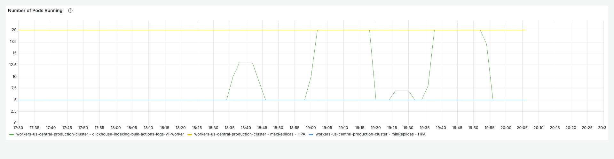
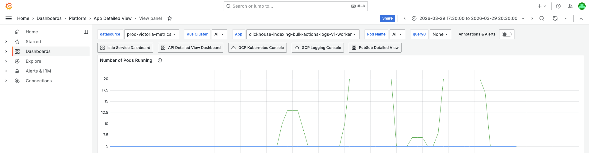
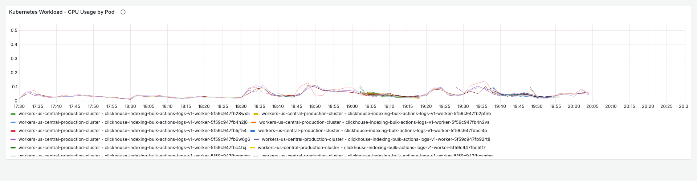
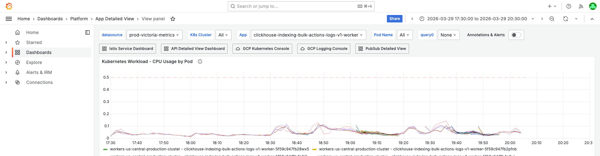
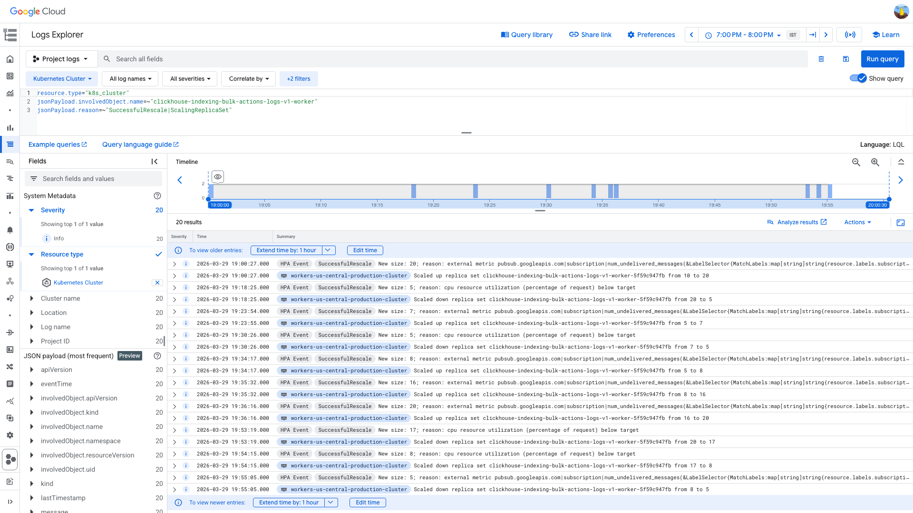

# PubSub Unacked Messages — clickhouse-indexing-bulk-actions-logs-v1 — 2026-03-29

**Author:** Himanshu Bhutani | **Status:** Self-resolved

## Summary

| Field | Value |
|-------|-------|
| Alert | Pubsub Unacked Messages above 10k (#113980) |
| Service | clickhouse-indexing-bulk-actions-logs-v1-worker |
| Subscription | clickhouse-indexing-bulk-actions-logs-v1-events-sub |
| Fired | 19:10 IST (13:40 UTC) |
| Duration | ~45 min (self-resolved) |
| Peak Backlog | ~832k undelivered messages |
| Impact | ClickHouse indexing for bulk-actions logs delayed ~8 min at peak; no user-facing impact |

## Root Cause

**HPA thrashing due to competing scaling metrics** — the HPA scales up on `num_undelivered_messages` (backlog) but scales down on CPU utilization. Since this worker is I/O-bound (low CPU even at full load), the HPA rapidly oscillates between 5 and 20 pods. During scale-down, pods are terminated while still processing messages, causing `Subscriber closed` errors and failed acks that temporarily re-inflate the backlog. This is a **recurring pattern** — same root cause was identified 2 days ago.

## Proof

<details>
<summary>[Grafana] HPA pod count oscillated 5→20→5 repeatedly during the incident</summary>

> **Verify:** The green line shows pod count jumping from 5 to 20 (maxReplicas) and back to 5 multiple times within the investigation window. The orange line is maxReplicas=20.



**Context (filters + time range):**



[Open in Grafana](https://prod.grafana.leadconnectorhq.com/d/a4859d4a-1e0a-4ae3-b9b2-d04d366cf29b/app-detailed-view?orgId=1&var-container=clickhouse-indexing-bulk-actions-logs-v1-worker&from=1774785600000&to=1774796400000&viewPanel=32)
</details>

<details>
<summary>[Grafana] CPU stayed at ~0.1-0.2 cores (36% of 0.5 request) — I/O-bound, not CPU-bound</summary>

> **Verify:** All pod CPU lines stay well below 0.5 cores throughout. This low CPU is what triggers the HPA to scale DOWN — even while messages are still being processed.



**Context (filters + time range):**



[Open in Grafana](https://prod.grafana.leadconnectorhq.com/d/a4859d4a-1e0a-4ae3-b9b2-d04d366cf29b/app-detailed-view?orgId=1&var-container=clickhouse-indexing-bulk-actions-logs-v1-worker&from=1774785600000&to=1774796400000&viewPanel=16)
</details>

<details>
<summary>[GCP] HPA scaled 5→8→16→20 (up) then 20→17→8→5 (down) within minutes</summary>

> **Verify:** 20 HPA events visible. Look for the "cpu resource utilization below target" reason on the scale-down events — this is the competing metric that causes premature scale-down while backlog is still high.



```
resource.type="k8s_cluster"
jsonPayload.involvedObject.name=~"clickhouse-indexing-bulk-actions-logs-v1-worker"
jsonPayload.reason=~"SuccessfulRescale|ScalingReplicaSet"
```

[Open in GCP Log Explorer](https://console.cloud.google.com/logs/query;query=resource.type%3D%22k8s_cluster%22%0AjsonPayload.involvedObject.name%3D~%22clickhouse-indexing-bulk-actions-logs-v1-worker%22%0AjsonPayload.reason%3D~%22SuccessfulRescale%7CScalingReplicaSet%22;timeRange=2026-03-29T13%3A30%3A00Z%2F2026-03-29T14%3A30%3A00Z?project=highlevel-backend)
</details>

<details>
<summary>[GCP] Burst of "Subscriber closed" errors at 19:55:06 IST — exactly when HPA scaled 8→5</summary>

> **Verify:** Multiple `unhandledRejectionError: INVALID : Subscriber closed` at 14:25:06 UTC (19:55:06 IST), occurring 1 second after HPA scaled from 8 to 5. This confirms pods were terminated while batch ack was in-flight.

```
# 5 of 50+ identical entries at 14:25:06.439Z
2026-03-29T14:25:06.440Z | unhandledRejectionError: INVALID : Subscriber closed (at AckQueue.add → Subscriber.ack)
2026-03-29T14:25:06.439Z | unhandledRejectionError: INVALID : Subscriber closed (at AckQueue.add → Subscriber.ack)
```

GCP query:
```
resource.type="k8s_container"
resource.labels.container_name="clickhouse-indexing-bulk-actions-logs-v1-worker"
jsonPayload.message=~"Subscriber closed"
severity>=ERROR
```
</details>

<details>
<summary>[Cloud Monitoring] Ack rate never dropped to zero — workers processed throughout</summary>

> **Verify:** Ack count per minute stayed between 7k-149k throughout the incident. Sent/ack ratio ~1.0 (9.08M sent vs 9.05M ack). Zero nacks. The backlog was caused by publish bursts exceeding momentary capacity, not by processing failures.

| Metric | Value |
|--------|-------|
| Peak undelivered | ~832k @ 13:33 UTC |
| Second wave | ~202k @ 14:14 UTC (alert value) |
| Oldest unacked age | ~504s (~8.4 min) peak |
| Nack count | Zero |
| Sent/ack ratio | ~1.0x (no retry amplification) |
| Memory | 193MB peak / 1126MB limit (17%) |
| CPU | 0.178 cores peak / 0.5 request (36%) |
</details>

## Action Items

| Priority | Action | Owner |
|----------|--------|-------|
| **High** | Fix HPA scale-down stabilization — increase `scaleDown.stabilizationWindowSeconds` to 300-600s to prevent premature scale-down while backlog is still draining | CRM-bulk-actions team |
| **High** | Remove or de-prioritize CPU metric from HPA — this worker is I/O-bound, CPU will always be low and trigger unwanted scale-down | CRM-bulk-actions team |
| **Medium** | Add graceful shutdown handler — drain PubSub subscriber before closing (stop pulling → wait for in-flight acks → close) | CRM-bulk-actions team |
| **Low** | Increase `minReplicas` to 8-10 if this traffic pattern recurs daily | CRM-bulk-actions team |

## Links

- [Verbose report](report-verbose.md)
- [Grafana App Detailed View](https://prod.grafana.leadconnectorhq.com/d/a4859d4a-1e0a-4ae3-b9b2-d04d366cf29b/app-detailed-view?orgId=1&var-container=clickhouse-indexing-bulk-actions-logs-v1-worker&from=1774785600000&to=1774796400000)
- [GCP Subscription Console](https://console.cloud.google.com/cloudpubsub/subscription/detail/clickhouse-indexing-bulk-actions-logs-v1-events-sub?project=highlevel-backend)
