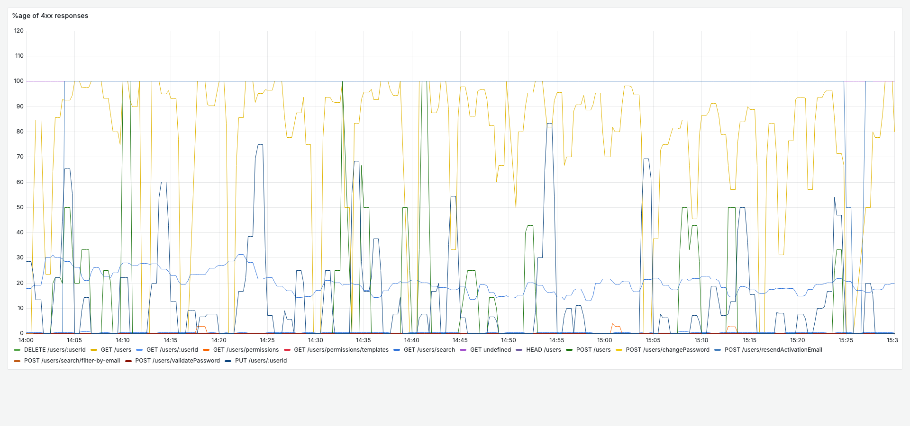
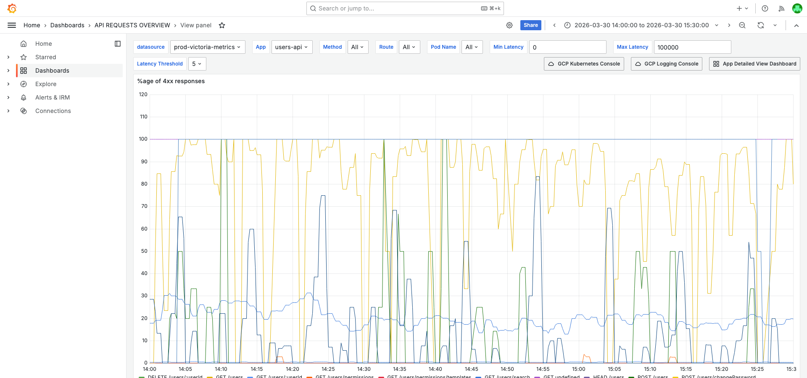
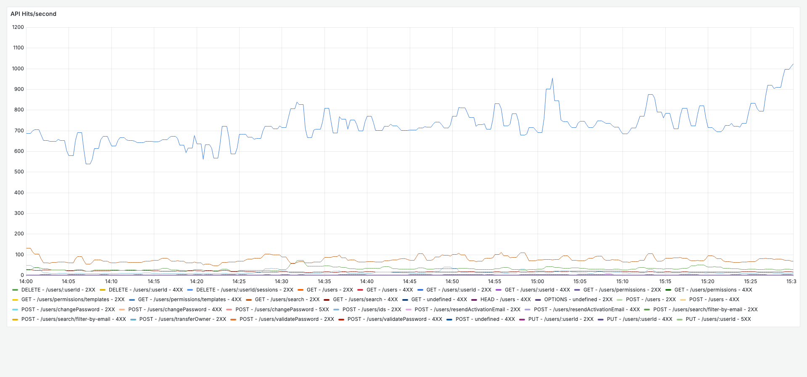
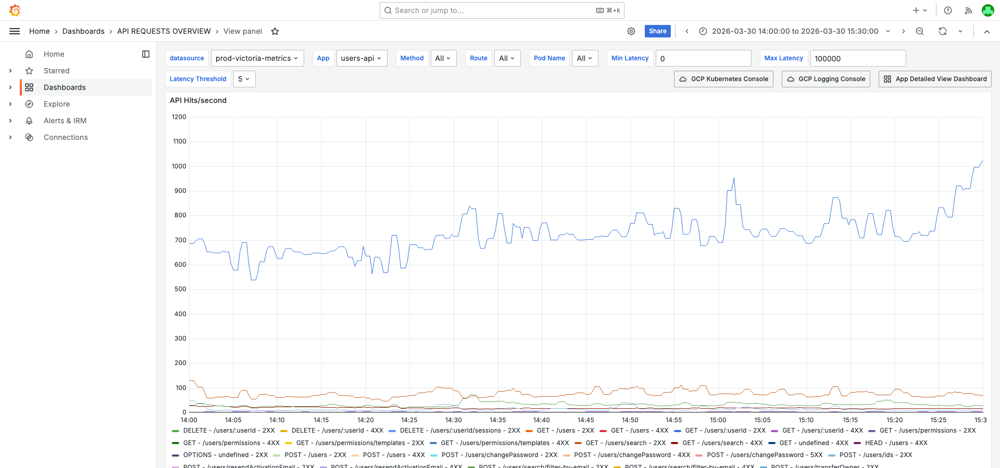
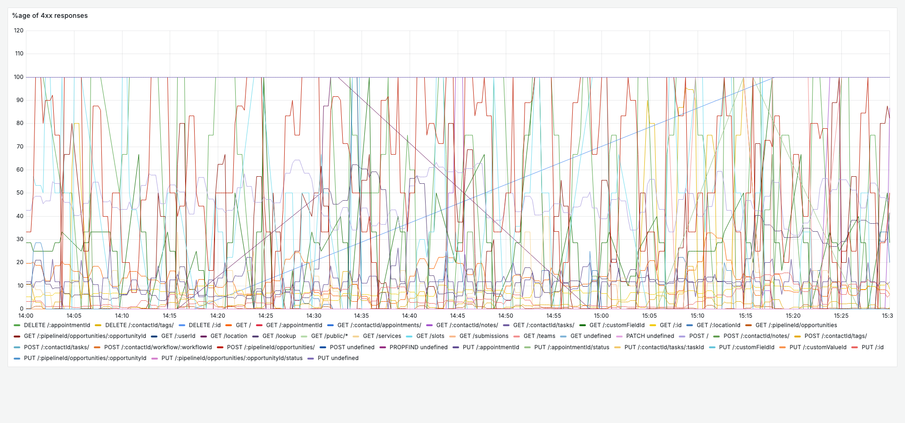
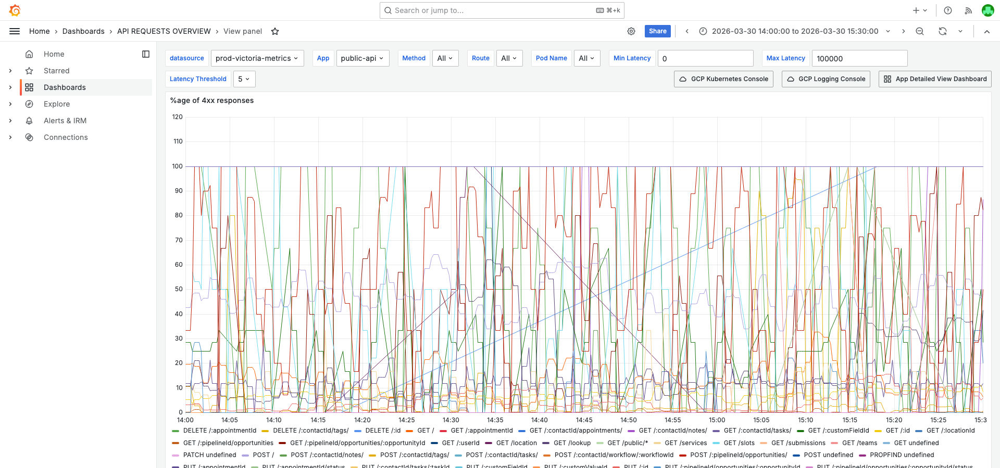
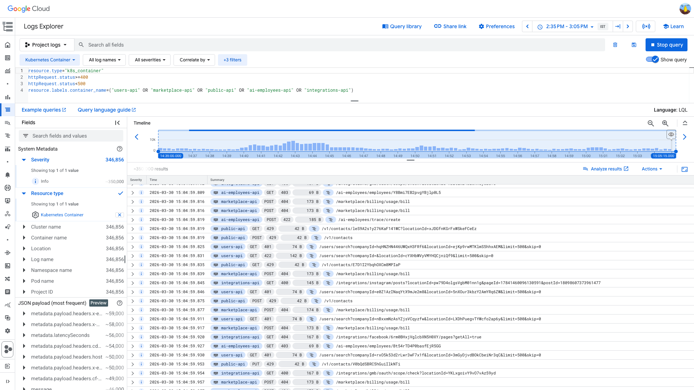
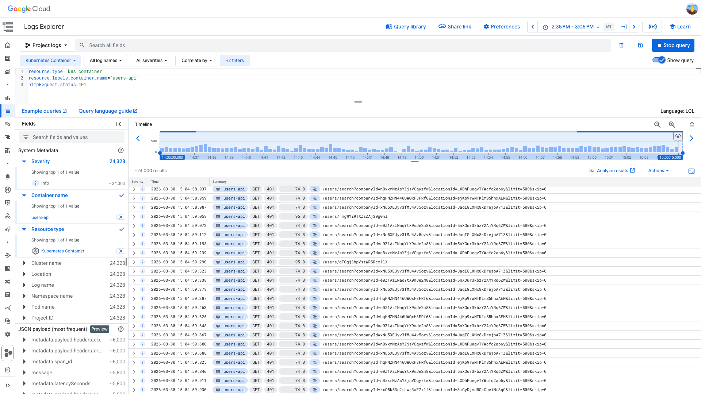
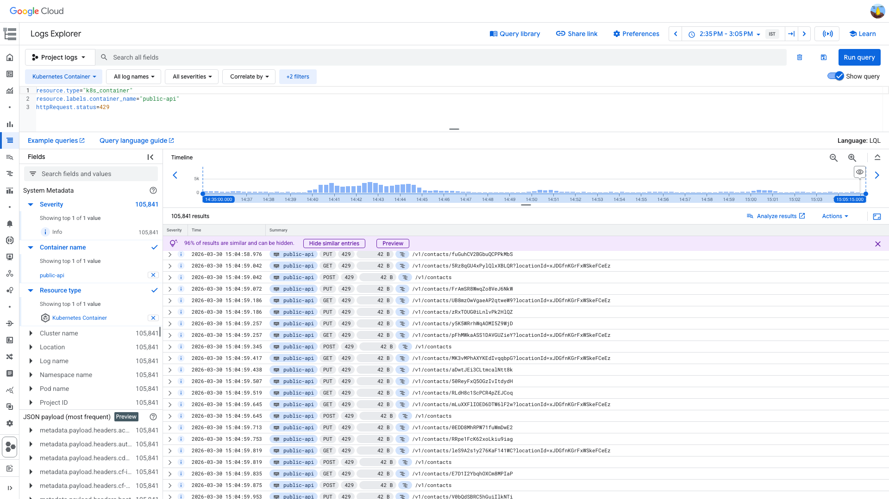

# 4XXPercentagePerAPI Burst Investigation — 2026-03-30

**Author:** Himanshu Bhutani
**Generated:** 2026-03-30 16:00 IST

---

## 1. Alert Summary

| Field | Value |
|-------|-------|
| Alert type | 4XXPercentagePerAPI |
| Firings | 20 alerts in 24 minutes |
| Source channel | #alerts-crm (C0315RRNH1B) |
| Time | 14:37–15:01 IST (09:07–09:31 UTC) |
| Severity | Per-API 4XX percentage threshold exceeded |
| Resolution | Resolved by OnCall operator (Ganesh / valluru.reddy) |

### Affected Services (24 distinct containers)

| Container | Alert Route Team | Primary 4XX Code |
|-----------|-----------------|-------------------|
| cdp-core-api | CRM-cdp | Mixed |
| public-api | CRM-marketplace | 429, 404 |
| opportunities-pipelines-get-api | CRM-opportunities | 401 |
| ai-employees-api | CRM-conversations-ai | 403 |
| ai-employees-initiate-api | CRM-conversations-ai | 403 |
| bulk-actions-api | CRM-bulk-actions | Mixed |
| users-get-api | CRM-users-internal | 401 |
| users-api | CRM-users-internal | 401 |
| integrations-api | CRM-integrations | 400, 404 |
| oauth-api-keys-api | CRM-marketplace | 400 |
| oauth-api | CRM-marketplace | Mixed |
| oauth-login-api | CRM-marketplace | Mixed |
| oauth-token-refresh-api | CRM-marketplace | Mixed |
| oauth-users-api | CRM-marketplace | Mixed |
| appengine-crm-marketplace-api | CRM-integrations | Mixed |
| appengine-api | CRM-opportunities | 400, 404 |
| marketplace-api | CRM-marketplace | 404 |
| opportunities-api | CRM-opportunities | Mixed |
| opportunities-search-api | CRM-opportunities | Mixed |
| opportunities-upsert-api | CRM-opportunities | Mixed |
| conversations-ai-api | CRM-conversations-ai | Mixed |
| crm-custom-menus-api | CRM-marketplace | Mixed |
| audit-api | CRM-marketplace | Mixed |
| voice-ai-api | CRM-conversations-ai | Mixed |

---

## 2. Investigation Findings

### Evidence: Grafana — 4XX Rate vs Baseline

The 4XX rate genuinely increased across multiple services. This is not a percentage artifact from reduced traffic — total 2XX traffic was higher on March 30 than March 29.

**Rate comparison (max 5m rate, req/s):**

| Container | Mar 29 4XX | Mar 30 4XX | Change | Mar 29 Total | Mar 30 Total |
|-----------|-----------|-----------|--------|-------------|-------------|
| users-api | ~2.6 | **~34.5** | **13.3x** | ~337 | ~1092 |
| opportunities-pipelines-get-api | ~0.55 | **~31.1** | **56.5x** | ~69 | ~189 |
| marketplace-api | ~36 | **~103** | **2.9x** | ~81 | ~195 |
| public-api | ~77 | **~233** | **3.0x** | ~220 | ~367 |
| integrations-api | ~7.4 | **~19.3** | **2.6x** | ~467 | ~588 |
| ai-employees-api | ~11.6 | **~29.5** | **2.5x** | ~211 | ~417 |
| cdp-core-api | ~0.77 | **~7.3** | **9.5x** | ~27 | ~56 |

Global 4XX rate during the incident: ~1912–2357 req/s (vs ~1520 baseline).
Global 2XX rate: ~34k–40k req/s (vs ~22.6k–36.5k baseline). Traffic was **up**, not down.

<details>
<summary>Evidence: users-api %4XX timeseries</summary>

> **What to look for:** The %4XX chart should show elevation during 14:37–15:01 IST. Peak around ~3.2% versus baseline ~0.8%.



**Context:**


[Open in Grafana](https://prod.grafana.leadconnectorhq.com/d/d2db17da-530c-43f3-9273-c0fd664c591f/api-requests-overview?orgId=1&var-container=users-api&from=1774859400000&to=1774864800000&viewPanel=3)
</details>

<details>
<summary>Evidence: users-api traffic volume (not a traffic drop)</summary>

> **What to look for:** API Hits/second should show normal or elevated traffic during the incident window, confirming this is not a "percentage only" artifact.



**Context:**


[Open in Grafana](https://prod.grafana.leadconnectorhq.com/d/d2db17da-530c-43f3-9273-c0fd664c591f/api-requests-overview?orgId=1&var-container=users-api&from=1774859400000&to=1774864800000&viewPanel=1)
</details>

<details>
<summary>Evidence: public-api %4XX timeseries</summary>

> **What to look for:** public-api has a high baseline 4XX% (~35%) due to rate limiting on external API traffic. During the incident, it reached ~63%.



**Context:**


[Open in Grafana](https://prod.grafana.leadconnectorhq.com/d/d2db17da-530c-43f3-9273-c0fd664c591f/api-requests-overview?orgId=1&var-container=public-api&from=1774859400000&to=1774864800000&viewPanel=3)
</details>

### Evidence: GCP Logs — Status Code Distribution

From a 200-entry sample across 5 services (09:05–09:35 UTC):

| Container | Status | Count | Category |
|-----------|--------|-------|----------|
| marketplace-api | 404 | 56 | Missing endpoints / wrong paths |
| public-api | 429 | 32 | Rate limiting |
| users-api | 401 | 30 | Auth failures |
| ai-employees-api | 403 | 23 | Forbidden / permission denied |
| integrations-api | 400 | 20 | Bad request |
| integrations-api | 404 | 10 | Missing endpoints |
| ai-employees-api | 400 | 8 | Bad request |
| users-api | 422 | 6 | Validation error |
| public-api | 422 | 3 | Validation error |
| others | mixed | 12 | Various |

**Key insight:** No single 4XX status code dominates across services. Each service has its own primary error type, indicating **multiple independent causes**, not a shared infrastructure failure.

<details>
<summary>Evidence: GCP Log Explorer — 4XX distribution</summary>

> **What to look for:** The log histogram should show entries distributed across multiple containers. Pin the `httpRequest.status` and `resource.labels.container_name` fields to see the distribution.



```
resource.type="k8s_container"
httpRequest.status>=400
httpRequest.status<500
resource.labels.container_name=("users-api" OR "marketplace-api" OR "public-api" OR "ai-employees-api" OR "integrations-api")
```

[Open in GCP Log Explorer](https://console.cloud.google.com/logs/query;query=resource.type%3D%22k8s_container%22%0AhttpRequest.status%3E%3D400%0AhttpRequest.status%3C500%0Aresource.labels.container_name%3D%28%22users-api%22%20OR%20%22marketplace-api%22%20OR%20%22public-api%22%20OR%20%22ai-employees-api%22%20OR%20%22integrations-api%22%29;timeRange=2026-03-30T09%3A05%3A00Z%2F2026-03-30T09%3A35%3A00Z?project=highlevel-backend)
</details>

### Evidence: GCP Logs — users-api 401 Auth Failures

users-api returned 401 on `/users/search` from many distinct `companyId`/`locationId` pairs:
- `companyId=rxO5k53d2rLwr3wF7x1f`, `locationId=3mGyDjvdBOkCbeiNr3qC`
- `companyId=nBxxmNzAsYZjsVCqyzfw`, `locationId=LXDhPuegvTYWcfo2ap6y`
- `companyId=e0Z1AzINaqYtX9mJe2m8`, `locationId=5nXOur3kbzY2AmYRq6ZW`
- (and many more distinct pairs)

The guard error `Error in canSearchUsers guard` appears in ERROR logs at ~09:34:58–09:34:59Z. This is **not a single bad caller** — many accounts/locations are receiving auth denials.

<details>
<summary>Evidence: GCP Log Explorer — users-api 401s</summary>

> **What to look for:** Log entries showing 401 on /users/search with different companyId and locationId values in the URL parameters.



```
resource.type="k8s_container"
resource.labels.container_name="users-api"
httpRequest.status=401
```

[Open in GCP Log Explorer](https://console.cloud.google.com/logs/query;query=resource.type%3D%22k8s_container%22%0Aresource.labels.container_name%3D%22users-api%22%0AhttpRequest.status%3D401;timeRange=2026-03-30T09%3A05%3A00Z%2F2026-03-30T09%3A35%3A00Z?project=highlevel-backend)
</details>

### Evidence: GCP Logs — public-api 429 Rate Limits

public-api returned 429 on `/v1/contacts` endpoints. Rate limiting is working as designed on high-volume external API traffic. The `/v1/contactsTEST` path (a non-existent endpoint) was also hit by an automated client (User-Agent: `axios/1.13.2`), contributing to 429 volume.

429s were spread across multiple external-facing APIs:
| Container | 429 Count (sample) |
|-----------|-------------------|
| public-api | 19 |
| contacts-search-external-api | 15 |
| conversations-frontend-external-api | 6 |
| oauth-api | 4 |
| contacts-external-api | 3 |
| contacts-get-external-api | 2 |

<details>
<summary>Evidence: GCP Log Explorer — public-api 429s</summary>

> **What to look for:** Log entries showing 429 on /v1/contacts endpoints — rate limiting activating on external API consumers.



```
resource.type="k8s_container"
resource.labels.container_name="public-api"
httpRequest.status=429
```

[Open in GCP Log Explorer](https://console.cloud.google.com/logs/query;query=resource.type%3D%22k8s_container%22%0Aresource.labels.container_name%3D%22public-api%22%0AhttpRequest.status%3D429;timeRange=2026-03-30T09%3A05%3A00Z%2F2026-03-30T09%3A35%3A00Z?project=highlevel-backend)
</details>

### Evidence: Infrastructure Health

- **No pod restarts:** `kube_pod_container_status_restarts_total` for users-api = 0 during the window
- **No k8s cluster events:** Query for `Unhealthy`, `Killing`, `BackOff` returned 0 results (08:50–09:40 UTC)
- **No database alerts:** `#alerts-database` was empty during the window
- **No platform infrastructure alerts:** `#alerts-platform` showed only a Jenkins node offline (unrelated) and an elastic-indexing log alert (weak correlation)
- **No deployment found:** No deployment activity in Slack channels in the 2 hours before the alert

---

## 3. Cross-Validation

| Signal | Source | Confirms |
|--------|--------|----------|
| 4XX rate increased (not just %) | Grafana Prometheus | ✅ Real 4XX increase |
| Mixed status codes per service | GCP Logs | ✅ Multiple independent causes |
| No pod restarts | Grafana + Prometheus | ✅ Not infrastructure |
| No k8s events | GCP k8s_cluster logs | ✅ Not infrastructure |
| No deployment | Slack search | ✅ Not deployment-triggered |
| No database alerts | #alerts-database | ✅ Not database issue |
| Many distinct accounts in 401s | GCP Logs | ✅ Not single bad caller |
| Traffic higher than baseline | Grafana Prometheus | ✅ Not traffic drop artifact |
| Rate limits on external APIs | GCP Logs | ✅ External consumer pressure |

**Confidence: MEDIUM-HIGH**

Reasoning: Multiple independent sources consistently show this is a convergence of application-level 4XX sources, not a single infrastructure failure. The limitation is that we cannot access the vmalert rule definition to confirm exact thresholds, and the Prometheus metric only exposes aggregate "4XX" status bucket (not individual 401/403/404/429).

---

## 4. Root Cause

**Multiple concurrent application-level 4XX sources** crossed the `4XXPercentagePerAPI` vmalert threshold simultaneously during a period of elevated traffic.

### Causal Chain

There is no single causal chain — this is a **convergence of independent contributors:**

1. **marketplace-api 404s** — integration clients hitting wrong or deprecated endpoints (high baseline, elevated during window)
2. **public-api 429s** — external API consumers exceeding rate limits, including an automated client hitting `/v1/contactsTEST` (non-existent path)
3. **users-api 401s** — auth guard failures on `/users/search` from many distinct accounts; possible token rotation or permission issue
4. **ai-employees-api 403s** — permission denied on AI employee endpoints
5. **integrations-api 400/404s** — bad requests and missing endpoints on integration routes

All five sources independently raised the 4XX percentage for their respective APIs above the alert threshold within the same ~24-minute window.

## What Happened

1. **~14:37 IST** — 4XX percentage for cdp-core-api, public-api, and opportunities crossed the vmalert threshold; first alerts fired.
2. **~14:39 IST** — ai-employees-api, bulk-actions-api, users-get-api, integrations-api, oauth-api-keys-api crossed thresholds; wave of 8 more alerts.
3. **~14:44 IST** — appengine-crm and appengine-api crossed thresholds.
4. **~14:59–15:01 IST** — Second wave: users-api, appengine-api, ai-employees-api, opportunities, marketplace-api all re-triggered or crossed thresholds again.
5. **~15:10 IST** — OnCall operator (Ganesh) began resolving alert groups in Grafana OnCall.

<details>
<summary>Detailed timeline — alert firings</summary>

| Time (IST) | Alert # | Service | Route Team |
|------------|---------|---------|------------|
| 14:37:52 | #114035 | cdp-core-api | CRM-cdp |
| 14:37:55 | #114038 | public-api | CRM-marketplace |
| 14:37:57 | #114040 | opportunities | CRM-opportunities |
| 14:39:36 | #114042 | ai-employees-api | CRM-conversations-ai |
| 14:39:38 | #114044 | ai-employees-api | CRM-conversations-ai |
| 14:39:39 | #114046 | bulk-actions-api | CRM-bulk-actions |
| 14:39:46 | #114053 | users-get-api | CRM-users-internal |
| 14:39:54 | #114061 | integrations-api | CRM-integrations |
| 14:40:02 | #114068 | oauth-api-keys-api | CRM-marketplace |
| 14:44:53 | #114076 | appengine-crm | CRM-integrations |
| 14:44:54 | #114078 | appengine-api | CRM-opportunities |
| 14:59:21 | #114122 | users-api | CRM-users-internal |
| 14:59:22 | #114123 | users-api | CRM-users-internal |
| 15:00:58 | #114132 | appengine-api | CRM-opportunities |
| 15:01:00 | #114135 | ai-employees-api | CRM-conversations-ai |
| 15:01:02 | #114140 | opportunities | CRM-opportunities |
| 15:01:04 | #114142 | ai-employees-api | CRM-conversations-ai |
| 15:01:05 | #114146 | opportunities | CRM-opportunities |
| 15:01:06 | #114147 | ai-employees-api | CRM-conversations-ai |
| 15:01:07 | #114148 | marketplace-api | CRM-marketplace |

</details>

---

## 5. Probable Noise

<details>
<summary>Probable noise — transient errors during the window (not root cause)</summary>

| Pattern | Why it's noise |
|---------|----------------|
| `Error in canSearchUsers guard` on users-api | Expected when auth token is invalid/expired — this IS the 401 source, not a separate issue |
| `Invalid private integration token` on marketplace-api | Normal validation error when tokens are wrong — part of the 400 count |
| `/v1/contactsTEST` 404s on public-api | A client making requests to non-existent endpoint — contributes to 4XX volume but is external client error |
| Grafana OnCall invite thread replies | OnCall automation, not investigation content |

</details>

---

## 6. Action Items

| Priority | Action | Owner | Reasoning |
|----------|--------|-------|-----------|
| **Medium** | Tune `4XXPercentagePerAPI` thresholds per service | Platform / Alert Config | marketplace-api (45-59% baseline) and public-api (35% baseline) have high normal 4XX rates that frequently trigger this alert. Consider service-specific thresholds or excluding 404/429 from the metric. |
| **Medium** | Investigate `/v1/contactsTEST` automated traffic | CRM-marketplace | An axios/1.13.2 client is making repeated requests to this non-existent endpoint, generating 404s that get rate-limited to 429s. Identify and fix the misconfigured integration. |
| **Low** | Review users-api 401 spike pattern | CRM-users-internal | 13x increase in 401s from many distinct accounts. Could be a token rotation event or IAM configuration change. Review guard logic and token validation timing. |
| **Low** | Add per-status-code alerting | Platform / Alert Config | Current metric tracks aggregate "4XX" bucket. Per-code alerting (401 vs 404 vs 429) would improve triage — a 429 spike means rate limiting is working, while a 401 spike might indicate auth infrastructure issues. |
| **Low** | Consider excluding 429 from 4XX alerts | Platform / Alert Config | 429s indicate rate limiting is working as designed. Including them in the 4XX percentage metric makes the alert noisy for external-API-facing services. |

---

## 7. Deployment Details

Not applicable — no deployment was found in the investigation window.

---

## 8. Cross-Validation Summary

| # | Signal | Source 1 | Source 2 | Agreement |
|---|--------|----------|----------|-----------|
| 1 | 4XX rate increased | Grafana Prometheus (rate comparison) | GCP Logs (entry volume) | ✅ Agree |
| 2 | Multiple independent causes | GCP Logs (mixed codes) | Grafana (different % per service) | ✅ Agree |
| 3 | Not infrastructure | k8s events (empty) | Pod restarts (0) | ✅ Agree |
| 4 | Not deployment | Slack search (empty) | Alert timing (no recent deploy) | ✅ Agree |
| 5 | Not traffic drop | Grafana 2XX rate (higher than baseline) | Total RPS (higher than Mar 29) | ✅ Agree |
| 6 | External API pressure | GCP Logs (429s on /v1/* routes) | Grafana (public-api high 4XX baseline) | ✅ Agree |

**Confidence: MEDIUM-HIGH** — All signals converge. Limitation: cannot inspect vmalert rule threshold directly.
