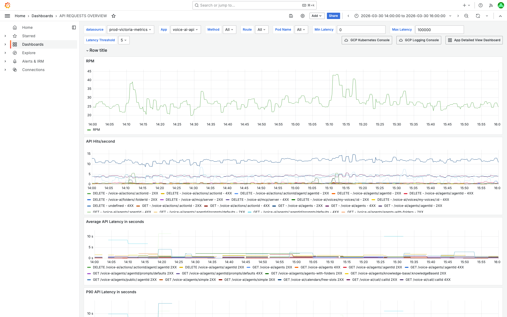
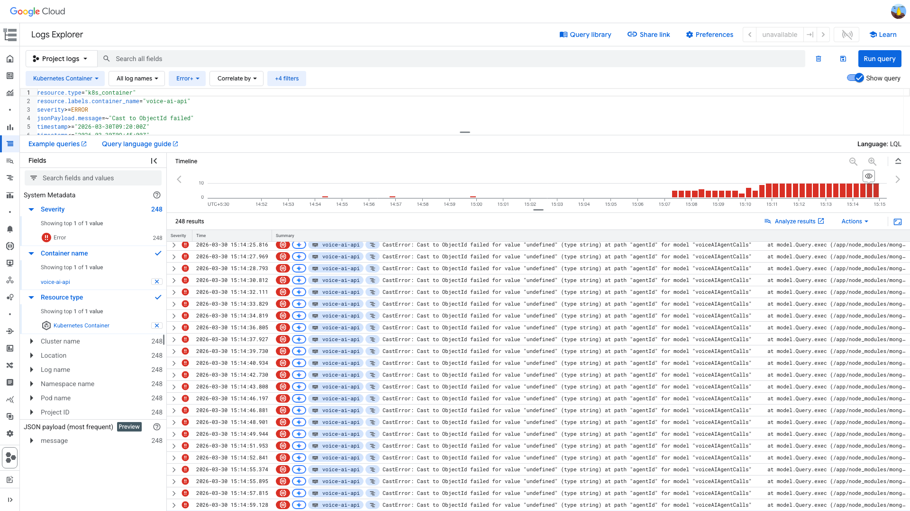
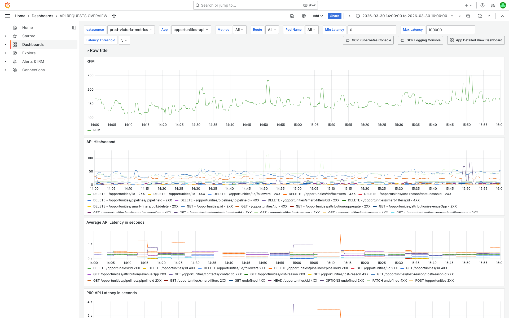
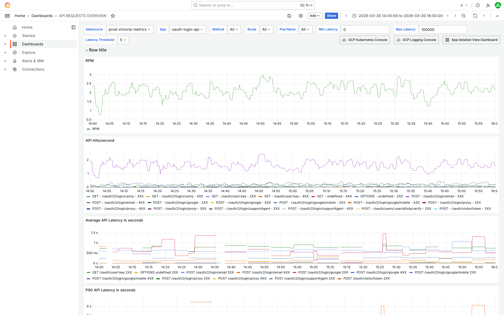
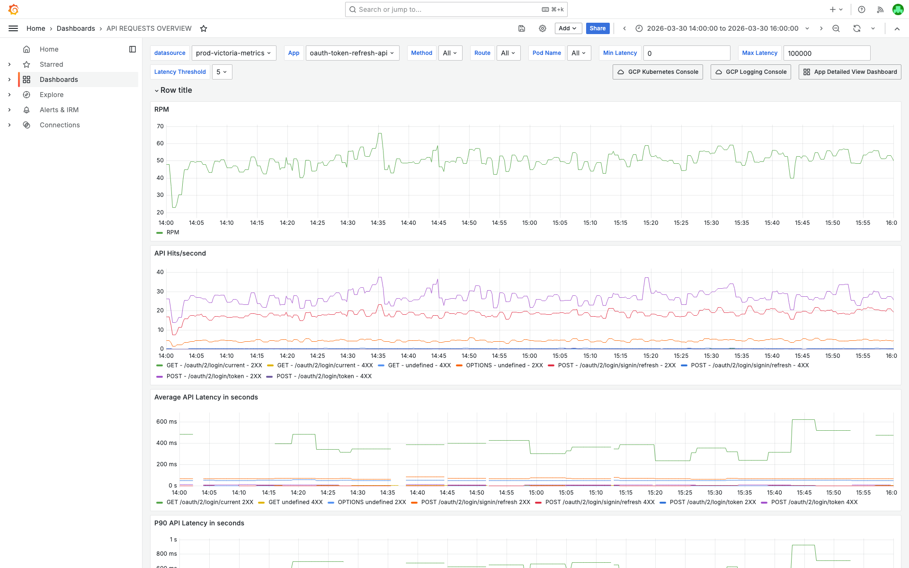

# 4XXPercentagePerAPI — voice-ai-api, opportunities-api, oauth-login-api, oauth-token-refresh-api — 2026-03-30

**Author:** Himanshu Bhutani | **Status:** Auto-resolved (false positive)

## Summary

| Field | Value |
|-------|-------|
| Alert | 4XXPercentagePerAPI (5 alerts) |
| Services | voice-ai-api, opportunities-api, oauth-login-api, oauth-token-refresh-api |
| Fired | 15:01 IST (09:31 UTC) — all within 30 seconds |
| Duration | Transient — alerts auto-resolved |
| Impact | No user impact. No infrastructure failure. All 4XX errors are client-side (400, 401, 403, 429). |

## Root Cause

**False positive — convergence of independent application-level 4XX errors.** Four unrelated services with normal-to-elevated 4XX baselines (from business validation errors, auth failures, rate limiting) simultaneously crossed the `4XXPercentagePerAPI` alert threshold during a period of elevated traffic. No single infrastructure failure triggered the burst. This is part of a larger 100+ alert storm that fired across all CRM channels between 14:37–15:31 IST.

## Proof

<details>
<summary>[Grafana] voice-ai-api — 403 Forbidden dominates at 92% of all 4XX (peak 21.1%)</summary>

> **Verify:** The 4XX rate chart shows the spike is driven almost entirely by 403 responses (auth/permission denials). The total rate peaked at 21.1% around 15:09 IST but is composed of normal auth traffic, not a service failure.



[Open in Grafana](https://prod.grafana.leadconnectorhq.com/d/d2db17da-530c-43f3-9273-c0fd664c591f/api-requests-overview?orgId=1&var-container=voice-ai-api&from=1774859400000&to=1774866600000)
</details>

<details>
<summary>[GCP Logs] voice-ai-api CastError — undefined agentId causing ~15x error spike starting 14:55 IST</summary>

> **Verify:** All error entries show the same CastError: `Cast to ObjectId failed for value "undefined" at path "agentId"`. This is a business logic bug — callers sending requests without a valid agentId.

```
resource.type="k8s_container"
resource.labels.container_name="voice-ai-api"
severity>=ERROR
jsonPayload.message=~"Cast to ObjectId failed"
timestamp>="2026-03-30T09:20:00Z"
timestamp<="2026-03-30T09:45:00Z"
```



[Open in GCP Log Explorer](https://console.cloud.google.com/logs/query;query=resource.type%3D%22k8s_container%22%0Aresource.labels.container_name%3D%22voice-ai-api%22%0Aseverity%3E%3DERROR%0AjsonPayload.message%3D~%22Cast%20to%20ObjectId%20failed%22;timeRange=2026-03-30T09%3A00%3A00Z%2F2026-03-30T10%3A00%3A00Z?project=highlevel-backend)
</details>

<details>
<summary>[Grafana] opportunities-api — steady 5.3% baseline, no spike at alert time</summary>

> **Verify:** The 4XX rate chart shows no change at 15:01 IST. The steady baseline is composed of 400 (duplicate opportunities), 429 (rate limits), 422 (validation errors).



[Open in Grafana](https://prod.grafana.leadconnectorhq.com/d/d2db17da-530c-43f3-9273-c0fd664c591f/api-requests-overview?orgId=1&var-container=opportunities-api&from=1774859400000&to=1774866600000)
</details>

<details>
<summary>[Grafana] oauth-login-api — 4XX peaked at 08:36 UTC, declining at alert time</summary>

> **Verify:** The 4XX rate was already declining at 15:01 IST. The peak (8.46%) occurred 55 minutes before the alert, driven by failed login attempts (400 Bad Request).



[Open in Grafana](https://prod.grafana.leadconnectorhq.com/d/d2db17da-530c-43f3-9273-c0fd664c591f/api-requests-overview?orgId=1&var-container=oauth-login-api&from=1774859400000&to=1774866600000)
</details>

<details>
<summary>[Grafana] oauth-token-refresh-api — noise-level 0.74% 4XX (401 expired tokens)</summary>

> **Verify:** The 4XX rate never exceeds 1%. All 401s are from expired refresh tokens — normal OAuth lifecycle. This alert should not have fired at this threshold.



[Open in Grafana](https://prod.grafana.leadconnectorhq.com/d/d2db17da-530c-43f3-9273-c0fd664c591f/api-requests-overview?orgId=1&var-container=oauth-token-refresh-api&from=1774859400000&to=1774866600000)
</details>

<details>
<summary>[Cross-validation] Zero pod restarts, zero CPU/memory pressure, no deployments</summary>

> **Verify:** No infrastructure-level issues were found for any of the 4 services during the investigation window.

- **Pod restarts:** 0 across all 4 services (08:30–10:30 UTC)
- **CPU/memory:** No pressure indicators — all well within limits
- **Deployments:** None within 2 hours before the alert
- **Database alerts:** None in #alerts-database
- **Platform alerts:** Only JenkinsNodeOffline (unrelated)
- **Prior investigation:** Two earlier reports today reached the same conclusion — [Multi-service report](https://github.com/bhutanihimanshu/alert-investigations/blob/main/reports/2026/03/30-4xx-burst-multi-service/report.md)
</details>

## Action Items

| Priority | Action | Owner |
|----------|--------|-------|
| Low | Fix voice-ai-api CastError: validate `agentId` before Mongoose query in `CallsService.fetchCallDetails` | Voice AI team |
| Low | Review `4XXPercentagePerAPI` alert threshold — consider excluding known client-error-dominated endpoints or raising the threshold for services with high 4XX baselines (e.g., oauth-token-refresh-api at ~4K errors/5min steady state) | Platform / Alert owners |
| Info | oauth-token-refresh-api has a steady ~4K ERROR/5min baseline — worth investigating whether expired token errors should be ERROR or WARN | OAuth team |

## Links

- [Verbose report](report-verbose.md)
- [Earlier multi-service investigation (same event)](https://github.com/bhutanihimanshu/alert-investigations/blob/main/reports/2026/03/30-4xx-burst-multi-service/report.md)
