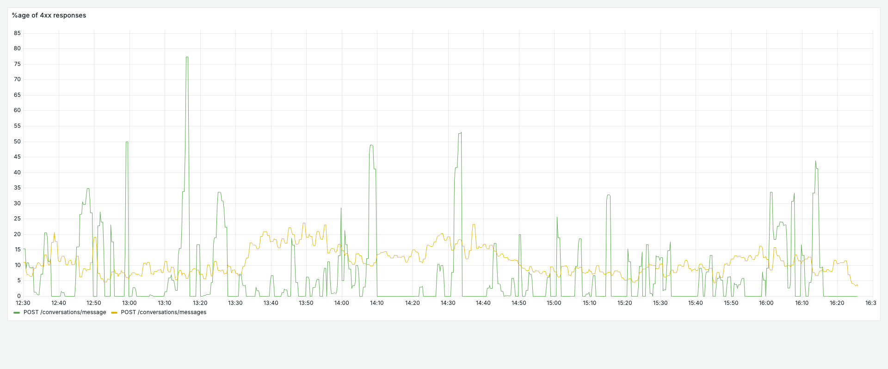
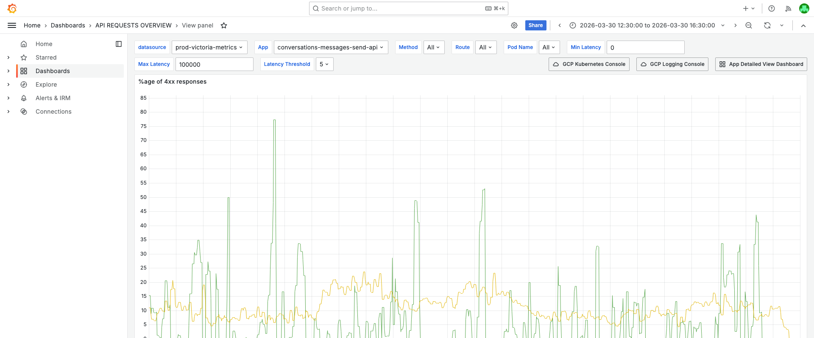
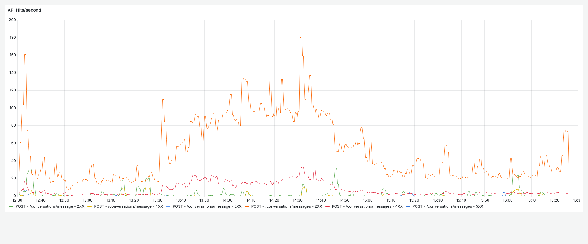
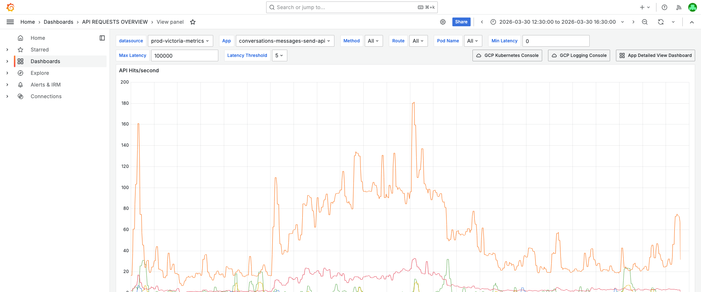
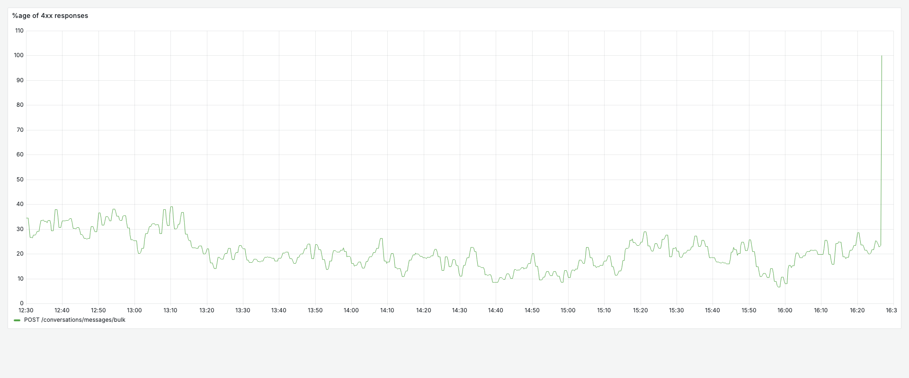
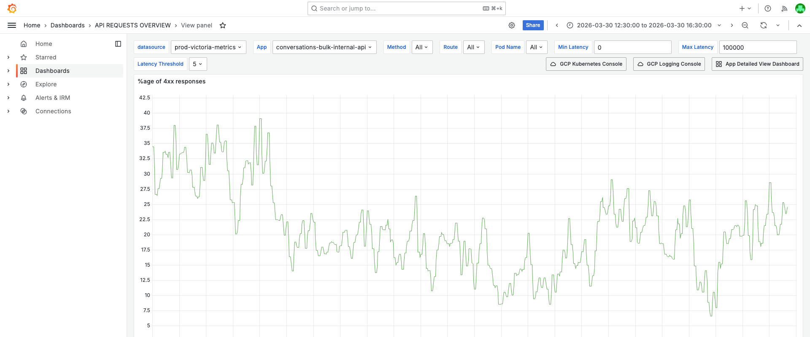
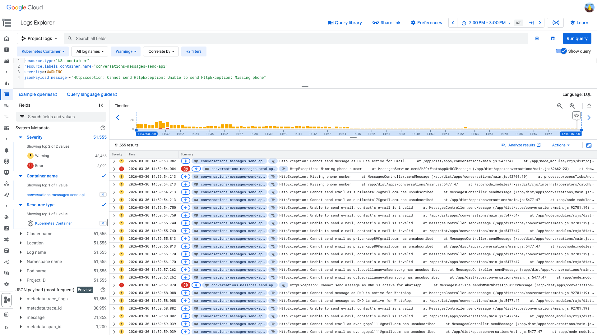

# 4XXPercentagePerAPI Investigation — CRM Conversations APIs — 2026-03-30

**Author:** Himanshu Bhutani
**Generated:** 2026-03-30 16:30 IST

---

## Alert Summary

| Field | Value |
|-------|-------|
| Alert type | 4XXPercentagePerAPI |
| Count | 15 alerts |
| Source channel | #alerts-crm-conversations (C097UPY34QJ) |
| First alert | 14:44:52 IST (09:14:52 UTC) |
| Last alert | 15:09:42 IST (09:39:42 UTC) |
| Duration | ~25 minutes |
| Resolution | All auto-resolved, acknowledged by Ganesh |
| Impact | **No user-facing impact** — 4XX are business validation rejections |

### Affected Services and Routes

| App | Route | Method | Dominant 4XX Code |
|-----|-------|--------|-------------------|
| conversations-messages-send-api | /conversations/messages | POST | 400 |
| conversations-messages-external-api | /conversations/:conversationId | GET | 400, 403 |
| conversations-messages-external-api | /conversations/messages/:messageId/status | PUT | 403, 401 |
| conversations-messages-external-api | /conversations/messages/:messageId/locations/:locationId/recording | GET | 400 |
| conversations-frontend-external-api | /conversations/messages | POST | 429 |
| conversations-frontend-external-api | /conversations/:conversationId/messages | GET | 400 |
| conversations-external-api | /conversations | POST | 400 |
| conversations-external-api | /conversations/:conversationId | GET | 400, 401 |
| conversations-providers-external-api | /conversations/providers/twilio/fetch | GET | 400 |
| conversations-providers-external-api | /conversations/providers/mailgun/fetch | GET | 400 |
| conversations-search-external-api | /conversations/search | GET | 401, 404 |
| conversations-inbound-external-api | /conversations/messages/inbound | POST | 401 |
| conversations-messages-internal-api | /conversations/messages/upload | POST | 400 |
| conversations-send-message-workflows-api | /conversations/messages | POST | 400 |
| crm-conversations-scoring-api | /scoring/workflows-action/:actionType | POST | 400 |

---

## Investigation Findings

### Evidence: Grafana — 4XX Percentage Timeline

<details>
<summary>4XX % for conversations-messages-send-api — oscillates 5–80% all day, no anomaly at alert time</summary>

> **What to look for:** Two series are visible — green (POST /conversations/message) and orange (POST /conversations/messages). The green line spikes to ~78% at 13:10 IST — well before the 14:23 IST deployment and the 14:44 IST first alert. During the alert window (14:44–15:09 IST), the rate is ~15–25%, within the same baseline range seen throughout the day.



**Context (filters + time range):**



[Open in Grafana](https://prod.grafana.leadconnectorhq.com/d/d2db17da-530c-43f3-9273-c0fd664c591f/api-requests-overview?orgId=1&var-container=conversations-messages-send-api&from=1774854000000&to=1774868400000&viewPanel=3)
</details>

<details>
<summary>Traffic volume (API Hits/second) — normal, denominator is stable</summary>

> **What to look for:** Request rate for conversations-messages-send-api stays consistent throughout the window. No traffic drop that would inflate the percentage.



**Context:**



[Open in Grafana](https://prod.grafana.leadconnectorhq.com/d/d2db17da-530c-43f3-9273-c0fd664c591f/api-requests-overview?orgId=1&var-container=conversations-messages-send-api&from=1774854000000&to=1774868400000&viewPanel=1)
</details>

<details>
<summary>4XX % for conversations-bulk-internal-api — baseline 15–35%, inherently high</summary>

> **What to look for:** The green line (POST /conversations/messages/bulk) stays between 15–35% throughout the entire 4-hour window. This is normal — bulk operations target contacts with invalid data (no phone, unsubscribed email, DND active), producing inherent HTTP 400 responses.



**Context:**



[Open in Grafana](https://prod.grafana.leadconnectorhq.com/d/d2db17da-530c-43f3-9273-c0fd664c591f/api-requests-overview?orgId=1&var-container=conversations-bulk-internal-api&from=1774854000000&to=1774868400000&viewPanel=3)
</details>

### Evidence: Prometheus — 4XX Rate Comparison

4XX percentage across all conversation services with >5% peak:

| Service | Peak 4XX % | Peak Time (UTC) | Avg 4XX % |
|---------|-----------|-----------------|-----------|
| conversations-outbound-api | 42.4% | 10:05 | 8.5% |
| conversations-bulk-internal-api | 24.0% | 09:55 | 17.6% |
| conversations-messages-send-api | 19.1% | 08:25 | 11.6% |
| conversations-messages-external-api | 17.7% | 10:45 | 7.0% |
| conversations-providers-external-api | 15.0% | 08:55 | 13.2% |
| conversations-frontend-external-api | 9.5% | 09:40 | 5.4% |
| conversations-search-external-api | 5.8% | 10:40 | 4.0% |
| conversations-external-api | 5.7% | 08:45 | 3.3% |

**Key insight:** Peak 4XX percentages are distributed across the entire time window, NOT clustered at the alert time (09:14–09:39 UTC). `conversations-messages-send-api` peaked at 08:25 UTC (13:55 IST) — 49 minutes BEFORE the first alert and 28 minutes BEFORE the deployment.

### Evidence: Prometheus — Aggregate 4XX Absolute Rate

| Metric | At alert time (09:14 UTC) | Baseline (07:14 UTC) |
|--------|--------------------------|---------------------|
| Total 4XX req/s (all conversation services) | ~356 req/s | ~469 req/s |
| Total 2XX req/s | ~6,722 req/s (200), ~4,157 req/s (201) | — |
| Total 5XX req/s | ~5 req/s (503), ~3 req/s (500) | — |

**The aggregate 4XX absolute rate was LOWER at incident time than 2 hours before.** This rules out any systemic increase in errors. The alert fires on per-route percentage, which crossed threshold during normal oscillation.

### Evidence: Prometheus — 4XX Breakdown by Status Code

| Status Code | Peak Rate | Interpretation |
|-------------|-----------|----------------|
| **400** | ~530 req/s | Dominant — validation errors (DND, invalid email, missing phone) |
| **429** | ~52 req/s | Rate limiting (conversations-frontend-external-api) |
| **401** | ~27 req/s | Auth failures (expired tokens, IAM denials) |
| **403** | ~16 req/s | Permission denied |
| **422** | ~14 req/s | Validation (unprocessable entity) |
| **404** | ~12 req/s | Not found |
| **415** | small | Unsupported media type |
| **413** | small | Payload too large |

**HTTP 400 is overwhelmingly dominant.** These are client-side validation errors, not server-side failures.

### Evidence: GCP Logs — Validation Error Messages

<details>
<summary>51,555 WARNING+ entries in conversations-messages-send-api — all business validation</summary>

> **What to look for:** Every entry in the log view is an HttpException from business validation: "Cannot send message as DND is active", "Missing phone number", "Cannot send email as X has unsubscribed", "Unable to send e-mail, contact's e-mail is invalid". The histogram shows these errors are constant throughout the day — not spiking at any particular time.



**Query:**
```
resource.type="k8s_container"
resource.labels.container_name="conversations-messages-send-api"
severity>=WARNING
jsonPayload.message=~"HttpException: Cannot send|HttpException: Unable to send|HttpException: Missing phone"
```

[Open in GCP Log Explorer](https://console.cloud.google.com/logs/query;query=resource.type%3D%22k8s_container%22%0Aresource.labels.container_name%3D%22conversations-messages-send-api%22%0Aseverity%3E%3DWARNING%0AjsonPayload.message%3D~%22HttpException%3A%20Cannot%20send%7CHttpException%3A%20Unable%20to%20send%7CHttpException%3A%20Missing%20phone%22;timeRange=2026-03-30T09%3A00%3A00Z%2F2026-03-30T09%3A30%3A00Z?project=highlevel-backend)
</details>

Sample validation errors from GCP logs:

| Timestamp | Message | HTTP Status |
|-----------|---------|-------------|
| 09:19:59 UTC | HttpException: Cannot send email as laurissa6@hotmail.com has unsubscribed | 400 |
| 09:19:59 UTC | HttpException: Cannot send email as sarah@qmts.edu.au has unsubscribed | 400 |
| 09:19:59 UTC | HttpException: Cannot send email as sharonthomas_1965@yahoo.com.au has unsubscribed | 400 |
| 09:19:59 UTC | HttpException: Missing phone number | 400 |
| 09:19:59 UTC | HttpException: Cannot send message as DND is active for Email | 400 |
| 09:19:59 UTC | HttpException: Unable to send e-mail, contact's e-mail is invalid | 400 |

### Evidence: Slack — Deployment Context

- **Jenkins #213** (leadconnector production) deployed at **14:23 IST** (08:53 UTC) — 22 min before first alert
- **PR #26921** — sidecar resources for production workers (ClickUp 86d2dwrr6)
- Deployed by himanshu.bhutani, CC'd to Deepanshu and Prasath
- **This was a sidecar resource change, NOT application code** — cannot cause new validation errors
- Pod startups in GCP logs at 14:56–14:59 IST (09:26–09:29 UTC) confirm rolling restart from the deploy

---

## What Happened

1. **All day** — Conversation APIs process requests with baseline 4XX rates of 7–35% from business validation (DND, unsubscribed, invalid email, missing phone, rate limits).
2. **14:23 IST** — Sidecar resource deployment (Jenkins #213, PR #26921) triggers rolling pod restarts across workers.
3. **14:44 IST** — First `4XXPercentagePerAPI` alert fires. The per-route 4XX percentage for several APIs temporarily crosses the alert threshold during normal oscillation.
4. **15:01–15:09 IST** — 14 more alerts fire across different routes/services as the vmalert rule evaluates each API independently.
5. **~15:10 IST** — Alerts stop firing. 4XX percentages return below threshold as oscillation continues.
6. **All alerts acknowledged** by Ganesh and auto-resolved.

<details>
<summary>Detailed timeline — full event log</summary>

| Time (IST) | Source | Event |
|---|---|---|
| 12:30–14:23 | Grafana | conversations-messages-send-api 4XX % oscillates 7–19%, conversations-bulk-internal-api at 15–35% baseline |
| 13:10 | Grafana | conversations-messages-send-api POST /conversations/message hits 78% 4XX — highest spike of the day, no alert fires |
| 13:40–13:55 | Grafana | conversations-messages-send-api 4XX at 17–19% — pre-deploy peak |
| 14:23 (08:53 UTC) | Slack | Jenkins #213 deployed — sidecar resources for production workers |
| 14:44:52 (09:14:52 UTC) | Alert | First 4XXPercentagePerAPI fires — app: conversation |
| 14:56–14:59 (09:26–09:29 UTC) | GCP Logs | Pod startups for conversations-messages-external-api, conversations-messages-internal-api, conversations-bulk-internal-async-api |
| 15:01:02–15:01:34 | Alert | 12 alerts fire in rapid succession across different routes/services |
| 15:05:20 | Alert | Alert #14 fires |
| 15:09:42 | Alert | Alert #15 (last) fires |
| ~15:10 | Grafana | 4XX percentages drop below alert threshold |
| Post-alert | Slack | All alerts resolved by Ganesh |

</details>

---

## Cross-Validation

| Source | Signal | Finding | Confirms Root Cause? |
|--------|--------|---------|---------------------|
| Grafana (Istio) | Aggregate 4XX rate | ~356/s at incident vs ~469/s baseline — NOT elevated | ✅ Yes — no systemic increase |
| Grafana (per-service) | 4XX % timeline | Peak at 08:25 UTC (before deploy), oscillates 7–80% all day | ✅ Yes — baseline oscillation |
| GCP Logs | Error messages | 100% business validation (DND, unsubscribed, invalid email) | ✅ Yes — not infra errors |
| GCP Logs | Pod startups | Startups at 09:26–09:29 UTC from deploy | ⚠️ Partial — deploy confirmed but not causal |
| Slack | Deployment | Jenkins #213 at 08:53 UTC — sidecar resources | ⚠️ Correlative only |
| Prometheus | Status code distribution | HTTP 400 dominant (~530/s), then 429 (~52/s) | ✅ Yes — client errors |

**Confidence: High** — 5 of 6 sources confirm the 4XX rate is within baseline. The deployment is temporally correlated but the 4XX percentage was already elevated before the deploy.

---

## Root Cause

**False positive / noisy alert.** The `4XXPercentagePerAPI` alerts fire on per-route 4XX percentage thresholds. Conversation APIs have inherently high baseline 4XX rates (7–35%) due to business validation — DND active, unsubscribed emails, invalid email addresses, missing phone numbers, rate limiting. The per-route percentage naturally oscillates with traffic patterns and temporarily crossed the alert threshold during normal operation, triggering 15 alerts across different routes.

The sidecar resource deployment at 14:23 IST is temporally correlated but NOT causal — the 4XX percentage was already 17–19% before the deployment, and the deployment changed sidecar resources, not application logic.

---

<details>
<summary>Probable noise — transient errors during disruption (not root cause)</summary>

| Time | Pattern | Why it's noise |
|------|---------|----------------|
| All day | HTTP 401/403 on conversations-messages-external-api, conversations-search-external-api | Auth failures are a constant baseline — expired tokens, IAM denials. Not related to the alert burst. |
| All day | HTTP 429 on conversations-frontend-external-api (~48/s peak) | Rate limiting is working as intended. |
| 14:56–14:59 IST | Pod startups from deployment | Expected rolling restart from Jenkins #213. Pods came up normally. |
| All day | Marketplace UBP errors in conversations-messages-send-api | Pre-existing business logic errors, not related to this incident. |

</details>

---

## Action Items

| Priority | Action | Reasoning | Owner |
|----------|--------|-----------|-------|
| **Medium** | Tune `4XXPercentagePerAPI` thresholds for conversation APIs | Current thresholds are too sensitive — services have 7–35% baseline 4XX from validation. Consider raising to 40% or adding per-service overrides. | CRM Conversations + Platform |
| **Medium** | Exclude HTTP 400 from the 4XX alert metric, or separate 400 (validation) from 401/403/429 | HTTP 400 from validation (DND, invalid email) is expected behavior, not service degradation. Alerting on 401/403/429 separately would be more actionable. | Platform Alerting |
| **Low** | Review validation HttpException log levels | "Cannot send message as DND is active" is a normal business flow, not a warning. Consider logging at INFO level to reduce log noise. | CRM Conversations |
| **Low** | Add the `4XXPercentagePerAPI` alert type to the investigations DB | This is a new alert type not currently tracked. | Automation |

---

## Deployment Details

| Config | Value |
|--------|-------|
| Deployment | Jenkins #213 — leadconnector production |
| PR | #26921 — sidecar resources for production workers |
| ClickUp | 86d2dwrr6 |
| Deploy time | 14:23 IST (08:53 UTC) |
| Impact | Sidecar resource change only — no app code changes |

---

## Links

- [Grafana — API Requests Overview (send-api)](https://prod.grafana.leadconnectorhq.com/d/d2db17da-530c-43f3-9273-c0fd664c591f/api-requests-overview?orgId=1&var-container=conversations-messages-send-api&from=1774854000000&to=1774868400000)
- [Grafana — API Requests Overview (bulk-internal)](https://prod.grafana.leadconnectorhq.com/d/d2db17da-530c-43f3-9273-c0fd664c591f/api-requests-overview?orgId=1&var-container=conversations-bulk-internal-api&from=1774854000000&to=1774868400000)
- [GCP Log Explorer — validation errors](https://console.cloud.google.com/logs/query;query=resource.type%3D%22k8s_container%22%0Aresource.labels.container_name%3D%22conversations-messages-send-api%22%0Aseverity%3E%3DWARNING%0AjsonPayload.message%3D~%22HttpException%3A%20Cannot%20send%7CHttpException%3A%20Unable%20to%20send%7CHttpException%3A%20Missing%20phone%22;timeRange=2026-03-30T09%3A00%3A00Z%2F2026-03-30T09%3A30%3A00Z?project=highlevel-backend)
