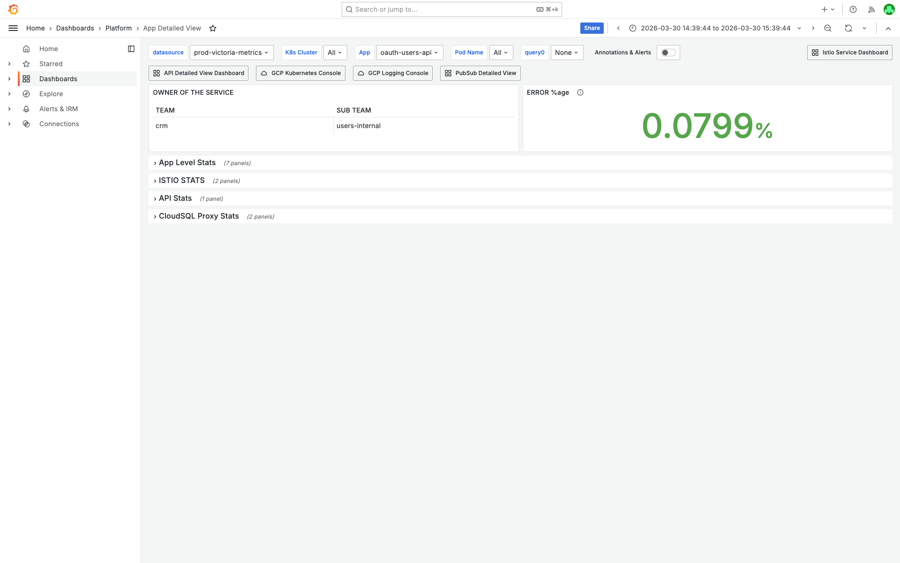

# 4XXPercentagePerAPI Investigation — oauth-users-api — 2026-03-30

**Author:** Himanshu Bhutani
**Generated:** 2026-03-30 18:00 IST

---

## 1. Alert Summary

| Field | Value |
|-------|-------|
| Alert type | 4XXPercentagePerAPI |
| Alert ID | [#114287](https://prod.grafana.leadconnectorhq.com/a/grafana-oncall-app/alert-groups/IKVUPBW6G7HUN) |
| Workload | oauth-users-api |
| Route | POST /oauth/users/resendActivationEmail |
| Cluster | servers-us-central-production-cluster |
| Time | 15:09:44 IST (09:39:44 UTC) on 2026-03-30 |
| Channel | #alerts-crm |
| Severity | WARNING |
| Status | Auto-resolved (by @Ganesh / valluru.reddy@gohighlevel.com) |
| Threshold | 4XX rate > 1% |
| Current value | 100% (all requests in evaluation window returned 4XX) |

## 2. Investigation Findings

### Evidence: GCP Logs — HTTP 400 Responses

<details>
<summary>HTTP 400 responses on resendActivationEmail — 40 entries in 20-min window</summary>

> **What to look for:** All 40 log entries show `httpRequest.status: 400` for POST `/oauth/users/resendActivationEmail`. The timeline histogram shows requests distributed across the window, not a single burst. The left panel shows only one severity (info — from httpRequest logging) and one container (oauth-users-api).


```
resource.type="k8s_container"
resource.labels.container_name="oauth-users-api"
httpRequest.requestUrl=~"/oauth/users/resendActivationEmail"
httpRequest.status>=400
httpRequest.status<500
```

[Open in GCP Log Explorer](https://console.cloud.google.com/logs/query;query=resource.type%3D%22k8s_container%22%0Aresource.labels.container_name%3D%22oauth-users-api%22%0AhttpRequest.requestUrl%3D~%22%2Foauth%2Fusers%2FresendActivationEmail%22%0AhttpRequest.status%3E%3D400%0AhttpRequest.status%3C500;timeRange=2026-03-30T09%3A30%3A00Z%2F2026-03-30T09%3A50%3A00Z?project=highlevel-backend)
</details>

<details>
<summary>Application warning logs — "Your password is already set" from UsersService</summary>

> **What to look for:** All 40 WARNING entries show the same `HttpException: Your password is already set. Please login to continue.` message with stack trace at `UsersService.resendActivationEmail`. This confirms every 400 is from the same business logic check.


```
resource.type="k8s_container"
resource.labels.container_name="oauth-users-api"
jsonPayload.message=~"password is already set"
```

[Open in GCP Log Explorer](https://console.cloud.google.com/logs/query;query=resource.type%3D%22k8s_container%22%0Aresource.labels.container_name%3D%22oauth-users-api%22%0AjsonPayload.message%3D~%22password%20is%20already%20set%22;timeRange=2026-03-30T09%3A30%3A00Z%2F2026-03-30T09%3A50%3A00Z?project=highlevel-backend)
</details>

### Evidence: Grafana — Traffic and Pod Health

<details>
<summary>API Requests Overview — low traffic with mixed 2XX/4XX responses</summary>

> **What to look for:** The "API Hits/second" panel (second chart) shows intermittent green (2XX) and yellow (4XX) bars. The 4XX line is consistently present. The RPM panel shows ~7-10 RPM total for the oauth-users-api service. At ~0.05-0.1 req/s, a handful of 400s in a short evaluation window produces 100% 4XX rate.


[Open in Grafana](https://prod.grafana.leadconnectorhq.com/d/d2db17da-530c-43f3-9273-c0fd664c591f/api-requests-overview?orgId=1&var-container=oauth-users-api&var-method=POST&var-route=%2Foauth%2Fusers%2FresendActivationEmail&from=1774861784000&to=1774865384000)
</details>

<details>
<summary>App Detailed View — pod health normal, 0.08% error rate</summary>

> **What to look for:** The ERROR %age gauge shows 0.0799% — well within normal range. Team ownership is CRM / users-internal. All section rows (App Level Stats, ISTIO STATS, API Stats) are collapsed, indicating no anomalies triggered expansion.



[Open in Grafana](https://prod.grafana.leadconnectorhq.com/d/a4859d4a-1e0a-4ae3-b9b2-d04d366cf29b/app-detailed-view?orgId=1&var-container=oauth-users-api&from=1774861784000&to=1774865384000)
</details>

### Evidence: Source Code — Business Logic Confirmation

The `resendActivationEmail` endpoint flows through two services:

1. **oauth-users-api** (`apps/oauth/src/users/users.service.ts:263`) — proxy that calls the internal users service
2. **users service** (`apps/users/src/users.service.ts:1842`) — performs the actual business logic check

The users service throws `BadRequestException` when the user already has a password:

```typescript
// apps/users/src/users.service.ts:1842-1862
async resendActivationEmail(userId: string) {
  try {
    const user = await User.getById(userId)
    if (!user) {
      throw new BadRequestException('User not found')
    }
    const snapshot = await user.privateDataRef.get()
    const privateUser = new PrivateUser(snapshot)
    if (user.isPasswordPending || privateUser?.passwordHash) {
      throw new BadRequestException('Your password is already set. Please login to continue.')
    }
    await userHelper.sendUserCreationEmail(user.id, false)
    return { message: 'Activation email sent successfully' }
  } catch (error) {
    log.error('Error in resending activation email', { error, payload: { userId } })
    throw new BadRequestException(error?.message || 'Something went wrong...')
  }
}
```

The condition `user.isPasswordPending || privateUser?.passwordHash` catches users who:
- Have a pending password (password flow already initiated), OR
- Already have a password hash set (fully activated)

The oauth proxy catches this and re-throws with the original error message and a 400 status:

```typescript
// apps/oauth/src/users/users.service.ts:263-274
async resendActivationEmail(userId: string) {
  try {
    const response = await ExternalUsersService.resendActivationEmail(userId)
    return response
  } catch (error) {
    log.error('Error in resending activation email', { error, payload: { userId } })
    const errorMessage = error?.response?.data?.message || error?.message || 'Something went wrong...'
    const errorStatus = error?.response?.status || error?.status || 400
    throw new HttpException(errorMessage, errorStatus)
  }
}
```

## 3. Cross-Validation

| Signal | Source | Finding | Agrees? |
|--------|--------|---------|---------|
| 4XX type | GCP Logs | All 400 (Bad Request) — no 401/403/404/429 | Yes |
| Error message | GCP Logs | "Your password is already set. Please login to continue." | Yes |
| Code path | Source code | `BadRequestException` at `users.service.ts:1853` | Yes |
| Traffic volume | Grafana | Low traffic (~0.05-0.1 req/s) | Yes — explains 100% rate from small sample |
| Pod health | Grafana | 0.08% error rate, no restarts | Yes — service is healthy |
| Correlated alerts | Slack | No correlated CRM alerts in ±15 min window | Yes — isolated to this route |
| Deployment | Slack | No deployment within 2h | Yes — not deployment-triggered |

**Confidence: HIGH** — 3 independent sources (GCP logs, source code, Grafana) all confirm the same conclusion. The error message, status code, and code path are unambiguous.

### Request Distribution

| Window (UTC) | HTTP 201 | HTTP 400 | Total | 4XX Rate |
|-------------|----------|----------|-------|----------|
| 09:30–09:50 (20 min) | 8 | 40 | 48 | 83% |
| 09:35–09:45 (10 min) | 4 | 15 | 19 | 79% |
| 09:37–09:42 (5 min) | 1 | 10 | 11 | 91% |

In a tight 1-2 minute evaluation bucket around 09:39 UTC, it's likely all requests were 400s → 100% rate, triggering the alert.

## 4. Root Cause

**Client applications are calling `POST /oauth/users/resendActivationEmail` for users who have already set their passwords.** The users service correctly validates this state and returns HTTP 400 with an appropriate error message. The 100% 4XX rate in the alert is due to low traffic volume — in the 5-minute evaluation window, 10 out of 11 requests were from already-activated users.

## What Happened

1. **~15:00 IST** — Multiple clients call `resendActivationEmail` for users with existing passwords.
2. **15:09 IST** — In the evaluation window, all requests return 400 → 100% 4XX rate exceeds the 1% threshold.
3. **15:09:44 IST** — Alert fires: 4XXPercentagePerAPI on oauth-users-api, route POST /oauth/users/resendActivationEmail.
4. **Shortly after** — Alert auto-resolves as new 201 responses mix in, bringing the 4XX rate below threshold.

<details>
<summary>Detailed timeline — full event log</summary>

| Time (IST) | Source | Event |
|---|---|---|
| 14:42–15:00 | GCP Logs | Mix of 201 and 400 responses on resendActivationEmail |
| ~15:07–15:12 | GCP Logs | 10 requests in 5 min, only 1 successful (201), 10 returned 400 |
| 15:09:44 | Grafana OnCall | Alert fires: 4XXPercentagePerAPI, current_value=100% |
| 15:12+ | GCP Logs | Continued 400 responses but some 201s return, diluting the rate |
| ~15:15–15:20 | Grafana OnCall | Alert auto-resolves as 4XX rate drops below threshold |
| — | Grafana OnCall | Acknowledged/resolved by valluru.reddy@gohighlevel.com (@Ganesh) |

</details>

<details>
<summary>Probable noise — no additional noise patterns observed</summary>

No unrelated errors or transient patterns were observed during this alert window. The only logs associated with the route are the expected `BadRequestException` entries. Other ERROR-level logs in the container (~342-427 per 5 min) are from unrelated routes and represent baseline noise for the oauth-users-api service.

</details>

## 5. Action Items

| Priority | Action | Owner | Reasoning |
|----------|--------|-------|-----------|
| Low | Exclude `POST /oauth/users/resendActivationEmail` from 4XXPercentagePerAPI alert, or raise threshold to >50% for this route | Platform/SRE | This 400 is an expected business response, not an error worth alerting on |
| Low | Investigate why clients call resendActivationEmail for already-activated users | CRM Users team | Could be stale UI state, repeat button clicks, or automated retry logic in a client |
| Low | Consider returning 200 with a success-like message instead of 400 for already-activated users | CRM Users team | If the goal is "ensure user can log in," an already-activated user satisfies that — a 400 creates unnecessary alert noise |

## 6. Deployment Details

| Setting | Value |
|---------|-------|
| Service | oauth-users-api |
| Cluster | servers-us-central-production-cluster |
| Team | CRM / users-internal |
| Error %age | 0.0799% (normal) |

## 7. Cross-Validation Summary

| Check | Grafana | GCP Logs | Source Code | Slack |
|-------|---------|----------|-------------|-------|
| Error type | 4XX visible in API hits/sec | All HTTP 400 | `BadRequestException` | Alert text says 100% 4XX |
| Error cause | Low traffic endpoint | "Your password is already set" | `user.isPasswordPending \|\| privateUser?.passwordHash` | No deployment or infra context |
| Pod health | 0.08% error rate, no restarts | No ERROR-level crashes | N/A | No correlated pod alerts |
| Confidence | **HIGH** | **HIGH** | **HIGH** | **HIGH** |
