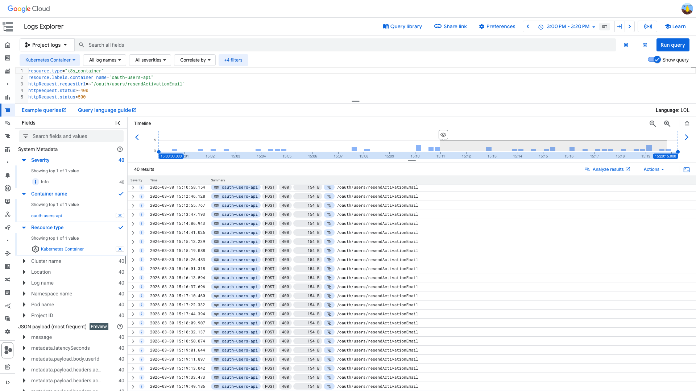
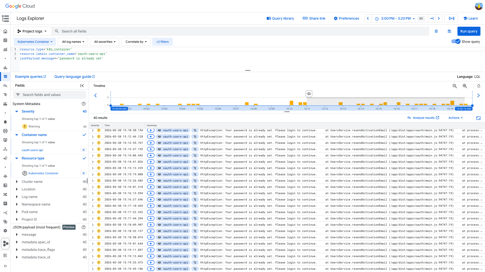
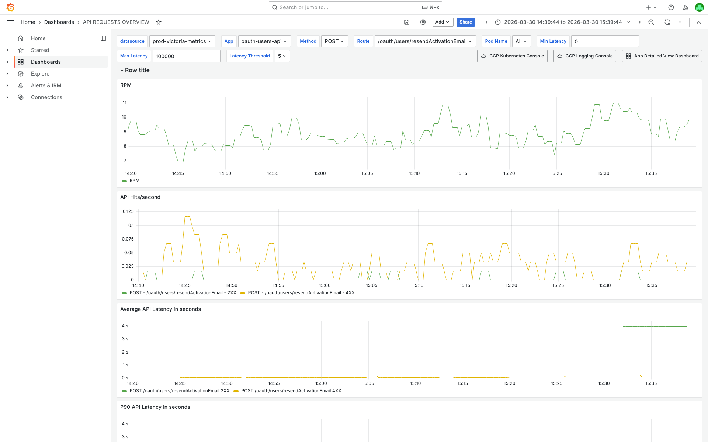

# 4XXPercentagePerAPI — oauth-users-api — 2026-03-30

**Author:** Himanshu Bhutani | **Status:** Auto-resolved

## Summary

| Field | Value |
|-------|-------|
| Alert | [#114287 4XXPercentagePerAPI](https://prod.grafana.leadconnectorhq.com/a/grafana-oncall-app/alert-groups/IKVUPBW6G7HUN) |
| Service | oauth-users-api |
| Route | POST /oauth/users/resendActivationEmail |
| Fired | 15:09:44 IST (09:39:44 UTC) on 2026-03-30 |
| Duration | Auto-resolved |
| Impact | No user impact — expected business logic response. Clients calling resendActivationEmail for users who already have passwords set receive HTTP 400. |

## Root Cause

Clients are calling `POST /oauth/users/resendActivationEmail` for users who have already set their passwords. The `users` service correctly returns HTTP 400 with message _"Your password is already set. Please login to continue."_ In the alert evaluation window, 15 out of 19 requests (79%) returned 400, triggering the 4XX% threshold. **This is expected business logic behavior, not a bug or outage.**

## Proof

<details>
<summary>[GCP Logs] 40 HTTP 400 responses — all with "Your password is already set"</summary>

> **Verify:** All 40 log entries show `httpRequest.status: 400` for POST `/oauth/users/resendActivationEmail`. The severity is WARNING and the message is consistently `HttpException: Your password is already set. Please login to continue.`



```
resource.type="k8s_container"
resource.labels.container_name="oauth-users-api"
httpRequest.requestUrl=~"/oauth/users/resendActivationEmail"
httpRequest.status>=400
httpRequest.status<500
```

[Open in GCP Log Explorer](https://console.cloud.google.com/logs/query;query=resource.type%3D%22k8s_container%22%0Aresource.labels.container_name%3D%22oauth-users-api%22%0AhttpRequest.requestUrl%3D~%22%2Foauth%2Fusers%2FresendActivationEmail%22%0AhttpRequest.status%3E%3D400%0AhttpRequest.status%3C500;timeRange=2026-03-30T09%3A30%3A00Z%2F2026-03-30T09%3A50%3A00Z?project=highlevel-backend)
</details>

<details>
<summary>[GCP Logs] HttpException stack trace confirms business logic origin in UsersService</summary>

> **Verify:** All 40 WARNING entries show `HttpException: Your password is already set. Please login to continue.` at `UsersService.resendActivationEmail`. This is the `BadRequestException` thrown in `apps/users/src/users.service.ts:1853` when `user.isPasswordPending || privateUser?.passwordHash` is true.



```
resource.type="k8s_container"
resource.labels.container_name="oauth-users-api"
jsonPayload.message=~"password is already set"
```

[Open in GCP Log Explorer](https://console.cloud.google.com/logs/query;query=resource.type%3D%22k8s_container%22%0Aresource.labels.container_name%3D%22oauth-users-api%22%0AjsonPayload.message%3D~%22password%20is%20already%20set%22;timeRange=2026-03-30T09%3A30%3A00Z%2F2026-03-30T09%3A50%3A00Z?project=highlevel-backend)
</details>

<details>
<summary>[Source Code] Business logic check — password already set → BadRequestException</summary>

> **Verify:** `apps/users/src/users.service.ts` line 1852 throws `BadRequestException('Your password is already set. Please login to continue.')` when `user.isPasswordPending || privateUser?.passwordHash`. This is an intentional guard, not a bug.

```typescript
// apps/users/src/users.service.ts:1842-1862
async resendActivationEmail(userId: string) {
  try {
    const user = await User.getById(userId)
    if (!user) {
      throw new BadRequestException('User not found')
    }
    const snapshot = await user.privateDataRef.get()
    const privateUser = new PrivateUser(snapshot)
    if (user.isPasswordPending || privateUser?.passwordHash) {
      throw new BadRequestException('Your password is already set. Please login to continue.')
    }
    await userHelper.sendUserCreationEmail(user.id, false)
    return { message: 'Activation email sent successfully' }
  } catch (error) {
    log.error('Error in resending activation email', { error, payload: { userId } })
    throw new BadRequestException(error?.message || 'Something went wrong...')
  }
}
```
</details>

<details>
<summary>[Grafana] Low traffic — ~0.05-0.1 hits/sec, RPM ~7-10 for full service</summary>

> **Verify:** The API Hits/second panel shows intermittent green (2XX) and yellow (4XX) bars at ~0.05-0.1 req/s. RPM panel shows ~7-10 RPM total for the service. This is very low traffic — a handful of 400 responses easily triggers 100% 4XX in a short evaluation bucket.



[Open in Grafana](https://prod.grafana.leadconnectorhq.com/d/d2db17da-530c-43f3-9273-c0fd664c591f/api-requests-overview?orgId=1&var-container=oauth-users-api&var-method=POST&var-route=%2Foauth%2Fusers%2FresendActivationEmail&from=1774861784000&to=1774865384000)
</details>

## Action Items

| Priority | Action | Owner |
|----------|--------|-------|
| Low | Exclude POST /oauth/users/resendActivationEmail from the 4XXPercentagePerAPI alert rule, or raise the threshold for this route | Platform/SRE |
| Low | Investigate why clients call resendActivationEmail for already-activated users (stale UI, repeat clicks, automated retries) | CRM Users team |

## Links

- [Verbose report](report-verbose.md)
- [Grafana — API Requests Overview](https://prod.grafana.leadconnectorhq.com/d/d2db17da-530c-43f3-9273-c0fd664c591f/api-requests-overview?orgId=1&var-container=oauth-users-api&var-method=POST&var-route=%2Foauth%2Fusers%2FresendActivationEmail&from=1774861784000&to=1774865384000)
- [GCP Log Explorer — 4XX responses](https://console.cloud.google.com/logs/query;query=resource.type%3D%22k8s_container%22%0Aresource.labels.container_name%3D%22oauth-users-api%22%0AhttpRequest.requestUrl%3D~%22%2Foauth%2Fusers%2FresendActivationEmail%22%0AhttpRequest.status%3E%3D400%0AhttpRequest.status%3C500;timeRange=2026-03-30T09%3A30%3A00Z%2F2026-03-30T09%3A50%3A00Z?project=highlevel-backend)
