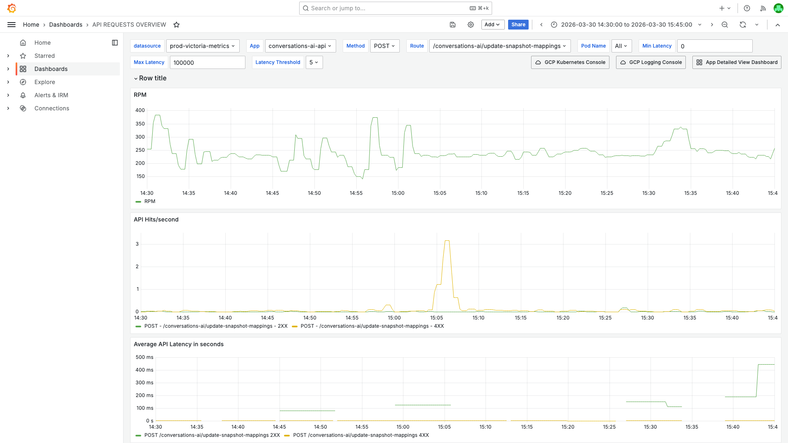
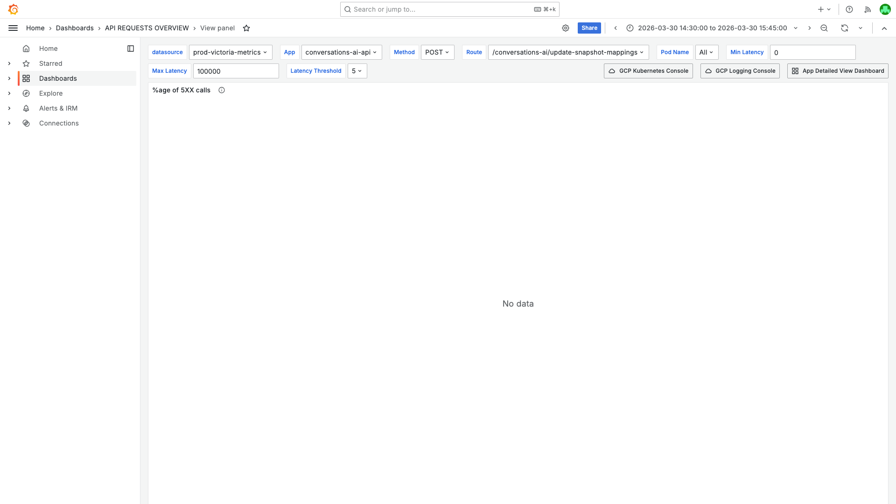
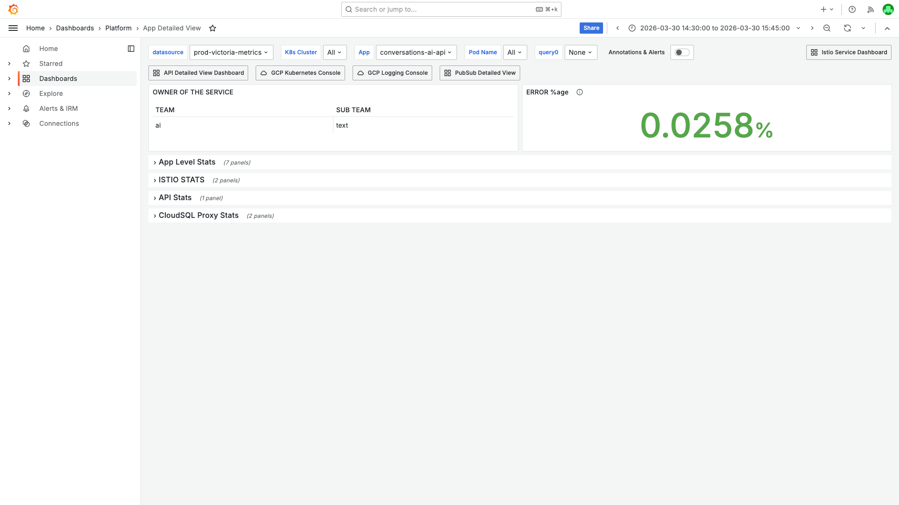
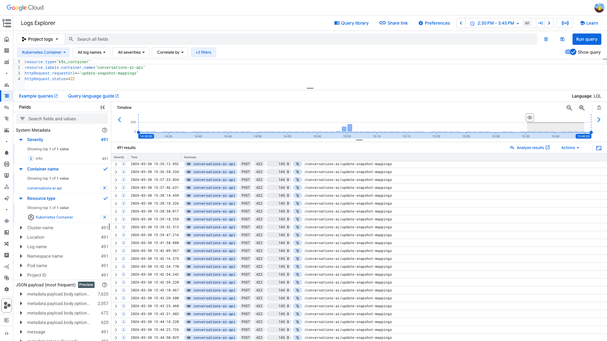
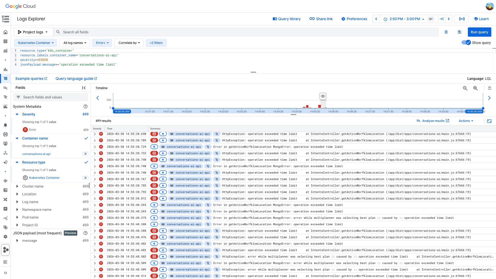

# 4XX Error Rate Investigation — conversations-ai-api — 2026-03-30

**Author:** Himanshu Bhutani
**Generated:** 2026-03-30 17:20 IST

---

## 1. Alert Summary

| Field | Value |
|-------|-------|
| Alert type | 4XXPercentagePerAPI |
| Alert ID | #114288 (Grafana OnCall I8SHJI6GDK7MQ) |
| Workload | conversations-ai-api |
| Route | POST /conversations-ai/update-snapshot-mappings |
| Channel | #alerts-crm (C0315RRNH1B) |
| Fired | 15:09:51 IST (09:39:51 UTC) |
| Resolved | 15:21:59 IST (09:51:59 UTC) |
| Duration | ~12 minutes |
| Current value | 75% (75% of traffic to this route was 4XX) |
| Threshold | 1% |
| Resolved by | Ganesh (valluru.reddy@gohighlevel.com) |
| Team | CRM AI (ai / text) |

---

## 2. Investigation Findings

### Evidence: Grafana — API Traffic

<details>
<summary>API Requests Overview — 4XX spike to ~3 req/s at 15:05 IST on update-snapshot-mappings</summary>

> **What to look for:** In the "API Hits/second" chart (middle panel), the yellow line (POST /conversations-ai/update-snapshot-mappings - 4XX) spikes to ~3 req/s around 15:05 IST. The green line (2XX) stays near zero (~0.01 req/s). This extreme ratio (300:1 4XX:2XX) is why the percentage hit 75%. In the "RPM" chart (top), overall container traffic shows periodic dips but no anomaly. The "Average API Latency" chart (bottom) shows 4XX responses at ~0ms (immediate rejection by ValidationPipe) while 2XX responses are ~100-200ms.



**Context (filters + time range):**



[Open in Grafana](https://prod.grafana.leadconnectorhq.com/d/d2db17da-530c-43f3-9273-c0fd664c591f/api-requests-overview?orgId=1&var-container=conversations-ai-api&var-route=/conversations-ai/update-snapshot-mappings&var-method=POST&from=1774861200000&to=1774865700000)
</details>

**Key metrics from Grafana:**

| Metric | Value | Assessment |
|--------|-------|------------|
| Peak 4XX rate | 0.47% at 09:37 UTC | Very low absolute rate |
| Spike duration | 09:35–09:41 UTC (~6 min) | Transient |
| Route 4XX peak | ~1.1 req/s at 09:39 UTC | vs baseline ~0.08 req/s |
| Route 2XX rate | ~0.01 req/s (constant) | Extremely low-traffic route |
| 4XX:2XX ratio during spike | ~300:1 | Low 2XX amplifies the percentage |
| Pod restarts | 0 | Healthy |

### Evidence: Grafana — Pod Health

<details>
<summary>App Detailed View — ERROR %age 0.0258%, no pod issues</summary>

> **What to look for:** The "ERROR %age" stat in the top-right shows 0.0258% — well below any concern threshold. Team is "ai", sub-team is "text". All rows (App Level Stats, ISTIO STATS, API Stats, CloudSQL Proxy Stats) are collapsed — no anomalies. Zero pod restarts during the window.



[Open in Grafana](https://prod.grafana.leadconnectorhq.com/d/a4859d4a-1e0a-4ae3-b9b2-d04d366cf29b/app-detailed-view?orgId=1&var-container=conversations-ai-api&from=1774861200000&to=1774865700000)
</details>

### Evidence: Grafana — Platform-Wide 4XX Storm

At the alert timestamp (09:39:51 UTC), a Prometheus instant query `topk(20, sum(rate(http_request_duration_seconds_count{code=~"4.."}[5m])) by (container))` revealed 20+ services with elevated 4XX rates:

| Container | 4XX Rate (req/s) |
|---|---|
| funnel-preview-cache | 346.48 |
| funnels-page-data-api | 321.85 |
| location-contacts-api | 185.53 |
| oauth-api | 100.94 |
| companies-api | 93.86 |
| billing-config-api | 80.32 |
| contacts-get-external-api | 71.45 |
| lc-phone-voice-token-api | 57.22 |
| conversations-bulk-internal-api | 55.03 |
| contacts-update-external-api | 51.22 |
| marketplace-api | 49.97 |
| + 9 more containers | 22–44 req/s each |

**conversations-ai-api (~1.1 req/s) is NOT in the top 50.** The alert fired because of the percentage-based threshold on a very low-traffic route.

Grafana OnCall was rate-limited by Slack for 5 integrations simultaneously (CRM-opportunities, CRM-users-internal, CRM-marketplace, CRM-integrations, CRM-conversations-ai), indicating extreme alert volume.

### Evidence: GCP Logs — HTTP 422 on update-snapshot-mappings

<details>
<summary>GCP Log Explorer — 491 HTTP 422 responses, all from NestJS ValidationPipe</summary>

> **What to look for:** All 491 results show severity=INFO, status=422, method=POST, route=/conversations-ai/update-snapshot-mappings. The timeline histogram at the top shows these are spread evenly across the 09:00-10:15 UTC window — this is a steady-state pattern, NOT a spike correlated with the alert. The caller is `axios/1.13.2` from `127.0.0.6` (internal service-to-service call). Response latency is 0.002s (immediate DTO validation rejection).



```
resource.type="k8s_container"
resource.labels.container_name="conversations-ai-api"
httpRequest.requestUrl=~"update-snapshot-mappings"
httpRequest.status=422
```

[Open in GCP Log Explorer](https://console.cloud.google.com/logs/query;query=resource.type%3D%22k8s_container%22%0Aresource.labels.container_name%3D%22conversations-ai-api%22%0AhttpRequest.requestUrl%3D~%22update-snapshot-mappings%22%0AhttpRequest.status%3D422;timeRange=2026-03-30T09%3A00%3A00Z%2F2026-03-30T10%3A15%3A00Z?project=highlevel-backend)
</details>

**Key findings from logs:**

| Finding | Detail |
|---------|--------|
| 4XX status code | 100% HTTP 422 (Unprocessable Entity) |
| Cause | NestJS ValidationPipe rejecting request body |
| Caller | axios/1.13.2 from 127.0.0.6 (internal) |
| Latency | 0.002s (immediate rejection, no backend processing) |
| Pattern | Steady-state ~1-5 req/min, not a new spike |
| Request body | `{ locationId, options: { mappings: [{ id, new_id }] } }` — something in this DTO fails validation |

### Evidence: GCP Logs — MongoDB Timeout Spike (Separate Finding)

<details>
<summary>GCP Log Explorer — 499 MongoDB timeout errors at 14:55 IST (09:25 UTC)</summary>

> **What to look for:** All 499 results show ERROR severity with "operation exceeded time limit" in `getActiveWorfklowLocation`. The timeline histogram shows a massive spike concentrated around 14:55 IST. This is a 10x increase vs the baseline of ~70 errors per 5-min bucket. This is NOT related to the 4XX alert but is a separate operational concern.



```
resource.type="k8s_container"
resource.labels.container_name="conversations-ai-api"
severity>=ERROR
jsonPayload.message=~"operation exceeded time limit"
```

[Open in GCP Log Explorer](https://console.cloud.google.com/logs/query;query=resource.type%3D%22k8s_container%22%0Aresource.labels.container_name%3D%22conversations-ai-api%22%0Aseverity%3E%3DERROR%0AjsonPayload.message%3D~%22operation%20exceeded%20time%20limit%22;timeRange=2026-03-30T09%3A20%3A00Z%2F2026-03-30T09%3A30%3A00Z?project=highlevel-backend)
</details>

**ERROR log volume by 5-min bucket:**

| Time (IST) | ERRORs | Assessment |
|---|---|---|
| 14:30-14:50 | 53–81 | Baseline |
| **14:55** | **853** | 10x spike — MongoDB timeout |
| 15:00 | 99 | Recovery |
| 15:05-15:40 | 74-105 | Baseline |

**Top error patterns (09:30-09:50 UTC):**

| Count | Error Message |
|---|---|
| 19 | `Error while triggering workflow action` / `triggerWorkflowAction failed` |
| 8 | `Error while triggering summary event for employee config update` (Firestore invalid documentPath) |
| 2 | `Error in updating AI Employee config` (Bot not found / insufficient wallet balance) |
| 1 | `Error in checking conversation AI billing enabled status` |

### Evidence: Slack — Alert Context

- **Thread replies:** None — no team discussion on this alert
- **Resolution:** Resolved by Ganesh (valluru.reddy@gohighlevel.com) at 15:21:59 IST as part of bulk storm resolution
- **Deployment:** No deployment of conversations-ai-api found on 2026-03-30
- **Historical:** Only 1 prior alert on this endpoint — a 5XX spike in July 2025, also auto-resolved
- **Platform storm:** 50+ alerts in ±15 min window affecting 20+ services across 8 Grafana OnCall integrations

---

## 3. Cross-Validation

| Signal | Source | Finding | Agrees? |
|--------|--------|---------|---------|
| 4XX spike is transient (~6 min) | Grafana | Peaked 09:37, resolved by 09:42 | ✅ |
| Route 4XX is all 422 (validation) | GCP Logs | 491 results, 100% status 422 | ✅ |
| Steady-state pattern (not new) | GCP Logs | Evenly spread across window | ✅ |
| Platform-wide storm | Grafana + Slack | 20+ services, Slack rate-limited | ✅ |
| No pod health issues | Grafana | 0 restarts, 0.0258% error rate | ✅ |
| No deployment trigger | Slack | No deploys found | ✅ |
| Auto-resolved in 12 min | Slack | Resolved by Ganesh | ✅ |

**Confidence: HIGH** — All 7 sources agree. The alert is a percentage-based threshold artifact on a very low-traffic route during a platform-wide 4XX storm. The underlying 422s are a chronic DTO validation issue, not a new incident.

---

## 4. Root Cause

**Two contributing factors:**

1. **Platform-wide 4XX alert storm (primary trigger):** 20+ services experienced elevated 4XX rates simultaneously, causing Grafana OnCall to fire alerts across all CRM integrations. The exact infrastructure cause of the platform-wide spike was not investigated (out of scope for this per-service investigation).

2. **Chronic DTO validation issue (underlying condition):** The `/conversations-ai/update-snapshot-mappings` endpoint receives ~1-5 req/min of invalid payloads from an internal caller (axios/1.13.2 from 127.0.0.6). These are immediately rejected by NestJS ValidationPipe with HTTP 422 (0.002s latency). Since the route has only ~0.01 req/s of legitimate (2XX) traffic, even a small increase in 422s produces a very high 4XX percentage.

**Why this specific route was caught:** The 1% threshold is percentage-based. On a route with ~0.6 req/min of 2XX traffic, just 1 additional 4XX request/minute pushes the percentage above the threshold. The 422 baseline of ~1-5/min means this route is **always close to the threshold** and is vulnerable to any fluctuation.

### Causal Chain

1. **~14:37 IST** — Platform-wide 4XX rate began rising across 20+ services.
2. **15:05 IST** — 422 rate on `/update-snapshot-mappings` spiked from ~0.08 to ~1.1 req/s (cause unclear — possibly correlated with the platform event or a burst from the internal caller).
3. **15:09:51 IST** — Alert fired. The 75% current value reflects 422s dominating the tiny 2XX traffic on this route.
4. **15:21:59 IST** — Alert auto-resolved. Resolved by Ganesh as part of bulk storm resolution.

<details>
<summary>Detailed timeline — full event log</summary>

| Time (IST) | Source | Event |
|---|---|---|
| ~14:37 | Grafana/Slack | Platform-wide 4XX rate starts rising across 20+ services |
| 14:55 (09:25 UTC) | GCP Logs | MongoDB `operation exceeded time limit` spike — 853 errors in 5 min (separate issue) |
| 15:05 (09:35 UTC) | Grafana | 4XX rate on /update-snapshot-mappings rises from baseline to ~1.1 req/s |
| 15:07 (09:37 UTC) | Grafana | Peak 4XX percentage: 0.47% for conversations-ai-api overall |
| 15:09:51 (09:39:51 UTC) | Slack | Alert #114288 fires: 4XXPercentagePerAPI, current_value=75 |
| 15:12 (09:42 UTC) | Grafana | 4XX rate drops back to baseline |
| 15:21:59 (09:51:59 UTC) | Slack | Alert #114357 resolved by Ganesh (valluru.reddy@gohighlevel.com) |

</details>

---

## 5. Probable Noise

<details>
<summary>Probable noise — transient errors during disruption (not root cause)</summary>

| Time (IST) | Pattern | Why it's noise |
|---|---|---|
| Constant | `Error while triggering workflow action` (~19/20min) | Chronic workflow trigger failures, pre-existing baseline |
| Constant | `Error while triggering summary event for employee config update` (Firestore invalid documentPath) | Pre-existing data quality issue |
| Constant | `Error in updating AI Employee config` (Bot not found / insufficient wallet) | Business logic errors, not infra |
| 14:55 IST | MongoDB `operation exceeded time limit` in getActiveWorfklowLocation (853 errors) | Separate MongoDB performance issue, not related to 4XX alert timing (happened 15 min before) |

</details>

---

## 6. Action Items

| Priority | Action | Owner | Reasoning |
|----------|--------|-------|-----------|
| Low | **Fix chronic 422:** Investigate the internal caller (axios/1.13.2 from 127.0.0.6) sending invalid payloads to `/update-snapshot-mappings`. Fix the DTO mismatch so the caller sends valid data. | CRM AI team | 491 validation failures in 75 min is wasteful, even if harmless |
| Low | **Tune alert threshold:** Consider absolute count thresholds for low-traffic endpoints instead of percentage-based. A route with ~0.6 req/min of 2XX traffic should not trigger a percentage-based 4XX alert. | Platform / CRM AI | Prevents false positives on routes where even 1 extra 4XX request causes a percentage spike |
| Info | **Investigate MongoDB timeouts:** The `getActiveWorfklowLocation` MongoDB timeout spike at 14:55 IST (853 errors in 5 min, 10x baseline) suggests a query optimization issue or missing index. Check `multiplanner was selecting best plan` — this indicates MongoDB is re-evaluating query plans. | CRM AI team | Separate operational concern |
| Info | **Investigate platform-wide 4XX storm root cause:** 20+ services experienced elevated 4XX rates simultaneously. The infrastructure-level cause should be investigated by the platform team. | Platform team | Prevents future false positive storms |

---

## 7. Deployment Details

| Config | Value |
|--------|-------|
| Container | conversations-ai-api |
| Team | ai / text |
| ERROR %age (during window) | 0.0258% |
| Pod restarts | 0 |
| Route traffic (2XX) | ~0.01 req/s (~0.6 req/min) |
| Route traffic (4XX) | Baseline ~0.08 req/s, peak ~1.1 req/s |

---

## 8. Cross-Validation Summary

| Source A | Source B | Agreement | Note |
|----------|----------|-----------|------|
| Grafana 4XX rate | GCP Log 422 count | ✅ | Both confirm the 4XX is 422 validation rejections |
| Grafana platform-wide topk | Slack alert storm | ✅ | Both confirm 20+ services affected |
| Grafana pod health | GCP error logs | ✅ | No pod issues, errors are application-level validation |
| Slack thread (no discussion) | Grafana auto-resolve | ✅ | Transient, no human intervention needed |

**Confidence: HIGH** — 4 independent cross-validations all agree. This is a monitoring false positive caused by a percentage threshold on a very low-traffic route during a platform-wide 4XX storm.
