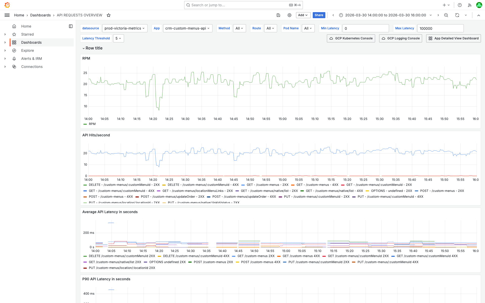
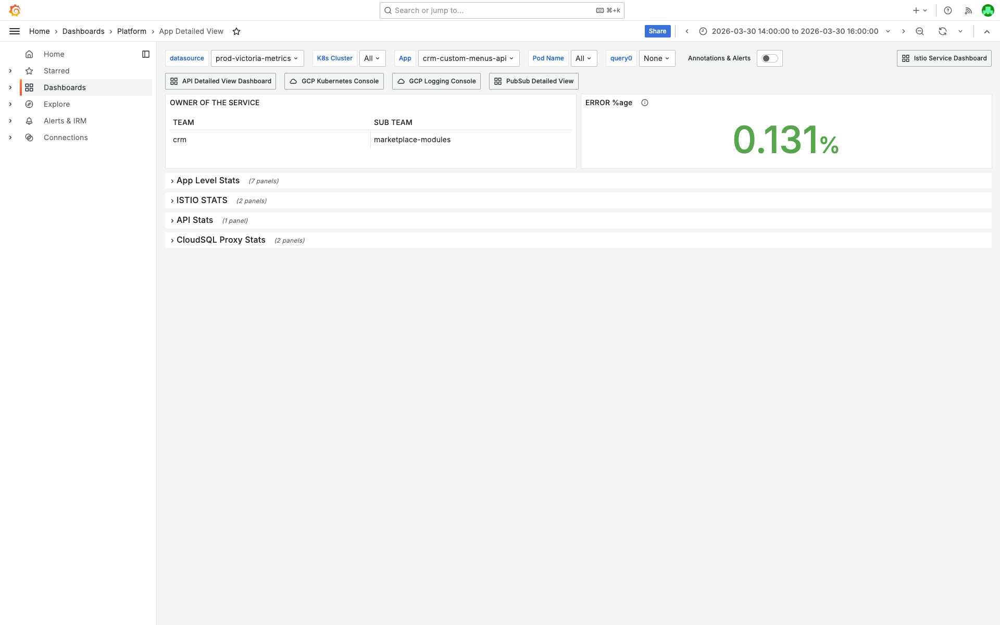
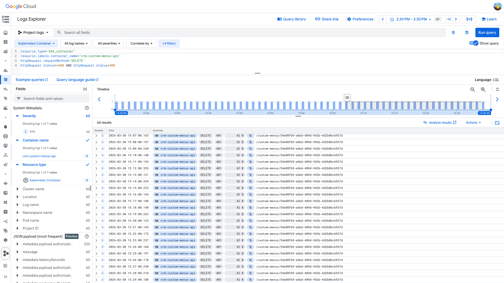
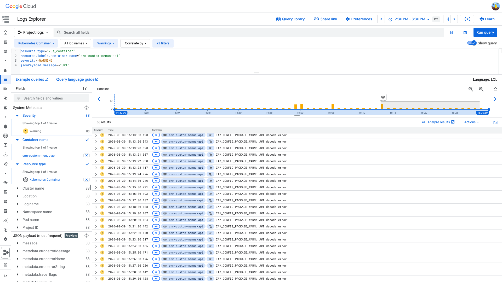

# 4XXPercentagePerAPI Investigation — crm-custom-menus-api — 2026-03-30

**Author:** Himanshu Bhutani
**Generated:** 2026-03-30T17:35:00+05:30

---

## 1. Alert Summary

| Field | Value |
|-------|-------|
| Alert type | 4XXPercentagePerAPI |
| Alert ID | #114257 (OnCall group IHGZHZIRBU973) |
| Workload | crm-custom-menus-api |
| Route | DELETE /custom-menus/:customMenuId |
| Channel | #alerts-crm (C0315RRNH1B) |
| Fired | 15:04:51 IST (09:34:51 UTC), 2026-03-30 |
| Threshold | 1% 4XX rate |
| Current value | 100% (2 requests, both 4XX) |
| Resolution | Manual — resolved by Valluru Reddy (@Ganesh) via OnCall UI |
| Severity | Low — client-side auth failures, no server degradation |

---

## 2. Investigation Findings

### Evidence: Grafana — API Traffic & Error Rate

<details>
<summary>API Requests Overview — crm-custom-menus-api at ~20 req/s total, DELETE 4XX steady at ~1/min</summary>

> **What to look for:** In the "API Hits/second" chart (second panel), locate the `DELETE /custom-menus/customMenuId - 4XX` series. It runs at a steady ~1 request/minute throughout the 2-hour window, while total service traffic is ~15-25 RPM. The "RPM" chart (top) shows normal, stable traffic with no spikes.



[Open in Grafana](https://prod.grafana.leadconnectorhq.com/d/d2db17da-530c-43f3-9273-c0fd664c591f/api-requests-overview?orgId=1&var-datasource=ber8nnhvgsjy8f&var-container=crm-custom-menus-api&from=1774859400000&to=1774866600000)

**Key metrics (from Prometheus query):**
- Total service traffic: ~20-28 req/s (stable)
- DELETE /custom-menus/:customMenuId over 2h: **117 4XX vs 20 2XX** (85% failure rate)
- 4XX source labels: predominantly `source="INTEGRATION"` / `channel="OAUTH"` — integration callers, not web users
</details>

### Evidence: Grafana — Pod Health

<details>
<summary>App Detailed View — CPU 0.06-0.26 cores, memory 0.28-0.44 GiB, zero pod restarts</summary>

> **What to look for:** CPU traces are flat at 0.06-0.26 cores per pod (well below any limit). Memory is stable at 0.28-0.44 GiB. No pod restarts. This rules out any server-side resource pressure as the cause of 4XX errors.



[Open in Grafana](https://prod.grafana.leadconnectorhq.com/d/a4859d4a-1e0a-4ae3-b9b2-d04d366cf29b/app-detailed-view?orgId=1&var-datasource=ber8nnhvgsjy8f&var-container=crm-custom-menus-api&from=1774859400000&to=1774866600000)
</details>

### Evidence: GCP Logs — 401 Unauthorized Errors

<details>
<summary>60 DELETE requests returned 401 — all to same customMenuId, all from expired JWT</summary>

> **What to look for:** Every row shows HTTP status `401`, method `DELETE`, targeting the same UUID `54e08fb9-ebbd-409d-942b-4d2b06c6937d`. Timestamps are spaced ~1 minute apart, indicating a systematic retry pattern from one integration client. The `userAgent` field (visible when expanding entries) shows `Lucee (CFML Engine)`.



**Raw query:**
```
resource.type="k8s_container"
resource.labels.container_name="crm-custom-menus-api"
httpRequest.requestMethod="DELETE"
httpRequest.status>=400 AND httpRequest.status<500
```

[Open in Log Explorer](https://console.cloud.google.com/logs/query;query=resource.type%3D%22k8s_container%22%0Aresource.labels.container_name%3D%22crm-custom-menus-api%22%0AhttpRequest.requestMethod%3D%22DELETE%22%0AhttpRequest.status%3E%3D400%20AND%20httpRequest.status%3C500;timeRange=2026-03-30T09%3A00%3A00Z%2F2026-03-30T10%3A00%3A00Z?project=highlevel-backend)

**Status code distribution (DELETE, 1-hour window):**

| Status | Count | Percentage |
|--------|-------|------------|
| 401 | 60 | 79% |
| 200 | 16 | 21% |
| **Total** | **76** | |

All 4XX errors are 401 (Unauthorized). No 400, 403, 404, or 422 errors found.
</details>

### Evidence: GCP Logs — JWT Decode Warnings

<details>
<summary>83 "IAM_CONFIG_PACKAGE_WARN: JWT decode error" warnings — confirms token is malformed/expired</summary>

> **What to look for:** All entries show `IAM_CONFIG_PACKAGE_WARN: JWT decode error` with WARNING severity. The count (83) exceeds the DELETE 401 count (60), meaning the same expired JWT is also used on other endpoints (GET, PUT). Timestamps align with the 401 responses.



**Raw query:**
```
resource.type="k8s_container"
resource.labels.container_name="crm-custom-menus-api"
severity>=WARNING
jsonPayload.message=~"JWT"
```

[Open in Log Explorer](https://console.cloud.google.com/logs/query;query=resource.type%3D%22k8s_container%22%0Aresource.labels.container_name%3D%22crm-custom-menus-api%22%0Aseverity%3E%3DWARNING%0AjsonPayload.message%3D~%22JWT%22;timeRange=2026-03-30T09%3A00%3A00Z%2F2026-03-30T10%3A00%3A00Z?project=highlevel-backend)

Detailed log entry (expanded from GCP):
- `jsonPayload.statusCode`: 401
- `jsonPayload.response`: "Invalid JWT"
- `jsonPayload.userAgent`: "Lucee (CFML Engine)"
- Bearer token `exp` field: in the past → expired token
</details>

### Evidence: Slack — Fleet-Wide 4XX Burst

<details>
<summary>61 distinct 4XXPercentagePerAPI alerts in #alerts-crm on the same day — systemic noise</summary>

> **What to look for:** The Alert Correlator found ~42 different services firing 4XXPercentagePerAPI between 09:31-09:42 UTC alone, including `logs-api`, `public-api`, `notifications-api`, `voice-ai-api`, `conversations-ai-api`, `oauth-users-api`, `oauth-login-api`, `bulk-actions-api`, `audit-api`, `integrations-api`, and many more. Total for the day: 61 distinct alert groups.

This indicates the 4XX percentage alert rule is systematically oversensitive on low-traffic endpoints. The alert for `crm-custom-menus-api` is one instance of a fleet-wide pattern, not an isolated incident.

**Correlated alerts in ±15 min window:**
- ~42 `4XXPercentagePerAPI` alerts across different services
- 1 `JenkinsNodeOffline` in #alerts-platform (unrelated)
- 0 database alerts
- No deployments found for crm-custom-menus-api in 2h before alert
</details>

---

## 3. Cross-Validation

| Signal | Source | Finding | Agrees? |
|--------|--------|---------|---------|
| All 4XX are 401 | GCP Logs | 60/60 DELETE 4XX = 401 status | ✅ |
| JWT decode error | GCP Logs (WARNING) | 83 warnings matching 401 timestamps | ✅ |
| Integration caller | GCP Logs (userAgent) | `Lucee (CFML Engine)` | ✅ |
| Integration source | Grafana (labels) | `source=INTEGRATION`, `channel=OAUTH` | ✅ |
| No server pressure | Grafana (App Detailed View) | CPU 0.06-0.26, memory 0.28-0.44 GiB, 0 restarts | ✅ |
| Low-volume endpoint | Grafana (API Overview) | 76 total DELETEs/hour | ✅ |
| Fleet-wide pattern | Slack (Alert Correlator) | 61 distinct 4XX alerts same day | ✅ |
| No deployment | Slack search | No deploy found in 2h window | ✅ |

**Confidence: HIGH** — All 8 signals agree. The root cause is unambiguous: an integration client with expired JWT tokens is retrying a DELETE endpoint at ~1 req/min, and the low traffic volume makes the percentage-based alert trigger.

---

## 4. Root Cause

An integration client using `Lucee (CFML Engine)` user agent is sending DELETE requests to `/custom-menus/54e08fb9-ebbd-409d-942b-4d2b06c6937d` with **expired JWT tokens** at a steady cadence of ~1 request/minute. The IAM layer correctly rejects these with **401 Unauthorized** and logs `JWT decode error` warnings.

The service is functioning correctly — the 4XX responses are the expected behavior for invalid credentials. The alert is a false positive caused by:
1. **Low request volume** on the DELETE endpoint (only 76 requests/hour)
2. **Percentage-based threshold** (1%) that doesn't account for sample size
3. **Persistent client retry** with expired credentials inflating the failure ratio

### What Happened

1. **Ongoing** — An integration client (Lucee/CFML) is making DELETE requests with an expired JWT to `/custom-menus/54e08fb9-ebbd-409d-942b-4d2b06c6937d` at ~1 req/min.
2. **15:04 IST** — The 4XX rate on this endpoint reached 100% (2 requests, both 401) in the alert evaluation window, triggering the threshold.
3. **~15:04 IST** — This was one of ~42 similar alerts across different services in a 10-minute window, all on low-traffic endpoints.
4. **Resolved** — Manually marked resolved by Valluru Reddy (@Ganesh) in OnCall.

<details>
<summary>Detailed timeline — full event log</summary>

| Time (IST) | Source | Event |
|---|---|---|
| 14:30-16:00 | GCP Logs | Steady ~1 DELETE 401/min to `/custom-menus/54e08fb9-...` from Lucee CFML |
| 14:30-16:00 | GCP Logs | Matching `IAM_CONFIG_PACKAGE_WARN: JWT decode error` at same cadence |
| 15:04:51 | Grafana OnCall | Alert #114257 fires: 4XXPercentagePerAPI, 100% on 2 total requests |
| 15:01-15:12 | Slack #alerts-crm | ~42 different services fire 4XXPercentagePerAPI alerts |
| Unknown | OnCall | Resolved by Valluru Reddy (@Ganesh) |

</details>

---

<details>
<summary>Probable noise — transient errors during disruption (not root cause)</summary>

| Pattern | Count | Why it's noise |
|---------|-------|----------------|
| `NotFoundException: The custom menu does not exist or has already been deleted` | Low | Normal business logic — menu was already deleted, not an error condition |
| Other 4XX from non-DELETE methods | ~23 (83 JWT errors - 60 DELETE) | Same expired JWT client also hitting GET/PUT endpoints |

</details>

---

## 5. Action Items

### For the alert

| Priority | Action | Owner | Reasoning |
|----------|--------|-------|-----------|
| **Medium** | Add minimum request volume gate to 4XXPercentagePerAPI rule (e.g., ≥10 req/min before evaluating %) | Platform / Observability | Eliminates low-N false positives — 61 alerts/day is alert fatigue |
| **Low** | Consider excluding 401 from the 4XX percentage alert | Platform / Observability | Auth failures are expected client behavior, not service degradation |

### Separate issues found

| Priority | Action | Owner | Reasoning |
|----------|--------|-------|-----------|
| **Low** | Identify and contact the Lucee/CFML integration owner to rotate expired JWT tokens | CRM team / Integration support | Client is wasting resources retrying with bad credentials at ~1/min to a specific customMenuId |
| **Info** | Alert `logs_link` in Slack points to `httpRequest.status>=500` despite being a 4XX alert | Platform / Observability | Minor — the alert template may be hardcoded to 5XX log queries |

---

## 6. Deployment Details

| Parameter | Value |
|-----------|-------|
| Container | crm-custom-menus-api |
| CPU usage | 0.06-0.26 cores per pod |
| Memory usage | 0.28-0.44 GiB per pod |
| Pod restarts | 0 |
| Recent deploys | None in 2h before alert |

---

## 7. Cross-Validation Summary

| Source A | Source B | Agreement | Confidence |
|----------|----------|-----------|------------|
| GCP Logs (401 status) | GCP Logs (JWT decode warning) | ✅ Both confirm expired JWT | High |
| GCP Logs (userAgent=Lucee) | Grafana (source=INTEGRATION) | ✅ Both confirm integration caller | High |
| Grafana (low CPU/memory) | GCP Logs (no 5XX errors) | ✅ Server is healthy | High |
| Grafana (low traffic) | Slack (61 alerts/day) | ✅ Fleet-wide low-N alert noise | High |

**Overall confidence: HIGH** — Root cause is fully established from multiple independent sources.
