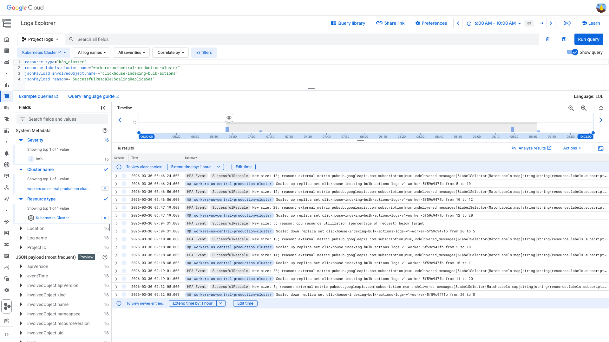
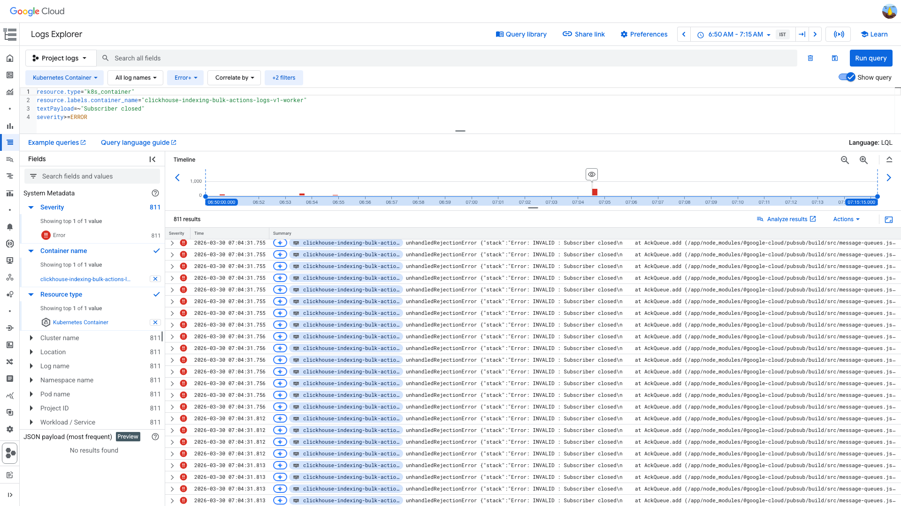
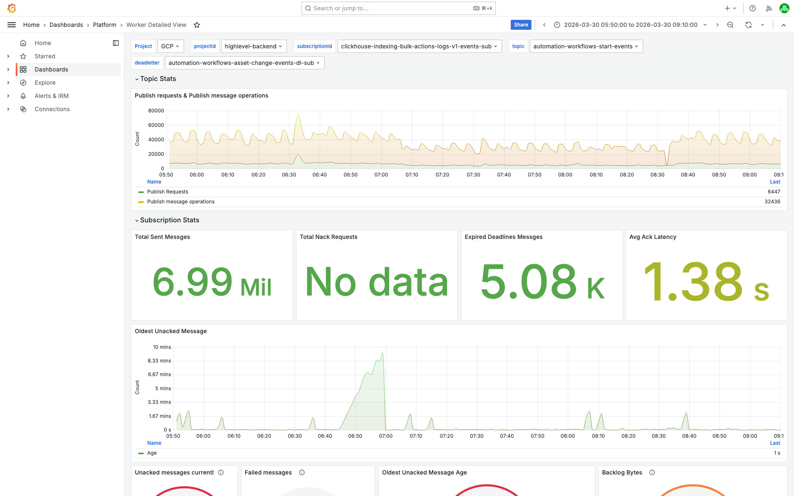
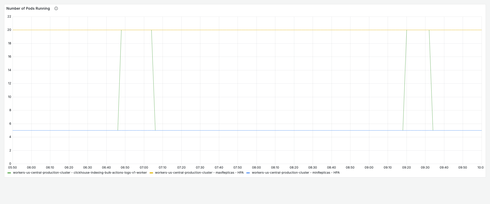
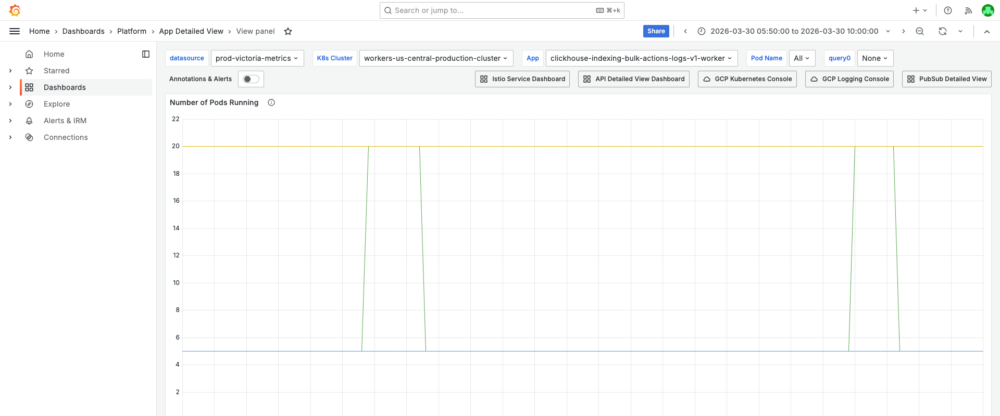
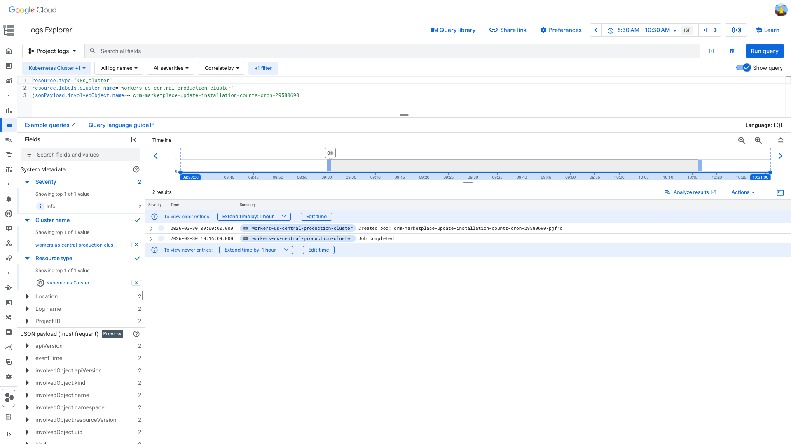
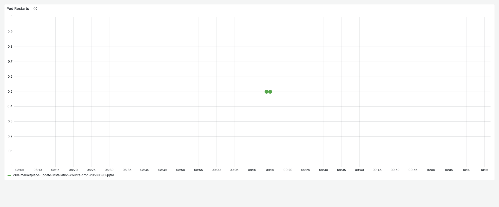
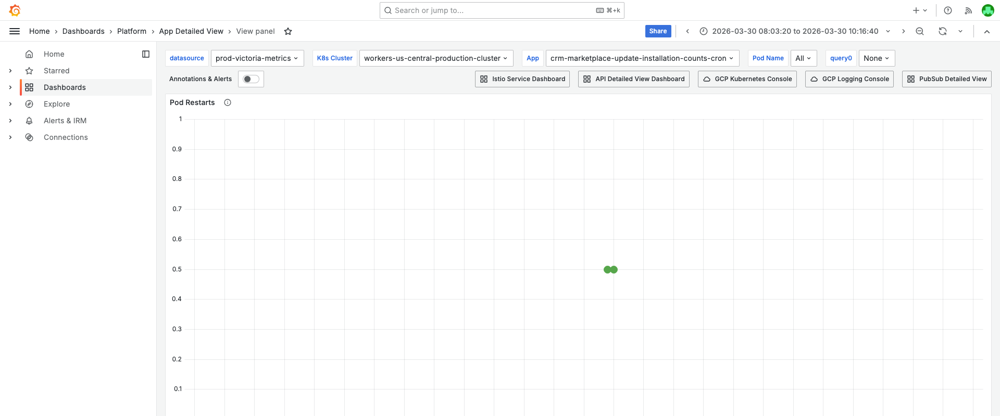

# Dual Alert Investigation — PubSub Unacked + CronJob Pod Restart — 2026-03-30

**Author:** Himanshu Bhutani | **Status:** Both auto-resolved / acknowledged

## Summary

| Field | Alert 1 | Alert 2 |
|-------|---------|---------|
| Alert | #113997 Pubsub Unacked Messages above 10k | #114003 PodRestartsAboveThreshold |
| Service | clickhouse-indexing-bulk-actions-logs-v1-worker | crm-marketplace-update-installation-counts-cron |
| Cluster | workers-us-central-production-cluster | workers-us-central-production-cluster |
| Fired | 06:58 IST (01:28 UTC) | 09:14 IST (03:44 UTC) |
| Value | 184,887 unacked messages | 1 restart |
| Duration | ~18 min (auto-resolved) | Single event (acknowledged) |
| Impact | Delayed ClickHouse indexing of bulk action logs | None — CronJob completed on retry |

**These are two independent recurring incidents that fired in the same alert channel within ~2 hours. They do not share a root cause.**

## Root Cause — Alert 1: HPA Thrashing (recurring)

The ClickHouse bulk actions worker HPA has **conflicting scaling metrics**: PubSub `num_undelivered_messages` scales UP, while CPU utilization scales DOWN. The worker is I/O-bound (low CPU despite high load), so CPU-based scale-down fires prematurely while backlog is still high. This creates a **scale-up → scale-down → backlog spike → scale-up** oscillation.

**This is the same root cause as Mar 27 and Mar 29** (investigation #48).

## Root Cause — Alert 2: CronJob Timeout (recurring false positive)

The `crm-marketplace-update-installation-counts-cron` CronJob runs a heavy MongoDB aggregation via HTTP that takes 27–76 minutes. The first container is killed at ~20 min by a timeout, K8s restarts it (`restartPolicy: OnFailure`), and the second attempt completes. The restart triggers `PodRestartsAboveThreshold` even though the job succeeds.

**This is the same pattern as Mar 15 and Mar 16** (investigations #21, #23).

## Proof

<details>
<summary>[GCP] HPA oscillated 5→20→5 twice in 4 hours — scaling conflict confirmed</summary>

> **Verify:** Two complete cycles of scale-up on PubSub backlog followed by scale-down on CPU. The first cycle at 06:46–07:04 IST has the premature CPU-driven scale-down; the second at 09:18–09:32 IST resolved naturally when backlog drained.

| Time (IST) | Replicas | Trigger |
|---|---|---|
| 06:46:24 | 5 → 10 → 12 → 20 | PubSub undelivered above target |
| 07:04:31 | 20 → 5 | **CPU below target** (premature) |
| 09:18:08 | 5 → 10 → 11 → 20 | PubSub undelivered above target |
| 09:32:05 | 20 → 5 | PubSub below target (natural drain) |

```
resource.type="k8s_cluster"
resource.labels.cluster_name="workers-us-central-production-cluster"
jsonPayload.involvedObject.name=~"clickhouse-indexing-bulk-actions"
jsonPayload.reason=~"SuccessfulRescale|ScalingReplicaSet"
```



[Open in GCP Log Explorer](https://console.cloud.google.com/logs/query;query=resource.type%3D%22k8s_cluster%22%0Aresource.labels.cluster_name%3D%22workers-us-central-production-cluster%22%0AjsonPayload.involvedObject.name%3D~%22clickhouse-indexing-bulk-actions%22%0AjsonPayload.reason%3D~%22SuccessfulRescale%7CScalingReplicaSet%22;timeRange=2026-03-30T00%3A30%3A00Z%2F2026-03-30T04%3A30%3A00Z?project=highlevel-backend)

</details>

<details>
<summary>[GCP] Subscriber Closed errors burst at exactly 07:04:31 IST — confirms scale-down disruption</summary>

> **Verify:** All `INVALID : Subscriber closed` errors cluster at exactly 01:34:31 UTC (07:04:31 IST), which is the exact timestamp of the HPA scale-down 20→5.

```
resource.type="k8s_container"
resource.labels.container_name="clickhouse-indexing-bulk-actions-logs-v1-worker"
textPayload=~"Subscriber closed"
severity>=ERROR
```



[Open in GCP Log Explorer](https://console.cloud.google.com/logs/query;query=resource.type%3D%22k8s_container%22%0Aresource.labels.container_name%3D%22clickhouse-indexing-bulk-actions-logs-v1-worker%22%0AtextPayload%3D~%22Subscriber%20closed%22%0Aseverity%3E%3DERROR;timeRange=2026-03-30T01%3A20%3A00Z%2F2026-03-30T01%3A45%3A00Z?project=highlevel-backend)

</details>

<details>
<summary>[Grafana] Backlog peaked at ~749k undelivered, oldest unacked ~9.3 min — recovered after HPA scale-up</summary>

> **Verify:** The Worker Detailed View shows unacked messages spiking during the HPA oscillation and recovering once pods scale back to 20. Ack rate stayed positive throughout (workers were processing, just not enough of them).



[Open in Grafana](https://prod.grafana.leadconnectorhq.com/d/a04e5483-eb8c-47ef-8198-30147926964c/worker-detailed-view?orgId=1&var-subscriptionId=clickhouse-indexing-bulk-actions-logs-v1-events-sub&from=1774830000000&to=1774842000000)

</details>

<details>
<summary>[Grafana] Pod count oscillated 5→20→5 — no pod restarts</summary>

> **Verify:** Pod count panel shows step function 5→20→5, with no restart bars visible. This is scaling, not crashes.



**Context (filters + time range):**


[Open in Grafana](https://prod.grafana.leadconnectorhq.com/d/a4859d4a-1e0a-4ae3-b9b2-d04d366cf29b/app-detailed-view?orgId=1&var-datasource=ber8nnhvgsjy8f&var-container=clickhouse-indexing-bulk-actions-logs-v1-worker&var-cluster=workers-us-central-production-cluster&from=1774830000000&to=1774845000000)

</details>

<details>
<summary>[GCP] CronJob completed successfully — pod created 09:00 IST, job completed 10:16 IST</summary>

> **Verify:** Only two events: `SuccessfulCreate` at 09:00 IST (03:30 UTC) and `Completed` at 10:16 IST (04:46 UTC). No `Failed`, `Backoff`, or `Killing` events.



[Open in GCP Log Explorer](https://console.cloud.google.com/logs/query;query=resource.type%3D%22k8s_cluster%22%0Aresource.labels.cluster_name%3D%22workers-us-central-production-cluster%22%0AjsonPayload.involvedObject.name%3D~%22crm-marketplace-update-installation-counts-cron-29580690%22;timeRange=2026-03-30T03%3A00%3A00Z%2F2026-03-30T05%3A00%3A00Z?project=highlevel-backend)

</details>

<details>
<summary>[Grafana] Single restart on CronJob container — no crash loop</summary>

> **Verify:** Pod restarts panel shows exactly 1 restart at 09:14 IST. No recurring pattern.



**Context (filters + time range):**


[Open in Grafana](https://prod.grafana.leadconnectorhq.com/d/a4859d4a-1e0a-4ae3-b9b2-d04d366cf29b/app-detailed-view?orgId=1&var-datasource=ber8nnhvgsjy8f&var-container=crm-marketplace-update-installation-counts-cron&var-cluster=workers-us-central-production-cluster&from=1774838000000&to=1774846000000)

</details>

## Action Items

| Priority | Action | Owner | Alert |
|----------|--------|-------|-------|
| **Medium** | Fix HPA metric conflict — remove CPU-based scale-down or add `stabilizationWindowSeconds` for scale-down behavior | CRM Bulk Actions team | Alert 1 |
| **Low** | Optimize the `update-installation-counts` API to run under 20 min, or increase CronJob container timeout | CRM Marketplace team | Alert 2 |
| **Low** | Suppress PodRestartsAboveThreshold for CronJob workloads where single restart is expected behavior | Platform team | Alert 2 |

## Links

- [Verbose report](report-verbose.md)
- [Grafana — Worker Detailed View](https://prod.grafana.leadconnectorhq.com/d/a04e5483-eb8c-47ef-8198-30147926964c/worker-detailed-view?orgId=1&var-subscriptionId=clickhouse-indexing-bulk-actions-logs-v1-events-sub&from=1774830000000&to=1774842000000)
- [Grafana — App Detailed View (ClickHouse)](https://prod.grafana.leadconnectorhq.com/d/a4859d4a-1e0a-4ae3-b9b2-d04d366cf29b/app-detailed-view?orgId=1&var-container=clickhouse-indexing-bulk-actions-logs-v1-worker&var-cluster=workers-us-central-production-cluster&from=1774830000000&to=1774845000000)
- [Past investigation — Mar 27/29 HPA thrashing (same root cause)](https://github.com/bhutanihimanshu/alert-investigations/blob/main/reports/2026/03/29-pubsub-unacked-clickhouse-bulk-actions-v1/report.md)
