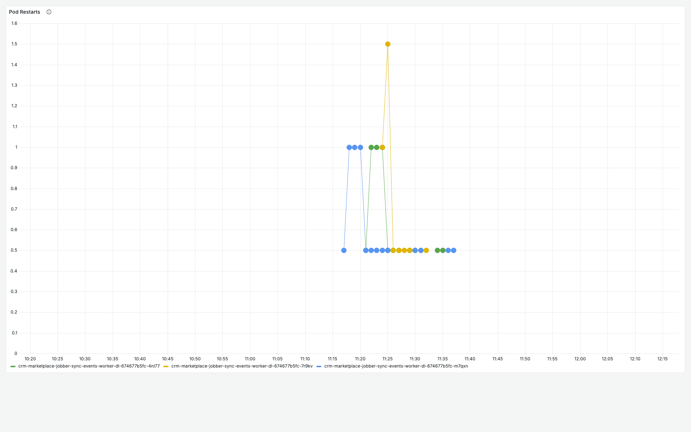
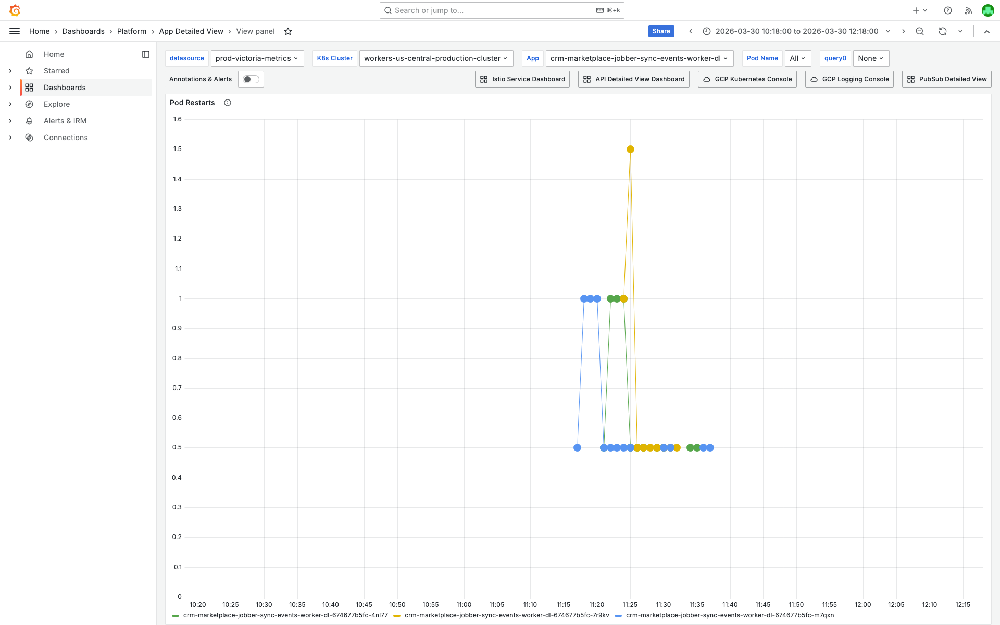
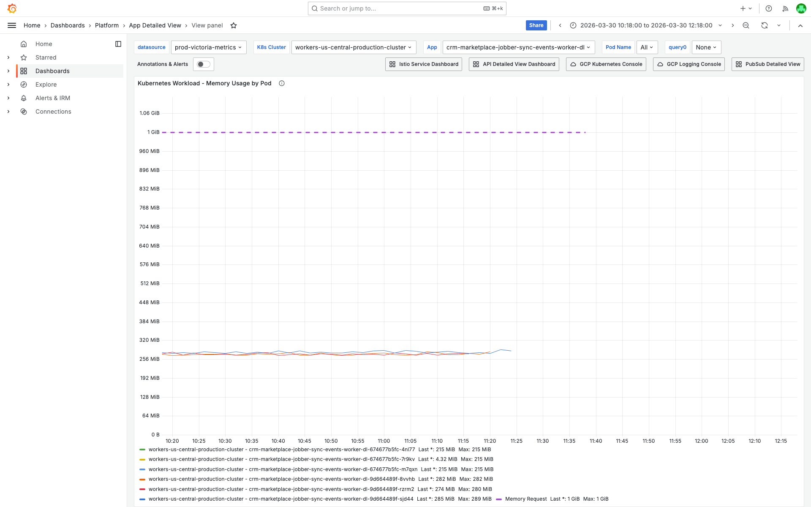
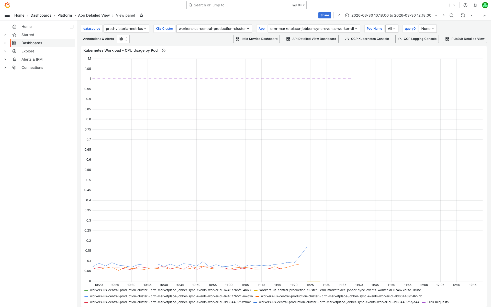
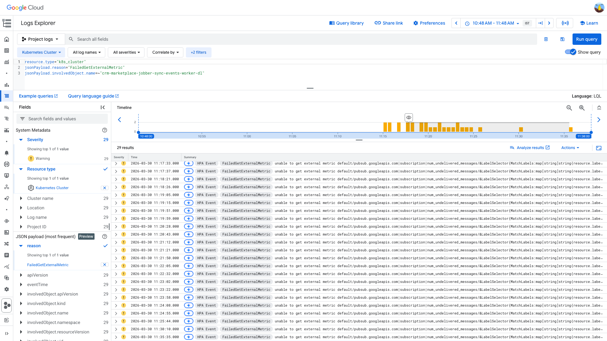

# PodRestartsAboveThreshold Investigation — crm-marketplace-jobber-sync-events-worker-dl — 2026-03-30

**Author:** Himanshu Bhutani
**Generated:** 2026-03-30 11:45 IST

---

## Alert Summary

| Field | Value |
|-------|-------|
| Alert type | PodRestartsAboveThreshold |
| Alert ID | [#114012](https://prod.grafana.leadconnectorhq.com/a/grafana-oncall-app/alert-groups/IJ3GU4193CX6Z) |
| Workload | crm-marketplace-jobber-sync-events-worker-dl |
| Cluster | workers-us-central-production-cluster |
| Time | 11:18 IST (05:48 UTC) on 2026-03-30 |
| Threshold | 1 |
| Channel | #alerts-crm |
| Acknowledged by | Karan Kaneria |

---

## Root Cause

**PubSub subscription naming mismatch.** The DL worker deployment sets `SUBSCRIPTION_NAME=crm-marketplace-jobber-sync-events-dl`, but this is the PubSub **topic** name, not the subscription. The actual DL subscription (created by Terraform) is `crm-marketplace-jobber-sync-events-dl-sub`. The worker starts, calls `asynchronousPull()` on a non-existent subscription, receives `Resource not found`, does a graceful shutdown (exit 0), and K8s restarts it — creating a CrashLoopBackOff loop.

This is a **persistent configuration issue** — Slack search shows 21+ prior PodRestartsAboveThreshold alerts for this container since December 2025. Every deployment or pod restart triggers a new alert cycle.

---

## What Happened

1. **10:58 IST (05:28 UTC)** — Jenkins build #1275 for `crm-marketplace-jobber-sync-events-worker` completed successfully, triggered by Karan. This rolls out new pods for both the main worker and the DL worker.
2. **11:14–11:23 IST (05:44–05:53 UTC)** — New ReplicaSet `674677b5fc` scales up, old RS `9d664489f` scales down. Three new DL worker pods start.
3. **11:18 IST (05:48 UTC)** — Alert fires. Pods attempt to subscribe to `crm-marketplace-jobber-sync-events-dl`, receive `PubSub error: Error: Resource not found`, and gracefully exit (code 0).
4. **11:20+ IST** — All 3 pods enter CrashLoopBackOff. HPA also reports `FailedGetExternalMetric` for the same non-existent subscription.

<details>
<summary>Detailed timeline — full event log</summary>

| Time (IST) | Source | Event |
|---|---|---|
| 10:58 IST (05:28 UTC) | Jenkins | Build #1275 for crm-marketplace-jobber-sync-events-worker completed |
| 11:14 IST (05:44 UTC) | K8s Deployment | ScalingReplicaSet: new RS 674677b5fc scaled up |
| 11:14 IST (05:44 UTC) | K8s Deployment | ScalingReplicaSet: old RS 9d664489f scaled down |
| 11:18 IST (05:48 UTC) | Grafana OnCall | Alert #114012 PodRestartsAboveThreshold fires |
| 11:20 IST (05:50 UTC) | Grafana Metrics | Pod m7qxn: 4 restarts in 5m bucket |
| 11:24 IST (05:54 UTC) | K8s HPA | FailedGetExternalMetric: unable to get pubsub.googleapis.com\|subscription\|num_undelivered_messages |
| 11:25 IST (05:55 UTC) | Grafana Metrics | Pods 4nl77, 7r9kv: 3-4 restarts each in 5m bucket |
| 11:27 IST (05:57 UTC) | GCP Logs | ERROR: PubSub error: Resource not found (resource=crm-marketplace-jobber-sync-events-dl) |
| 11:28 IST (05:58 UTC) | GCP Logs | ERROR: PubSub error: Resource not found (repeat) |
| 11:29 IST (05:59 UTC) | GCP Logs | ERROR: PubSub error: Resource not found (repeat) |
| 11:30 IST (06:00 UTC) | K8s HPA | FailedGetExternalMetric (repeat) |
| 11:33 IST (06:03 UTC) | GCP Logs | ERROR: PubSub error: Resource not found (repeat) |

</details>

---

## Investigation Findings

### Evidence: Grafana — Pod Health

<details>
<summary>Pod Restarts — fleet-wide CrashLoopBackOff across all 3 pods starting at 11:20 IST</summary>

> **What to look for:** All 3 pods (m7qxn, 4nl77, 7r9kv) show restart spikes starting at ~11:20 IST. This is fleet-wide, not isolated to one pod — ruling out node-level issues.



**Context (filters + time range):**


[Open in Grafana](https://prod.grafana.leadconnectorhq.com/d/a4859d4a-1e0a-4ae3-b9b2-d04d366cf29b/app-detailed-view?orgId=1&var-container=crm-marketplace-jobber-sync-events-worker-dl&var-cluster=workers-us-central-production-cluster&from=1774846080000&to=1774853280000&viewPanel=36)
</details>

<details>
<summary>Memory by Pod — peak 0.28 GiB, well below 1Gi limit (rules out OOM)</summary>

> **What to look for:** Memory usage stays between 0.21–0.28 GiB across all pods. The limit is 1Gi. No memory pressure whatsoever — this is definitively NOT an OOM kill.


**Context (filters + time range):**


[Open in Grafana](https://prod.grafana.leadconnectorhq.com/d/a4859d4a-1e0a-4ae3-b9b2-d04d366cf29b/app-detailed-view?orgId=1&var-container=crm-marketplace-jobber-sync-events-worker-dl&var-cluster=workers-us-central-production-cluster&from=1774846080000&to=1774853280000&viewPanel=30)
</details>

<details>
<summary>CPU by Pod — peak ~0.15 cores, no saturation (request: 1 core)</summary>

> **What to look for:** CPU usage barely registers (~0.15 cores max). The request is 1 core. CPU saturation is not a factor.


**Context (filters + time range):**


[Open in Grafana](https://prod.grafana.leadconnectorhq.com/d/a4859d4a-1e0a-4ae3-b9b2-d04d366cf29b/app-detailed-view?orgId=1&var-container=crm-marketplace-jobber-sync-events-worker-dl&var-cluster=workers-us-central-production-cluster&from=1774846080000&to=1774853280000&viewPanel=16)
</details>

### Evidence: GCP Logs — PubSub Error

<details>
<summary>PubSub "Resource not found" errors — repeated every restart cycle</summary>

> **What to look for:** Every error entry shows the same message: `PubSub error: Error: Resource not found (resource=crm-marketplace-jobber-sync-events-dl)`. The subscription name in the error is the **topic** name, not the actual subscription.


```
resource.type="k8s_container"
resource.labels.container_name="crm-marketplace-jobber-sync-events-worker-dl"
severity>=ERROR
jsonPayload.message=~"Resource not found"
```

[Open in GCP Log Explorer](https://console.cloud.google.com/logs/query;query=resource.type%3D%22k8s_container%22%0Aresource.labels.container_name%3D%22crm-marketplace-jobber-sync-events-worker-dl%22%0Aseverity%3E%3DERROR%0AjsonPayload.message%3D~%22Resource%20not%20found%22;timeRange=2026-03-30T05%3A18%3A00Z%2F2026-03-30T06%3A18%3A00Z?project=highlevel-backend)
</details>

### Evidence: GCP Logs — K8s Cluster Events

<details>
<summary>FailedGetExternalMetric — HPA cannot query PubSub metrics for non-existent subscription</summary>

> **What to look for:** Repeated `FailedGetExternalMetric` events showing HPA cannot get `num_undelivered_messages` for `crm-marketplace-jobber-sync-events-dl`. This confirms the subscription doesn't exist from GCP's perspective either.



```
resource.type="k8s_cluster"
jsonPayload.reason="FailedGetExternalMetric"
jsonPayload.involvedObject.name=~"crm-marketplace-jobber-sync-events-worker-dl"
```

[Open in GCP Log Explorer](https://console.cloud.google.com/logs/query;query=resource.type%3D%22k8s_cluster%22%0AjsonPayload.reason%3D%22FailedGetExternalMetric%22%0AjsonPayload.involvedObject.name%3D~%22crm-marketplace-jobber-sync-events-worker-dl%22;timeRange=2026-03-30T05%3A18%3A00Z%2F2026-03-30T06%3A18%3A00Z?project=highlevel-backend)
</details>

### Evidence: kubectl — Pod State and Configuration

<details>
<summary>kubectl describe pod — CrashLoopBackOff, exit 0 (Completed)</summary>

> **What to look for:** `Last State: Terminated, Reason: Completed, Exit Code: 0` — the worker shuts down cleanly after failing to find the subscription. It's not crashing — it's exiting normally, but K8s expects it to run indefinitely.

```
Container: crm-marketplace-jobber-sync-events-worker-dl
  State:          Waiting (CrashLoopBackOff)
  Last State:     Terminated
    Reason:       Completed
    Exit Code:    0
  Restart Count:  5-6

Istio-proxy: Running, Restart Count: 0
```
</details>

<details>
<summary>kubectl env var — SUBSCRIPTION_NAME points to topic, not subscription</summary>

> **What to look for:** The env var is set to `crm-marketplace-jobber-sync-events-dl` (the topic name). The actual subscription is `crm-marketplace-jobber-sync-events-dl-sub`.

```
SUBSCRIPTION_NAME=crm-marketplace-jobber-sync-events-dl
```
</details>

<details>
<summary>GCP PubSub API — direct confirmation of naming mismatch</summary>

> **What to look for:** The subscription the worker tries to use doesn't exist. The one that does exist has a different name.

**Worker tries:** `crm-marketplace-jobber-sync-events-dl` → NOT_FOUND
**Actual subscription:** `crm-marketplace-jobber-sync-events-dl-sub` → exists (topic: `crm-marketplace-jobber-sync-events-dl`, created by Terraform)

```bash
$ gcloud pubsub subscriptions describe crm-marketplace-jobber-sync-events-dl
ERROR: NOT_FOUND: Resource not found (resource=crm-marketplace-jobber-sync-events-dl)

$ gcloud pubsub subscriptions describe crm-marketplace-jobber-sync-events-dl-sub
name: projects/highlevel-backend/subscriptions/crm-marketplace-jobber-sync-events-dl-sub
topic: projects/highlevel-backend/topics/crm-marketplace-jobber-sync-events-dl
labels:
  created-from: terraform
  team: crm
  sub_team: marketplace
```
</details>

---

## Cross-Validation

| Signal | Source 1 | Source 2 | Source 3 | Agree? |
|--------|----------|----------|----------|--------|
| Subscription doesn't exist | GCP PubSub API (NOT_FOUND) | GCP container logs (Resource not found) | K8s HPA events (FailedGetExternalMetric) | ✅ Yes |
| Exit code 0 (clean exit) | kubectl describe (Completed) | Kubelet logs (ContainerDied) | Grafana termination reason (Completed) | ✅ Yes |
| No resource pressure | Grafana memory (0.28 GiB / 1Gi) | Grafana CPU (0.15 / 1 core) | No OOM in GCP logs | ✅ Yes |
| Deployment triggered restart | Slack Jenkins alert (build #1275) | K8s events (ScalingReplicaSet) | Alert timing (~20min post-deploy) | ✅ Yes |

**Confidence: HIGH** — All 4 independent sources confirm the same root cause. No conflicting evidence.

---

## Causal Chain

```
Helm chart derives DL subscription name as "{prefix}-dl" (topic name)
    ↓
Terraform creates DL subscription as "{prefix}-dl-sub"
    ↓
SUBSCRIPTION_NAME env var = crm-marketplace-jobber-sync-events-dl (topic, not subscription)
    ↓
Worker starts → calls asynchronousPull("crm-marketplace-jobber-sync-events-dl")
    ↓
PubSub returns: Resource not found
    ↓
Worker does graceful shutdown → exit code 0
    ↓
K8s restarts pod (expects long-running) → CrashLoopBackOff
    ↓
HPA also fails: FailedGetExternalMetric for same non-existent subscription
    ↓
All 3 pods stuck in CrashLoopBackOff indefinitely
```

---

<details>
<summary>Probable noise — transient errors during disruption (not root cause)</summary>

| Time | Pattern | Why it's noise |
|------|---------|----------------|
| 11:29 IST | `(Use node --trace-deprecation ... to show where the warning was created)` | Node.js deprecation warning printed on startup — unrelated to PubSub failure |
| 11:20-11:30 IST | Jobber API errors (Job not found, Failed to create GHL contact: 400) | These are from the **main worker**, not the DL worker. They appear in the search window because both share the same deployment |

</details>

---

## Action Items

| Priority | Action | Owner | Reasoning |
|----------|--------|-------|-----------|
| **High** | Fix DL subscription name: change `SUBSCRIPTION_NAME` from `crm-marketplace-jobber-sync-events-dl` to `crm-marketplace-jobber-sync-events-dl-sub` | CRM Marketplace team | Fixes the immediate CrashLoopBackOff |
| **High** | Investigate if this naming mismatch affects other DL workers across the platform | Platform / CRM Marketplace | There are 50+ `-dl` deployments in the cluster. If the Helm chart auto-generates DL subscription names, this may be a systemic issue |
| Medium | Add a startup health check that validates the PubSub subscription exists before entering the pull loop | Platform (base-worker) | Would fail fast with a clear error instead of a cryptic exit 0 → CrashLoopBackOff |
| Low | Suppress PodRestartsAboveThreshold for this container until the fix is deployed | On-call | This alert has fired 21+ times since Dec 2025 with no fix — it's alert fatigue |

---

## Deployment Details

| Setting | Value |
|---------|-------|
| Container | crm-marketplace-jobber-sync-events-worker-dl |
| Main subscription (working) | crm-marketplace-jobber-sync-events-sub |
| DL subscription (exists in GCP) | crm-marketplace-jobber-sync-events-dl-sub |
| DL subscription (worker tries) | crm-marketplace-jobber-sync-events-dl ← **WRONG** |
| DL topic | crm-marketplace-jobber-sync-events-dl |
| Memory request | 1Gi |
| CPU request | 1 |
| HPA | min: 1, max: 3, CPU target: 65% |
| Istio proxy | memory: 896Mi, CPU: 200m |
| Replicas (during incident) | 3 (all in CrashLoopBackOff) |
| Service account | default-crm-marketplace |
| Team | CRM / Marketplace |

---

## Correlated Alerts

| Time | Channel | Alert | Related? |
|------|---------|-------|----------|
| 11:11–11:17 IST | #alerts-platform | Cloudflare HTTP DDoS auto-mitigation (sites.ludicrous.cloud, agnelek.com) | ❌ Unrelated |
| — | #alerts-crm-conversations | No alerts in ±15 min window | — |
| — | #alerts-database | No alerts in ±15 min window | — |

No correlated alerts. This is an isolated configuration issue.

---

## Prior Alert History

21+ PodRestartsAboveThreshold alerts for this container found via Slack search, dating back to December 2025. A sustained noisy period occurred in Dec 2025 (repeated firing every ~4 hours). In 2026, alerts are sparser but recur on every deployment or pod restart. No documented root cause in any prior thread.
