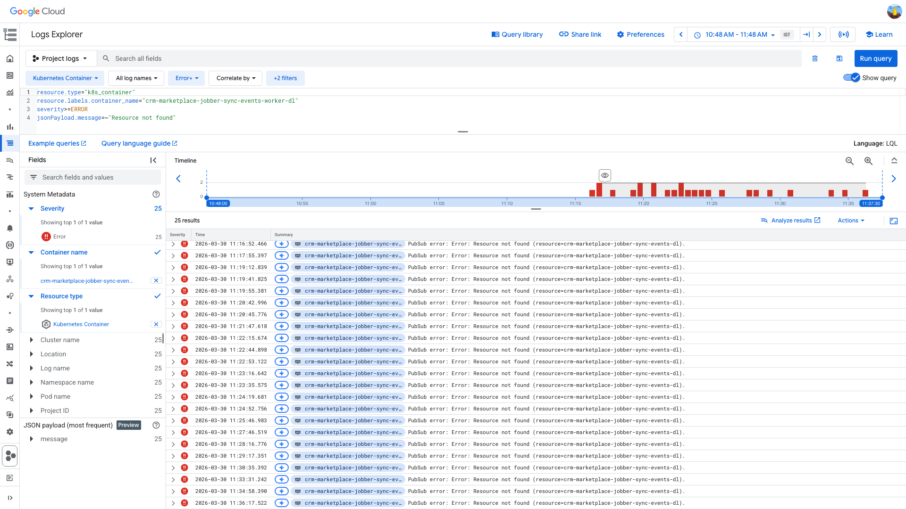
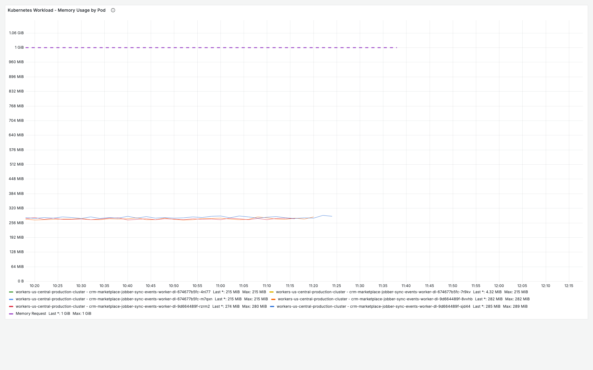
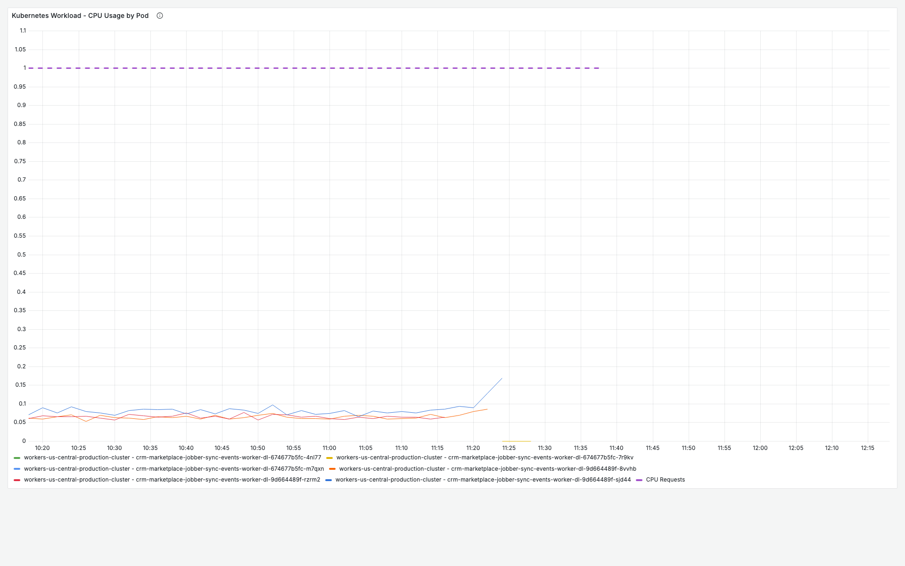

# PodRestartsAboveThreshold — crm-marketplace-jobber-sync-events-worker-dl — 2026-03-30

**Author:** Himanshu Bhutani | **Status:** Persistent (recurring since Dec 2025)

## Summary

| Field | Value |
|-------|-------|
| Alert | [#114012 PodRestartsAboveThreshold](https://prod.grafana.leadconnectorhq.com/a/grafana-oncall-app/alert-groups/IJ3GU4193CX6Z) |
| Service | crm-marketplace-jobber-sync-events-worker-dl |
| Cluster | workers-us-central-production-cluster |
| Fired | 11:18 IST (05:48 UTC) on 2026-03-30 |
| Duration | Ongoing — all 3 pods in CrashLoopBackOff |
| Impact | DL worker non-functional; dead-letter messages from the Jobber sync pipeline are not being processed |

## Root Cause

The DL worker is configured with `SUBSCRIPTION_NAME=crm-marketplace-jobber-sync-events-dl`, but this PubSub subscription **does not exist**. The actual dead-letter subscription created by Terraform is `crm-marketplace-jobber-sync-events-dl-sub`. The worker starts, fails to find the subscription, performs a graceful shutdown (exit 0), and K8s restarts it — creating a perpetual CrashLoopBackOff. A deployment (~20 min before the alert) triggered a fresh restart cycle.

## What Happened

1. **10:58 IST** — Jenkins build #1275 for `crm-marketplace-jobber-sync-events-worker` completed, rolling out new pods for both the main worker and DL worker.
2. **11:14–11:23 IST** — New DL worker pods (RS `674677b5fc`) start, attempt to subscribe to `crm-marketplace-jobber-sync-events-dl`, receive `Resource not found`, and gracefully exit (code 0).
3. **11:18 IST** — PodRestartsAboveThreshold fires after accumulated restarts exceed threshold of 1.
4. **11:20+ IST** — All 3 pods enter CrashLoopBackOff with increasing back-off intervals.

## Proof

<details>
<summary>[GCP PubSub API] Subscription does not exist — confirmed via gcloud</summary>

> **Verify:** `gcloud pubsub subscriptions describe` returns NOT_FOUND for the subscription the worker is trying to use.

```
$ gcloud pubsub subscriptions describe crm-marketplace-jobber-sync-events-dl --project=highlevel-backend
ERROR: NOT_FOUND: Resource not found (resource=crm-marketplace-jobber-sync-events-dl)
```

The correct DL subscription is `crm-marketplace-jobber-sync-events-dl-sub` (created by Terraform), subscribed to topic `crm-marketplace-jobber-sync-events-dl`.
</details>

<details>
<summary>[GCP Logs] Repeated "Resource not found" errors — every restart attempt</summary>

> **Verify:** ERROR logs show `PubSub error: Error: Resource not found (resource=crm-marketplace-jobber-sync-events-dl)` repeating every ~1 minute as pods restart.



```
resource.type="k8s_container"
resource.labels.container_name="crm-marketplace-jobber-sync-events-worker-dl"
severity>=ERROR
jsonPayload.message=~"Resource not found"
```

[Open in GCP Log Explorer](https://console.cloud.google.com/logs/query;query=resource.type%3D%22k8s_container%22%0Aresource.labels.container_name%3D%22crm-marketplace-jobber-sync-events-worker-dl%22%0Aseverity%3E%3DERROR%0AjsonPayload.message%3D~%22Resource%20not%20found%22;timeRange=2026-03-30T05%3A18%3A00Z%2F2026-03-30T06%3A18%3A00Z?project=highlevel-backend)
</details>

<details>
<summary>[kubectl] All 3 pods in CrashLoopBackOff — exit code 0 (Completed), not OOM</summary>

> **Verify:** Last terminated reason is `Completed` with exit code `0`. Restart count elevated (5-6). Container is `Waiting: CrashLoopBackOff`.

```
$ kubectl describe pod crm-marketplace-jobber-sync-events-worker-dl-674677b5fc-m7qxn
  Last State:     Terminated
    Reason:       Completed
    Exit Code:    0
```
</details>

<details>
<summary>[kubectl] SUBSCRIPTION_NAME env var points to topic name, not subscription</summary>

> **Verify:** The env var is set to the topic name (without `-sub` suffix).

```
$ kubectl get deployment crm-marketplace-jobber-sync-events-worker-dl -o jsonpath='{.spec.template.spec.containers[0].env}'
SUBSCRIPTION_NAME=crm-marketplace-jobber-sync-events-dl    # ← topic name, not subscription
```

The actual subscription is `crm-marketplace-jobber-sync-events-dl-sub`.
</details>

<details>
<summary>[Grafana] Memory 0.21–0.28 GiB, CPU ~0.15 cores — rules out resource pressure</summary>

> **Verify:** Memory well below 1Gi limit, CPU well below 1 core — this is not a resource issue.




[Open App Detailed View](https://prod.grafana.leadconnectorhq.com/d/a4859d4a-1e0a-4ae3-b9b2-d04d366cf29b/app-detailed-view?orgId=1&var-container=crm-marketplace-jobber-sync-events-worker-dl&var-cluster=workers-us-central-production-cluster&from=1774846080000&to=1774853280000)
</details>

## Action Items

| Priority | Action | Owner |
|----------|--------|-------|
| **High** | Fix DL worker subscription name: change `SUBSCRIPTION_NAME` from `crm-marketplace-jobber-sync-events-dl` to `crm-marketplace-jobber-sync-events-dl-sub` in the Helm chart / deployment config | CRM Marketplace team |
| Medium | Investigate naming mismatch root cause — is this a Helm chart bug that affects all DL workers, or specific to this workload? | CRM Marketplace team / Platform |
| Low | Suppress recurring alerts for this known-broken DL worker until the fix is deployed | On-call |

## Links

- [Verbose report](report-verbose.md)
- [App Detailed View — Grafana](https://prod.grafana.leadconnectorhq.com/d/a4859d4a-1e0a-4ae3-b9b2-d04d366cf29b/app-detailed-view?orgId=1&var-container=crm-marketplace-jobber-sync-events-worker-dl&var-cluster=workers-us-central-production-cluster&from=1774846080000&to=1774853280000)
- [GCP Log Explorer — PubSub errors](https://console.cloud.google.com/logs/query;query=resource.type%3D%22k8s_container%22%0Aresource.labels.container_name%3D%22crm-marketplace-jobber-sync-events-worker-dl%22%0Aseverity%3E%3DERROR%0AjsonPayload.message%3D~%22Resource%20not%20found%22;timeRange=2026-03-30T05%3A18%3A00Z%2F2026-03-30T06%3A18%3A00Z?project=highlevel-backend)
- [Jenkins Build #1275](https://jenkins.msgsndr.net/job/production/job/crm/job/crm-marketplace-workers/1275/)
