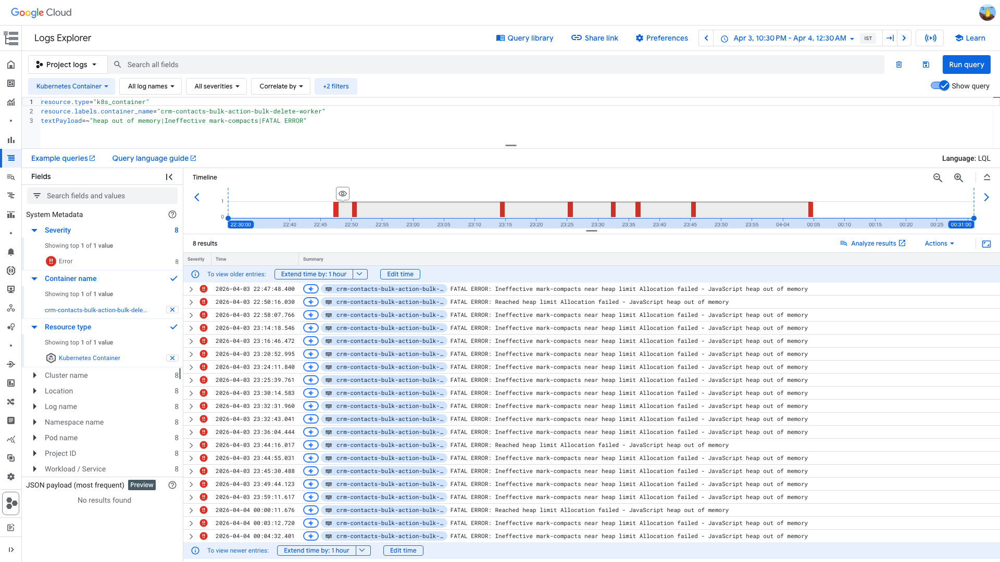
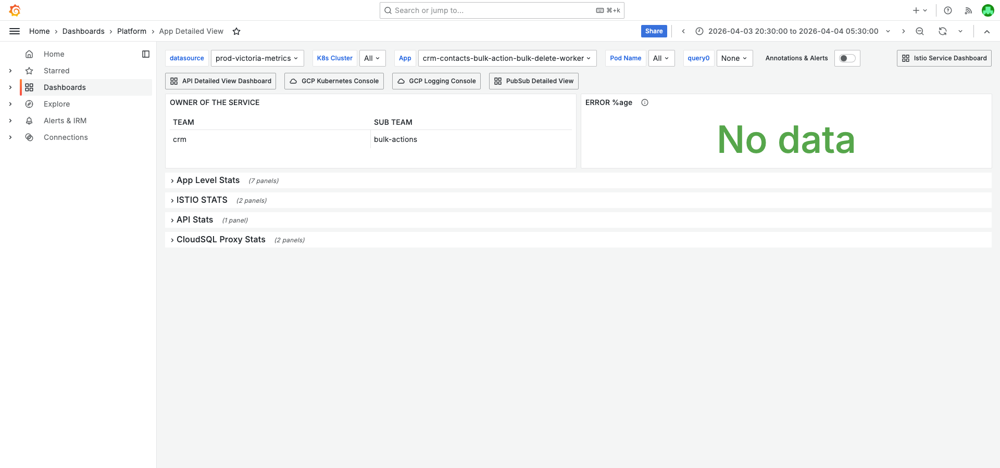
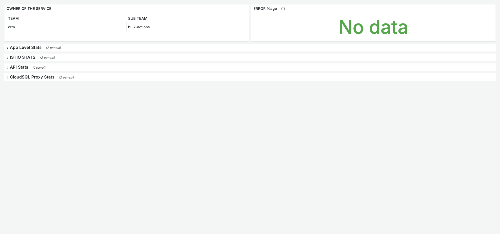
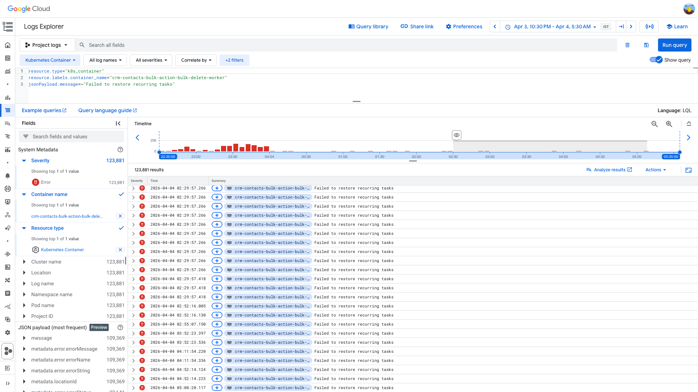

# Heap out of Memory Investigation — crm-contacts-bulk-action-bulk-delete-worker — 2026-04-03

**Author:** Himanshu Bhutani
**Generated:** 2026-04-04

## 1. Alert Summary

| Field | Value |
|-------|-------|
| Alert | [#115041 Heap out of Memory](https://prod.grafana.leadconnectorhq.com/a/grafana-oncall-app/alert-groups/IIVEH71QJV2FH) |
| Service | crm-contacts-bulk-action-bulk-delete-worker |
| Cluster | workers-us-central-production-cluster |
| Fired | 2026-04-03 23:26 IST (17:56 UTC) |
| Duration | ~77 min of sustained OOM (22:47–00:04 IST), alert re-fired for ~2.5 hours |
| Severity | WARNING |
| Team | CRM bulk-actions |
| OnCall | virendra.sharma, anjalica.suman |
| Slack thread | [View thread](https://gohighlevel.slack.com/archives/C0315RRNH1B/p1775239014617849) |

**Past investigation:** This is a **recurring alert** — the same worker OOM'd on March 15 with an identical root cause ([March 15 report](heap-oom-crm-contacts-bulk-delete-worker-2026-03-15.md)). The action items from that investigation were never implemented.

## 2. Investigation Findings

### Evidence: GCP Logs — V8 OOM Crashes

<details>
<summary>[GCP Logs] 20 V8 FATAL ERROR crashes across 17 unique pods in 77 minutes</summary>

> **What to look for:** Each log entry shows `FATAL ERROR: Ineffective mark-compacts near heap limit Allocation failed - JavaScript heap out of memory`. The crashes are spread across nearly every pod in the fleet, confirming this is a workload-level issue, not an isolated pod problem.

| Time (IST) | Pod suffix | Error type |
|---|---|---|
| 22:47:48 | wx8j9 | Ineffective mark-compacts |
| 22:58:07 | cq9wj | Ineffective mark-compacts |
| 23:14:18 | zbqvv | Ineffective mark-compacts |
| 23:16:46 | lbflc | Ineffective mark-compacts |
| 23:20:52 | qcl8x | Ineffective mark-compacts |
| 23:24:11 | jzlsg | Ineffective mark-compacts |
| 23:25:39 | zbqvv | Ineffective mark-compacts (2nd crash) |
| 23:30:14 | hjnrc | Ineffective mark-compacts |
| 23:32:31 | wx8j9 | Ineffective mark-compacts (2nd crash) |
| 23:32:43 | 246mg | Ineffective mark-compacts |
| 23:36:04 | s2hqs | Ineffective mark-compacts |
| 23:44:16 | 56lpd | Reached heap limit |
| 23:44:55 | lxczm | Ineffective mark-compacts |
| 23:45:30 | vvb5d | Ineffective mark-compacts |
| 23:49:44 | 87sns | Ineffective mark-compacts |
| 23:59:11 | mk24v | Ineffective mark-compacts |
| 00:00:11 | hhwvp | Reached heap limit |
| 00:03:12 | 87sns | Ineffective mark-compacts (2nd crash) |
| 00:04:32 | slnjl | Ineffective mark-compacts |

**Repeat crashers:** 3 pods crashed twice — 87sns, wx8j9, zbqvv — consistent with crash → restart → pick up more messages → crash again cycle.

**Two error variants:**
- `Ineffective mark-compacts` (17 crashes) — GC running frequently but failing to reclaim enough memory
- `Reached heap limit` (3 crashes) — V8 hit the `max-old-space-size` ceiling directly



GCP query:
```
resource.type="k8s_container"
resource.labels.container_name="crm-contacts-bulk-action-bulk-delete-worker"
textPayload=~"heap out of memory|Ineffective mark-compacts|FATAL ERROR"
```
[Open in Log Explorer](https://console.cloud.google.com/logs/query;query=resource.type%3D%22k8s_container%22%0Aresource.labels.container_name%3D%22crm-contacts-bulk-action-bulk-delete-worker%22%0AtextPayload%3D~%22heap%20out%20of%20memory%7CIneffective%20mark-compacts%7CFATAL%20ERROR%22;timeRange=2026-04-03T17%3A00%3A00Z%2F2026-04-03T19%3A00%3A00Z?project=highlevel-backend)
</details>

### Evidence: Prometheus — Memory and Termination

<details>
<summary>[Prometheus] OOMKilled termination reason + memory at 2253 MB limit</summary>

> **What to look for:** `kube_pod_container_status_last_terminated_reason` shows `OOMKilled`. Memory limit is 2253 MB, request is 2048 MB.

| Metric | Value |
|---|---|
| Memory limit | 2253 MB (Helm auto × 1.1 from 2048 request) |
| Memory request | 2048 MB |
| Termination reason | OOMKilled (pods d5dwf, qcl8x) |
| Post-recovery memory | ~563 MB (normal idle) |


**Context (filters + time range):**



[Open in Grafana — App Detailed View](https://prod.grafana.leadconnectorhq.com/d/a4859d4a-1e0a-4ae3-b9b2-d04d366cf29b/app-detailed-view?orgId=1&var-container=crm-contacts-bulk-action-bulk-delete-worker&var-namespace=default&from=1775228400000&to=1775260800000)
</details>

### Evidence: Pod Restarts

<details>
<summary>[Grafana] Pod restarts during the OOM storm</summary>

> **What to look for:** Restart count spikes during the 22:47–00:04 IST window. Multiple pods restarting in rapid succession.



**Context (filters + time range):**


[Open in Grafana — App Detailed View](https://prod.grafana.leadconnectorhq.com/d/a4859d4a-1e0a-4ae3-b9b2-d04d366cf29b/app-detailed-view?orgId=1&var-container=crm-contacts-bulk-action-bulk-delete-worker&var-namespace=default&from=1775228400000&to=1775260800000)
</details>

### Evidence: 7-Day Baseline — Worsening Trend

<details>
<summary>[GCP 7-Day] 42 OOM crashes in 7 days — escalating, Apr 3 is the worst</summary>

> **What to look for:** The OOM crash count is increasing week-over-week. March 15 investigation found 7 crashes in 7 days. This investigation finds 42 in 7 days — a 6x increase.

| Day | OOM Crashes | Notes |
|---|---|---|
| 2026-03-28 | 2 | Baseline |
| 2026-03-29 | 0 | — |
| 2026-03-30 | 1 | — |
| 2026-03-31 | 11 | Spike |
| 2026-04-01 | 3 | — |
| 2026-04-02 | 5 | — |
| **2026-04-03** | **20** | **This incident** |
| **Total** | **42** | 6x worse than March |

**March 15 7-day comparison:** 7 OOM crashes (Mar 13: 3, Mar 15: 4). The problem is clearly accelerating — possibly due to growing data volumes or more frequent bulk delete requests.

GCP query:
```
resource.type="k8s_container"
resource.labels.container_name="crm-contacts-bulk-action-bulk-delete-worker"
textPayload=~"heap out of memory|Ineffective mark-compacts|FATAL ERROR"
timestamp>="2026-03-28T00:00:00Z" AND timestamp<="2026-04-04T00:00:00Z"
```
</details>

### Evidence: Application Errors

<details>
<summary>[GCP Logs] "Failed to restore recurring tasks" — 10 entries on Apr 3</summary>

> **What to look for:** Burst of these errors on pod restart, from `@platform-core/base-worker` startup routine. Same pattern found in March 15 investigation.

10 entries across 3 pods (tg8pq, d5dwf, qcl8x) from 21:22 to 23:38 IST.



GCP query:
```
resource.type="k8s_container"
resource.labels.container_name="crm-contacts-bulk-action-bulk-delete-worker"
jsonPayload.message=~"Failed to restore recurring tasks"
```
</details>

### Evidence: Kubelet — Container Lifecycle

<details>
<summary>[Kubelet] Pod startup activity confirms crash → restart cycle</summary>

> **What to look for:** PLEG events showing pod sandbox creation after OOM kills. "No sandbox for pod can be found. Need to start a new one" at 18:56 UTC for pod 7fnjl.

Kubelet logs show:
- 18:56:54 UTC — `No sandbox for pod can be found. Need to start a new one` (pod 7fnjl)
- 18:56:55–18:56:58 — Volume mounts, container startup, PLEG events
- 18:59:38 — Pod startup complete, readiness probe passes

GCP query:
```
logName="projects/highlevel-backend/logs/kubelet"
"crm-contacts-bulk-action-bulk-delete-worker"
timestamp>="2026-04-03T17:00:00Z" AND timestamp<="2026-04-03T19:00:00Z"
```
</details>

<details>
<summary>Probable noise — transient errors during OOM disruption (not root cause)</summary>

| Time (IST) | Pattern | Why it's noise |
|---|---|---|
| 00:29:45 | `MONGO_URL_CRM_CONTACTS_STANDARD not found` | Secret mounting race on restart; pods recover after retry. Known since March investigation. |
| 00:28:45 | `SequelizeConnectionRefusedError: ECONNREFUSED 127.0.0.1:3306` | CloudSQL proxy sidecar not ready before app container starts. Transient on pod restart. |
| 00:27:36 | `No logs found for bulk action` | Bulk action record lookup returns empty; expected for some edge cases. |
| 21:22–23:38 | `Failed to restore recurring tasks` (10x) | Side-effect of pod restarts. The base worker tries to restore scheduled tasks on startup and fails. Contributing to heap pressure but not the primary cause. |

</details>

## 3. Cross-Validation

| Signal | Source | Finding | Agrees? |
|---|---|---|---|
| V8 OOM crashes | GCP Logs | 20 crashes, 17 pods | ✅ |
| OOMKilled termination | Prometheus | OOMKilled on multiple pods | ✅ |
| Memory near limit | Prometheus + YAML | 2253 MB limit, OOM at ceiling | ✅ |
| No maxOldSpaceSize | Deployment YAML | Not set, auto-calc ~1638 MB | ✅ |
| Batch size = 100 | Source code | `singleProcessingSize: 100` | ✅ |
| Parallel sub-batches | Source code | `Promise.allSettled` | ✅ |
| Full doc load per contact | Source code | `Contact.findById()` in loop | ✅ |
| Worsening trend | GCP 7-day baseline | 42 vs 7 (March) — 6x increase | ✅ |
| Same root cause as March | Past investigation DB | Investigation #19 — identical findings | ✅ |

**Confidence: HIGH** — All 9 sources agree. This is a textbook V8 heap exhaustion from unbounded parallel memory allocation during bulk deletion. The root cause is structural (batch size + parallelism + full doc loading) and was identified 19 days ago.

## 4. Root Cause

The V8 JavaScript heap exhausts its auto-calculated `max-old-space-size` (~1638 MB) during bulk contact deletion processing. The causal chain:

1. A large bulk delete request arrives via PubSub
2. `BaseBulkActionWorker.processMessage` loads batch IDs and creates sub-batches of 100 contacts each
3. Sub-batches execute in parallel via `Promise.allSettled` — each sub-batch holds:
   - 100 full MongoDB contact documents (`Contact.findById()` per ID)
   - A Firestore batch write object
   - An audit log array growing to 100 entries
4. With `flowControl: 50`, up to 50 messages can be processed concurrently, each spawning parallel sub-batches
5. Peak memory = (concurrent messages) × (sub-batches per message) × (100 full contacts + Firestore batch + audit array)
6. V8 heap exceeds ~1638 MB → GC fails to reclaim enough → `Ineffective mark-compacts` → FATAL ERROR
7. Pod killed, restarts, picks up same messages from PubSub → OOM again
8. Cycle repeats across the fleet — 20 crashes in 77 minutes

### Why it's worsening

The 7-day trend (42 crashes vs 7 in March's window) suggests either:
- Growing bulk delete request volumes (more/larger batches)
- Growing contact document sizes (more custom fields, notes, etc.)
- More concurrent users triggering bulk deletes

## 5. Action Items

| Priority | Action | Owner | Status |
|----------|--------|-------|--------|
| **Critical** | Set explicit `maxOldSpaceSize: 2500` in deployment config and increase memory request to 3072 MB | CRM bulk-actions team | **OPEN (19 days since first identified)** |
| **High** | Reduce `singleProcessingSize` from 100 to 25 for bulk-delete | CRM bulk-actions team | **OPEN** |
| **High** | Process sub-batches sequentially (`for...of await` instead of `Promise.allSettled`) to prevent multiplicative memory | CRM bulk-actions team | **OPEN** |
| **Medium** | Reduce `flowControl` from 50 to 10-20 for this worker to limit concurrent message processing | CRM bulk-actions team | **NEW** |
| **Medium** | Stream contact deletion instead of loading full documents — `findById` only needs the `_id` and `locationId` for delete | CRM bulk-actions team | **NEW** |
| **Medium** | Investigate "Failed to restore recurring tasks" in `@platform-core/base-worker` startup | Platform team | **OPEN** |
| **Low** | Fix `MONGO_URL_CRM_CONTACTS_STANDARD not found` secret mounting race | CRM bulk-actions team | **OPEN** |

## 6. Deployment Details

| Config | Value | Source |
|--------|-------|--------|
| Memory request | 2000 (→ 2048 MB deployed) | values YAML |
| Memory limit | 2253 MB (Helm auto) | Prometheus |
| CPU request | 1000m | values YAML |
| maxOldSpaceSize | Not set (~1638 MB auto) | values YAML |
| flowControl | 50 | values YAML |
| ackDeadline | 600s | values YAML |
| singleProcessingSize | 100 | bulk_action.ts |
| batchCount | 100 | bulk_action.ts |
| minReplicas | 3 | values YAML |
| maxReplicas | 50 | values YAML |
| HPA target CPU | 65% | values YAML |
| Subscription | crm-contacts-bulk-action-bulk-delete-events-sub | values YAML |

## 7. Slack Thread Context

- Alert thread: 13 messages, all automated (Grafana OnCall bot escalations)
- OnCall: virendra.sharma, anjalica.suman — both escalated multiple times
- No human investigation in thread
- Alert auto-resolved as bulk workload subsided

## 8. Links

- [Grafana alert](https://prod.grafana.leadconnectorhq.com/a/grafana-oncall-app/alert-groups/IIVEH71QJV2FH)
- [Grafana alert rule](https://prod.grafana.leadconnectorhq.com/alerting/grafana/ae6f8968-3397-408c-ba48-9b2fbc5c1939/view?orgId=1)
- [App Detailed View](https://prod.grafana.leadconnectorhq.com/d/a4859d4a-1e0a-4ae3-b9b2-d04d366cf29b/app-detailed-view?orgId=1&var-container=crm-contacts-bulk-action-bulk-delete-worker&var-namespace=default&from=1775228400000&to=1775260800000)
- [GCP Log Explorer — OOM](https://console.cloud.google.com/logs/query;query=resource.type%3D%22k8s_container%22%0Aresource.labels.container_name%3D%22crm-contacts-bulk-action-bulk-delete-worker%22%0AtextPayload%3D~%22heap%20out%20of%20memory%7CIneffective%20mark-compacts%7CFATAL%20ERROR%22;timeRange=2026-04-03T17%3A00%3A00Z%2F2026-04-03T19%3A00%3A00Z?project=highlevel-backend)
- [Slack alert thread](https://gohighlevel.slack.com/archives/C0315RRNH1B/p1775239014617849)
- [March 15 investigation (concise)](heap-oom-crm-contacts-bulk-delete-worker-2026-03-15.md)
- [March 15 investigation (verbose)](heap-oom-crm-contacts-bulk-delete-worker-2026-03-15-verbose.md)
