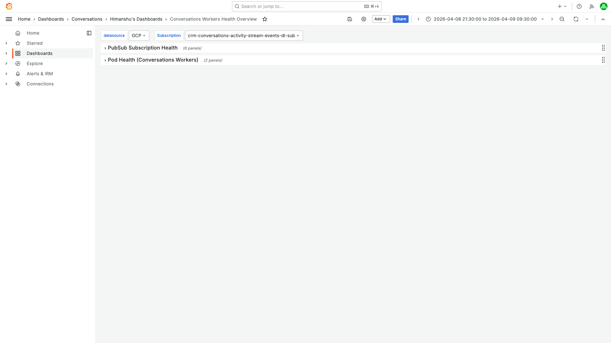
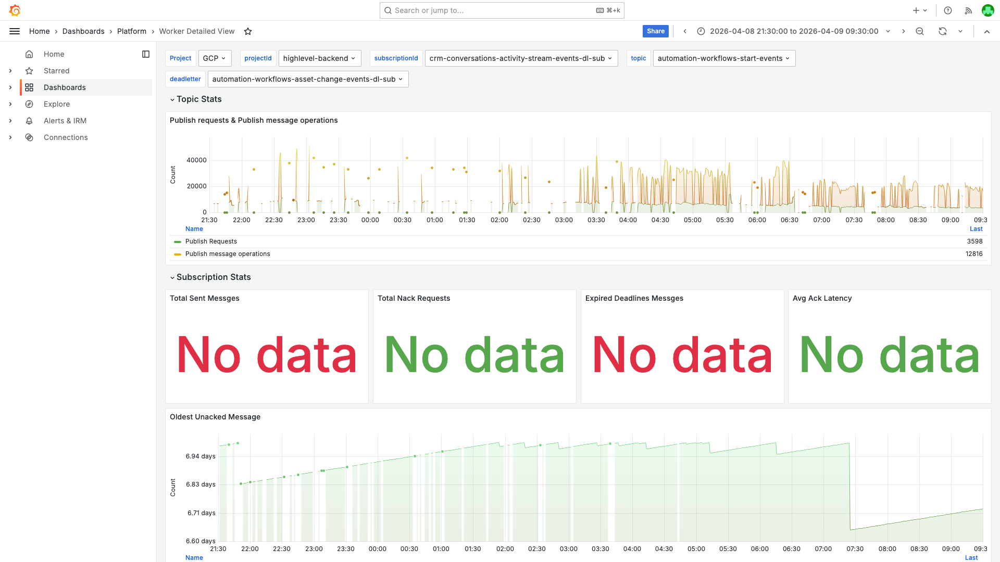
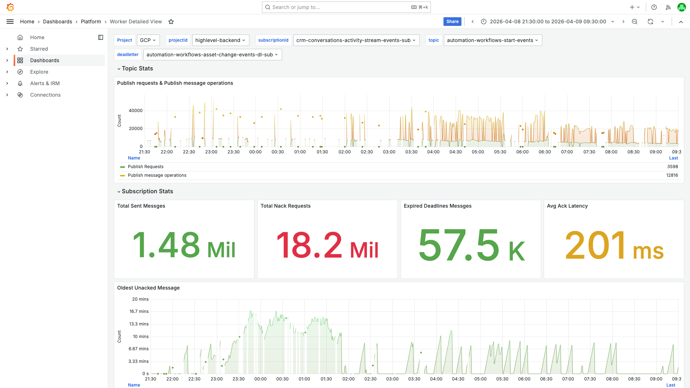
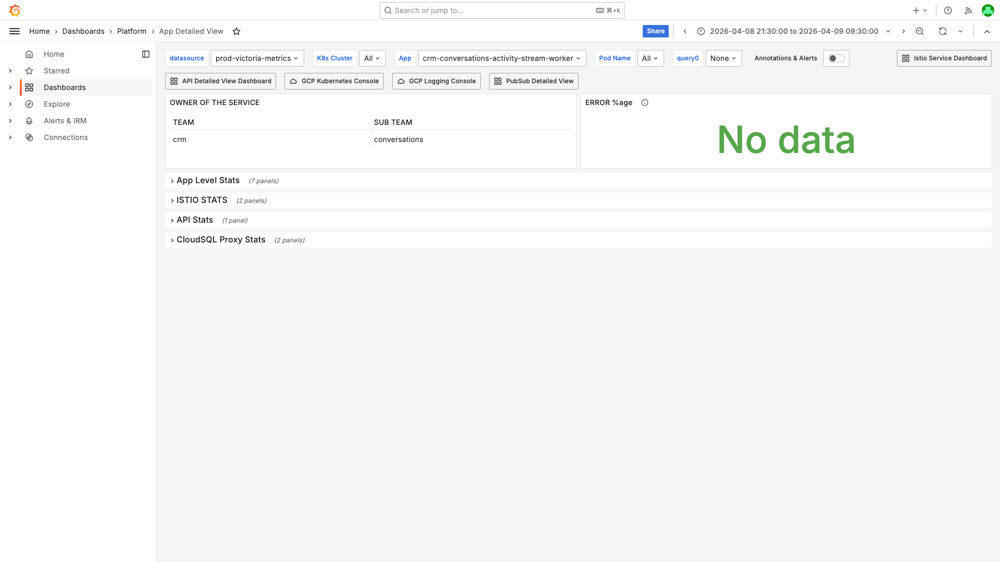

# Pubsub Unacked Messages Investigation — crm-conversations-activity-stream-events-dl-sub — 2026-04-09

**Author:** Himanshu Bhutani
**Generated:** 2026-04-11

## Alert Summary

| Field | Value |
|-------|-------|
| Alert type | Pubsub Unacked Messages above 500 |
| Alert ID | #115224 |
| Subscription | crm-conversations-activity-stream-events-dl-sub (dead-letter) |
| Parent subscription | crm-conversations-activity-stream-events-sub |
| Worker | crm-conversations-activity-stream-worker (5 pods) |
| DL Worker | **Does not exist** |
| Channel | #alerts-crm-conversations (C097UPY34QJ) |
| Time | 08:28 IST (02:58 UTC) on 2026-04-09 |
| Unacked Messages | 89,576 (at alert time) |
| Team | CRM / Conversations (Core team) |
| Severity | WARNING |

## What Happened

1. **22:30 IST Apr 8** — A traffic surge hit the parent subscription `crm-conversations-activity-stream-events-sub`, causing massive Redis lock contention (70,901 lock conflict warnings in 15 minutes).
2. **22:30-01:30 IST** — Lock contention caused messages to hold flowControl slots for extended periods. Workers couldn't ack messages within the 600s deadline, causing 57,510 expired ack deadlines. Messages exceeding 10 delivery attempts were forwarded to the dead-letter topic.
3. **23:28-01:50 IST** — The DL subscription accumulated ~89,300 new messages (from 217 to 89,524), with no consumer to process them.
4. **08:28 IST Apr 9** — Alert fired for unacked messages above 500 threshold on the DL subscription.
5. **Present** — Backlog remains at ~89,535 with no consumer deployed.

<details>
<summary>Detailed timeline — full event log</summary>

| Time (IST) | Source | Event |
|---|---|---|
| Apr 8, 21:30 | Cloud Monitoring | DL sub baseline: 217 undelivered |
| Apr 8, 22:30 | Cloud Monitoring | Parent sub undelivered starts rising (614 at 22:40) |
| Apr 8, 22:45 | Cloud Monitoring | Parent sub backlog at 2,311 |
| Apr 8, 23:00 | Cloud Monitoring | Parent sub expired ack deadlines spike (540 in 5 min) |
| Apr 8, 23:10 | Cloud Monitoring | Expired deadlines: 766 in 5 min |
| Apr 8, 23:28 | Cloud Monitoring | DL sub crosses 500: reaches 414 |
| Apr 8, 23:30 | GCP Logs | WARNING log burst: 10,938 Redis lock conflicts |
| Apr 8, 23:35 | GCP Logs | Peak WARNING burst: 36,500 in 5 min |
| Apr 8, 23:35 | Cloud Monitoring | DL sub at 1,756 |
| Apr 8, 23:40 | Cloud Monitoring | Peak expired deadlines: 12,719 in 5 min |
| Apr 8, 23:40 | GCP Logs | WARNING: 23,463 in 5 min |
| Apr 8, 23:45 | Cloud Monitoring | Parent sub backlog peaks at 18,801 |
| Apr 9, 00:00 | Cloud Monitoring | DL sub at 5,035 |
| Apr 9, 00:15 | Cloud Monitoring | DL sub at 43,092 |
| Apr 9, 00:30 | GCP Logs | SLOW_EVENT entries appear |
| Apr 9, 01:00 | GCP Logs | ERROR: Failed to acquire lock, Redis ECONNREFUSED |
| Apr 9, 01:20 | Cloud Monitoring | DL sub at 88,366 |
| Apr 9, 01:50 | Cloud Monitoring | DL sub plateaus at 89,524 |
| Apr 9, 02:00 | Cloud Monitoring | Parent sub backlog recovers to <300 |
| Apr 9, 08:28 | Grafana Alert | Alert #115224 fires: Unacked Messages above 500 |

</details>

## Investigation Findings

### Evidence: PubSub Metrics — DL Subscription

<details>
<summary>[Cloud Monitoring] DL sub undelivered messages: 217 → 89,524 in 2.5 hours</summary>

> **What to look for:** The num_undelivered_messages metric shows a steep ramp from 217 to 89,524 between 22:58 IST and 01:50 IST. After 01:50, the line is completely flat — no messages being added or removed.

**7-day backlog trend (pre-spike):**
- Apr 2-8: Stable at 200-260, slowly decreasing due to message expiry (7-day retention)
- Baseline: ~1-5 new dead-lettered messages per day

**Spike detail (1-min resolution):**
- 22:58 IST: 414 (first breach above 300)
- 23:35 IST: 1,756 (ramp accelerating)
- 23:43 IST: 7,906 (~2,000/min inflow)
- 00:00 IST: 16,239
- 00:30 IST: 43,092
- 01:00 IST: 77,218
- 01:20 IST: 88,366
- 01:50 IST: 89,524 (plateau)

</details>

<details>
<summary>[Cloud Monitoring] DL sub sent_message_count: zero — no consumer pulling</summary>

> **What to look for:** Zero sent_message_count data means no subscriber client has ever pulled from this subscription. There is no consumer at all.

Query returned no data for `sent_message_count` on `crm-conversations-activity-stream-events-dl-sub` in the entire investigation window.

</details>

<details>
<summary>[Cloud Monitoring] DL sub oldest_unacked_message_age: ~7 days (message retention limit)</summary>

> **What to look for:** The oldest message is ~7 days old (604,800s = 7d), which matches the subscription's `messageRetentionDuration: 604800s`. Messages are aging up to the retention limit and then expiring.

The oldest unacked age was consistently 6.8-7.0 days throughout the investigation window. This means:
- Messages sit for exactly 7 days, then expire
- The ~200 baseline messages were a rolling window of slow trickle dead-letters
- After the spike, the 89k messages will expire over the next 7 days (if not consumed)

</details>

### Evidence: PubSub Metrics — Parent Subscription

<details>
<summary>[Cloud Monitoring] Parent sub ack_message_count: 2,928,942 total — workers were processing</summary>

> **What to look for:** Ack count stays positive throughout (never drops to zero). Workers were alive and processing. The issue was throughput degradation from lock contention, not worker failure.

Parent sub acked 2.9M messages between 21:30 IST Apr 8 and 05:30 IST Apr 9. Ack rate ranged from 10k-93k per 5-min interval. The workers were healthy but couldn't keep up with lock-contended messages.

</details>

<details>
<summary>[Cloud Monitoring] Parent sub nack_message_count: zero — no explicit nacking</summary>

> **What to look for:** Zero nacks means messages were NOT being explicitly rejected. The dead-lettering was caused by ack deadline expiry (messages held too long by lock contention), not by workers actively nacking.

This is significant: nack_message_count = 0 means the worker's processing code never called `message.nack()`. Instead, messages timed out because lock acquisition held the processing slot for longer than the 600s ack deadline.

</details>

<details>
<summary>[Cloud Monitoring] Parent sub expired_ack_deadlines_count: 57,510 total</summary>

> **What to look for:** Massive spike in expired deadlines between 23:00-01:00 IST. Peak: 12,719 expired in a single 5-min window at 23:40 IST.

| Time (IST) | Expired Deadlines (5-min) |
|---|---|
| 23:00 | 540 |
| 23:05 | 225 |
| 23:10 | 766 |
| 23:35 | 12,719 (peak) |
| 23:40 | 746 |
| 23:45 | 1,288 |
| 23:50 | 696 |
| 00:00 | 1,424 |
| 00:10 | 5,507 |
| 00:15 | 1,545 |
| 00:20 | 4,464 |
| 00:25 | 3,716 |
| 00:30 | 2,964 |

After 01:00 IST, expired deadlines dropped back to near-zero. Total: 57,510.

</details>

<details>
<summary>[Cloud Monitoring] Parent sub num_undelivered_messages: peaked at 18,801</summary>

> **What to look for:** Parent sub backlog peaked at 18,801 at 23:45 IST, then gradually recovered. By 02:00 IST it was back under 300. The parent sub self-recovered; the DL sub did not.

</details>

### Evidence: Kubernetes — No DL Worker Deployment

<details>
<summary>[kubectl] Only parent worker deployed — no DL worker exists</summary>

> **What to look for:** `kubectl get deployment` shows `crm-conversations-activity-stream-worker` with 5/5 pods, but no `*-dl-worker` deployment.

```bash
$ kubectl get deployment -n default | grep activity-stream
crm-conversations-activity-stream-worker    5/5    5    5    2y128d
```

The parent subscription `crm-conversations-activity-stream-events-sub` has a dead-letter policy configured:
```yaml
deadLetterPolicy:
  deadLetterTopic: projects/highlevel-backend/topics/crm-conversations-activity-stream-events-dl
  maxDeliveryAttempts: 10
```

But the DL subscription `crm-conversations-activity-stream-events-dl-sub` has no pull subscriber. Its configuration:
```yaml
ackDeadlineSeconds: 600
messageRetentionDuration: 604800s  # 7 days
retryPolicy:
  maximumBackoff: 600s
  minimumBackoff: 10s
topic: projects/highlevel-backend/topics/crm-conversations-activity-stream-events-dl
```

</details>

### Evidence: GCP Logs — Redis Lock Contention

<details>
<summary>[Cloud Monitoring] 70,901 WARNING logs in 15-minute burst</summary>

> **What to look for:** log_entry_count for WARNING severity shows all 70,901 entries concentrated in three 5-min windows starting at 23:30 IST. This is the Redis lock conflict storm.

| Time (IST) | WARNING Log Count |
|---|---|
| 23:30 | 10,938 |
| 23:35 | 36,500 |
| 23:40 | 23,463 |
| Total | 70,901 |

All entries are `[Conversation Redis Lock][error]Redis lock conflict`.

</details>

<details>
<summary>[GCP Logs] ERROR-level: Failed lock acquisition + Redis ECONNREFUSED</summary>

> **What to look for:** Two error patterns: (1) `Failed to acquire lock for contactId` — lock contention causing processing failure, and (2) `error connecting redis ECONNREFUSED 127.0.0.1:6379` — local Redis sidecar connection issues.

```
resource.type="k8s_container"
resource.labels.container_name="crm-conversations-activity-stream-worker"
jsonPayload.message=~"Failed to acquire lock|error connecting redis|Error while processing"
severity>=ERROR
```

Sample errors at ~01:30 IST (Apr 9):
- `Failed to acquire lock for contactId: GjMPuLyVU6vYIaE1pCbA`
- `error connecting redis {"errno":-111,"code":"ECONNREFUSED","syscall":"connect","address":"127.0.0.1","port":6379}`
- `Error while processing pubsub message: Failed to acquire lock for contactId: GjMPuLyVU6vYIaE1pCbA`

The Redis ECONNREFUSED errors target 127.0.0.1:6379 (local Redis sidecar), which may have crashed under the lock contention load. This is likely a secondary effect, not the root cause.

</details>

<details>
<summary>[GCP Logs] SLOW_EVENT entries at 01:22 IST</summary>

> **What to look for:** Multiple SLOW_EVENT entries appeared at 01:22 IST, confirming messages were being processed slowly (>30s per message) during the lock contention.

```
resource.type="k8s_container"
resource.labels.container_name="crm-conversations-activity-stream-worker"
jsonPayload.message=~"SLOW_EVENT"
```

10 SLOW_EVENT entries logged at 01:22 IST (19:52 UTC). These confirm processing was degraded — messages taking >30s to process due to lock contention.

</details>

### Evidence: Grafana Dashboards

<details>
<summary>[Grafana] Workers Health Overview — DL sub backlog</summary>

> **What to look for:** The DL subscription line shows a flat high backlog at ~89k with no processing activity.


[Open in Grafana](https://prod.grafana.leadconnectorhq.com/d/ffex8olsxa9kwc/conversations-workers-health-overview?orgId=1&var-subscriptionId=crm-conversations-activity-stream-events-dl-sub&from=1775664000000&to=1775707200000)

</details>

<details>
<summary>[Grafana] Worker Detailed View — DL Subscription</summary>

> **What to look for:** Zero ack rate, zero nack rate, zero everything — confirms no consumer exists for this subscription.


[Open in Grafana](https://prod.grafana.leadconnectorhq.com/d/a04e5483-eb8c-47ef-8198-30147926964c/worker-detailed-view?orgId=1&var-subscriptionId=crm-conversations-activity-stream-events-dl-sub&from=1775664000000&to=1775707200000)

</details>

<details>
<summary>[Grafana] Worker Detailed View — Parent Subscription</summary>

> **What to look for:** Healthy ack rate throughout. Unacked messages spike temporarily but recover. This confirms the parent worker was alive and processing.


[Open in Grafana](https://prod.grafana.leadconnectorhq.com/d/a04e5483-eb8c-47ef-8198-30147926964c/worker-detailed-view?orgId=1&var-subscriptionId=crm-conversations-activity-stream-events-sub&from=1775664000000&to=1775707200000)

</details>

<details>
<summary>[Grafana] App Detailed View — Worker Pod Health</summary>

> **What to look for:** No pod restarts, stable memory/CPU, 5 pods running throughout. Confirms the worker was healthy — the issue was lock contention causing throughput degradation, not pod failures.


[Open in Grafana](https://prod.grafana.leadconnectorhq.com/d/a4859d4a-1e0a-4ae3-b9b2-d04d366cf29b/app-detailed-view?orgId=1&var-container=crm-conversations-activity-stream-worker&from=1775664000000&to=1775707200000)

</details>

## Cross-Validation

| Signal | Source | Finding | Agrees? |
|--------|--------|---------|---------|
| No DL consumer | kubectl | Zero deployments for DL worker | Yes |
| No DL consumer | Cloud Monitoring | Zero sent_message_count on DL sub | Yes |
| Traffic surge | Cloud Monitoring | Parent sub backlog peaked at 18,801 | Yes |
| Lock contention | GCP Logs | 70,901 Redis lock conflict warnings | Yes |
| Lock contention | GCP Logs | Failed to acquire lock errors | Yes |
| Expired deadlines | Cloud Monitoring | 57,510 expired ack deadlines | Yes |
| Zero nacks | Cloud Monitoring | nack_message_count = 0 | Yes |
| Workers healthy | Grafana | No pod restarts, stable CPU/memory | Yes |
| Workers processing | Cloud Monitoring | 2.9M messages acked | Yes |

**Confidence: HIGH** — All 9 signals agree. The causal chain is: traffic surge -> Redis lock contention -> flowControl slot blocking -> expired ack deadlines -> messages exceed maxDeliveryAttempts (10) -> forwarded to DL topic -> no consumer on DL sub -> permanent backlog.

<details>
<summary>Probable noise — transient errors during disruption (not root cause)</summary>

| Time (IST) | Pattern | Why it's noise |
|---|---|---|
| 01:30 Apr 9 | Redis ECONNREFUSED 127.0.0.1:6379 | Local Redis sidecar connection issue, likely secondary effect of lock contention overload |
| 01:22 Apr 9 | SLOW_EVENT entries | Expected side-effect of lock contention — messages processing slowly, not a separate issue |

</details>

## Root Cause

**Two-part root cause:**

1. **Immediate cause (why the alert fired):** The dead-letter subscription `crm-conversations-activity-stream-events-dl-sub` has no consumer. No worker deployment exists for this subscription. Messages land in the DL topic and accumulate until they expire (7-day retention).

2. **Trigger (why 89k messages arrived suddenly):** A traffic surge on Apr 8 at 22:30 IST caused massive Redis lock contention on the parent subscription's worker. 70,901 lock conflict warnings in 15 minutes. This blocked flowControl slots, preventing messages from being acked within the 600s deadline. 57,510 messages expired their ack deadlines. After 10 delivery attempts (the maxDeliveryAttempts setting), messages were forwarded to the dead-letter topic, resulting in ~89,300 new messages in the DL subscription within 2.5 hours.

**Why this is not just a "traffic spike":** The DL subscription is a structural issue — even at normal traffic levels, 1-5 messages per day trickle into the DL (baseline was ~200-260 messages). The traffic surge merely amplified an existing gap: the DL policy exists but no consumer was ever deployed for it.

## Action Items

| Priority | Action | Owner |
|----------|--------|-------|
| **High** | Deploy a DL worker for `crm-conversations-activity-stream-events-dl-sub` or purge the 89k messages and disable the dead-letter policy if DL processing is not needed | Core team / CRM Conversations |
| **Medium** | Investigate the traffic surge trigger on Apr 8 17:00-20:00 UTC — check events worker for bulk operations that generated the lock conflicts | Core team |
| **Medium** | Review Redis lock retry configuration for this worker — high retry counts amplify slot-blocking during contention (see past investigation: activity-stream-events-sub 2026-03-01) | CRM Conversations |
| **Low** | Add monitoring for DL subscription backlogs with a dedicated lower threshold | Platform |

## Deployment Details

**Parent subscription configuration:**
```yaml
subscription: crm-conversations-activity-stream-events-sub
topic: crm-conversations-activity-stream-events
ackDeadlineSeconds: 600
messageRetentionDuration: 604800s  # 7 days
deadLetterPolicy:
  deadLetterTopic: crm-conversations-activity-stream-events-dl
  maxDeliveryAttempts: 10
retryPolicy:
  minimumBackoff: 10s
  maximumBackoff: 600s
labels:
  team: crm
  sub_team: conversations
  unack_age_alert_level: 30mins
  unack_alert_level: 10k
```

**DL subscription configuration:**
```yaml
subscription: crm-conversations-activity-stream-events-dl-sub
topic: crm-conversations-activity-stream-events-dl
ackDeadlineSeconds: 600
messageRetentionDuration: 604800s  # 7 days
retryPolicy:
  minimumBackoff: 10s
  maximumBackoff: 600s
# No dead-letter policy (terminal)
# No consumer deployment
```

**Worker deployment:**
```
crm-conversations-activity-stream-worker: 5 replicas, running for 2y128d
crm-conversations-activity-stream-events-dl-worker: DOES NOT EXIST
```

## Slack Thread Context

The alert thread (19 replies) contained:
- Previous auto-investigation identified "DL worker is not running" as the root cause
- Team member confirmed: "dl-worker is not running. Increased inflow in activity-dl here yesterday."
- Ownership clarification: "No one in particular owns this, this belongs to Core team"
- Multiple reminder notifications (alert remained acknowledged but unresolved)
