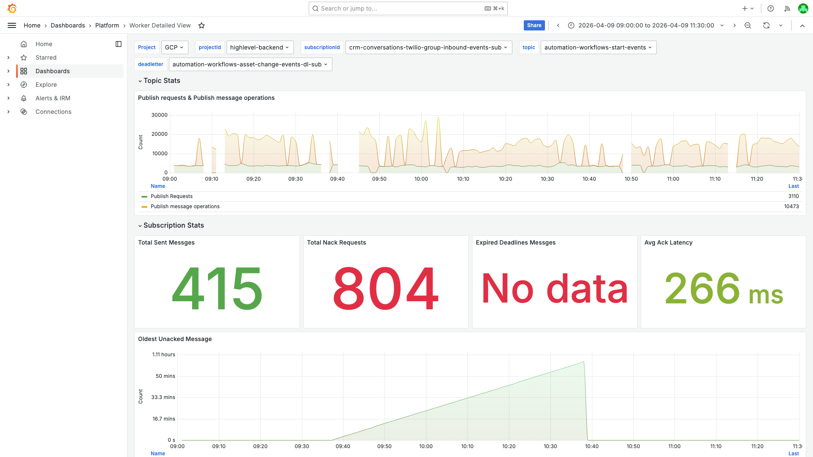

# Pubsub Oldest Unacked Age Investigation -- crm-conversations-twilio-group-inbound-events-sub -- 2026-04-09

**Author:** Himanshu Bhutani
**Generated:** 2026-04-11

## Alert Summary

| Field | Value |
|-------|-------|
| Alert type | Pubsub Oldest Unacked Messages age above 30mins |
| Alert # | 115225 |
| Workload | crm-conversations-twilio-group-inbound-events-worker |
| Subscription | crm-conversations-twilio-group-inbound-events-sub |
| Cluster | workers-us-central-production-cluster |
| Namespace | default |
| Time | 10:14 IST (04:44 UTC) on 2026-04-09 |
| Reported value | 2,104s oldest unacked age |
| Threshold | 1,800s (30 min) |
| Status | Self-resolved after ~2 hours (messages dead-lettered) |

## What Happened

1. **09:35 IST (04:05 UTC)** -- A Twilio group inbound message (ID: `IM9987a193f7a3493aa7750aa868385486`) failed processing with `HttpException: Message not found` at `handleDelieveryUpdate`. The error causes the worker to nack the message.
2. **09:37 IST (04:07 UTC)** -- PubSub redelivers the nacked message. It fails again. This nack-redeliver cycle repeats 804 times over the next ~2 hours, holding the oldest_unacked_message_age at an ever-increasing value.
3. **10:14 IST (04:44 UTC)** -- Alert fires. Oldest unacked age = 2,104s (35 minutes), exceeding the 30-minute threshold.
4. **10:38 IST (05:08 UTC)** -- Oldest unacked age peaks at 3,684s (61 min). The 4 stuck messages exhaust their retry budget and are forwarded to the dead-letter subscription.
5. **~10:40 IST (05:10 UTC)** -- Subscription recovers. Oldest unacked age returns to 0. Normal processing resumes.

<details>
<summary>Detailed timeline -- full event log</summary>

| Time (IST) | Time (UTC) | Source | Event |
|---|---|---|---|
| 09:30:01 | 04:00:01 | GCP Logs | Redis ECONNREFUSED on 127.0.0.1:6379 (persistent, ~3/sec) |
| 09:35:40 | 04:05:40 | GCP Logs | First `HttpException: Message not found for id:IM9987a193f7a3493aa7750aa868385486` at handleDelieveryUpdate |
| 09:35:41 | 04:05:41 | GCP Logs | Same message retried, same error |
| 09:35:46 | 04:05:46 | GCP Logs | Third retry, same error |
| 09:37:00 | 04:07:00 | Cloud Monitoring | oldest_unacked_message_age jumps to 3s |
| 09:38:00 | 04:08:00 | Cloud Monitoring | oldest_unacked_message_age = 64s |
| 09:40:00 | 04:10:00 | Cloud Monitoring | num_undelivered_messages = 4 |
| 09:44:00 | 04:14:00 | Cloud Monitoring | oldest_unacked_message_age = 424s (7 min) |
| 10:00:00 | 04:30:00 | Cloud Monitoring | oldest_unacked_message_age = 1,384s (23 min) |
| 10:14:00 | 04:44:00 | Grafana Alert | Alert #115225 fires: oldest unacked = 2,104s |
| 10:38:00 | 05:08:00 | Cloud Monitoring | Peak: oldest_unacked_message_age = 3,684s (61 min) |
| ~10:40:00 | ~05:10:00 | Cloud Monitoring | Messages dead-lettered (4 total). Subscription recovers. |
| 10:44:00 | 05:14:00 | Slack | Investigation report posted by automation |

</details>

## Evidence: Grafana -- PubSub Metrics

<details>
<summary>Worker Detailed View -- 804 nack requests vs 415 sent messages (09:00-11:30 IST)</summary>

> **What to look for:** In the Subscription Stats gauge row, Total Nack Requests (804, red) is nearly 2x Total Sent Messages (415, green). This is the smoking gun for a poison message -- one message being delivered, nacked, and redelivered hundreds of times. The Oldest Unacked Message chart at the bottom shows the linear rise from 0 to ~1.11 hours.



[Open in Grafana](https://prod.grafana.leadconnectorhq.com/d/a04e5483-eb8c-47ef-8198-30147926964c/worker-detailed-view?orgId=1&var-subscriptionId=crm-conversations-twilio-group-inbound-events-sub&from=1775705400000&to=1775714400000)
</details>

## Evidence: Cloud Monitoring -- PubSub Subscription Metrics

<details>
<summary>oldest_unacked_message_age -- linear growth 0s to 3,684s confirming stuck message</summary>

> **What to look for:** Linear growth at ~1s/s is the signature of a single stuck message. If multiple messages were failing, we'd see a stepped pattern (each new failing message adding to the age). The growth starts at exactly 09:37 IST and peaks at 10:38 IST, then drops to 0 when messages are dead-lettered.

```
09:37 IST (04:07 UTC):     3s
09:38 IST (04:08 UTC):    64s
09:40 IST (04:10 UTC):   184s
09:44 IST (04:14 UTC):   424s
10:00 IST (04:30 UTC): 1,384s
10:14 IST (04:44 UTC): 2,104s  <-- ALERT FIRES
10:38 IST (05:08 UTC): 3,684s  <-- PEAK
```

Cloud Monitoring query: `metric.type="pubsub.googleapis.com/subscription/oldest_unacked_message_age" AND resource.labels.subscription_id="crm-conversations-twilio-group-inbound-events-sub"`
</details>

<details>
<summary>num_undelivered_messages -- peaked at only 5, confirming low-volume incident</summary>

> **What to look for:** The undelivered count was just 4-5 messages during the entire incident. This is NOT a backlog crisis -- it's a poison message scenario on a very low-volume subscription (~2.8 msgs/min).

Peak: 5 messages at 10:28 IST (04:58 UTC)
Dead letter count: 4 messages total

Cloud Monitoring query: `metric.type="pubsub.googleapis.com/subscription/num_undelivered_messages" AND resource.labels.subscription_id="crm-conversations-twilio-group-inbound-events-sub"`
</details>

<details>
<summary>ack_message_count -- 419 total acks, with gap during poison message processing</summary>

> **What to look for:** Ack rate was extremely low throughout (this is normal for this low-volume subscription). There was a gap of ~20 minutes (09:39-10:11 IST) with near-zero acks, coinciding with the poison message consuming worker slots. Total acks in the window: 419.

Cloud Monitoring query: `metric.type="pubsub.googleapis.com/subscription/ack_message_count" AND resource.labels.subscription_id="crm-conversations-twilio-group-inbound-events-sub"`
</details>

## Evidence: Pod Health

<details>
<summary>Pod count stable at 3, zero restarts throughout -- contradicts earlier Slack investigation</summary>

> **What to look for:** The earlier Slack thread investigation (by automation at 09:36 IST) stated "the consumer workload is completely down and has no running pods because it is continuously crashing upon startup." This is incorrect. Prometheus metrics show:
> - Pod restarts: 0 across all 3 pods
> - Pod count: stable at 3 for the entire window
> The worker WAS running -- it just couldn't process the poison message.

Pod names observed in GCP logs:
- `crm-conversations-twilio-group-inbound-events-worker-7f69c28z5f`
- `crm-conversations-twilio-group-inbound-events-worker-7f69cjj5v2`

PromQL queries:
- `sum(increase(kube_pod_container_status_restarts_total{container="crm-conversations-twilio-group-inbound-events-worker"}[5m]))` -> 0
- `count(kube_pod_info{created_by_name=~"crm-conversations-twilio-group-inbound-events.*"})` -> 3

[Open App Detailed View in Grafana](https://prod.grafana.leadconnectorhq.com/d/a4859d4a-1e0a-4ae3-b9b2-d04d366cf29b/app-detailed-view?orgId=1&var-container=crm-conversations-twilio-group-inbound-events-worker&var-cluster=workers-us-central-production-cluster&from=1775705400000&to=1775714400000)
</details>

## Evidence: GCP Logs

<details>
<summary>HttpException: Message not found -- single poison message (IM9987a193f7a3493aa7750aa868385486) retried 100+ times</summary>

> **What to look for:** Every ERROR log entry (excluding Redis noise) contains the same message ID `IM9987a193f7a3493aa7750aa868385486`. The error occurs at `handleDelieveryUpdate` (line 788). This function is called during delivery status update processing for a Twilio group SMS. The referenced message no longer exists in the database, so every retry fails identically.

```
resource.type="k8s_container"
resource.labels.container_name="crm-conversations-twilio-group-inbound-events-worker"
severity>=ERROR
-jsonPayload.message=~"error connecting redis"
-jsonPayload.message=~"reconnecting to redis"
jsonPayload.message=~"HttpException"
timestamp>="2026-04-09T04:00:00Z"
timestamp<="2026-04-09T05:30:00Z"
```

Results: 100 entries (query limit), all for the same message ID.
First occurrence: `2026-04-09T04:05:40.746Z` (09:35:40 IST)

Stack trace:
```
HttpException: Message not found for id:IM9987a193f7a3493aa7750aa868385486
    at handleDelieveryUpdate (crm-conversations-twilio-group-inbound-events-worker.js:788:19)
    at TwilioService.processInboundGroupMessage (crm-conversations-twilio-group-inbound-events-worker.js:724:21)
    at ConversationWorker.processMessage (crm-conversations-twilio-group-inbound-events-worker.js:42:13)
    at base-worker_v2.24/dist/classes/baseWorker.js:436:36
```
</details>

<details>
<summary>Probable noise -- Redis ECONNREFUSED (persistent baseline, NOT the trigger)</summary>

> **What to look for:** Redis ECONNREFUSED errors on `127.0.0.1:6379` appear at a perfectly constant rate of ~10,788/hour across ALL 3 days checked (Apr 8-11). This is a deployment configuration issue: no Redis sidecar is configured, so the worker defaults to localhost. The error rate does NOT spike at the alert time -- confirming it is NOT the trigger.

| Time range | ERROR/hour |
|---|---|
| Apr 8 all day | ~10,788/hr |
| Apr 9 04:00 UTC (alert window) | ~10,791/hr |
| Apr 10 all day | ~10,787/hr |
| Apr 11 all day | ~10,788/hr |

The deployment values YAML (`values.crm-conversations-twilio-group-inbound-events-worker.yaml`) confirms: no `REDIS_HOST` env var, no Redis sidecar. Only sidecars are `billing-api-service` and `lc-phone-api-service`.
</details>

## Cross-Validation

| Signal | Source 1 | Source 2 | Source 3 | Agree? |
|--------|----------|----------|----------|--------|
| Poison message | GCP logs (100+ retries of same ID) | Grafana (804 nacks >> 415 sent) | Cloud Monitoring (4 DL messages) | Yes |
| Linear stuck pattern | Cloud Monitoring (oldest_unacked linear growth) | Grafana (Oldest Unacked chart) | GCP logs (consistent retries over 2h) | Yes |
| Pods healthy | Prometheus (0 restarts, 3 pods) | GCP logs (logs from 2 distinct pods) | -- | Yes |
| Redis is noise | Cloud Monitoring (constant 10.8k/hr baseline) | Deployment YAML (no Redis config) | -- | Yes |

**Confidence: HIGH** -- The poison message is confirmed by 3 independent sources (GCP logs, Grafana nack count, Cloud Monitoring dead letter count). The causal chain is clear: `HttpException: Message not found` -> nack -> redeliver -> fail again -> oldest_unacked grows -> alert fires -> eventually dead-lettered -> recovery.

## Root Cause

**Primary:** A single PubSub message for Twilio group inbound SMS delivery update (message ID `IM9987a193f7a3493aa7750aa868385486`) referenced a database record that no longer exists. The worker's `handleDelieveryUpdate` function throws `HttpException: Message not found`, which is not caught with a specific handler that would ack the message. Instead, the error propagates up and the message is nacked. PubSub redelivers it, creating a cycle that ran 804 times over ~2 hours until the message hit its dead-letter threshold.

**Why this is a bug:** The message ID was valid when the PubSub message was published, but the underlying database record was deleted before the worker processed the delivery update. This is a race condition between message deletion and delivery update processing. The worker should handle this case by acking the message (the delivery update for a deleted message is no longer actionable).

**Secondary:** The worker has a persistent Redis ECONNREFUSED condition producing ~10.8k errors/hour. While this doesn't directly cause message failures (the code handles Redis errors gracefully), it is configuration debt that obscures genuine errors in log analysis.

## Action Items

| Priority | Action | Rationale |
|----------|--------|-----------|
| **High** | In `handleDelieveryUpdate`, catch `HttpException: Message not found` and ack the message (`success = true`). A deleted message's delivery update will never succeed on retry. | Prevents future poison message scenarios from this specific error |
| **Medium** | Add `REDIS_HOST` env var pointing to the correct Redis instance, or add a Redis sidecar to the deployment. | Eliminates ~10.8k noise errors/hour, making log analysis cleaner |
| **Low** | Add a force-ack after N delivery attempts (e.g., 50) as a safety net for any unhandled error type that causes infinite nack loops. | Defense-in-depth against future poison messages from other error types |

## Deployment Details

| Setting | Value |
|---------|-------|
| Container | crm-conversations-twilio-group-inbound-events-worker |
| Replicas | 3 (min) / 10 (max) |
| CPU request | 1000m |
| Memory request | 1024Mi |
| HPA CPU target | 65% |
| HPA memory target | 65% |
| PubSub ack deadline | 120s |
| PubSub flow control | 50 |
| Subscription | crm-conversations-twilio-group-inbound-events-sub |
| Sidecars | billing-api-service, lc-phone-api-service |
| Redis | NOT configured (defaults to 127.0.0.1:6379) |

## Alert Rule Analysis

The alert rule (UID: `demqv0uteacjkf`, "Pubsub Oldest Unacked Messages age above 30mins") has empty filters -- it monitors ALL 2,000+ subscriptions. The alert correctly attributed the firing to `crm-conversations-twilio-group-inbound-events-sub` (verified via Cloud Monitoring data). The `perSeriesAligner` is `ALIGN_MEAN` with `for: 5m`, meaning the 30-minute threshold had to be sustained for 5 minutes before firing.
