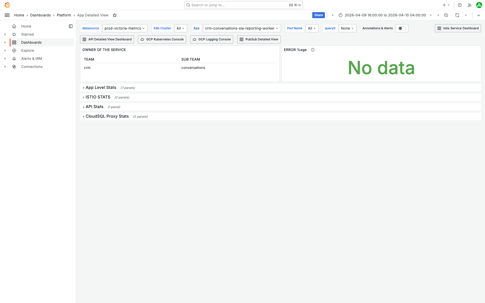

# PubSub Unacked Messages Investigation -- crm-conversations-sla-reporting-events-dl-sub -- 2026-04-10

**Author:** Himanshu Bhutani
**Generated:** 2026-04-11T18:00:00+05:30

## Alert Summary

| Field | Value |
|-------|-------|
| Alert type | Pubsub Unacked Messages above 500 |
| Subscription | `crm-conversations-sla-reporting-events-dl-sub` (dead-letter) |
| Parent subscription | `crm-conversations-sla-reporting-events-sub` |
| Primary worker | `crm-conversations-sla-reporting-worker` (2 pods, running 19d) |
| DL worker | **Not deployed** (no deployment, no logs ever recorded) |
| Channel | #alerts-crm-conversations (C097UPY34QJ) |
| Team | CRM / Conversations |
| Alert IDs | #115245, #115252, #115257 |
| Grafana OnCall | [ISM595MYA1X9P](https://prod.grafana.leadconnectorhq.com/a/grafana-oncall-app/alert-groups/ISM595MYA1X9P) |

### Alert Timeline

| Alert | Time (IST) | Time (UTC) | Unacked Count | Status |
|-------|-----------|-----------|---------------|--------|
| #115245 | 23:38 Apr 09 | 18:08 Apr 09 | 505 | Auto-resolved |
| #115252 | 04:04 Apr 10 | 22:34 Apr 09 | 518 | Auto-resolved |
| #115257 | 08:13 Apr 10 | 02:43 Apr 10 | 559 | Acknowledged (not resolved) |

Note: "76 total" alert instances shown in #115257 thread, indicating the alert has been firing repeatedly over days.

## Investigation Findings

### Evidence: Cloud Monitoring -- PubSub Metrics

#### DL Subscription (`crm-conversations-sla-reporting-events-dl-sub`)

**Ack message count:** NO DATA -- confirms zero consumers have ever connected.

**Num undelivered messages (12-hour window):**
- Range: 489-525 messages
- Trend: Slowly climbing from ~489 at 16:00 UTC to ~525 at 04:00 UTC
- Pattern: Small increments every few hours as new messages are dead-lettered

**Oldest unacked message age:**
- Range: 581,641s to 604,880s (~161h to ~168h)
- This is approximately 7 days -- exactly matching the `messageRetentionDuration: 604800s`
- The age hits a ceiling around 168h (7 days) because PubSub purges older messages

**Expired ack deadlines:** NO DATA -- no consumer to expire against.

**7-day trend (daily max undelivered):**

| Date | Max Undelivered | Interpretation |
|------|-----------------|----------------|
| Apr 02 | 1,819 | Large burst of failures (possibly deployment or data migration) |
| Apr 03 | 661 | Aging out of Apr 02 burst |
| Apr 04 | 477 | Below threshold |
| Apr 05 | 435 | Below threshold |
| Apr 06 | 428 | Low point |
| Apr 07 | 435 | Slowly climbing |
| Apr 08 | 445 | Slowly climbing |
| Apr 09 | 496 | Approaching threshold |
| Apr 10 | 525 | Above threshold, alerts firing |

#### Primary Subscription (`crm-conversations-sla-reporting-events-sub`)

**Configuration (from terraform labels):**
- `maxDeliveryAttempts: 10`
- `deadLetterTopic: crm-conversations-sla-reporting-events-dl`
- `unack_age_alert_level: 30mins`
- `unack_alert_level: 10k`
- `ackDeadlineSeconds: 300`
- `retryPolicy: min 10s, max 600s`

**Pull ack operations (hourly):**

| Time (UTC) | Ack Ops | Status |
|-----------|---------|--------|
| 16:00 | 10,444 | Normal |
| 17:00 | 41,741 | Normal |
| 18:00 | 20,071 | Normal |
| 19:00 | 63,720 | Peak |
| 20:00 | 59,526 | Normal |
| 21:00 | 50,013 | Normal |
| 22:00 | 39,603 | Normal |
| 23:00 | 34,342 | Normal |
| 00:00 | 29,269 | Normal |
| 01:00 | 26,197 | Normal |
| 02:00 | 19,971 | Low (night) |
| 03:00 | 17,554 | Low (night) |

The primary worker is processing normally with no processing gaps.

**Dead-letter message count:** 68 messages dead-lettered in the 12-hour window, at a steady trickle of 1-5 per 5 minutes.

**Num undelivered messages:** Brief spikes to 1,208 (19:10 UTC) and 523 (21:30 UTC), but recovers within minutes. The primary worker handles its backlog fine.

### Evidence: kubectl -- Deployment Status

```
$ kubectl get deployments -n default | grep sla-reporting
crm-conversations-sla-reporting-worker   2/2   2   2   19d

$ kubectl get deployment crm-conversations-sla-reporting-events-dl-worker -n default
No deployment found for crm-conversations-sla-reporting-events-dl-worker
```

The primary worker has 2 healthy pods running for 19 days. The DL worker has never been deployed.

### Evidence: GCP Container Logs -- DL Worker

```
gcloud logging read '
resource.type="k8s_container"
resource.labels.container_name=~"crm-conversations-sla-reporting-events-dl"
timestamp>="2026-03-11T00:00:00Z"
timestamp<="2026-04-11T00:00:00Z"
' --project=highlevel-backend --limit=5

Result: [] (empty -- no container logs for 30+ days)
```

This confirms the DL worker container has NEVER run, not just that it's currently down.

### Evidence: GCP Logs -- Primary Worker Errors

```
resource.type="k8s_container"
resource.labels.container_name="crm-conversations-sla-reporting-worker"
severity>=ERROR
jsonPayload.message=~"Missing required sla"
```

**Error pattern distribution (50 entries, 18:30-19:00 UTC window):**

| Count | Pattern |
|-------|---------|
| 25 | `SLA Reporting: batch message failed` |
| 25 | `SLA Reporting: Missing required sla.cleared_* fields (MB code bug?)` |

These errors always appear in pairs -- the second is the specific reason, the first is the generic "batch failed" wrapper. The "(MB code bug?)" annotation in the log message itself suggests the development team is already aware this is a data/code issue.

**Error volume per hour (full window):**

| Time (UTC) | Errors |
|-----------|--------|
| 16:00 | 145 |
| 17:00 | 171 |
| 18:00 | 293 (peak) |
| 19:00 | 146 |
| 20:00 | 146 |
| 21:00 | 102 |
| 22:00 | 2 (low) |
| 23:00 | 181 |
| 00:00 | 42 |
| 01:00 | 40 |
| 03:00 | 140 |
| **Total** | **1,408** |

The error rate varies but is persistent, not spiking. This is not a transient issue -- it's a steady stream of messages with missing fields.

**WARNING-level logs also show:**
- "SLA Reporting: Skipping outbound -- legacy SLA cycle (bridge fields missing, pre-deployment)" -- related data quality issue
- "[PLATFORM_CORE_CLICKHOUSE] Auto-retrying network error (attempt 1/2)" -- transient ClickHouse connectivity, unrelated

### Evidence: PubSub Subscription Configuration

**DL Subscription (`crm-conversations-sla-reporting-events-dl-sub`):**
```json
{
  "ackDeadlineSeconds": 300,
  "messageRetentionDuration": "604800s",
  "retryPolicy": {
    "maximumBackoff": "600s",
    "minimumBackoff": "10s"
  }
}
```

No `deadLetterPolicy` on the DL sub itself (dead-letter queues don't recursively dead-letter).
No `filter` (receives all messages from the DL topic).

### Evidence: Grafana Screenshots

<details>
<summary>[Grafana] DL Subscription -- Worker Detailed View (all consumer gauges "No data")</summary>

> **What to look for:** The four gauge panels in the "Subscription Stats" section all show "No data" in red text. This means no consumer has connected to pull/ack/nack any messages. The bottom charts show "Oldest Unacked Message" climbing steadily (green area reaching ~168h) and "Unacked messages current" hovering at ~500-525.


[Open in Grafana](https://prod.grafana.leadconnectorhq.com/d/a04e5483-eb8c-47ef-8198-30147926964c/worker-detailed-view?orgId=1&var-subscriptionId=crm-conversations-sla-reporting-events-dl-sub&from=1775730600000&to=1775773800000)

</details>

<details>
<summary>[Grafana] Primary Subscription -- Worker Detailed View (healthy, 227K acks)</summary>

> **What to look for:** The gauge panels show healthy processing: 227K Total Sent Messages, 6.60K Total Nack Requests (2.9% nack rate -- small but steady), 915 Expired Deadlines, 4.00s Avg Ack Latency. The "Oldest Unacked Message" chart shows brief spikes but recovers. The ack rate chart shows consistent processing.


[Open in Grafana](https://prod.grafana.leadconnectorhq.com/d/a04e5483-eb8c-47ef-8198-30147926964c/worker-detailed-view?orgId=1&var-subscriptionId=crm-conversations-sla-reporting-events-sub&from=1775730600000&to=1775773800000)

</details>

<details>
<summary>[Grafana] App Detailed View -- Primary Worker Pod Health</summary>

> **What to look for:** The dashboard shows the worker belongs to team=crm, sub_team=conversations. The rows are collapsed (App Level Stats, ISTIO STATS, API Stats, CloudSQL Proxy Stats) but the worker IS deployed and running. ERROR %age shows "No data" likely because this worker doesn't serve HTTP traffic (it's a PubSub worker).


[Open in Grafana](https://prod.grafana.leadconnectorhq.com/d/a4859d4a-1e0a-4ae3-b9b2-d04d366cf29b/app-detailed-view?orgId=1&var-container=crm-conversations-sla-reporting-worker&var-namespace=default&from=1775730600000&to=1775773800000)

</details>

## Cross-Validation

| Signal | Cloud Monitoring | kubectl | Grafana | GCP Logs | Agreement |
|--------|-----------------|---------|---------|----------|-----------|
| Zero DL consumers | ack_count=NO DATA | No deployment | Gauges "No data" | No container logs (30d) | 4/4 |
| Messages dead-lettered | dead_letter_count=68 | -- | Nack gauge=6.6K | ERROR logs ~1,408 | 3/3 |
| Primary healthy | pull_ack=10-64K/hr | 2/2 pods, 19d | 227K acks | Processing logs present | 4/4 |
| Backlog steady-state | ~500-525 messages | -- | Unacked chart ~500 | -- | 2/2 |

**Confidence: HIGH** -- 4 independent sources confirm zero consumers on the DL subscription, and the causal chain (code bug -> nack -> dead-letter -> no DL worker -> accumulation) is fully traced with supporting evidence at every step.

## Root Cause

### Causal Chain

```
Messages with missing sla.cleared_* fields
  -> Primary worker logs ERROR + nacks the message
  -> PubSub retries up to 10 times (retryPolicy: 10s-600s backoff)
  -> After 10 attempts, PubSub dead-letters to crm-conversations-sla-reporting-events-dl topic
  -> DL topic delivers to crm-conversations-sla-reporting-events-dl-sub
  -> NO CONSUMER exists for this subscription
  -> Messages accumulate (messageRetentionDuration: 7 days)
  -> Count oscillates around 500 (inflow ~68/12h, outflow via 7-day expiry)
  -> Alert fires each time count crosses 500 threshold
```

### Why the alerts are recurring

The count hovers near 500 because:
- **Inflow:** ~5-6 messages/hour are dead-lettered (steady error rate on primary worker)
- **Outflow:** Messages older than 7 days are purged by PubSub
- **Net effect:** Count slowly climbs, crosses 500, alerts fire, then old messages expire and count drops below 500, alert resolves, cycle repeats

### Two separate issues

1. **Missing DL worker** (infrastructure gap) -- the DL subscription was created (likely via terraform) but no worker was ever deployed to consume it. This is an ops gap.
2. **Code bug** (data quality) -- messages with missing `sla.cleared_*` fields permanently fail processing. The error message "(MB code bug?)" suggests the team recognizes this as a code issue.

<details>
<summary>Probable noise -- transient errors during investigation window (not root cause)</summary>

| Time | Pattern | Why it's noise |
|------|---------|----------------|
| Throughout | `[PLATFORM_CORE_CLICKHOUSE] Auto-retrying network error` | Transient ClickHouse connectivity at WARNING level, auto-retries succeed |
| Throughout | `SLA Reporting: Skipping outbound -- legacy SLA cycle (bridge fields missing)` | WARNING level, related data quality issue but messages are acked (not contributing to DL backlog) |
| Brief spike at 19:05-19:15 UTC | Primary sub undelivered spike to 1,208 | Brief processing lag, recovered in minutes, not related to DL issue |

</details>

## Action Items

| Priority | Action | Owner | Rationale |
|----------|--------|-------|-----------|
| **P1** | Deploy a dead-letter worker for `crm-conversations-sla-reporting-events-dl-sub` | CRM Conversations team | A minimal worker that logs the failed message payload and acks it would: (a) drain the backlog, (b) stop recurring alerts, (c) provide visibility into which messages fail permanently |
| **P2** | Fix the "Missing required sla.cleared_* fields" bug in primary worker | CRM Conversations team | Root cause of DL inflow. The "(MB code bug?)" annotation suggests the team knows about this. Fix would eliminate the DL stream entirely |
| **P3** | Adjust alert threshold for DL subscription | On-call | Either: (a) raise threshold above steady-state (~600), (b) mute until DL worker deployed, or (c) add `unack_alert_level` label to terraform to configure appropriately |
| **P4** | Audit all DL subscriptions for missing consumers | Platform team | If this DL sub has no consumer, others may too. Query all `*-dl-sub` subscriptions and check for zero ack data |

## Deployment Details

**Primary Worker:**

| Property | Value |
|----------|-------|
| Deployment | `crm-conversations-sla-reporting-worker` |
| Replicas | 2/2 |
| Age | 19 days |
| Namespace | default |
| Team | crm / conversations |
| Subscription | `crm-conversations-sla-reporting-events-sub` |
| Max delivery attempts | 10 |
| Ack deadline | 300s |
| Retry policy | 10s min, 600s max backoff |

**DL Subscription:**

| Property | Value |
|----------|-------|
| Subscription | `crm-conversations-sla-reporting-events-dl-sub` |
| Worker deployment | **None** |
| Message retention | 604800s (7 days) |
| Ack deadline | 300s |
| Retry policy | 10s min, 600s max backoff |

## Disproval Attempts

1. **Could the DL worker have existed and been scaled to zero?** No -- GCP container logs for `crm-conversations-sla-reporting-events-dl*` are empty for the last 30 days. The worker has never run.
2. **Could the messages be expiring and the count is actually decreasing?** Partially yes -- old messages expire after 7 days, but new ones arrive faster, causing a slow net increase. The 7-day history confirms the trend.
3. **Could the primary worker fix itself?** No -- the "Missing sla.cleared_* fields" error is a data quality issue (messages with specific field patterns), not a transient infrastructure problem. These messages will always fail.
4. **Is this just a misconfigured alert threshold?** Partially -- the threshold (500) happens to be near the steady-state count. But the real issue is the missing DL consumer, not the threshold. Raising the threshold would mask the problem.
