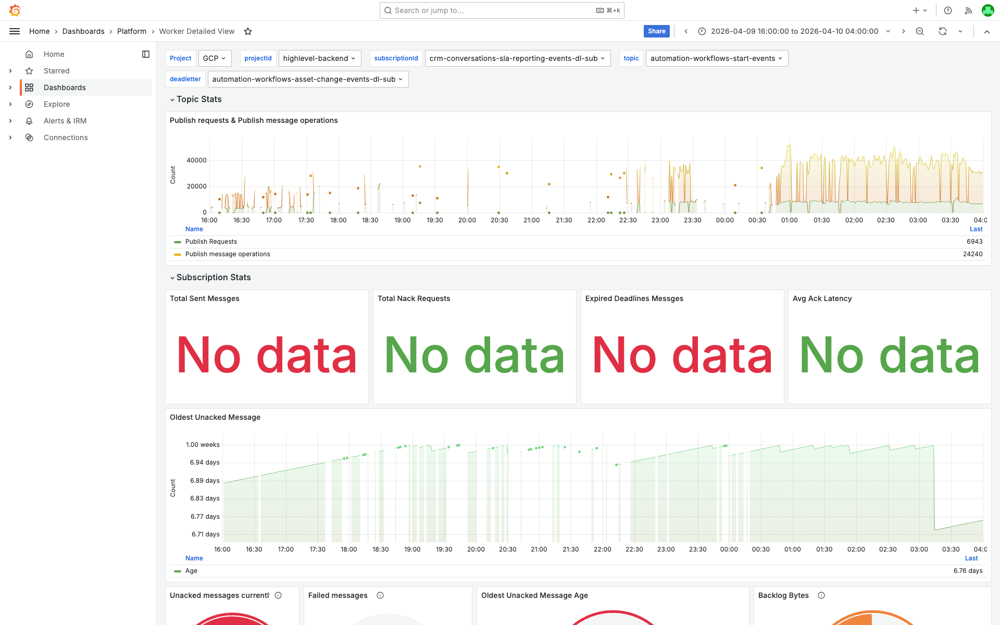
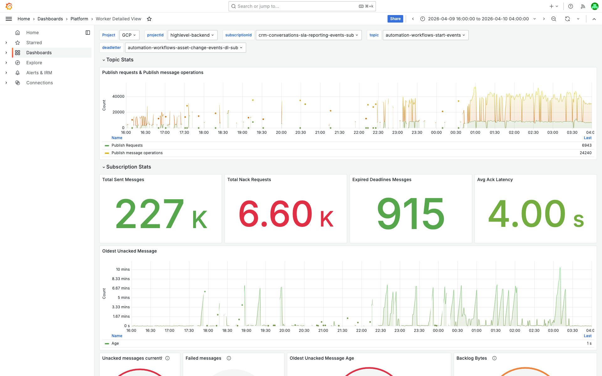

# PubSub Unacked Messages -- crm-conversations-sla-reporting-events-dl-sub -- 2026-04-10

**Author:** Himanshu Bhutani | **Status:** Recurring (3 alerts in ~8 hours, not resolved)

## Summary

| Field | Value |
|-------|-------|
| Alert | Pubsub Unacked Messages above 500 |
| Subscription | `crm-conversations-sla-reporting-events-dl-sub` (dead-letter) |
| Parent subscription | `crm-conversations-sla-reporting-events-sub` |
| Channel | #alerts-crm-conversations |
| Alert IDs | #115245, #115252, #115257 |
| First fired | 23:38 IST Apr 09 (18:08 UTC) |
| Last fired | 08:13 IST Apr 10 (02:43 UTC) |
| Duration | Ongoing -- DL backlog has been accumulating for 7+ days |
| Impact | ~525 dead-lettered messages with oldest unacked age of ~168 hours (~7 days); these represent permanently failed SLA reporting events |

## Root Cause

The dead-letter subscription `crm-conversations-sla-reporting-events-dl-sub` has **no consumer worker deployed**. No Kubernetes deployment exists for `crm-conversations-sla-reporting-events-dl-worker`, and no container logs for this workload have ever been recorded. Messages that exhaust their 10 delivery attempts on the primary subscription (`crm-conversations-sla-reporting-events-sub`) are forwarded to the dead-letter topic and accumulate indefinitely with no worker to process or acknowledge them.

The primary worker (`crm-conversations-sla-reporting-worker`, 2 pods) is healthy and processing normally (227K acks in the window), but generates a steady stream of errors -- "Missing required sla.cleared_* fields (MB code bug?)" -- that cause ~68 messages to be dead-lettered over the 12-hour investigation window. These messages fail all 10 delivery attempts and land in the DL queue.

The DL subscription has `messageRetentionDuration: 604800s` (7 days), so messages persist for a week before PubSub auto-purges them. The count oscillates around 500 as old messages age out and new ones trickle in, repeatedly crossing the 500 threshold and triggering alerts.

## What Happened

1. **Ongoing** -- Primary worker encounters messages with missing `sla.cleared_*` fields, fails processing, and nacks them.
2. **After 10 retries** -- PubSub dead-letters these messages to `crm-conversations-sla-reporting-events-dl-sub`.
3. **No DL worker exists** -- Messages accumulate in the DL subscription with no consumer.
4. **7 days of accumulation** -- ~500+ messages build up (new ones arriving, old ones expiring after 7-day retention).
5. **23:38 IST Apr 09** -- Count crosses 500 threshold, first alert fires. Auto-resolves as messages expire.
6. **04:04 IST Apr 10** -- Crosses threshold again, second alert. Auto-resolves.
7. **08:13 IST Apr 10** -- Crosses threshold again, third alert. Acknowledged but not resolved.

## Proof

<details>
<summary>[Cloud Monitoring] DL subscription has zero ack data -- confirms no consumer</summary>

> **Verify:** The `ack_message_count` metric for `crm-conversations-sla-reporting-events-dl-sub` returns NO DATA for the entire investigation window.

```
Query: pubsub.googleapis.com/subscription/ack_message_count
Subscription: crm-conversations-sla-reporting-events-dl-sub
Window: 2026-04-09 16:00 UTC to 2026-04-10 04:00 UTC
Result: NO DATA (zero consumers)
```

</details>

<details>
<summary>[kubectl] No deployment exists for the DL worker</summary>

> **Verify:** Only the primary worker is deployed (2/2 pods). No DL worker deployment exists.

```
$ kubectl get deployments -n default | grep sla-reporting
crm-conversations-sla-reporting-worker   2/2   2   2   19d
```

</details>

<details>
<summary>[Cloud Monitoring] DL subscription backlog -- 489-525 undelivered, oldest 167-168 hours</summary>

> **Verify:** `num_undelivered_messages` stays at 489-525. `oldest_unacked_message_age` is ~167-168h (7 days), matching retention.

</details>

<details>
<summary>[Cloud Monitoring] Primary subscription dead-letters 68 messages in 12 hours</summary>

> **Verify:** `dead_letter_message_count` shows 68 dead-lettered messages in the investigation window.

</details>

<details>
<summary>[GCP Logs] Primary worker errors -- "Missing required sla.cleared_* fields"</summary>

> **Verify:** Paired ERROR entries in the primary worker logs.

```
resource.type="k8s_container"
resource.labels.container_name="crm-conversations-sla-reporting-worker"
severity>=ERROR
jsonPayload.message=~"Missing required sla"
```

[Open in GCP Log Explorer](https://console.cloud.google.com/logs/query;query=resource.type%3D%22k8s_container%22%0Aresource.labels.container_name%3D%22crm-conversations-sla-reporting-worker%22%0Aseverity%3E%3DERROR%0AjsonPayload.message%3D~%22Missing%20required%20sla%22;timeRange=2026-04-09T18%3A00%3A00Z%2F2026-04-09T19%3A30%3A00Z?project=highlevel-backend)

</details>

<details>
<summary>[Grafana] DL subscription -- "No data" for all consumer metrics</summary>

> **Verify:** All four gauge stats show "No data". Bottom panels show unacked count ~500-525 and oldest age climbing.


[Open in Grafana](https://prod.grafana.leadconnectorhq.com/d/a04e5483-eb8c-47ef-8198-30147926964c/worker-detailed-view?orgId=1&var-subscriptionId=crm-conversations-sla-reporting-events-dl-sub&from=1775730600000&to=1775773800000)

</details>

<details>
<summary>[Grafana] Primary subscription -- healthy, 227K acks, 6.6K nacks</summary>

> **Verify:** Primary subscription is actively processing with a small nack rate.


[Open in Grafana](https://prod.grafana.leadconnectorhq.com/d/a04e5483-eb8c-47ef-8198-30147926964c/worker-detailed-view?orgId=1&var-subscriptionId=crm-conversations-sla-reporting-events-sub&from=1775730600000&to=1775773800000)

</details>

<details>
<summary>[Cloud Monitoring] 7-day trend -- DL backlog growing since Apr 02</summary>

| Date | Max Undelivered |
|------|-----------------|
| Apr 02 | 1,819 |
| Apr 03 | 661 |
| Apr 04 | 477 |
| Apr 05 | 435 |
| Apr 06 | 428 |
| Apr 07 | 435 |
| Apr 08 | 445 |
| Apr 09 | 496 |
| Apr 10 | 525 |

</details>

## Action Items

| Priority | Action | Owner | Rationale |
|----------|--------|-------|-----------|
| **P1** | Deploy a DL worker for `crm-conversations-sla-reporting-events-dl-sub` (even minimal logging + ack) | CRM Conversations | Without a consumer, DL sub will keep triggering alerts |
| **P2** | Fix "Missing required sla.cleared_* fields" code bug | CRM Conversations | Error message says "(MB code bug?)". Fix would eliminate DL inflow |
| **P3** | Adjust alert threshold for DL sub or suppress until DL worker deployed | On-call | Current 500 threshold with no consumer = repeated alerts |

## Cross-Validation

| Signal | Source | Agreement |
|--------|--------|-----------|
| Zero consumers on DL sub | Cloud Monitoring, kubectl, Grafana, GCP logs | 4/4 confirmed |
| Messages being dead-lettered | Cloud Monitoring (dead_letter_message_count) | Confirmed |
| Error causing dead-lettering | GCP Logs (primary worker) | Confirmed |
| Primary worker healthy | kubectl + Cloud Monitoring | Confirmed |

**Confidence: HIGH**

## Links

- [Verbose report](report-verbose.md)
- [Grafana -- DL Subscription](https://prod.grafana.leadconnectorhq.com/d/a04e5483-eb8c-47ef-8198-30147926964c/worker-detailed-view?orgId=1&var-subscriptionId=crm-conversations-sla-reporting-events-dl-sub&from=1775730600000&to=1775773800000)
- [Grafana -- Primary Subscription](https://prod.grafana.leadconnectorhq.com/d/a04e5483-eb8c-47ef-8198-30147926964c/worker-detailed-view?orgId=1&var-subscriptionId=crm-conversations-sla-reporting-events-sub&from=1775730600000&to=1775773800000)
- [GCP PubSub -- DL Subscription](https://console.cloud.google.com/cloudpubsub/subscription/detail/crm-conversations-sla-reporting-events-dl-sub?project=highlevel-backend)
- [GCP Log Explorer -- Primary Worker Errors](https://console.cloud.google.com/logs/query;query=resource.type%3D%22k8s_container%22%0Aresource.labels.container_name%3D%22crm-conversations-sla-reporting-worker%22%0Aseverity%3E%3DERROR%0AjsonPayload.message%3D~%22Missing%20required%20sla%22;timeRange=2026-04-09T18%3A00%3A00Z%2F2026-04-09T19%3A30%3A00Z?project=highlevel-backend)
- [Grafana OnCall](https://prod.grafana.leadconnectorhq.com/a/grafana-oncall-app/alert-groups/ISM595MYA1X9P)
